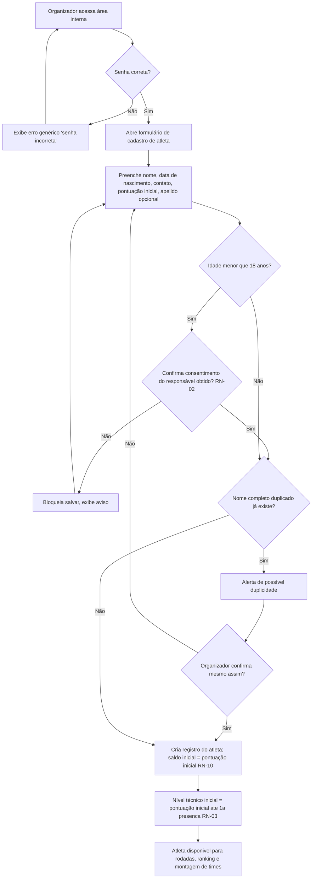
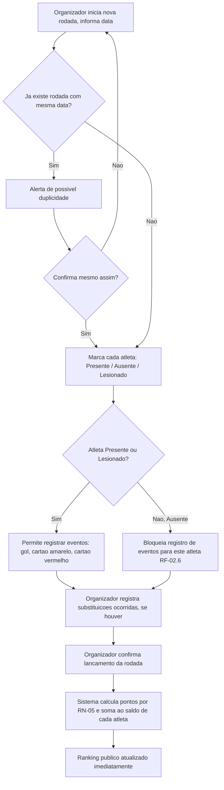
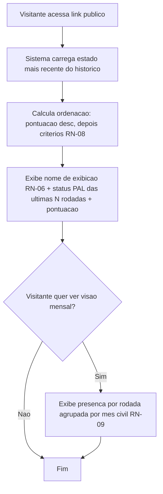
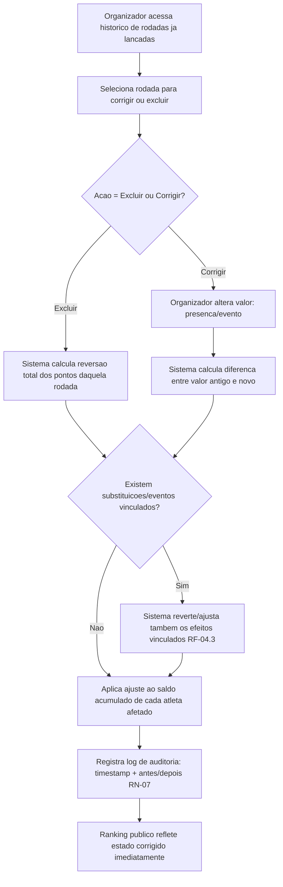
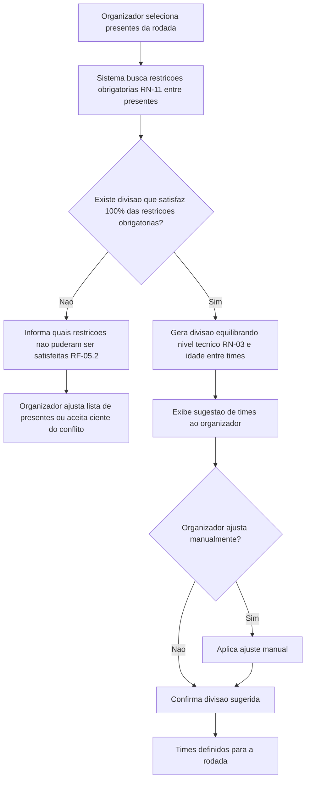
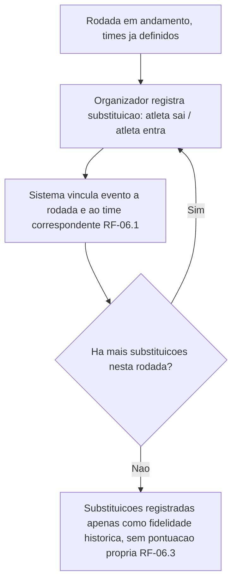
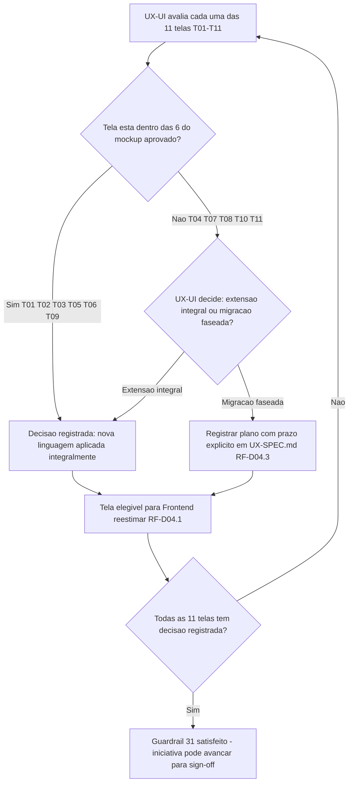
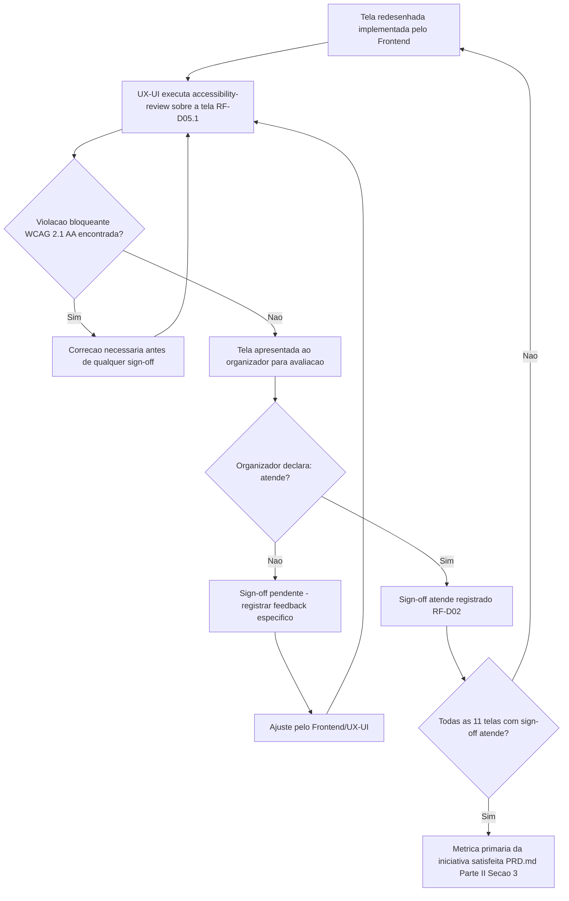
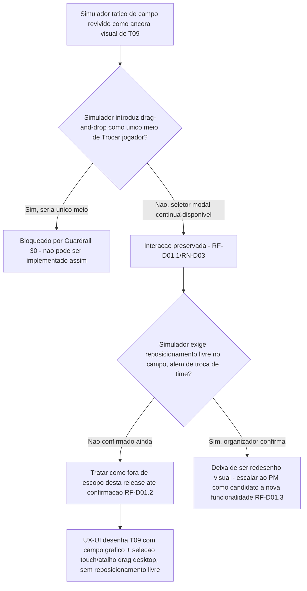

# PRD-TECNICO.md — Sistema de Ranking "Turma do Rola - Comary"

**Dono**: Business Analyst
**Status**: Pronto para Software Architect
**Input de origem**: `PRD.md` (PM, `stakeholder-alignment-check` limpo, 2026-09-02) + `CTO-REVIEW.md` Gate 1 (ressalvas: LGPD, senha única, algoritmo de times, estorno automático).
**Skills aplicadas**: `requirement-elicitation`, `user-flow-mapping` (com apoio de `mermaid-studio`), `dependency-and-integration-analysis`, `assumption-resolution`, `acceptance-criteria-drafting` (com apoio de `requirements-specification`, formato EARS), `prd-tecnico-drafting`.

**Nota metodológica**: não há stakeholder real (organizador do grupo) disponível
nesta sessão de levantamento. Toda decisão de negócio sem base objetiva no `PRD.md`
está explicitamente marcada como **"decisão assumida pelo BA, sujeita a validação do
organizador do grupo"** — nenhuma delas muda escopo ou objetivo de negócio do
`PRD.md`; são interpretações de detalhe necessárias para o Software Architect não
precisar reinterpretar intenção de negócio. Todas estão listadas de forma rastreável
na Seção 7.

**Registro de revisão (2026-09-02, pós-entrega)**: após a entrega inicial deste
documento, o stakeholder/organizador do grupo trouxe uma informação nova, direta ao
BA (não via PM/CTO): o projeto deve **manter e reaproveitar o banco de dados de um
projeto legado no Supabase** (`https://supabase.com/dashboard/project/ipnbdrejlikrmqyxggsp`),
com restrição confirmada de **zero perda de dados existentes** (schema pode ser
modificado). Esta revisão ajusta as Seções 1, 2, 3, 5, 6 e 7 para incorporar essa
restrição técnica confirmada — nenhuma mudança de escopo ou objetivo de negócio do
`PRD.md` foi feita; trata-se de uma restrição técnica nova sobre *como* os dados
existentes devem ser tratados, não sobre *o que* o produto faz.

---

## 1. Requisitos Funcionais

Formato de critério de aceite: EARS (Easy Approach to Requirements Syntax) —
"Quando/Se/Enquanto/O sistema deve sempre".

### RF-01 — Cadastro de Atletas

Cadastro único de atleta: nome completo, apelido/nome de exibição (opcional),
contato, data de nascimento, pontuação inicial. Sem categoria fixa de posição (RN
já herdada do PRD.md, Seção 4). Nível técnico **não é campo de entrada manual** —
é derivado (RN-03).

- **RF-01.1** Quando o organizador submete o formulário de cadastro com nome, data
  de nascimento e pontuação inicial preenchidos, o sistema deve criar o registro do
  atleta e inicializar seu saldo acumulado de pontos com o valor de pontuação
  inicial informado (RN-10).
- **RF-01.2** Se o campo "apelido/nome de exibição" for deixado em branco, então o
  sistema deve usar o primeiro nome do campo "nome completo" como nome de exibição
  público (RN-06).
- **RF-01.3** Quando a data de nascimento informada resultar em idade menor que 18
  anos na data do cadastro, o sistema deve exigir que o organizador confirme
  explicitamente "Consentimento do responsável legal obtido" antes de permitir
  salvar o cadastro (RN-02).
- **RF-01.4** O sistema deve sempre calcular e exibir o "nível técnico" do atleta
  como valor derivado (RN-03), nunca como campo de entrada manual no formulário de
  cadastro.
- **RF-01.5** Se o organizador tentar cadastrar um atleta com nome completo
  idêntico a um já existente, então o sistema deve alertar antes de confirmar a
  criação, para reduzir risco de duplicidade de registro.
- **RF-01.6** O sistema deve sempre permitir editar qualquer campo de um atleta já
  cadastrado (incluindo apelido de exibição), exceto a exclusão retroativa de
  pontuação inicial já utilizada em cálculo de ranking sem passar pelo fluxo de
  correção (RF-04).

### RF-02 — Registro de Rodada (Presença, Eventos e Cálculo Automático)

- **RF-02.1** Quando o organizador marca um atleta como "Presente" em uma rodada,
  o sistema deve somar automaticamente ao saldo do atleta os pontos de "Presença"
  definidos em RN-05.
- **RF-02.2** Quando o organizador marca um atleta como "Ausente" em uma rodada, o
  sistema deve aplicar a pontuação de "Ausência" definida em RN-05, sem exigir
  nenhuma outra ação do organizador.
- **RF-02.3** Quando o organizador marca um atleta como "Lesionado" em uma rodada,
  o sistema deve tratá-lo como presente para efeito da pontuação de presença
  (RN-05), permitindo ainda registrar eventos ocorridos até o momento da lesão.
- **RF-02.4** Quando o organizador registra um evento de gol para um atleta
  presente ou lesionado, o sistema deve somar automaticamente os pontos de "Gol"
  (RN-05) ao saldo do atleta.
- **RF-02.5** Quando o organizador registra um evento de cartão (amarelo ou
  vermelho) para um atleta presente ou lesionado, o sistema deve subtrair
  automaticamente os pontos correspondentes definidos em RN-05.
- **RF-02.6** Se o organizador tentar registrar um evento (gol/cartão) para um
  atleta marcado como "Ausente", então o sistema deve bloquear a ação e exibir uma
  mensagem de inconsistência.
- **RF-02.7** Quando o organizador confirma o lançamento completo de uma rodada, o
  sistema deve recalcular e persistir o saldo acumulado de cada atleta afetado,
  tornando o ranking público imediatamente consistente com o novo lançamento.
- **RF-02.8** Se o organizador tentar lançar uma rodada com a mesma data de uma
  rodada já existente, então o sistema deve alertar sobre a possível duplicidade
  antes de permitir a confirmação.

### RF-03 — Ranking Público

*(RF-03.1 revisado em 2026-09-04 — decisão direta do organizador, no contexto da
Iniciativa de Redesenho Visual; ver Interpretação registrada #14, Seção 7.)*

- **RF-03.1** O sistema deve sempre exibir, na área pública sem login, para cada
  atleta: nome de exibição (RN-06), o status de presença (Presente/Ausente/
  Lesionado) em cada uma das últimas N rodadas lançadas (quantidade "N" definida
  pela camada de apresentação, fora do escopo deste documento) e a pontuação
  acumulada — o sistema **não** deve exigir a exibição de número agregado de
  presenças ou de ausências nesta tela; o sistema nunca deve exibir contato ou
  data de nascimento na área pública (RN-01).
- **RF-03.2** Quando dois ou mais atletas têm pontuação acumulada idêntica, o
  sistema deve ordená-los aplicando o critério de desempate definido em RN-08, na
  ordem ali estabelecida.
- **RF-03.3** O sistema deve sempre disponibilizar, sem exigência de login, uma
  visão mensal de presença por rodada, agrupada por mês civil (RN-09).
- **RF-03.4** Quando um visitante acessa a página pública de ranking, o sistema
  deve exibir dados calculados a partir do estado mais recente do histórico de
  rodadas lançado até aquele momento.

### RF-04 — Histórico com Correção e Estorno Automático

- **RF-04.1** Quando o organizador exclui uma rodada já lançada, o sistema deve
  reverter automaticamente todos os pontos daquela rodada (presença, ausência,
  gols, cartões) do saldo acumulado de cada atleta afetado, sem exigir lançamento
  manual de estorno (RN-04).
- **RF-04.2** Quando o organizador corrige um valor já lançado em uma rodada (ex.:
  muda presença para ausência, corrige número de gols), o sistema deve calcular a
  diferença entre o valor antigo e o novo e aplicar automaticamente esse ajuste ao
  saldo acumulado do atleta afetado (RN-04).
- **RF-04.3** Quando uma rodada corrigida ou excluída possuir substituições ou
  eventos vinculados, o sistema deve reverter/ajustar também os efeitos desses
  eventos vinculados como parte da mesma operação de correção (RN-04).
- **RF-04.4** Quando qualquer correção ou exclusão de rodada é confirmada, o
  sistema deve registrar uma entrada de log de auditoria contendo: timestamp da
  correção, rodada afetada, valores anteriores e valores novos (antes/depois) —
  sem campo de autor individual, já que não há login individual no sistema
  (RN-07).
- **RF-04.5** O sistema deve sempre disponibilizar ao organizador uma tela de
  consulta do log de auditoria de correções, ordenada da mais recente para a mais
  antiga.

### RF-05 — Montagem de Times Equilibrados

- **RF-05.1** Quando o organizador solicita a sugestão de times para uma rodada
  com a lista de presentes definida, o sistema deve gerar uma divisão de times que
  respeite 100% das restrições obrigatórias (hard constraints) cadastradas entre
  os presentes (RN-11).
- **RF-05.2** Se não existir nenhuma divisão possível que satisfaça todas as
  restrições obrigatórias entre os presentes, então o sistema deve informar ao
  organizador quais restrições não puderam ser simultaneamente satisfeitas, em vez
  de sugerir uma divisão que as viole silenciosamente.
- **RF-05.3** O sistema deve sempre usar nível técnico (RN-03) e idade como
  critérios de equilíbrio (soft constraints) entre os times sugeridos, buscando
  minimizar a diferença agregada entre os times resultantes.
- **RF-05.4** Quando a sugestão de times é gerada, o sistema deve permitir que o
  organizador ajuste manualmente a divisão sugerida antes de confirmar.
- **RF-05.5** O sistema deve sempre permitir ao organizador cadastrar, editar e
  desativar pares de restrição obrigatória entre dois atletas (RN-11), sem exigir
  permissão diferenciada dentro da área interna (papel operacional único, RN-12).

### RF-06 — Substituições

- **RF-06.1** Quando o organizador registra uma substituição durante uma rodada
  (atleta X sai, atleta Y entra), o sistema deve vincular esse evento à rodada e
  ao time correspondente, para fidelidade do histórico.
- **RF-06.2** O sistema deve sempre permitir múltiplas substituições na mesma
  rodada, sem limite fixo de quantidade.
- **RF-06.3** Quando uma substituição é registrada, o sistema não deve gerar
  pontuação adicional por si só — a pontuação continua sendo função apenas dos
  eventos de presença/gol/cartão vinculados a cada atleta (RN-05); a substituição
  é exclusivamente registro de fidelidade histórica.

### RF-07 — Acesso por Senha Única (áreas internas)

- **RF-07.1** Quando um usuário tenta acessar cadastro, lançamento de rodada,
  histórico/correção ou gestão de restrições de times, o sistema deve exigir a
  senha interna única antes de permitir a ação.
- **RF-07.2** O sistema deve sempre permitir o acesso de consulta ao ranking
  público e à visão mensal de presença sem exigir senha (RF-03).
- **RF-07.3** Se a senha informada estiver incorreta, então o sistema deve negar o
  acesso e exibir apenas mensagem genérica ("senha incorreta"), sem detalhar o
  motivo da falha.

### RF-08 — Migração de Dados do Banco Legado (Supabase)

*(Adicionado na revisão de 2026-09-02 — restrição confirmada diretamente pelo
stakeholder após a entrega inicial deste documento; ver Seção 5.2 e Seção 6.)*

- **RF-08.1** Quando o processo de migração for executado, o sistema deve importar
  a totalidade dos registros existentes de cadastro de jogadores do banco legado
  Supabase, sem perda de nenhum registro.
- **RF-08.2** Quando o processo de migração for executado, o sistema deve importar
  a totalidade do histórico de rodadas/partidas já lançadas no banco legado
  (presenças, eventos de gol/cartão, pontuação de rodadas passadas), preservando a
  associação de cada evento ao respectivo jogador e rodada de origem.
- **RF-08.3** Se o schema do banco legado não corresponder diretamente ao novo
  modelo de dados definido pelo Software Architect, então a migração deve incluir
  uma etapa de mapeamento/transformação de campos, documentada no SDD.md, antes da
  carga final — o sistema nunca deve descartar um dado por incompatibilidade de
  schema sem confirmação prévia do organizador.
- **RF-08.4** O sistema deve sempre preservar a pontuação histórica já calculada e
  registrada no banco legado para rodadas passadas (RN-13), aplicando a tabela de
  pontuação RN-05 somente a partir da primeira rodada lançada após a migração.
- **RF-08.5** Quando a migração for concluída, o sistema deve disponibilizar um
  relatório de conferência (contagem de jogadores migrados, contagem de rodadas
  migradas, eventuais divergências ou registros não migrados) para validação
  explícita do organizador.
- **RF-08.6** O sistema não deve permitir a descontinuação/exclusão do banco legado
  Supabase enquanto o relatório de conferência (RF-08.5) não tiver sido validado
  explicitamente pelo organizador.

---

## 2. Requisitos Não-Funcionais

| # | Requisito | Detalhe |
|---|---|---|
| RNF-01 | **Privacidade/LGPD** | Dados sensíveis (contato, data de nascimento) nunca trafegam nem são renderizados na área pública, em nenhuma resposta/página acessível sem senha (RN-01). Base legal aplicada nesta release: legítimo interesse do organizador do grupo (LGPD Art. 7º, IX), restrito à finalidade de organização das peladas, com transparência sobre a coleta no ato do cadastro. |
| RNF-02 | **Proteção de dados de menores** | Cadastro de atleta com idade < 18 anos exige confirmação declarativa de consentimento do responsável (RN-02), conforme LGPD Art. 14, §1º. |
| RNF-03 | **Segurança de acesso** | Senha interna única deve ser armazenada de forma segura (hash, nunca texto puro) e o sistema deve ter proteção básica contra tentativas de força bruta (ex.: limite de tentativas/tempo de bloqueio). Algoritmo/tecnologia específica é decisão do Software Architect/DevSecOps. |
| RNF-04 | **Disponibilidade e custo** | Aplicação deve rodar com custo de hospedagem/operação próximo de zero (herdado da Premissa 6 do PRD.md — decisão assumida pelo BA, sujeita a validação do organizador). Não há exigência de SLA formal de disponibilidade além de "acessível sempre que o organizador ou jogador tentar consultar", compatível com um grupo amador. |
| RNF-05 | **Integridade e durabilidade do histórico** | O sistema deve garantir mecanismo de backup periódico dos dados de cadastro e rodadas, com possibilidade de restauração — requisito direto derivado do problema declarado na Seção 1 do PRD.md ("perda de histórico"); a tecnologia de backup é decisão do Software Architect/DevOps. |
| RNF-06 | **Auditabilidade** | O log de auditoria de correções (RN-07) deve ser retido indefinidamente nesta release (sem expurgo automático), pois é evidência central para resolver disputas de histórico — objetivo de sucesso do PRD.md, Seção 3. |
| RNF-07 | **Usabilidade/Acessibilidade de dispositivo** | Aplicação web responsiva (mobile-first), acessível por navegador em celular, sem exigir app nativo (herdado do PRD.md, Seção 4 "Fora"). Especificação detalhada de tela cabe ao UX/UI (`UX-SPEC.md`), fora do escopo deste documento. |
| RNF-08 | **Idioma e formato regional** | Interface e conteúdo em português do Brasil; datas em formato dia/mês/ano; nenhuma exigência de internacionalização (grupo único, não generalizável — PRD.md Seção 4). |
| RNF-09 | **Compatibilidade de navegador** | Suporte às duas versões mais recentes de Chrome, Firefox e Safari em desktop e mobile — decisão assumida pelo BA por ser padrão de mercado, sujeita a validação se o organizador reportar uso de navegador específico. |
| RNF-10 | **Consistência de cálculo** | Toda operação que altera saldo acumulado (lançamento, correção, exclusão) deve ser atômica — o ranking nunca deve ficar em estado parcialmente atualizado visível ao público entre o início e o fim de um recálculo. |
| RNF-11 | **Integridade referencial pós-migração** *(revisão 2026-09-02)* | Todo registro migrado do banco legado Supabase deve manter integridade referencial no novo modelo (nenhum evento de gol/cartão órfão sem jogador ou rodada associada; nenhuma rodada sem atleta válido). A migração deve ser executada de forma auditável e reversível (rollback possível) até a validação final do organizador (RF-08.5). Tecnologia/ferramenta de migração é decisão do Software Architect. |
| RNF-12 | **Zero perda de dados na migração** *(revisão 2026-09-02)* | Restrição não negociável, confirmada diretamente pelo stakeholder: nenhum dado do banco legado (jogadores, rodadas, eventos, ranking calculado, configuração de pontuação, times) pode ser perdido durante a migração, mesmo que o schema seja modificado. Qualquer divergência entre volume/conteúdo de dados de origem e destino deve bloquear a conclusão da migração até resolução (RF-08.5, RF-08.6). |

---

## 3. Regras de Negócio

Formato: Regra / Racional / Exceção.

| # | Regra | Racional | Exceção |
|---|---|---|---|
| **RN-01** | O ranking público exibe apenas nome de exibição e estatísticas de jogo (pontuação, presença); contato e data de nascimento nunca aparecem fora da área interna. | Mitigação de exposição de dado pessoal em ambiente público sem login (Premissa 1, CTO Gate 1); princípio de minimização de dados da LGPD. | Nenhuma — aplica-se sempre, sem modo de "exibição completa" configurável nesta release. |
| **RN-02** | Antes de cadastrar um atleta com idade < 18 anos, o organizador deve confirmar que o consentimento do responsável legal foi obtido; essa verificação é declarativa dentro do sistema, mas o processo de obtenção do consentimento em si é operacional, fora do sistema (não é fluxo a ser construído nesta release). | LGPD Art. 14, §1º exige consentimento específico e em destaque de responsável legal para tratamento de dados de crianças/adolescentes. Postura conservadora adotada porque não há confirmação do stakeholder sobre existência de menores no grupo (Premissa 2 do PRD.md). | Regra permanece como salvaguarda preventiva mesmo que hoje não haja menores confirmados no grupo — remove-se apenas se o organizador confirmar formalmente que a exigência não se aplica ao contexto do grupo. |
| **RN-03** | "Nível técnico" de um atleta = média de pontos obtidos em eventos de jogo (excluindo pontos de presença/ausência) por número de rodadas em que esteve presente. Para atleta sem nenhuma presença registrada, nível técnico inicial = pontuação inicial do cadastro (RN-10). | Pontuação bruta total favoreceria atletas com mais tempo de grupo (mais rodadas jogadas), distorcendo o equilíbrio real de habilidade entre times; a média normaliza por participação. **Decisão assumida pelo BA, sujeita a validação do organizador** (Premissa 7/Pergunta 3 do PRD.md — sem campo próprio de nível técnico no cadastro original). | Nenhuma exceção — todo atleta tem nível técnico calculável a qualquer momento, mesmo recém-cadastrado (via fallback). |
| **RN-04** | Ao excluir ou corrigir uma rodada já lançada, o sistema recalcula e reverte/ajusta automaticamente o efeito completo daquela rodada (presença, ausência, gols, cartões, e efeitos em cascata de substituições/eventos vinculados) sobre o saldo acumulado de todos os atletas afetados, sem exigir lançamento manual de estorno pelo organizador. | Núcleo da métrica de confiabilidade do PRD.md (Seção 3: "0 disputas não resolvíveis por consulta ao histórico"); sem estorno automático completo (incluindo eventos vinculados), uma correção parcial recriaria a mesma inconsistência que o projeto existe para eliminar (Premissa 4 do PRD.md). | Nenhuma — toda correção sempre estorna automaticamente; não existe opção de "corrigir sem estornar". |
| **RN-05** | Tabela fixa de pontuação por evento: Presença = **+2 pontos**; Ausência = **0 pontos** (sem penalidade); Lesão = tratada como presença (+2, RN acima) mais eventos ocorridos até a lesão; Gol = **+3 pontos** por gol; Cartão amarelo = **−1 ponto**; Cartão vermelho = **−3 pontos**. | Valores escolhidos para (a) incentivar comparecimento (presença > ausência), (b) valorizar desempenho em campo (gol > punição em módulo) e (c) permitir cálculo automático testável exigido pelo núcleo da métrica primária de sucesso do PRD.md. **Decisão assumida pelo BA, sujeita a validação do organizador do grupo** (Pergunta 5 do PRD.md — briefing menciona "regras fixas" mas não define valores). Se/como esses valores ficam configuráveis via painel ou fixos em código é decisão do Software Architect, não do BA. | Nenhuma exceção de cálculo automático; ajuste de valores só ocorre por mudança formal desta regra de negócio, nunca por lançamento manual de rodada. |
| **RN-06** | O nome de exibição público de um atleta é o apelido informado no cadastro; se não informado, usa-se o primeiro nome do campo "nome completo". | Mitigação adicional de exposição de dado pessoal (Pergunta 6 do PRD.md), complementar à RN-01, sem exigir dado extra obrigatório no cadastro. **Decisão assumida pelo BA, sujeita a validação do organizador.** | O organizador pode editar o apelido de exibição de um atleta já cadastrado a qualquer momento, sem necessidade de passar pelo fluxo de correção de rodada (RF-04). |
| **RN-07** | Toda correção ou exclusão de rodada gera uma entrada de log de auditoria com timestamp, rodada afetada e valores antes/depois — sem campo de autor individual. | Sem login individual (Premissa 3, aceita conscientemente no PRD.md), a única forma de preservar rastreabilidade mínima de "o que mudou e quando" é um log sistêmico. Sem esse log, uma correção indevida seria indetectável, contradizendo a própria métrica de confiabilidade do PRD.md. Resolve a Pergunta 7 do PRD.md dentro do limite já definido de não haver autenticação multiusuário. | Nenhuma — toda correção gera log, inclusive correções triviais (ex.: ajuste de um único gol). |
| **RN-08** | Critério de desempate no ranking, aplicado em cascata: (1) maior pontuação acumulada [critério primário já existente]; em empate, (2) maior número de presenças; em empate, (3) menor número de cartões (amarelo + vermelho somados); em empate, (4) ordem alfabética do nome de exibição. | Cada critério reflete um valor do próprio objetivo do produto (engajamento via presença, depois disciplina) antes de recorrer a um desempate puramente arbitrário e determinístico. **Decisão assumida pelo BA, sujeita a validação do organizador** (Pergunta 8 do PRD.md — sem critério declarado pelo stakeholder). | Nenhuma — a cascata sempre resolve empate de forma determinística; não há empate residual possível (ordem alfabética é sempre decisiva). |
| **RN-09** | "Mês", para a visão mensal de presença por rodada, significa mês civil (calendário Gregoriano, do dia 1 ao último dia do mês). | Não há evidência no PRD.md de ciclo/temporada próprio do grupo; mês civil é a interpretação de menor esforço de implementação e mais previsível para quem consulta publicamente. **Decisão assumida pelo BA, sujeita a validação do organizador** (Pergunta 9 do PRD.md). | Nenhuma nesta release — se o grupo tiver temporada própria (ex.: "temporada de inverno"), isso exigiria novo campo de configuração, fora de escopo até confirmação. |
| **RN-10** | A pontuação inicial informada no cadastro do atleta é somada como saldo inicial real ao total acumulado corrente, participando de todos os cálculos de ranking, nível técnico (RN-03) e desempate (RN-08) desde o primeiro dia — funciona como handicap herdado da planilha atual. | Tratar a pontuação inicial como "apenas migração sem efeito" recriaria a mesma disputa de justiça sobre pontuação que motivou o projeto (PRD.md, Seção 1); somá-la preserva continuidade histórica para atletas veteranos. **Decisão assumida pelo BA, sujeita a validação do organizador** (Pergunta 10 do PRD.md). | Pontuação inicial não pode ser negativa (mínimo 0); só é editável via correção de cadastro (RF-01.6), nunca via lançamento de rodada (RF-02). |
| **RN-11** | Pares de restrição obrigatória (hard constraint) entre dois atletas são cadastrados de forma permanente (não por rodada), vinculados diretamente aos dois atletas; qualquer pessoa com acesso à senha interna pode criar, editar ou desativar uma restrição (soft-delete, preservando histórico de por que times passados foram formados daquela maneira). | O PRD.md já define papel operacional único sem distinção de perfis individuais (Seção 2, Seção 4 "Fora de escopo") — o BA não pode inventar uma hierarquia de permissão que o próprio PRD excluiu. Tratar a restrição como permanente evita recadastro a cada rodada, reduzindo retrabalho manual (objetivo central da Seção 1 do PRD.md). **Decisão assumida pelo BA, sujeita a validação do organizador** (Pergunta 4 do PRD.md). | O organizador pode desativar (não excluir) uma restrição a qualquer momento (ex.: fim de uma rivalidade), preservando o registro histórico de sugestões de times passadas. |
| **RN-12** | Toda ação na área interna é atribuída genericamente ao "organizador", nunca a uma pessoa física identificada. | Herdado diretamente do PRD.md (Seção 2 e Seção 4): autenticação multiusuário com perfis individuais está explicitamente fora de escopo desta release. | Nenhuma — não há modo de identificação individual nesta release. |
| **RN-13** | *(Revisão 2026-09-02)* A pontuação histórica já lançada no banco legado Supabase (rodadas passadas, com seus valores originais de presença/gol/cartão) é **preservada exatamente como está** na migração — não é recalculada sob a tabela de pontuação RN-05. A partir da primeira rodada lançada após a migração, todo novo lançamento usa exclusivamente RN-05. | O stakeholder confirmou a restrição de migração ("dados existentes não podem ser perdidos"), mas **não deu resposta definitiva** sobre se o histórico deve ser recalculado sob as novas regras fixas de pontuação. Recalcular reescreveria retroativamente resultados de rodadas já conhecidas pelos jogadores — o mesmo tipo de risco de disputa que RN-04/RN-07 (estorno auditável, sem reescrita silenciosa de histórico) foram desenhadas para evitar. **Decisão assumida pelo BA, sujeita a validação do organizador** (ver Interpretação registrada #12, Seção 7). | Se o organizador confirmar explicitamente que deseja recálculo uniforme do histórico sob RN-05, esta regra deve ser revisitada com o Software Architect antes de a migração (RF-08) ser executada — não depois. |

---

## 4. Fluxos de Usuário/Processo

### 4.1 Cadastro de Atleta

### 4.2 Lançamento de Rodada (presença + eventos + cálculo automático)

### 4.3 Consulta de Ranking (público, sem login)

### 4.4 Correção de Histórico (com estorno automático)

### 4.5 Montagem de Times Equilibrados

### 4.6 Substituições

---

## 5. Dependências entre Requisitos e Integrações Externas

### 5.1 Dependências entre requisitos

| Requisito | Bloqueia / Depende de | Motivo |
|---|---|---|
| RF-01 (Cadastro de Atletas) | **Bloqueia** RF-02, RF-03, RF-04, RF-05, RF-06 | Pré-requisito estrutural — nenhuma rodada, ranking ou time pode existir sem atletas cadastrados. |
| RF-07 (Senha Única) | **Bloqueia** RF-01, RF-02, RF-04, RF-05, RF-06 (todas as ações de escrita da área interna) | Toda ação de escrita exige autenticação por senha interna; **não bloqueia** RF-03 (ranking é público). |
| RN-05 (Tabela de Pontuação) | **Bloqueia** RF-02.1 a RF-02.5 | O cálculo automático de pontos não pode ocorrer sem os valores de pontuação definidos/configurados no sistema antes do primeiro lançamento de rodada. |
| RF-02 (Registro de Rodada) | **Bloqueia** RF-03 (dados reais), RF-04, RF-06 | O ranking só reflete dados reais após ao menos uma rodada lançada; correção e substituição só existem sobre uma rodada já lançada. |
| RN-11 (Restrições Obrigatórias) | **Depende de** RF-01 (atletas cadastrados); afeta RF-05.1 | A montagem de times só aplica hard constraints se pares de restrição existirem cadastrados; sua ausência não bloqueia a funcionalidade — apenas reduz seu efeito a somente soft constraints (nível técnico/idade). |
| RN-03 (Nível Técnico) | **Depende de** RF-02 (histórico de rodadas) | Sem rodadas lançadas, nível técnico usa o fallback definido em RN-03 (pontuação inicial). |
| RF-04 (Correção/Estorno) | **Depende de** RF-02 e RF-07 | Só existe o que corrigir depois de uma rodada já lançada; é ação de área interna. |
| RF-06 (Substituições) | **Depende de** RF-02 (rodada em andamento) e RF-05 (times definidos) | Substituição pressupõe times já formados numa rodada ativa. |
| RF-08 (Migração de Dados do Legado) *(revisão 2026-09-02)* | **Bloqueia** ida a produção de RF-01, RF-02, RF-03 com dados reais | O sistema não deve ir a público/produção com o novo modelo enquanto os dados de jogadores e o histórico de rodadas do banco legado não estiverem migrados e o relatório de conferência (RF-08.5) validado — rodar com banco vazio contradiria a restrição de zero perda de dados existentes confirmada pelo stakeholder. |
| RF-08 (Migração de Dados do Legado) *(revisão 2026-09-02)* | **Depende de** descoberta técnica do schema real do Supabase legado (risco novo, Seção 6) | O Software Architect precisa investigar o schema exato do banco legado antes de finalizar o modelo de dados do `SDD.md`; sem essa descoberta, o mapeamento de campos (RF-08.3) não pode ser definido com precisão. Credenciais só disponíveis na fase de execução (Seção 6). |
| RN-13 (Preservação de Pontuação Histórica) *(revisão 2026-09-02)* | **Depende de** RF-08 | A regra de preservação só se aplica a partir do momento em que o histórico do legado é efetivamente migrado; sem migração, não há histórico legado a preservar. |

### 5.2 Integrações externas

*(Seção revisada em 2026-09-02 — conclusão original substituída após informação
nova do stakeholder recebida depois da entrega inicial deste documento.)*

**Integração/migração obrigatória identificada: banco de dados legado Supabase**
(`https://supabase.com/dashboard/project/ipnbdrejlikrmqyxggsp`, projeto
`ipnbdrejlikrmqyxggsp`). O stakeholder confirmou que o projeto deve **manter e
reaproveitar** esse banco — não se trata de uma integração de consumo contínuo em
tempo de execução (não é uma API de terceiro chamada a cada requisição), mas de uma
**migração/carga obrigatória de dados existentes**, com restrição confirmada de
**zero perda de dados**.

Restrições confirmadas pelo stakeholder:
- O **schema pode ser modificado** livremente pelo Software Architect ao desenhar o
  novo modelo de dados (não há obrigação de manter a estrutura de tabelas atual).
- Os **dados existentes não podem ser perdidos** em nenhuma hipótese. O stakeholder
  confirmou que o banco legado já contém: (1) cadastro de jogadores
  (nome/contato/dados de atletas); (2) histórico de rodadas/partidas já lançadas
  (presenças, eventos de gols/cartões, pontuação de rodadas passadas); (3) outras
  estruturas relacionadas (ranking calculado, configuração de pontuação, times,
  etc.) — o schema exato dessas estruturas ainda não foi detalhado pelo stakeholder.
- **Credenciais de acesso ao banco só serão fornecidas na fase de execução** — nesta
  fase de planejamento, a restrição é tratada como confirmada e não investigável a
  fundo agora (ver risco correspondente na Seção 6, item 8).

Requisitos derivados desta integração/migração: RF-08 (Seção 1); RNF-11 e RNF-12
(Seção 2); RN-13 (Seção 3). A decisão sobre preservar ou recalcular a pontuação
histórica migrada está registrada como Interpretação #12 (Seção 7).

Esta conclusão **substitui** a anterior ("nenhuma integração externa é necessária
para esta release"), que permanece tecnicamente correta apenas quanto a
integrações de terceiro em tempo de execução (notificações, SSO, APIs externas de
negócio) — continuam fora de escopo conforme `PRD.md` Seção 4. A dependência do
Supabase legado é de natureza diferente (migração de dados de origem obrigatória),
por isso passa a ser registrada nesta seção como a integração/dependência externa
central desta release.

---

## 6. Premissas e Riscos Resolvidos

Cada premissa herdada do `PRD.md` (Seção 6) foi revisitada abaixo, validada ou
refutada com evidência quando possível, ou mantida como decisão assumida quando
não havia stakeholder real disponível nesta sessão.

| # | Premissa/Risco herdado (PRD.md) | Resolução do BA | Evidência/Base |
|---|---|---|---|
| 1 | LGPD — dados pessoais em ranking público sem login. | **Parcialmente validado.** A postura de nunca expor contato/data de nascimento publicamente (RN-01) está alinhada ao princípio de minimização de dados da LGPD. Base legal aplicável nesta operação: legítimo interesse do organizador (LGPD Art. 7º, IX), que não exige hierarquia sobre outras bases e é compatível com tratamento interno de grupo, desde que restrito ao necessário e transparente. **Não fechado em definitivo** — a chancela formal da base legal continua sendo do CTO, conforme já definido no próprio PRD.md ("CTO validação formal" antes do Gate 2); o BA apenas fundamenta tecnicamente a postura para o Software Architect poder desenhar o modelo de dados. | [Artigo 7º da LGPD — Cherokee](https://www.cherokee.com.br/blog/artigos/artigo-7-lgpd/); [O legítimo interesse na LGPD — TCE-SP](https://www.tce.sp.gov.br/6524-artigo-uso-legitimo-interesse-como-base-legal-para-tratamento-dados-pessoais) |
| 2 | Dados de possíveis menores de idade no grupo. | **Não pode ser validado nem refutado** — é um fato do mundo real (existem ou não menores no grupo hoje) que só o organizador sabe; não há fonte objetiva disponível nesta sessão. Mantida a postura conservadora do PM (tratar como possível), traduzida na regra funcional RN-02 (consentimento declarativo do responsável antes de cadastrar menor). Tecnicamente confirmado: se houver menores, a exigência legal é consentimento específico e em destaque do responsável (LGPD Art. 14, §1º). **Pendência residual**: segue como pergunta em aberto para confirmação direta do organizador — não bloqueia a entrega deste documento porque já existe regra funcional aplicável em ambos os cenários (existir ou não menores). | [Tratamento de dados de crianças e adolescentes — Conjur](https://conjur.com.br/2023-nov-17/tratamento-de-dados-de-criancas-e-adolescentes/); [As bases legais para tratamento de dados da criança — Migalhas](https://www.migalhas.com.br/coluna/migalhas-de-protecao-de-dados/351794/as-bases-legais-para-tratamento-de-dados-da-crianca) |
| 3 | Senha única compartilhada para áreas internas. | **Aceito como risco de produto já resolvido pelo PM** (aceite consciente, proporcional ao contexto de grupo amador com papel operacional único). BA traduz o risco em requisito não-funcional mínimo de segurança (RNF-03: hash de senha, proteção contra força bruta), sem decidir a tecnologia específica — isso é do Software Architect/DevSecOps, a ser revisado formalmente no Gate 2. | Herdado diretamente do `PRD.md`, Premissa 3; nenhuma evidência adicional necessária — é decisão de produto já tomada, não fato a validar. |
| 4 | Regra de estorno automático de pontos. | **Resolvido/detalhado** nas Seções 1 e 3 (RF-04, RN-04, RN-07), incluindo o efeito sobre substituições/eventos vinculados e a necessidade de log de auditoria sem autor individual — as duas lacunas que o `PRD.md` explicitamente delegou ao BA. | Detalhamento funcional próprio do BA, dentro do limite de autoridade definido no `PRD.md` (linha "BA (detalhamento funcional)"). |
| 5 | Algoritmo de montagem de times com restrições informais. | **Resolvido no nível de negócio** (RF-05, RN-11): hard constraint = par de restrição obrigatória sempre respeitado; soft constraint = nível técnico (RN-03) + idade como critério de equilíbrio. Abordagem algorítmica (heurística determinística vs. otimização) permanece decisão técnica do Software Architect, a ser cobrada formalmente pelo CTO no Gate 2 — o BA não decide isso. | Herdado do `PRD.md`, Premissa 5; ressalva 3 do CTO Gate 1 (`CTO-REVIEW.md`). |
| 6 | Ausência de prazo-alvo e restrição de orçamento declarados. | **Não pode ser validado** por falta de stakeholder real nesta sessão. Mantida a postura provisória do PM: sem prazo rígido além de "o quanto antes"; orçamento de hospedagem/operação próximo de zero. **Decisão assumida pelo BA, sujeita a validação do organizador do grupo** — sinalizado explicitamente para reconfirmação antes do Gate 3 do CTO, conforme já previsto no `PRD.md`. | Herdado do `PRD.md`, Premissa 6; nenhuma fonte adicional disponível para confirmar ou refutar. |
| 7 | Definição de "nível técnico" para montagem de times. | **Resolvido** (RN-03): nível técnico = média de pontos por presença, com fallback de pontuação inicial para atletas sem histórico. **Decisão assumida pelo BA, sujeita a validação do organizador do grupo**, por não haver campo próprio no cadastro original nem critério declarado pelo stakeholder. | Herdado do `PRD.md`, Premissa 7/Pergunta 3; decisão de produto sem base legal ou técnica externa aplicável — é escolha de design de regra de negócio. |
| 8 | *(Novo, revisão 2026-09-02)* Restrição de reaproveitamento do banco legado Supabase, com schema exato ainda não detalhado e credenciais disponíveis apenas na fase de execução. | **Confirmado como restrição técnica pelo stakeholder** — não é uma premissa a validar por evidência externa, é um fato declarado diretamente pelo próprio organizador, com autoridade maior que uma suposição do BA. O que **permanece como risco técnico em aberto**, relevante tanto para o Gate 2 do CTO quanto para o Software Architect: (a) o schema exato do legado (tabelas, colunas, relacionamentos, tipos de dado) ainda não foi detalhado — o stakeholder confirmou apenas o conteúdo em alto nível (cadastro de jogadores; histórico de rodadas com presenças/eventos/pontuação; ranking calculado, configuração de pontuação e times, com schema exato indefinido); (b) o acesso/credenciais só serão fornecidos na fase de execução, o que impede qualquer validação técnica do schema real nesta fase de planejamento. **Ação exigida do Software Architect**: tratar a investigação do schema real do Supabase legado como uma etapa formal de descoberta técnica (spike/discovery) **antes** de finalizar o modelo de dados no `SDD.md` — não assumir estrutura de tabelas sem essa investigação; o mapeamento de campos de RF-08.3 depende diretamente dessa descoberta. | Confirmação direta do stakeholder/organizador do grupo, recebida após a entrega inicial deste documento (2026-09-02, via feedback direto ao BA); não há evidência técnica adicional disponível nesta fase por ausência de acesso ao schema (credenciais reservadas para a fase de execução). |

---

## 7. Interpretações Registradas

Toda ambiguidade de **interpretação de detalhe** do `PRD.md` resolvida pelo BA por
conta própria (nenhuma delas altera escopo ou objetivo de negócio do `PRD.md`):

1. **Pontuação de "Lesão".** O PRD.md distingue presença/ausência/lesão mas não
   define como a lesão pontua. **Interpretação escolhida**: lesão conta como
   presença para efeito de pontos (RN-05/RF-02.3); eventos ocorridos antes da
   lesão continuam válidos. **Porquê**: "presença" mede comparecimento físico —
   penalizar um atleta lesionado em campo contradiria o objetivo de justiça do
   ranking (Seção 1 do PRD.md).
2. **Valores numéricos de pontuação por evento** (Pergunta 5). **Interpretação
   escolhida**: tabela RN-05 (presença +2, ausência 0, gol +3, cartão amarelo −1,
   cartão vermelho −3). **Porquê**: diferencia presença de ausência e valoriza
   desempenho positivo mais que penalidades, mantendo incentivo a comparecer e
   jogar bem; sem fonte objetiva do grupo, é decisão assumida pelo BA, sujeita a
   validação do organizador.
3. **Definição de "nível técnico"** (Pergunta 3/Premissa 7). **Interpretação
   escolhida**: média de pontos por presença (RN-03), não pontuação total bruta.
   **Porquê**: normaliza por tempo de participação, evitando viés a favor de
   atletas com mais tempo de grupo; decisão assumida, sujeita a validação do
   organizador.
4. **Regras de restrição informal** — quem cadastra/edita, permanente ou por
   rodada (Pergunta 4). **Interpretação escolhida**: restrição permanente entre
   par de atletas, editável por qualquer pessoa com senha interna, com
   desativação (soft-delete) em vez de exclusão (RN-11). **Porquê**: alinhado ao
   papel operacional único já definido no PRD.md (sem perfis individuais);
   permanente reduz retrabalho recorrente, objetivo central do problema declarado.
5. **Nome exibido publicamente** — completo, apelido ou anonimizado (Pergunta 6).
   **Interpretação escolhida**: apelido opcional com fallback para primeiro nome
   (RN-06). **Porquê**: mitigação adicional de exposição de dado pessoal,
   complementar à RN-01, sem exigir dado extra obrigatório no cadastro.
6. **Necessidade de log de auditoria de correção** sem login individual (Pergunta
   7). **Interpretação escolhida**: log obrigatório com timestamp e
   valores antes/depois, sem campo de autor individual (RN-07/RF-04.4).
   **Porquê**: é a única forma de preservar rastreabilidade mínima de "o que
   mudou e quando" dado que a autenticação individual está fora de escopo; sem
   esse log, uma correção indevida seria indetectável, contradizendo a métrica de
   confiabilidade do PRD.md (Seção 3).
7. **Critério de desempate no ranking** (Pergunta 8). **Interpretação escolhida**:
   cascata pontuação → presenças → cartões → ordem alfabética (RN-08). **Porquê**:
   prioriza valores do próprio produto (presença, disciplina) antes de recorrer a
   um desempate puramente arbitrário; garante resultado sempre determinístico.
8. **Definição de "mês"** na visão mensal de presença (Pergunta 9).
   **Interpretação escolhida**: mês civil/calendário Gregoriano (RN-09).
   **Porquê**: sem evidência de ciclo/temporada próprio do grupo no PRD.md, é a
   leitura de menor esforço e mais previsível para quem consulta publicamente.
9. **Efeito da "pontuação inicial"** sobre o ranking corrente (Pergunta 10).
   **Interpretação escolhida**: soma-se como saldo inicial real, participando de
   todos os cálculos (RN-10). **Porquê**: tratar como "só migração" recriaria a
   mesma disputa de justiça sobre pontuação que motivou o projeto (Seção 1 do
   PRD.md); somar preserva continuidade histórica de atletas veteranos.
10. **Prazo-alvo e orçamento não confirmados** (Pergunta 1/Premissa 6). **Não é
    interpretação de requisito** — é dado factual de negócio que o BA não pode
    obter nesta sessão. Mantida a postura provisória já registrada pelo PM (sem
    prazo rígido, orçamento próximo de zero), sem alterar essa decisão por conta
    própria; sinalizada para reconfirmação antes do Gate 3 do CTO.
11. **Existência de menores de idade no grupo** (Pergunta 2/Premissa 2). **Não é
    interpretação de requisito** — é fato factual não obtível nesta sessão.
    Mantida a postura conservadora do PM (tratar como possível), com RN-02 como
    salvaguarda funcional aplicável em ambos os cenários; registrado como
    pendência residual para confirmação direta do organizador.
12. *(Revisão 2026-09-02)* **Preservar ou recalcular a pontuação histórica migrada
    do banco legado Supabase sob as novas regras fixas de pontuação (RN-05).** O
    stakeholder confirmou a restrição de migração (zero perda de dados) mas não deu
    resposta definitiva sobre este ponto específico. **Interpretação escolhida**:
    preservar a pontuação histórica exatamente como está registrada no legado
    (RN-13); a tabela RN-05 passa a valer apenas a partir da primeira rodada
    lançada após a migração — sem recálculo retroativo. **Porquê**: recalcular o
    histórico reescreveria resultados de rodadas já disputadas e já conhecidas
    pelos jogadores, o mesmo tipo de inconsistência que RN-04/RN-07 (estorno
    auditável, nunca reescrita silenciosa de histórico) foram desenhadas para
    evitar; tratar a migração como "adoção do estado atual" é mais seguro do que
    "reprocessamento" sob um critério diferente do que valeu quando os jogos
    ocorreram. **Nota de validação pendente**: por ser uma decisão sensível à
    percepção de justiça do ranking (pode alterar a posição relativa de atletas
    veteranos se a expectativa do organizador for outra), deve ser reconfirmada
    diretamente com o organizador **antes** de o Software Architect/execução
    implementar RF-08 — não apenas antes do Gate 3 do CTO.
13. *(Revisão 2026-09-02)* **Natureza da integração com o Supabase legado** —
    tratada como migração/carga pontual de dados existentes (com relatório de
    conferência antes de descontinuar o legado, RF-08.5/RF-08.6), não como
    integração contínua em tempo de execução entre dois sistemas ativos.
    **Porquê**: o stakeholder descreveu a restrição como "manter e reaproveitar" o
    banco de um projeto legado, não como "operar dois sistemas em paralelo
    indefinidamente"; não há indício, nem no `PRD.md` original nem no feedback do
    stakeholder, de que o legado continuará em uso ativo por outro sistema após a
    migração. **Limite desta interpretação**: se essa leitura estiver errada — por
    exemplo, se o banco legado continuar em uso paralelo por outro sistema/processo
    além deste projeto —, isso deixaria de ser detalhe de interpretação e passaria
    a tocar o objetivo de negócio da integração (sincronização contínua entre dois
    sistemas vivos, não migração única); nesse cenário o BA escalaria a questão ao
    PM antes de o Software Architect prosseguir com o desenho de arquitetura. Até
    confirmação em contrário, trata-se apenas de migração pontual, dentro da
    autoridade de interpretação de detalhe do BA.
14. *(Revisão 2026-09-04)* **Número agregado de presenças/ausências no ranking
    público (RF-03.1) vs. matriz de status das últimas N rodadas do mockup
    aprovado da Iniciativa de Redesenho Visual.** O UX/UI (`UX-SPEC.md`, Seção
    7.2, item 7) sinalizou tensão entre a redação original de RF-03.1 (número
    agregado de presenças e de ausências, exigido também no fluxo 4.3, nó D) e
    duas evidências convergentes: (a) o organizador já havia removido essas
    colunas da tabela pública num commit direto ao código de produção
    (`d9b77e5`); (b) o mockup do redesenho aprovado usa exclusivamente uma
    matriz de status (Presente/Ausente/Lesionado) das últimas N rodadas por
    atleta, sem número agregado em nenhum lugar da tela. **Esta não é uma
    ambiguidade de interpretação de detalhe que o BA resolva sozinho** — é uma
    pergunta sobre o que a tela deve efetivamente exibir ao público (objetivo
    de produto), por isso foi corretamente roteada ao organizador em vez de
    decidida unilateralmente pelo BA ou pelo UX/UI. **Decisão do organizador
    (2026-09-04, confirmação direta)**: manter apenas a matriz de status das
    últimas N rodadas por atleta, sem contagem agregada de presenças/ausências.
    **Porquê registrado aqui**: rastreabilidade — RF-03.1 (Seção 1) e o fluxo
    4.3 (Seção 4, nó D) foram reescritos para refletir essa decisão; a redação
    anterior de RF-03.1 não reflete mais o requisito real a partir desta data.

Nenhuma das interpretações acima altera o escopo ou o objetivo de negócio
validado no `PRD.md` sem confirmação direta do organizador quando o ponto em
questão de fato tocava escopo/objetivo — todas são refinamentos de detalhe
dentro do escopo já aprovado, incluindo as duas adicionadas na revisão de
2026-09-02 (itens 12 e 13), que tratam de *como* incorporar uma restrição
técnica nova sobre dados já confirmada pelo stakeholder, não de *o que* o
produto faz. O item 14, adicionado na revisão de 2026-09-04, é o único desta
lista que não é uma interpretação de detalhe do BA — é o registro de uma
decisão de escopo/objetivo de negócio tomada diretamente pelo organizador
após sinalização do UX/UI, exatamente o tipo de ponto que este documento
determina não ser decidido unilateralmente pelo BA (ver Guardrails). Nenhum
dos catorze itens exigiu escalonamento formal ao PM além do próprio registro
aqui — no caso do item 14, a decisão já chegou pronta, diretamente do
organizador.

---

## Checklist de Prontidão

*(Checklist reexecutado em 2026-09-02, após incorporar a restrição do banco legado
Supabase.)*

- [x] Todo requisito funcional tem critério de aceite testável (EARS) — Seção 1,
      RF-01 a RF-08, cada um com subitens numerados em formato EARS (RF-08
      adicionado nesta revisão, RF-08.1 a RF-08.6, cobrindo a migração do legado).
- [x] Toda regra de negócio tem racional declarado — Seção 3, RN-01 a RN-13
      (RN-13 adicionada nesta revisão), nenhuma sem coluna "Racional" preenchida.
- [x] Todo fluxo de usuário/processo relevante tem pontos de decisão e caminhos
      alternativos mapeados — Seção 4, 6 diagramas Mermaid (cadastro, rodada,
      ranking, correção, times, substituições), cada um com pelo menos um ponto
      de decisão e caminho alternativo. *(A migração do legado, RF-08, é um
      processo técnico de carga única, não um fluxo de usuário recorrente — não
      exige diagrama próprio nesta seção; sua execução é tratada como etapa de
      descoberta/implementação do Software Architect, registrada na Seção 6.)*
- [x] Toda dependência entre requisitos nomeia o que bloqueia o quê; toda
      integração externa está nomeada — Seção 5.1 (tabela de dependências,
      atualizada com 3 novas linhas para RF-08/RN-13) e Seção 5.2 (integração
      obrigatória agora nomeada: banco legado Supabase, projeto
      `ipnbdrejlikrmqyxggsp`, tratada como migração de dados existentes com
      restrição de zero perda de dados — substitui a conclusão anterior de
      "nenhuma integração externa").
- [x] Toda premissa/risco herdado do PM foi validado ou refutado com evidência
      citada — Seção 6, 8 premissas/riscos (item 8 adicionado nesta revisão: risco
      técnico do schema do legado não detalhado e credenciais só disponíveis na
      fase de execução, com ação exigida do Software Architect registrada).
- [x] Toda ambiguidade resolvida pelo BA está registrada na Seção 7, com a
      interpretação escolhida e o porquê — 13 itens registrados (itens 12 e 13
      adicionados nesta revisão: preservação vs. recálculo da pontuação histórica
      migrada, e natureza da integração como migração pontual, não integração
      contínua).
- [x] Nenhuma das 7 seções está vazia ou com placeholder.

Nenhuma ambiguidade encontrada tocou escopo ou objetivo de negócio do `PRD.md` —
todas as 13 interpretações da Seção 7 são refinamentos de detalhe dentro do
escopo já aprovado no Gate 1 do CTO e no `stakeholder-alignment-check` do PM,
incluindo as duas adicionadas nesta revisão sobre a restrição do banco legado
Supabase. A única ressalva explícita é o item 12 (preservação vs. recálculo de
pontuação histórica), que deve ser reconfirmada com o organizador antes da
implementação de RF-08 — isso não bloqueia a liberação deste documento porque já
existe uma interpretação funcional aplicável e rastreada (RN-13), com o ponto de
reconfirmação claramente identificado para a fase de execução.
Não há entrada em `BLOCKERS.md` aberta por este agente — a restrição do banco
legado foi tratada como interpretação de detalhe resolvida (item 12/13, Seção 7),
não como ambiguidade de escopo/objetivo de negócio que exigisse escalonamento ao
PM.

**Veredito**: PRD-TECNICO pronto, com a restrição do banco legado Supabase
incorporada. Liberado para o Software Architect, que deve tratar a descoberta do
schema real do Supabase legado como etapa formal de investigação técnica antes de
finalizar o modelo de dados no `SDD.md` (Seção 6, risco item 8).

---
---

# PARTE II — PRD-TÉCNICO Delta: Iniciativa de Redesenho Visual

**Dono**: Business Analyst
**Status**: Pronto para Software Architect / UX-UI
**Relação com a Parte I**: delta sobre o mesmo produto, não um levantamento novo.
Nenhuma regra de negócio, fluxo funcional ou modelo de dados da Parte I é reaberta
aqui — RF-01 a RF-08, RN-01 a RN-13, os 6 fluxos da Seção 4 e as dependências da
Seção 5 permanecem integralmente válidos. Esta Parte II detalha exclusivamente a
Iniciativa de Redesenho Visual registrada em `PRD.md`, Parte II, ao nível que o
Software Architect/UX-UI precisam para desenhar/implementar sem reinterpretar
intenção de produto — com uma exceção pontual analisada abaixo (Seção 1, RF-D01):
a possibilidade de a revivência do simulador tático de T09 alterar um contrato de
interação já aprovado (RF-05.4).
**Input de origem**: `PRD.md`, Parte II (PM, `stakeholder-alignment-check` limpo,
2026-09-04) + `UX-SPEC.md` (estado atual, 11 telas, T09 Seção 2/5.2/6.2/7.3) +
`SDD.md` (design system atual, `tokens.css`) + `CTO-REVIEW.md` (Gate 1 desta
iniciativa, quatro registros 2026-09-04, incluindo Guardrail 30/31) +
`GUARDRAILS.md` (regras 28, 30, 31) + `BLOCKERS.md` (nenhum bloqueio aberto
relevante a este delta).
**Escopo de envolvimento do BA nesta iniciativa**: conforme o próprio `PRD.md`
Parte II Seção 7 já registra, o CTO sinalizou que o BA "provavelmente não é
necessário" na ausência de mudança de regra/dado/fluxo — a maior parte das
perguntas em aberto é de PM/UX-UI/stakeholder diretamente, não do BA. Este
documento trata essas perguntas como **confirmação/roteamento** (não reabertura),
exceto o item 1 da Seção 7 do `PRD.md` Parte II (interação de T09), que o próprio
PM identificou como o único ponto que pode exigir levantamento funcional pleno do
BA — tratado com esse rigor abaixo (RF-D01, RN-D03, Interpretação #14).
**Skills aplicadas**: `requirement-elicitation` (Seção 1, restrita ao ponto de
interação de T09 e aos requisitos que tornam a decisão de cobertura/sign-off
verificável), `user-flow-mapping` (Seção 4, com apoio de `mermaid-studio`),
`dependency-and-integration-analysis` (Seção 5), `assumption-resolution` (Seção
6), `acceptance-criteria-drafting` (formato EARS, com apoio de
`requirements-specification`), `prd-tecnico-drafting`.

---

## 1. Requisitos Funcionais

Nenhum requisito funcional da Parte I muda de comportamento. Os itens abaixo são
**novos, específicos desta iniciativa** — cobrem exclusivamente (a) o único ponto
com risco real de mudança de comportamento (interação de T09) e (b) os requisitos
de processo que tornam verificável a condição de "pronto" definida em `PRD.md`
Parte II, Seção 3 (sign-off por tela, zero violação WCAG bloqueante, zero tela sem
decisão de cobertura). Formato de critério de aceite: EARS.

### RF-D01 — Preservação do contrato de interação de "Trocar jogador" em T09

*(Resolve `PRD.md` Parte II, Seção 7, item 1 — o único item desta iniciativa que
exigia levantamento funcional pleno do BA, não confirmação leve.)*

- **RF-D01.1** O sistema deve sempre manter, na versão redesenhada de T09, o
  contrato de interação de "Trocar jogador" já definido por RF-05.4 (Parte I) e
  detalhado em `UX-SPEC.md` (Seção 2, Seção 5.2, Seção 6.2): em viewport
  touch/mobile, a troca é feita exclusivamente por meio de um seletor modal
  ("trocar com quem?"); em viewport desktop/`lg`, arrastar-e-soltar pode ser
  oferecido como atalho adicional, mas **nunca substitui** o seletor modal, que
  permanece sempre disponível (Guardrail 30 — drag-and-drop nunca é a única forma
  de interação).
- **RF-D01.2** Se a nova representação visual de T09 (simulador tático de campo)
  exibir jogadores posicionados espacialmente dentro da área de cada time, então
  isso deve ser tratado como camada de renderização visual sobre a mesma
  atribuição de time (Time A/Time B) já definida por RF-05 — não introduz, por si
  só, capacidade de reposicionamento livre de jogador para uma coordenada
  arbitrária do campo (ex.: "jogador X na posição de lateral-direito") nesta
  release.
- **RF-D01.3** Se o organizador confirmar (`PRD.md` Parte II, Seção 7, item 5) que
  espera a capacidade de posicionar jogadores em posições específicas do campo —
  não apenas a atribuição de time —, então esse pedido deixa de poder ser tratado
  como redesenho visual: o BA/PM devem tratá-lo como candidato a nova
  funcionalidade, fora do escopo desta iniciativa, e o UX/UI não deve desenhá-lo
  como parte do delta visual sem esse registro prévio.
- **RF-D01.4** O sistema não deve, em nenhuma viewport, exigir arrastar-e-soltar
  como único meio de completar a ação "Trocar jogador" — todo caminho de interação
  introduzido pela nova pele visual de T09 deve continuar acessível 100% por
  teclado/seleção (RF-05.4 herdado; Guardrail 30; WCAG 2.1.1/2.1.2).

### RF-D02 — Sign-off binário de tela pelo organizador

- **RF-D02.1** Quando uma tela redesenhada é apresentada ao organizador para
  avaliação, o sistema de processo (não o software) deve registrar o resultado
  como um de dois estados possíveis — "atende" (sign-off concedido) ou "não
  atende" (sign-off pendente/recusado) — nunca como aprovação informal não
  registrada (ex.: comentário verbal sem registro rastreável).
- **RF-D02.2** O sistema de processo deve sempre vincular cada sign-off de tela a
  uma checagem prévia de zero violação bloqueante de WCAG 2.1 AA (RF-D05) — não
  deve existir sign-off "atende" registrado para uma tela com violação bloqueante
  aberta.
- **RF-D02.3** A iniciativa não deve ser considerada concluída enquanto qualquer
  uma das 11 telas não tiver sign-off "atende" registrado (`PRD.md` Parte II,
  Seção 3, métrica primária).

### RF-D03 — Persistência versionada do artefato de origem

- **RF-D03.1** Antes de qualquer tarefa de UX/UI ou Frontend consumir o mockup
  aprovado como especificação de trabalho, o conteúdo do mockup (telas, paleta,
  tipografia, componentes, desktop+mobile) deve ser capturado em formato
  versionado dentro do repositório (ex.: descrição formal/assets dentro do
  `UX-SPEC.md` revisado ou pasta de assets própria) — o link do Artifact do
  `claude.ai` não deve ser tratado como fonte de verdade de trabalho (Premissa 1,
  `PRD.md` Parte II, Seção 6; ressalva do Gate 1 do CTO).
- **RF-D03.2** Se o link do Artifact ficar inacessível, expirado ou for editado
  após a captura versionada, o sistema de processo não deve depender dele para
  nenhuma decisão de sign-off subsequente — a fonte de verdade passa a ser
  exclusivamente o artefato versionado no repositório.

### RF-D04 — Decisão de cobertura registrada para as 11 telas

- **RF-D04.1** O sistema de processo deve sempre associar a cada uma das 11
  telas (T01-T11) exatamente uma decisão de cobertura registrada em `UX-SPEC.md`:
  (a) "nova linguagem visual aplicada integralmente", ou (b) "entrada em plano de
  migração faseado, com prazo explícito registrado".
- **RF-D04.2** Se uma tela não tiver nenhuma das duas decisões registradas
  (RF-D04.1), então a iniciativa não deve ser considerada concluída, mesmo que as
  demais 10 telas já tenham sign-off "atende" (Guardrail 31; `PRD.md` Parte II,
  Seção 3, métrica de consistência de design system).
- **RF-D04.3** Se a decisão registrada para uma tela for "plano de migração
  faseado" (RF-D04.1-b), então o registro deve incluir prazo explícito — "manter
  como está por enquanto" sem prazo não satisfaz RF-D04.1.

### RF-D05 — Zero violação bloqueante de WCAG 2.1 AA na nova paleta/tipografia

- **RF-D05.1** Quando uma tela é redesenhada com a nova paleta (navy `#16234a` +
  dourado `#d9b64a` + verde de campo `#1c6e46`) e tipografia (Bebas Neue/Public
  Sans/JetBrains Mono), o sistema de processo deve exigir uma execução de
  `accessibility-review` própria sobre essa tela — a aprovação de acessibilidade
  já obtida pela paleta atual (`tokens.css`) não deve ser tratada como herdada
  automaticamente pela nova paleta (Guardrail 28; `CTO-REVIEW.md`, Gate 1 desta
  iniciativa).
- **RF-D05.2** Se `accessibility-review` identificar qualquer violação
  bloqueante de WCAG 2.1 AA (contraste, foco, navegação por teclado) numa tela
  redesenhada, então o sign-off "atende" (RF-D02) não deve ser concedido para
  aquela tela até a violação ser corrigida e reavaliada.

---

## 2. Requisitos Não-Funcionais

| # | Requisito | Detalhe |
|---|---|---|
| RNF-D01 | **Acessibilidade (WCAG 2.1 AA) reaplicada, não herdada** | Toda tela redesenhada exige nova checagem de contraste/foco/navegação por teclado sobre a paleta navy/dourado/verde e a tipografia Bebas Neue/Public Sans/JetBrains Mono — herdado de RF-D05/Guardrail 28. Responsabilidade de execução: UX/UI (`accessibility-review`). |
| RNF-D02 | **Nenhuma regressão de acessibilidade de interação em T09** | O ganho visual do simulador tático não pode reduzir a superfície de interação por teclado/seleção já validada (RF-D01, Guardrail 30). Qualquer nova affordance visual (ex.: campo gráfico) precisa expor equivalente acessível, não apenas visual. |
| RNF-D03 | **Hospedagem de fonte externa e CSP** | Bebas Neue/Public Sans/JetBrains Mono são fontes Google — a decisão de self-host vs. CDN tem implicação direta na CSP (`DEBT-03`, ainda pendente). **Decisão técnica não é do BA** — roteada ao Software Architect, em conjunto com o fechamento de `DEBT-03` (Premissa 5, `PRD.md` Parte II, Seção 6). O requisito de negócio aqui é apenas: nenhuma fonte externa deve ser adotada em produção antes dessa decisão conjunta ser tomada. |
| RNF-D04 | **Convenção de path e direito de uso de assets de marca** | `logo.jpg`/`logo_comary.jpg` já presentes na árvore de trabalho, fora de processo governado. Convenção de path é decisão de Tech Lead/Frontend (não do BA); confirmação de direito de uso dos escudos reais dos clubes é decisão de PM+stakeholder (não do BA). Requisito de negócio: nenhum desses assets deve ser mesclado/publicado antes de ambas as confirmações. |
| RNF-D05 | **Retrabalho sobre baseline já fechada (`tokens.css`/FE-00)** | A troca de paleta/tipografia é revisão estrutural do design system já aprovado em L0, não tarefa aditiva independente — deve usar o mecanismo de "alteração visível" já previsto em `UX-SPEC.md` Seção 3.3, com reestimativa formal pelo Tech Lead (Premissa 7, `PRD.md` Parte II, Seção 6). Decisão de sequenciamento é do Tech Lead, não do BA. |
| RNF-D06 | **Rastreabilidade do artefato de origem** | Herdado de RF-D03: nenhuma decisão de sign-off ou de cobertura de tela deve referenciar exclusivamente o link do Artifact do `claude.ai` como evidência — a evidência auditável é o artefato versionado no repositório. |
| RNF-D07 | **Consistência de nomenclatura** | Toda documentação de pipeline gerada a partir desta iniciativa deve referir-se a ela como "Iniciativa de Redesenho Visual" (nome de trabalho "Refactor Visual"), não "v2.0" — decisão já registrada pelo PM (`PRD.md` Parte II, cabeçalho e Seção 6, item 6), não reaberta aqui. |

---

## 3. Regras de Negócio

Formato: Regra / Racional / Exceção. Nenhuma regra de negócio da Parte I (RN-01 a
RN-13) é alterada — as regras abaixo são específicas ao processo/governança desta
iniciativa de redesenho.

| # | Regra | Racional | Exceção |
|---|---|---|---|
| **RN-D01** | Toda uma das 11 telas (T01-T11) deve ter, ao final desta iniciativa, exatamente uma decisão de cobertura visual registrada em `UX-SPEC.md`: nova linguagem aplicada integralmente, ou plano de migração faseado com prazo explícito. | Guardrail 31 (nenhuma tela cria variação paralela de design system sem decisão explícita); é a métrica de consistência de design system definida em `PRD.md` Parte II, Seção 3. | Nenhuma — aplica-se às 11 telas sem exceção, inclusive às 6 já cobertas pelo mockup aprovado (cuja decisão registrada é "aplicar integralmente", já dada por aprovada). |
| **RN-D02** | Sign-off de "pronto" por tela é ato binário do organizador contra os tokens de design já aprovados (paleta, tipografia, componentes do mockup) — nunca aprovação informal ("parece bom", "melhor que antes"). | É a métrica primária de sucesso desta iniciativa (`PRD.md` Parte II, Seção 3) — precisa ser auditável, tela a tela, contra um padrão definido, não subjetivamente reavaliado depois. | Nenhuma. |
| **RN-D03** | O contrato de interação de "Trocar jogador" em T09 (RF-05.4, Parte I) não muda nesta iniciativa: seletor modal por toque continua sendo o mecanismo primário e sempre disponível em qualquer viewport; arrastar-e-soltar, se oferecido em desktop/`lg`, é apenas atalho opcional, nunca exclusivo (Guardrail 30). | Preservar a confiabilidade/acessibilidade em touch já validada e documentada (`UX-SPEC.md` Seção 2/5.2/6.2); "reviver um recurso do legado" não pode, por si só, justificar reabrir um padrão de interação já rejeitado explicitamente por motivo de confiabilidade/acessibilidade — isso seria regressão disfarçada de melhoria visual. | Se o organizador confirmar explicitamente que deseja reposicionamento livre de jogador no campo (não apenas troca de time — `PRD.md` Parte II, Seção 7, item 5), esta regra deixa de cobrir esse caso: o pedido deve ser tratado como candidato a nova funcionalidade e roteado ao PM (RF-D01.3), não implementado silenciosamente como "parte do redesenho visual". |
| **RN-D04** | Zero violação bloqueante de WCAG 2.1 AA na nova paleta/tipografia é pré-condição obrigatória para qualquer sign-off "atende" de tela — não existe sign-off condicional a "corrigir depois". | Métrica de acessibilidade desta iniciativa (`PRD.md` Parte II, Seção 3); a aprovação de acessibilidade da paleta atual não é herdada automaticamente pela nova paleta (Gate 1 do CTO desta iniciativa; Guardrail 28). | Nenhuma. |
| **RN-D05** | O artefato de origem do mockup (Artifact do `claude.ai`) não é especificação de trabalho válida para nenhum agente downstream até ser capturado em formato versionado no repositório. | Rastreabilidade de pipeline — o próprio CTO confirmou (Gate 1 desta iniciativa) que o link é "uma casca vazia" sem controle de versão, editável/expirável, acessível só à sessão do organizador; mesmo racional de rastreabilidade que rege todo o resto do pipeline. | Nenhuma — mesmo com resumo textual detalhado disponível (como o que orientou este próprio levantamento do BA), a especificação de trabalho formal só existe após a captura versionada. |
| **RN-D06** | Nenhuma regra de negócio, fluxo funcional ou modelo de dados muda em decorrência desta iniciativa; qualquer elemento do mockup que implique mudança de comportamento deve ser roteado ao BA antes de ser tratado como "só visual". | Delimitação central da iniciativa (`PRD.md` Parte II, Seção 1) — é redesenho visual sobre produto já definido, não novo levantamento funcional. | T09 (interação de "Trocar jogador") é o único ponto identificado com risco real de tocar essa fronteira — já analisado e resolvido em RN-D03/RF-D01; nenhum outro ponto foi identificado nesta revisão. |
| **RN-D07** | A ambiguidade da paleta dupla (Grupo Rola marinho-dourado vs. Clube Comary verde) não é resolvida pelo BA — permanece pendente de esclarecimento direto do PM/UX-UI com o stakeholder antes de qualquer estimativa de esforço. | `PRD.md` Parte II já atribui essa decisão a PM+UX-UI (Seção 6, item 3), não ao BA; decidir sozinho aqui seria inventar critério de produto não confirmado, violando o limite de autoridade do BA. | Nenhuma — o BA não resolve esta ambiguidade por conta própria, mesmo sendo tecnicamente capaz de propor uma leitura, porque a decisão tem impacto direto de ordem de grandeza sobre a estimativa (não é só interpretação de detalhe). |

---

## 4. Fluxos de Usuário/Processo

Nenhum fluxo funcional da Parte I (Seções 4.1-4.6) muda. Os fluxos abaixo são
fluxos de **processo/governança** específicos desta iniciativa — necessários para
o Software Architect/Tech Lead/UX-UI saberem exatamente quando cada porta de
decisão precisa ser atravessada.

### 4.1 Fluxo de Decisão de Cobertura por Tela (as 11 telas)

### 4.2 Fluxo de Sign-off do Organizador por Tela

### 4.3 Fluxo de Confirmação da Interação de T09 (registro da decisão já tomada)

---

## 5. Dependências entre Requisitos e Integrações Externas

### 5.1 Dependências entre requisitos/decisões

| Item | Bloqueia / Depende de | Motivo |
|---|---|---|
| RF-D03 (Persistência versionada do artefato de origem) | **Bloqueia** o início de qualquer trabalho formal de UX/UI sobre o mockup (RF-D04, RF-D01) | Sem captura versionada, não há especificação de trabalho válida a seguir (RN-D05) — já registrado como Premissa 1/ressalva do Gate 1 do CTO, aqui traduzido em requisito verificável. |
| RN-D07 (Ambiguidade de paleta dupla, não resolvida pelo BA) | **Bloqueia** qualquer estimativa de esforço de Tech Lead sobre as telas afetadas (especialmente T09, onde Time A/Time B pode usar as duas paletas) | Confirmado como ponto de ordem de grandeza na estimativa pelo CTO (Gate 1 desta iniciativa); decisão pendente de PM/UX-UI com o stakeholder. |
| RF-D04 (Decisão de cobertura das 11 telas) | **Bloqueia** reestimativa de Frontend em `TASK.md` delta para as 5 telas fora do mockup (T04, T07, T08, T10, T11) | Sem decisão registrada de profundidade de tratamento, o Tech Lead não tem base para estimar esforço dessas 5 telas — já registrado como Premissa 2 do `PRD.md` Parte II. |
| RF-D01 (Interação de T09) | **Bloqueia** o desenho final de UX/UI para T09 | UX/UI não deve desenhar a interação final do simulador tático até este requisito (já resolvido nesta Parte II) ser incorporado como restrição de desenho — herdado da Premissa 8/pergunta 1 do `PRD.md` Parte II. |
| RNF-D03 (Hospedagem de fonte externa vs. `DEBT-03`/CSP) | **Depende de** decisão do Software Architect, em conjunto com o fechamento de `DEBT-03` | Não é decisão do BA nem do UX-UI isoladamente — implicação direta de segurança (CSP); já registrado como Premissa 5 do `PRD.md` Parte II. |
| RNF-D04 (Convenção de path + direito de uso de assets de marca) | **Depende de** Tech Lead/Frontend (path) e PM+stakeholder (direito de uso) | Nenhum dos dois é decisão do BA; requisito aqui é apenas o gate de bloqueio de merge/publicação até ambas as confirmações existirem — já registrado como Premissa 4 do `PRD.md` Parte II. |
| RF-D02/RF-D05 (Sign-off por tela / zero violação WCAG) | **Depende de** implementação real de cada tela pelo Frontend | Não há o que dar sign-off ou rodar `accessibility-review` sobre uma tela ainda não implementada — sequenciamento natural do fluxo 4.2. |
| RNF-D05 (Retrabalho sobre baseline `tokens.css`/FE-00) | **Depende de** decisão de sequenciamento do Tech Lead em `TASK.md` delta | Já registrado como Premissa 7 do `PRD.md` Parte II — não é decisão do BA. |
| Migração integral de capacidade de Backend para o redesenho | **Depende de** finalização de `DEBT-05`/`DEBT-06`/confirmação real de `DEBT-03` em produção (Backend/DevOps) | Condição explícita do veredito final do Gate 1 do CTO desta iniciativa (`CTO-REVIEW.md`) — não é responsabilidade do BA/PM resolver, mas o BA registra a dependência para não ser perdida na tradução para `TASK.md`. |

### 5.2 Integrações externas

Nenhuma integração externa nova é introduzida por esta iniciativa — confirmado
pela delimitação central do `PRD.md` Parte II, Seção 1 ("nenhuma regra de negócio,
fluxo funcional ou modelo de dados muda"). A única dependência externa relevante
não é uma integração de sistema, mas um **artefato de conteúdo**: o mockup
publicado como Artifact do `claude.ai` (`https://claude.ai/code/artifact/75a686fe-
5e8f-46fe-8c98-c3a2120e428b`), tratado como não-durável/não-versionado (RN-D05,
RF-D03) — dependência de captura, não de integração em tempo de execução.

Dependências técnicas externas herdadas da Parte I (banco legado Supabase, RF-08)
permanecem válidas e não são tocadas por este delta — esta iniciativa não altera
nada relacionado à migração de dados.

Fontes tipográficas externas (Google Fonts: Bebas Neue, Public Sans, JetBrains
Mono) são uma dependência técnica nova, mas sua resolução (self-host vs. CDN) é
decisão de arquitetura do Software Architect, não do BA — registrada aqui apenas
como dependência a rastrear (RNF-D03), não decidida.

---

## 6. Premissas e Riscos Resolvidos

Cada premissa/risco do `PRD.md` Parte II, Seção 6, é revisitada abaixo. Para a
maioria, a resolução correta do BA é **confirmar o roteamento já correto** (não
inventar uma decisão que é de outro dono) — apenas o item 8 (interação de T09)
exigia resolução funcional própria do BA, cumprida integralmente nesta Parte II.

| # | Premissa/Risco herdado (`PRD.md` Parte II) | Resolução do BA | Evidência/Base |
|---|---|---|---|
| 1 | Artefato de origem não durável/não versionado. | **Confirmado como bloqueio de processo, traduzido em requisito verificável.** Não cabe ao BA capturar o artefato (é ação de PM+UX-UI) — o BA formaliza a regra de que nenhum trabalho downstream deve tratar o link como especificação válida (RN-D05, RF-D03). | `CTO-REVIEW.md`, Gate 1 desta iniciativa — tentativa de `WebFetch` do CTO confirmou "casca vazia", sem conteúdo verificável. |
| 2 | Cobertura de apenas 6 das 11 telas — risco ao Guardrail 31. | **Traduzido em requisito verificável** (RF-D04, RN-D01): toda tela precisa de decisão registrada, sem definir qual profundidade cada uma das 5 remanescentes recebe — essa profundidade é decisão de UX/UI, não do BA, conforme já atribuído no `PRD.md` Parte II, Seção 4. | `PRD.md` Parte II, Seção 4 ("Decisão de cobertura") e Seção 5, item 8. |
| 3 | Ambiguidade da paleta dupla (Grupo Rola/marinho-dourado vs. Clube Comary/verde). | **Não resolvida pelo BA** (RN-D07) — decisão explicitamente atribuída a PM+UX-UI com o stakeholder no próprio `PRD.md` Parte II; o BA registra a dependência (Seção 5.1) sem inventar critério. | `PRD.md` Parte II, Seção 6, item 3. |
| 4 | Assets de marca fora de processo governado. | **Não resolvida pelo BA** — path é decisão de Tech Lead/Frontend; direito de uso é decisão de PM+stakeholder. BA registra o gate de bloqueio de merge/publicação (RNF-D04) até ambas existirem. | `PRD.md` Parte II, Seção 6, item 4. |
| 5 | Fonte externa (Google Fonts) vs. CSP (`DEBT-03`). | **Não resolvida pelo BA** — decisão técnica do Software Architect, em conjunto com o fechamento de `DEBT-03`. BA registra apenas o requisito de negócio de que nenhuma fonte externa entra em produção antes dessa decisão (RNF-D03). | `PRD.md` Parte II, Seção 6, item 5. |
| 6 | Rótulo "v2.0" prematuro. | **Já resolvido pelo PM, não reaberto.** BA apenas herda a nomenclatura "Iniciativa de Redesenho Visual"/"Refactor Visual" em toda a documentação gerada (RNF-D07). | `PRD.md` Parte II, cabeçalho e Seção 6, item 6. |
| 7 | Retrabalho sobre trabalho já aprovado (`tokens.css`/FE-00). | **Não resolvida pelo BA** — sequenciamento de reestimativa é decisão do Tech Lead. BA registra apenas a obrigatoriedade do mecanismo de "alteração visível" já existente em `UX-SPEC.md` (RNF-D05). | `PRD.md` Parte II, Seção 6, item 7; `UX-SPEC.md` Seção 3.3. |
| 8 | Simulador tático de T09 pode introduzir mudança funcional disfarçada de visual. | **Resolvido pelo BA — único item desta iniciativa que exigia levantamento funcional pleno.** Decisão: o contrato de interação de RF-05.4 (seletor modal por toque, sempre disponível; drag-and-drop apenas como atalho opcional em desktop) é preservado; o simulador tático é tratado como camada de renderização visual sobre a mesma atribuição de time, não como novo mecanismo de reposicionamento livre. Se o organizador confirmar que espera reposicionamento livre no campo, isso deixa de ser "visual" e deve ser escalado ao PM como candidato a nova funcionalidade (RF-D01, RN-D03, Interpretação #14). | `UX-SPEC.md`, Seção 2 (T09), Seção 5.2, Seção 6.2 (já antecipa drag-and-drop como atalho opcional em desktop, modal sempre disponível); `GUARDRAILS.md`, regra 30; `PRD.md` Parte II, Seção 6, item 8, e Seção 7, itens 1 e 5. |
| 9 | Sequenciamento de capacidade — Risco 1 do CTO, aceito conscientemente. | **Não é premissa do BA a validar** — é decisão de priorização já tomada pelo dono do produto e registrada formalmente pelo PM/CTO. BA não reabre. | `PRD.md` Parte II, "Registro formal da decisão de inversão de prioridade". |
| 10 | Dependência cruzada com DevOps (`DEBT-05`/`DEBT-06`/`DEBT-03`). | **Não é responsabilidade do BA/PM resolver** — BA registra a dependência (Seção 5.1) para que não se perca na tradução para `TASK.md` do Tech Lead, sem assumir responsabilidade de execução. | `PRD.md` Parte II, Seção 6, item 10; `CTO-REVIEW.md`, veredito final do Gate 1 desta iniciativa. |

---

## 7. Interpretações Registradas

Continuação da numeração da Parte I (itens 1-13). Toda ambiguidade de
**interpretação de detalhe** resolvida pelo BA por conta própria nesta iniciativa
(nenhuma altera escopo ou objetivo de negócio do `PRD.md`):

14. **Interação de "Trocar jogador" em T09 frente à revivência do simulador
    tático** (`PRD.md` Parte II, Seção 7, item 1 — o único item desta iniciativa
    que o próprio PM sinalizou como possivelmente exigindo levantamento funcional
    pleno). **Interpretação escolhida**: a nova versão de T09 **mantém** o
    contrato de interação já validado em `UX-SPEC.md`/RF-05.4 — seletor modal por
    toque, sempre disponível em qualquer viewport; arrastar-e-soltar, se oferecido
    em desktop/`lg`, permanece apenas atalho opcional, nunca exclusivo (já
    antecipado em `UX-SPEC.md`, Seção 6.2, antes mesmo desta iniciativa existir).
    O simulador tático de campo é tratado como **nova representação visual**
    (renderização gráfica da atribuição de time já existente), não como novo
    mecanismo de interação. **Porquê**: (a) o `UX-SPEC.md` já rejeitou
    explicitamente drag-and-drop obrigatório em touch por confiabilidade/
    acessibilidade, e essa decisão não foi reaberta por nenhuma instância do
    `PRD.md` Parte II — "reviver um recurso do legado" é uma decisão de
    prioridade de produto (adotada pelo PM), não uma reavaliação técnica do
    padrão de interação; (b) o Guardrail 30 (drag-and-drop nunca é a única forma
    de interação) é regra vigente do projeto, não específica desta iniciativa, e
    continua se aplicando integralmente; (c) tratar a revivência do simulador
    como puramente visual é a leitura que preserva 100% da acessibilidade já
    validada, sem exigir nenhuma reavaliação técnica nova — é a interpretação de
    menor risco compatível com a delimitação central da própria iniciativa
    (`PRD.md` Parte II, Seção 1: "nenhuma regra de negócio, fluxo funcional ou
    modelo de dados muda"). **Limite explícito desta interpretação**: ela cobre
    apenas a *atribuição* de jogador a um time (equivalente à troca já existente).
    Se o organizador confirmar (`PRD.md` Parte II, Seção 7, item 5) que espera
    **reposicionamento livre de jogador dentro do campo** (ex.: definir a posição
    tática específica de cada jogador, não apenas o time), isso ultrapassa o
    escopo desta interpretação — deixa de ser interpretação de detalhe e passa a
    ser um pedido de nova funcionalidade (RF-05 não cobre posicionamento tático
    individual), que o BA não decide sozinho: deve ser escalado ao PM antes de
    UX/UI desenhar essa capacidade (RF-D01.3). Até essa confirmação, T09
    permanece desenhada apenas com atribuição de time via campo gráfico + seletor
    touch/atalho drag desktop, sem reposicionamento livre.
15. **Ambiguidade da paleta dupla, direito de uso de assets, hospedagem de fonte
    externa, profundidade de cobertura das 5 telas remanescentes** — o BA
    verificou cada um desses pontos (`PRD.md` Parte II, Seção 6/7) e confirmou
    que **nenhum deles é interpretação de detalhe de requisito**: são decisões de
    produto (paleta, cobertura), de arquitetura (fonte/CSP) ou de execução
    (path/direito de uso) já explicitamente atribuídas a outros donos no próprio
    `PRD.md` Parte II. **Interpretação escolhida**: o BA não resolve nenhum
    desses pontos por conta própria — apenas traduz cada um em requisito/
    dependência verificável (Seções 1, 2 e 5 desta Parte II), preservando o
    roteamento já correto. **Porquê**: decidir qualquer um desses pontos sozinho
    seria extrapolar o limite de autoridade do BA (interpretação de requisito de
    negócio já aceito), não resolver ambiguidade de interpretação de detalhe.

Nenhuma das duas interpretações acima altera o escopo ou o objetivo de negócio
validado no `PRD.md` — a interpretação #14 é a resolução funcional que o próprio
PM delegou explicitamente ao BA (não uma decisão de escopo tomada por conta
própria: o BA confirmou que o padrão já aprovado permanece, e explicitou o limite
exato em que essa confirmação deixaria de valer); a interpretação #15 é uma
confirmação de que os demais pontos abertos **não** são do BA, evitando que o BA
"invente" decisão de produto/arquitetura que não é sua. Nenhuma exigiu
escalonamento ao PM nesta revisão — o único gatilho de escalonamento identificado
(reposicionamento livre em T09) é condicional, ainda não confirmado pelo
organizador, e já está registrado com o roteamento correto (RF-D01.3) para o
momento em que essa confirmação ocorrer.

---

## Checklist de Prontidão — Parte II

- [x] Todo requisito funcional tem critério de aceite testável (EARS) — RF-D01 a
      RF-D05, cada um com subitens EARS.
- [x] Toda regra de negócio tem racional declarado — RN-D01 a RN-D07, nenhuma sem
      coluna "Racional" preenchida.
- [x] Todo fluxo de usuário/processo relevante tem pontos de decisão e caminhos
      alternativos mapeados — Seção 4, 3 diagramas Mermaid (cobertura por tela,
      sign-off por tela, confirmação de interação em T09), cada um com pelo menos
      um ponto de decisão e caminho alternativo.
- [x] Toda dependência entre requisitos nomeia o que bloqueia o quê; toda
      integração externa está nomeada — Seção 5.1 (9 dependências nomeadas) e
      Seção 5.2 (confirmado: nenhuma integração externa nova; artefato de mockup
      tratado como dependência de captura, não integração; fontes Google como
      dependência técnica roteada ao Software Architect).
- [x] Toda premissa/risco herdado do PM foi validado ou refutado com evidência
      citada — Seção 6, 10 itens, cada um com resolução do BA (confirmação de
      roteamento correto para 9 itens; resolução funcional plena para o item 8).
- [x] Toda ambiguidade resolvida pelo BA está registrada na Seção 7, com a
      interpretação escolhida e o porquê — itens 14 e 15 (continuação da
      numeração da Parte I).
- [x] Nenhuma das 7 seções está vazia ou com placeholder.

Nenhuma ambiguidade resolvida nesta Parte II tocou escopo ou objetivo de negócio
do `PRD.md` — a única que poderia ter tocado (reposicionamento livre em T09,
`PRD.md` Parte II, Seção 7, item 5) permanece condicional e não confirmada; caso o
organizador confirme essa expectativa, o gatilho de escalonamento ao PM já está
registrado (RF-D01.3, Interpretação #14) e deve ser executado antes de qualquer
desenho de UX/UI para essa capacidade especificamente. Não há entrada em
`BLOCKERS.md` aberta por este agente nesta revisão — todos os pontos em aberto
identificados já têm dono e roteamento corretos registrados no `PRD.md` Parte II
e confirmados/traduzidos em requisito verificável nesta Parte II.

**Veredito**: PRD-TÉCNICO Delta (Parte II) pronto. Liberado para o Software
Architect (ponto de atenção: RNF-D03, decisão de hospedagem de fonte em conjunto
com `DEBT-03`) e para o UX-UI (ponto de atenção: RF-D01/RN-D03/Interpretação #14
como restrição de desenho vinculante para T09; RF-D04 como checklist de cobertura
das 11 telas; RF-D02/RF-D05 como critério de sign-off).
