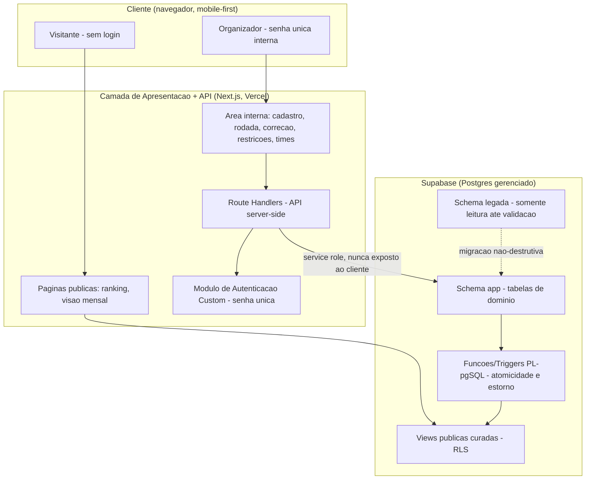
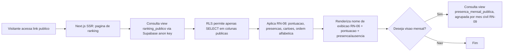
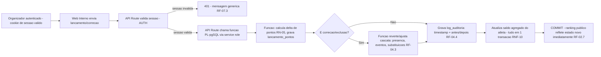
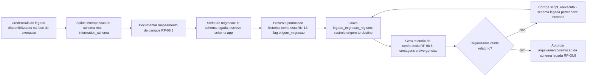
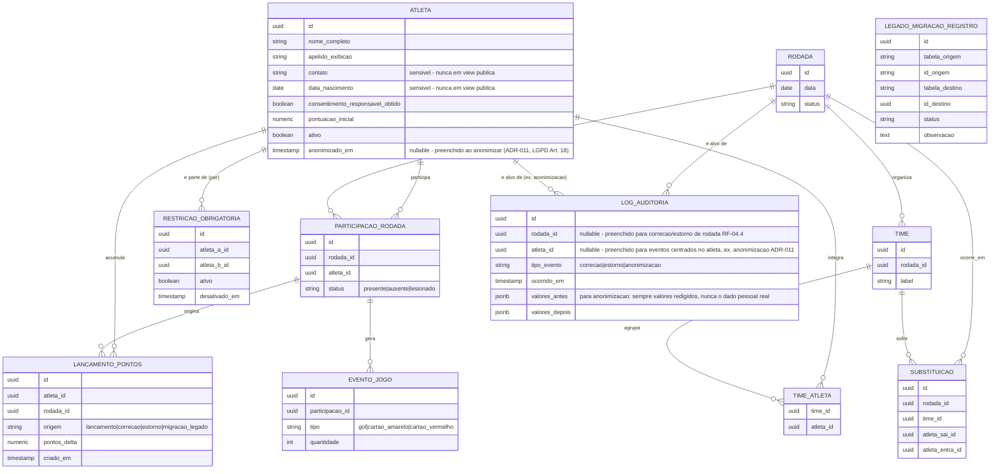

# SDD.md — Sistema de Ranking "Turma do Rola - Comary"

**Dono**: Software Architect
**Status**: **Aprovado com ressalvas pelo CTO no Gate 2** (`CTO-REVIEW.md`,
2026-09-02). Três ressalvas do Gate 2 (itens 3, 4 e 6 — anonimização LGPD Art.
18, redação da base legal LGPD diferenciada entre adulto e menor na Seção 7.6,
e mecanismo de explicação de conflito RF-05.2) foram resolvidas: a primeira e
a terceira via ADR-011 e ADR-010 respectivamente (ver Anexo A), e a segunda
via correção direta de redação da Seção 7.6 em 2026-09-04, sem gerar novo ADR
(ver Anexo B) — e `BLOCKERS.md` (BLOCKER-001/BLOCKER-002, marcados
`Resolvido`). As demais ressalvas do Gate 2 (itens 1, 2, 5, 7) seguem em
acompanhamento conforme `CTO-REVIEW.md` e não são objeto desta revisão.
**Input de origem**: `PRD-TECNICO.md` (Business Analyst, liberado 2026-09-02,
incluindo a revisão que incorpora RF-08/RNF-11/RNF-12/RN-13 sobre o banco legado
Supabase) + `CTO-REVIEW.md` Gate 1 (ressalvas estratégicas: LGPD, senha única,
algoritmo de times, estorno automático).
**Skills aplicadas**: `architecture-design` (Seções 1-2, com apoio de
`modular-design-principles` e `mermaid-studio`), `tech-stack-selection` (Seção
3), `adr-drafting` (arquivos `adr/`, com apoio de `create-adr`, índice na
Seção 4), `risk-and-scalability-assessment` (Seção 6), `security-architecture-definition`
(Seção 7), `sdd-drafting` (montagem final).

**Nota metodológica sobre o ponto crítico de entrada**: o PRD-TECNICO.md
confirma uma restrição técnica não negociável — o sistema deve reaproveitar um
banco de dados Supabase de um projeto legado (`ipnbdrejlikrmqyxggsp`), com
schema exato ainda não detalhado e credenciais só disponíveis na fase de
execução. Este SDD.md **não assume** que o legado está vazio ou trivial: a
descoberta do schema real é tratada como um spike técnico formal (Seção 6),
executado **antes** da carga final de migração (RF-08.3), e a decisão de
adotar o próprio Supabase como plataforma do novo sistema (em vez de migrar
para outra tecnologia) está registrada com racional explícito em ADR-002,
marcado para `build-vs-buy-analysis` no Gate 2.

---

## 1. Visão Geral da Arquitetura

### 1.1 Contexto e restrições que moldam a arquitetura

O sistema é uma aplicação web única (RNF-07: responsiva, mobile-first,
acessível por navegador em celular, sem app nativo), operada por um grupo
amador único ("Turma do Rola - Comary"), com:

- **Área pública sem login**: ranking de atletas e visão mensal de presença
  (RF-03), nunca expondo dado sensível (RN-01).
- **Área interna protegida por senha única compartilhada**: cadastro,
  lançamento de rodada, correção/histórico, gestão de restrições de times
  (RF-07), sem hierarquia de permissão (RN-12).
- **Restrição de dados legados**: banco Supabase pré-existente (projeto
  `ipnbdrejlikrmqyxggsp`) deve ser reaproveitado, com zero perda de dados
  (RNF-12) e schema livre para redesenho (RF-08.3).
- **Custo de operação próximo de zero** (RNF-04), sem SLA formal, sem equipe de
  operação dedicada.

### 1.2 Estilo arquitetural

**Monólito modular sobre plataforma BaaS (Backend-as-a-Service)** — ver
[ADR-001](adr/001-adotar-monolito-modular-sobre-plataforma-baas.md).
Nenhum sinal no PRD-TECNICO.md (volume, complexidade, equipe) justifica
microsserviços ou arquitetura distribuída; ao mesmo tempo, os dados já residem
numa plataforma (Supabase) que resolve banco gerenciado, backups, controle de
acesso a nível de linha (RLS) e API autogerada — reaproveitá-la
(ver [ADR-002](adr/002-adotar-supabase-legado-como-plataforma-de-dados.md))
reduz a superfície de código próprio ao estritamente necessário.

A aplicação tem três camadas lógicas:

1. **Camada de Apresentação** (Next.js/React, SSR + client-side): páginas
   públicas (ranking, visão mensal) e área interna (formulários de cadastro,
   lançamento de rodada, correção, gestão de restrições, montagem de times).
2. **Camada de Aplicação/API** (Next.js Route Handlers, serverless,
   TypeScript): validação de senha interna e sessão (RF-07), orquestração de
   regras que não cabem só no banco (heurística de montagem de times, RF-05),
   chamadas server-side ao Supabase usando a chave de serviço (nunca exposta
   ao cliente).
3. **Camada de Dados** (Supabase/Postgres): schema nova `app` com tabelas de
   domínio, funções/triggers PL/pgSQL para atomicidade e estorno automático
   (RNF-10, RF-04), Row Level Security e views curadas para a fronteira de
   exposição pública (RN-01), e a schema legada preservada intocada até
   validação da migração (RF-08.5/RF-08.6).

Justificativa ligada a volume/complexidade/equipe: o volume esperado (dezenas
de atletas, uma rodada semanal, um único grupo) e a ausência de equipe de
operação dedicada tornam qualquer arquitetura distribuída um custo não
solicitado por nenhum requisito do PRD-TECNICO.md — ver ADR-001 para o
comparativo completo de alternativas.

### 1.3 Diagrama de visão geral



---

## 2. Componentes e Fluxo de Dados

### 2.1 Componentes

| Componente | Responsabilidade | Requisitos rastreados |
|---|---|---|
| **Web Público** (Next.js, SSR) | Renderiza ranking e visão mensal a partir das views públicas, sem exigir sessão | RF-03, RN-01, RN-06, RN-08, RN-09 |
| **Web Interno** (Next.js, autenticado via cookie de sessão) | Formulários de cadastro, lançamento de rodada, correção/histórico, gestão de restrições, sugestão de times | RF-01, RF-02, RF-04, RF-05, RF-06, RF-07 |
| **Módulo de Autenticação Custom** (API Route + tabela `auth_interno`/`tentativa_login`) | Valida senha única, emite/valida sessão, aplica rate limiting, mensagem de erro genérica | RF-07, RNF-03 — ver [ADR-004](adr/004-autenticacao-custom-senha-unica-em-vez-de-supabase-auth.md) |
| **Serviço de Atletas** (API + tabela `atleta`) | CRUD de atleta, cálculo de nível técnico (RN-03), alerta de duplicidade (RF-01.5), anonimização de dado pessoal a pedido do titular (LGPD Art. 18) | RF-01, RN-02, RN-03, RN-10 — anonimização ver [ADR-011](adr/011-anonimizacao-de-dado-pessoal-do-atleta-lgpd-art-18.md) |
| **Serviço de Rodadas/Eventos** (API + funções PL/pgSQL) | Lançamento de presença/eventos, cálculo automático de pontos, correção/estorno atômico | RF-02, RF-04, RN-04, RN-05, RN-07 — ver [ADR-006](adr/006-atomicidade-via-funcoes-postgres.md) |
| **Serviço de Times** (API, heurística em TypeScript) | Montagem de times respeitando hard constraints (RN-11) e minimizando soft constraints; quando não há divisão 100% válida, identifica e reporta as restrições em conflito por componente conexo | RF-05, RN-03, RN-11 — ver [ADR-007](adr/007-heuristica-de-restricoes-para-montagem-de-times.md) e [ADR-010](adr/010-mecanismo-de-explicacao-de-conflito-rf-05-2.md) |
| **Serviço de Substituições** (API + tabela `substituicao`) | Registro de fidelidade histórica, sem efeito em pontuação | RF-06 |
| **Serviço de Auditoria** (funções PL/pgSQL + tabela `log_auditoria`) | Grava e disponibiliza log de correções (antes/depois, timestamp) e de eventos centrados no atleta (ex.: anonimização, com valores pessoais sempre redigidos) | RF-04.4, RF-04.5, RN-07, RNF-06 — anonimização ver [ADR-011](adr/011-anonimizacao-de-dado-pessoal-do-atleta-lgpd-art-18.md) |
| **Camada de Exposição Pública** (views + RLS no Postgres) | Garante, no nível de banco, que contato/data de nascimento nunca sejam expostos | RN-01, RNF-01 — ver [ADR-005](adr/005-fronteira-de-exposicao-publica-via-rls-e-views.md) |
| **Serviço de Migração** (scripts versionados, executados uma única vez na fase de execução) | Descoberta de schema legado, transformação e carga para a schema nova, relatório de conferência | RF-08, RNF-11, RNF-12, RN-13 — ver [ADR-008](adr/008-migracao-nao-destrutiva-preservando-historico-legado.md) |
| **Backup/Exportação Externa** (job agendado) | Exportação lógica periódica complementar ao PITR nativo | RNF-05 — ver [ADR-009](adr/009-estrategia-de-backup-e-recuperacao.md) |

Todo componente acima é rastreável a pelo menos um requisito funcional do
PRD-TECNICO.md; nenhum componente foi introduzido "por via das dúvidas".

### 2.2 Fluxo de dados — leitura pública (sem login)



### 2.3 Fluxo de dados — escrita interna (lançamento de rodada com estorno)



### 2.4 Fluxo de dados — migração do legado (execução única)



### 2.5 Integrações externas

A única integração/dependência externa desta release é a migração de dados do
banco legado Supabase (`ipnbdrejlikrmqyxggsp`), tratada como fronteira
explícita no **Serviço de Migração** (2.1) e no fluxo 2.4 — nenhuma outra
integração de terceiro em tempo de execução está prevista (PRD-TECNICO.md,
Seção 5.2).

---

## 3. Stack Tecnológica e Justificativa

| Componente | Tecnologia | Requisito que motiva | Alternativa considerada | Trade-off | Gate 2? |
|---|---|---|---|---|---|
| Plataforma de banco/backend | **Supabase** (Postgres gerenciado + PostgREST + Auth/Storage/Edge Functions, projeto legado reaproveitado) | RF-08, RNF-11, RNF-12 (dados já residem lá), RNF-04 (custo baixo) | Migrar para Postgres self-hosted/outro provedor gerenciado; migrar para outra tecnologia de banco (Firebase, MySQL) | Vendor lock-in em RLS/PL-pgSQL/PostgREST vs. menor risco de perda de dado (sem salto de plataforma) | **Sim — build-vs-buy-analysis (ADR-002)** |
| Frontend + camada de API | **Next.js 14+ (React, App Router, TypeScript)** | RNF-07 (mobile-first), RNF-09 (compat. navegadores), RF-03.4 (SSR consistente) | SPA pura (Vite + React); SvelteKit | Acopla ao modelo serverless (tempo de execução limitado) vs. um único deploy e ecossistema maduro | Não |
| Hospedagem frontend/API | **Vercel (tier gratuito/hobby)** | RNF-04 (custo próximo de zero) | Netlify, Cloudflare Pages | Integração nativa com Next.js vs. lock-in de plataforma de hospedagem (baixo risco, portátil) | Não |
| Autenticação interna | **Camada custom** (argon2id + cookie de sessão assinado httpOnly/secure/SameSite=strict + tabela de rate limiting em Postgres) | RF-07, RNF-03, RN-12 | Supabase Auth com conta única compartilhada; Basic Auth em proxy/CDN | Responsabilidade de segurança recai sobre código próprio vs. modela exatamente "papel único, sem conta individual" | **Sim — risk-and-compliance-check (ADR-004)** |
| Lógica de negócio crítica (atomicidade/estorno) | **Funções e triggers PL/pgSQL no Postgres (Supabase)** | RNF-10, RF-04.1-04.3, RF-04.4 | Transação orquestrada na camada de aplicação (TypeScript) | Lógica de domínio em linguagem menos familiar vs. atomicidade nativa do banco, sem coordenação de transação distribuída | Não |
| Montagem de times | **Heurística própria em TypeScript** (backtracking com poda + busca local) na camada de API | RF-05.1-05.4, RN-03, RN-11 | Solver de otimização genérico (CSP/ILP); heurística gulosa pura | Sem garantia de ótimo global vs. garante semântica exata de "100% das hard constraints ou reporta conflito" | **Sim — architecture-decision-review (ADR-007)** |
| Exposição pública sem PII | **Row Level Security + views curadas** (`ranking_publico`, `presenca_mensal_publica`) no Postgres | RN-01, RF-03.1, RNF-01 (LGPD) | Filtro só na camada de aplicação; desabilitar API autogerada por completo | Exige disciplina de revisão de RLS a cada novo campo sensível vs. proteção garantida no nível de banco | **Sim — risk-and-compliance-check (ADR-005)** |
| Migração de dados | **Scripts de migração versionados** (SQL + Node/TypeScript de transformação), execução única, não-destrutiva (schema nova ao lado da legada) | RF-08, RNF-11, RNF-12, RN-13 | Ferramenta de ETL genérica (Airbyte); migração in-place; novo projeto Supabase separado | ETL genérico é overkill para poucas tabelas vs. scripts versionados são mais auditáveis (RNF-11) | **Sim — risk-and-compliance-check (ADR-008)** |
| Backup/recuperação | **PITR nativo do Supabase + exportação lógica agendada** (GitHub Actions cron, `pg_dump` para storage externo) | RNF-05, RNF-06 | Somente PITR nativo; serviço terceiro pago dedicado | Mais um script a manter vs. redundância independente do fornecedor único, sem custo adicional | Não |
| Rate limiting de login | **Tabela Postgres de tentativas + lógica na API Route** (sem serviço externo) | RNF-03, RNF-04 | Upstash Redis rate limit | Menos performático sob alta concorrência (aceitável dado o volume) vs. sem novo serviço pago | Não |

Toda escolha marcada "Gate 2? Sim" está registrada como ADR próprio e **não
decidida unilateralmente** pelo Software Architect — depende de aprovação do
CTO via `build-vs-buy-analysis`, `architecture-decision-review` e/ou
`risk-and-compliance-check`, conforme guardrail de limite de autoridade.

---

## 4. Decisões Arquiteturais (ADRs)

Índice de todas as decisões registradas em `adr/`. Nenhum ADR foi editado
após aceito — mudança de decisão sempre gera novo ADR com `Superseded by`.

| ADR | Título | Status | Marcado para Gate 2? |
|---|---|---|---|
| [001](adr/001-adotar-monolito-modular-sobre-plataforma-baas.md) | Adotar Monólito Modular sobre Plataforma BaaS como Estilo Arquitetural | Accepted | Não |
| [002](adr/002-adotar-supabase-legado-como-plataforma-de-dados.md) | Adotar o Projeto Supabase Legado como Plataforma de Backend/Banco de Dados do Novo Sistema | Accepted | **Sim — `build-vs-buy-analysis` + `risk-and-compliance-check`** |
| [003](adr/003-adotar-nextjs-como-framework-web.md) | Adotar Next.js (React/TypeScript) como Framework Web Único | Accepted | Não |
| [004](adr/004-autenticacao-custom-senha-unica-em-vez-de-supabase-auth.md) | Implementar Autenticação Custom de Senha Única Compartilhada em Vez de Supabase Auth | Accepted | **Sim — `risk-and-compliance-check`** |
| [005](adr/005-fronteira-de-exposicao-publica-via-rls-e-views.md) | Aplicar a Fronteira de Exposição Pública via Row Level Security e Views Curadas | Accepted | **Sim — `risk-and-compliance-check`** |
| [006](adr/006-atomicidade-via-funcoes-postgres.md) | Usar Funções/Triggers PL/pgSQL para Cálculo Atômico e Estorno Automático | Accepted | Não |
| [007](adr/007-heuristica-de-restricoes-para-montagem-de-times.md) | Usar Heurística Determinística de Satisfação de Restrições para Montagem de Times | Accepted | **Sim — `architecture-decision-review`** |
| [008](adr/008-migracao-nao-destrutiva-preservando-historico-legado.md) | Migrar via Schema Nova Dentro do Mesmo Projeto Supabase, Preservando a Schema Legada Intocada até Validação | Accepted | **Sim — `risk-and-compliance-check`** |
| [009](adr/009-estrategia-de-backup-e-recuperacao.md) | Combinar PITR Nativo do Supabase com Exportação Lógica Agendada | Accepted | Não |
| [010](adr/010-mecanismo-de-explicacao-de-conflito-rf-05-2.md) | Mecanismo de Extração e Contrato de Dado para Explicação de Conflito (RF-05.2) | Accepted | Não (adendo pós-Gate 2 — resolve BLOCKER-001/ressalva item 6, registrado em `BLOCKERS.md`) |
| [011](adr/011-anonimizacao-de-dado-pessoal-do-atleta-lgpd-art-18.md) | Anonimização In-Place do Dado Pessoal do Atleta a Pedido do Titular (LGPD Art. 18) | Accepted | Não (adendo pós-Gate 2 — resolve BLOCKER-002/ressalva item 3, registrado em `BLOCKERS.md`) |

---

## 5. Modelo de Dados de Alto Nível

Entidades principais da schema nova (`app`), derivadas do fluxo de dados
(Seção 2) e dos requisitos do PRD-TECNICO.md. Não é modelagem física detalhada
(tipos de coluna exatos, índices) — isso cabe ao Backend Developer/Tech Lead na
decomposição seguinte.



Notas de modelagem:

- **Saldo acumulado do atleta** não é uma coluna editada diretamente: é a soma
  de `pontuacao_inicial` (RN-10) + todos os `lancamento_pontos.pontos_delta`
  associados ao atleta — um ledger append-only. Estorno (RF-04.1/RF-04.2) é
  implementado como novos lançamentos de `pontos_delta` negativos/ajuste, nunca
  como edição retroativa de um lançamento já existente — preserva a mesma
  garantia de não-reescrita silenciosa de histórico que RN-04/RN-07/RN-13 exigem.
- **`LEGADO_MIGRACAO_REGISTRO`** existe exclusivamente para rastrear, registro a
  registro, o mapeamento origem→destino da migração (RF-08.3, RNF-11) e
  alimentar o relatório de conferência (RF-08.5) — ver ADR-008.
- **`CONFIGURACAO_PONTUACAO`** (tabela auxiliar, não detalhada no diagrama por
  ser simples: `evento`, `pontos`, `vigente_desde`) versiona os valores de
  RN-05, permitindo que o histórico pós-migração sempre saiba qual tabela de
  pontuação estava vigente em cada lançamento, sem exigir tela de edição nesta
  release — editável apenas via migration/acesso direto, alinhado a RN-05
  ("fixos em código" vs. "configuráveis" é decisão do Architect: optou-se por
  configurável em banco para auditabilidade, mas sem UI de edição nesta versão).
- O schema exato do banco **legado** não está representado aqui — é
  desconhecido até o spike de descoberta (Seção 6) ser executado na fase de
  execução, quando as credenciais forem disponibilizadas.
- **`ATLETA.anonimizado_em`** e a função `anonimizar_atleta` (ver
  [ADR-011](adr/011-anonimizacao-de-dado-pessoal-do-atleta-lgpd-art-18.md))
  resolvem o direito de anonimização do titular (LGPD Art. 18) sem quebrar o
  ledger append-only: a linha de `ATLETA` nunca é excluída, apenas
  `nome_completo`, `apelido_exibicao`, `contato` e `data_nascimento` são
  sobrescritos por um placeholder não identificável — todas as tabelas
  dependentes (`LANCAMENTO_PONTOS`, `PARTICIPACAO_RODADA`, `TIME_ATLETA`,
  `SUBSTITUICAO`, `LEGADO_MIGRACAO_REGISTRO`) continuam referenciando o mesmo
  `atleta_id` sem qualquer alteração.
- **`LOG_AUDITORIA`** deixou de ser exclusivamente escopado por `rodada_id`:
  ganhou `atleta_id` (nullable) e `tipo_evento`, para registrar também eventos
  centrados no atleta (hoje: `anonimizacao`) que não pertencem a nenhuma
  rodada específica. Para `tipo_evento = 'anonimizacao'`, `valores_antes`
  contém sempre marcadores redigidos (nunca o dado pessoal real), evitando que
  o próprio log de auditoria — retido indefinidamente, RNF-06 — perpetue o
  dado que a operação existe para eliminar.

### 5.1 Adendo (2026-09-03, resolução de `BLOCKER-005`) — Campo `ausencias` em `app.ranking_publico`

**Contexto**: RF-03.1 exige exibir "número de ausências" por atleta no
ranking público; a view `app.ranking_publico` (tarefa `BE-03`, já `Concluída`
e aprovada pelo QA) expõe hoje `presencas` e `cartoes`, mas não `ausencias`,
e o campo não é derivável no cliente (UX/UI abriu `BLOCKER-005` em
`.md/BLOCKERS.md` após confirmar, na resolução de `BLOCKER-004`, que o
requisito é firme, não resíduo de rascunho).

**Caso de borda `participacao_rodada.status = 'lesionado'`**: releitura de
RF-02.3 ("o sistema deve tratá-lo [o atleta lesionado] como presente para
efeito da **pontuação** de presença") e de RN-05 ("Lesão = tratada como
presença... para efeito de **pontos**") mostra que os dois requisitos amarram
`lesionado` apenas ao cálculo de **pontos** — não à métrica de **exibição**
"número de presenças"/"número de ausências" de RF-03.1, que é um conceito
distinto. A própria view já aprovada em `BE-03` trata `presencas` como
contagem estrita de `status = 'presente'` (excluindo explicitamente
`lesionado`), conforme a migration `20260902101300_create_public_views.sql`
e `API-CONTRACT.yaml` (`RankingPublicoItem.presencas`); essa decisão já foi
validada pelo QA e **não é reaberta** por este adendo.

Dado esse precedente já aceito, a fórmula sugerida pelo UX/UI
(`total_rodadas_lancadas - presencas`) é **rejeitada**: como `presencas` já
exclui `lesionado`, subtrair `presencas` de um total de rodadas contaria toda
rodada em que o atleta esteve lesionado como se fosse uma ausência — o que
contradiz RN-05 (lesão nunca é penalizada, e é tratada como categoria própria
de `status`, distinta de `ausente`) e tornaria `presencas + ausencias`
diferente do total real de participações do atleta, uma inconsistência
visível a quem comparar os dois números na área pública.

**Decisão final**: `ausencias` é uma contagem direta e simétrica a
`presencas`, lida diretamente do status explícito já gravado em
`participacao_rodada.status = 'ausente'`, sem subtração — mesmo padrão de
subquery já usado por `presenca`/`cartao` na view existente:

```sql
coalesce(ausencia.total_ausencias, 0) as ausencias
-- ...
left join (
  select pr.atleta_id, count(*) as total_ausencias
  from app.participacao_rodada pr
  join app.rodada r on r.id = pr.rodada_id
  where pr.status = 'ausente'
    and r.status = 'lancada'
  group by pr.atleta_id
) ausencia on ausencia.atleta_id = a.id
```

`lesionado` permanece uma terceira categoria, **não contabilizada nem em
`presencas` nem em `ausencias`** nesta view — consistente com o tratamento já
aprovado de `presencas` e com a distinção de três status que RN-05/RF-02 já
fazem (presença, ausência e lesão são valores mutuamente exclusivos de
`participacao_rodada.status`; apenas o efeito em **pontos** da lesão é
equiparado ao da presença, RF-02.3/RN-05 — o efeito na **contagem exibida**
não é). Um contador visível específico de lesões não é exigido por RF-03.1
hoje; se o organizador solicitar isso no futuro, é requisito novo, não
correção deste adendo.

**Onde a coluna é calculada**: como coluna computada via subquery/CTE na
própria view `app.ranking_publico` (mesmo padrão de `presenca`/`cartao` já
existentes), **não** como tabela ou coluna auxiliar nova. Mantém a mesma
garantia do [ADR-005](adr/005-fronteira-de-exposicao-publica-via-rls-e-views.md):
a view nunca seleciona `contato`/`data_nascimento` de `app.atleta`, e a nova
subquery não introduz nenhuma coluna sensível nem novo `GRANT`.

**Migration**: **nova migration aditiva** (ex.:
`supabase/migrations/<timestamp>_add_ausencias_to_ranking_publico.sql`), e
não edição da migration já aplicada e aprovada `20260902101300_create_public_views.sql`
— preserva o histórico de migration já executado. A nova migration deve usar
`CREATE OR REPLACE VIEW app.ranking_publico AS ...`, reproduzindo
integralmente a definição atual da view (colunas `atleta_id`,
`nome_exibicao`, `pontuacao_acumulada`, `presencas`, `cartoes`, na mesma
ordem e mesmos tipos) e acrescentando `ausencias` como nova coluna ao final
do `SELECT`. O Postgres preserva os `GRANT`s já concedidos a `anon`/
`service_role` (`BE-03`) em `CREATE OR REPLACE VIEW`, desde que nomes, ordem
e tipos das colunas existentes não mudem — portanto **não é necessário
reemitir** `grant select on app.ranking_publico to anon/service_role` nesta
nova migration. Nenhuma tabela auxiliar é criada. **Não gera novo ADR** — é
detalhe de implementação de uma view já coberta por
[ADR-005](adr/005-fronteira-de-exposicao-publica-via-rls-e-views.md) (Seção 4).

**Consumidores desta especificação (fora da autoridade deste agente para
executar)**:
- **Backend**: implementar a migration acima; atualizar `API-CONTRACT.yaml`
  (`RankingPublicoItem.ausencias`, tipo `integer`, mesma descrição de
  derivação desta seção; incrementar `info.version` e registrar no
  Changelog do próprio arquivo, conforme convenção já existente nele).
- **Frontend**: pequeno incremento em `FE-02` para consumir e exibir
  `ausencias` — o wireframe e a Seção 6.2 de `UX-SPEC.md` já foram corrigidos
  para exibi-lo na resolução de `BLOCKER-004`.

---

## 6. Riscos Técnicos e Dívida Técnica Aceita

### 6.1 Spike técnico formal — descoberta do schema legado (pré-requisito de RF-08)

Antes de qualquer transformação/carga de dados (RF-08.3), a execução deve
seguir este procedimento, **não substituível por suposição**:

1. Assim que as credenciais forem disponibilizadas (fase de execução),
   executar introspecção via `information_schema.tables`,
   `information_schema.columns` e `pg_constraint` sobre o projeto legado
   completo (não só as tabelas mencionadas em alto nível pelo stakeholder).
2. Documentar o schema real descoberto (tabelas, colunas, tipos,
   relacionamentos, volume de linhas por tabela) como artefato de execução,
   antes de desenhar o script de transformação.
3. Mapear campo a campo entre schema legada e schema nova (`app`), registrando
   qualquer campo sem correspondência clara para confirmação explícita do
   organizador antes de descartar (RF-08.3) — nenhum dado é descartado por
   incompatibilidade sem essa confirmação.
4. Só then iniciar os scripts de migração não-destrutiva (ADR-008).

Este spike é tratado como etapa formal de descoberta técnica, não como detalhe
implícito da migração — nenhuma suposição sobre "schema provavelmente simples"
foi feita neste SDD.md.

### 6.2 Riscos técnicos e gargalos

| Risco/Gargalo | Componente | Severidade | Mitigação ou plano |
|---|---|---|---|
| Schema real do banco legado desconhecido até a fase de execução; credenciais indisponíveis nesta fase de planejamento | Serviço de Migração | **Alta** | Spike formal obrigatório (Seção 6.1) antes de qualquer transformação; migração não-destrutiva (ADR-008) garante rollback se a descoberta revelar estrutura mais complexa que o esperado |
| Tier gratuito/baixo custo do Supabase pode pausar o projeto por inatividade prolongada, ou impor limites de linhas/armazenamento/bandwidth | Plataforma de dados (Supabase) | **Média** | Recomendar tier pago de baixo custo ("Pro") se o uso real se aproximar dos limites do tier gratuito — decisão de custo vs. disponibilidade a ser confirmada no Gate 2 (tensiona RNF-04 "custo zero" com RNF-05 "durabilidade"); monitorar consumo desde o primeiro mês em produção |
| Único banco de dados (Supabase) é ponto único de persistência — se indisponível, toda escrita e leitura param | Camada de Dados | **Média** | Mitigado por SLA gerenciado da própria plataforma (managed HA) + PITR + exportação externa (ADR-009); aceitável dado RNF-04 (sem exigência de SLA formal) |
| Backtracking exato da montagem de times (ADR-007) tem complexidade combinatória no pior caso | Serviço de Times | **Baixa** | Aceitável para o volume esperado (~30-40 presentes/rodada); revisitar heurística (relaxar para aproximação) se presença regular exceder ~60 atletas por rodada |
| Implementação custom de autenticação (ADR-004) carrega toda a responsabilidade de segurança sem a robustez "pronta" de um provedor de identidade especializado | Módulo de Autenticação | **Média** | Requisito de arquitetura definido em detalhe na Seção 7; hardening tático (timing-safe compare, revisão de biblioteca de hash) fica a cargo do DevSecOps antes de produção |
| Job de exportação lógica externa (ADR-009) pode falhar silenciosamente, deixando a redundância externa inativa sem que ninguém perceba | Backup/Exportação | **Baixa** | Job deve emitir alerta visível em caso de falha — requisito repassado ao DevOps na fase de observabilidade |
| Dado duplicado temporário (schema legada + schema nova) durante a janela de validação da migração aumenta uso de armazenamento | Camada de Dados | **Baixa** | Transitório, resolvido após validação explícita do organizador (RF-08.5/RF-08.6); volume esperado é baixo (grupo amador) |
| Backups já realizados antes de um pedido de anonimização (PITR nativo + exportação lógica externa, ADR-009) continuam contendo o dado pessoal original até expirarem pela política de retenção vigente — a anonimização (ADR-011) só age sobre a schema ativa, não retroage sobre backups já tirados | Backup/Exportação, Serviço de Atletas | **Baixa** | Documentar a janela de retenção de backup vigente (dono: DevOps) para informar ao titular se solicitado; revisitar se o volume de pedidos de anonimização crescer a ponto de exigir expurgo ativo de backups antigos |

### 6.3 Dívida técnica aceita conscientemente

| Dívida Técnica Aceita | Motivo | Condição de revisão |
|---|---|---|
| Montagem de times usa heurística de melhor esforço para soft constraints (não garante ótimo global) | RF-05.3 não exige otimalidade matematicamente provada; RF-05.4 já permite ajuste manual do organizador | Revisitar se o organizador reportar insatisfação recorrente com o equilíbrio sugerido, mesmo após ajuste manual |
| `CONFIGURACAO_PONTUACAO` fica editável apenas via migration/acesso direto ao banco, sem UI de edição nesta release | RN-05 não exige painel de edição nesta versão; manter em banco (não hardcoded) já garante auditabilidade futura sem esforço extra agora | Revisitar se o organizador solicitar alterar valores de pontuação sem depender do time técnico |
| Rate limiting de login implementado em tabela Postgres própria, não em serviço dedicado (ex.: Redis) | RNF-04 (custo mínimo); volume de tentativas esperado é baixo (grupo pequeno, sem múltiplos usuários simultâneos reais) | Revisitar se houver evidência de tentativa de força bruta sustentada que a solução atual não contenha adequadamente |
| Dependência do tier comercial atual do Supabase para backup nativo (PITR) | Custo mínimo (RNF-04) enquanto o volume de uso justificar tier gratuito/baixo custo | Revisitar tier assim que o consumo real se aproximar dos limites do plano vigente (ver risco de pausa por inatividade, Seção 6.2) |
| Explicação de conflito de RF-05.2 (ADR-010) reporta o componente conexo inteiro do grafo de restrições, não o subconjunto mínimo estrito de pares em conflito | RF-05.2 não exige minimalidade estrita; volume real de restrições obrigatórias cadastradas é baixo e esparso (vínculos informais, RF-05.5), tornando componentes tipicamente pequenos (2-5 atletas); evita introduzir um algoritmo de núcleo insatisfável mínimo, desproporcional (RNF-04) | Revisitar (introduzir extração de núcleo mínimo) se aparecerem, na prática, componentes de conflito grandes (>8 atletas) que tornem a explicação confusa para o organizador |
| Anonimização (ADR-011) não retroage sobre backups/exportações já realizados antes do pedido | Retroagir exigiria reprocessar/expurgar backups históricos, custo operacional desproporcional (RNF-04) a um evento esperado como raro | Revisitar se o volume de pedidos de anonimização crescer ou se o titular exigir expurgo formal de backups (ver risco correspondente, Seção 6.2) |

---

## 7. Requisitos de Segurança e Compliance (nível de arquitetura)

### 7.1 Autenticação

- **Usuário final (área interna)**: senha única compartilhada, sem identidade
  individual (RN-12) — ver [ADR-004](adr/004-autenticacao-custom-senha-unica-em-vez-de-supabase-auth.md).
  Hash armazenado com **argon2id** (nunca texto puro, RNF-03), comparação em
  tempo constante. Sessão emitida como cookie assinado (`httpOnly`, `Secure`,
  `SameSite=Strict`), TTL curto (recomendado: 8-12h), renovável apenas por
  novo login — não há refresh token de longa duração.
- **Proteção contra força bruta (RNF-03)**: tabela de tentativas de login
  (IP + timestamp), limite de 5 tentativas por 15 minutos por IP, com backoff
  exponencial após o limite; mensagem de erro sempre genérica ("senha
  incorreta"), sem diferenciar "senha errada" de "conta bloqueada" (RF-07.3).
- **Serviço a serviço**: a camada de API usa a chave de serviço (`service
  role`) do Supabase exclusivamente no servidor (Route Handlers), nunca
  enviada ao navegador; toda chamada que grava dado passa por essa chave, não
  pela chave anônima do cliente.
- **Área pública**: nenhuma autenticação exigida para leitura das views
  públicas (RF-07.2) — acesso via chave anônima (`anon`) do Supabase,
  restrita por RLS (ver 7.4).

### 7.2 Autorização

- Modelo de autorização: **binário, sem RBAC** — sessão válida = acesso total
  a todas as ações da área interna (RN-12: papel operacional único, sem
  hierarquia). Não existe conceito de permissão diferenciada entre "criar
  atleta" e "gerenciar restrições" (RF-05.5 já confirma isso explicitamente).
- Toda rota de escrita (cadastro, lançamento, correção, restrições) exige
  sessão válida verificada em middleware antes de qualquer chamada à camada de
  dados; toda rota de leitura pública não exige verificação alguma.
- Nenhuma ação da área interna é atribuída a uma pessoa física identificada
  (RN-12) — o log de auditoria (RF-04.4) registra "o quê" e "quando", nunca
  "quem".

### 7.3 Criptografia

- **Em trânsito**: TLS obrigatório em toda borda externa — Vercel (frontend/
  API) e Supabase (banco) fornecem TLS por padrão; HSTS habilitado na
  configuração de deploy.
- **Em repouso**: 
  - Dado sensível identificado no PRD-TECNICO.md (`contato`, `data_nascimento`
    do atleta) armazenado em colunas normais do Postgres, protegido por
    encryption at rest nativo da plataforma gerenciada (Supabase) — nenhuma
    criptografia de aplicação adicional é exigida pelo PRD-TECNICO.md além
    disso, já que a proteção principal exigida (RN-01) é de **exposição**, não
    de criptografia de coluna.
  - Senha interna: hash argon2id, nunca texto puro (RNF-03).
  - Segredos operacionais (chave de serviço do Supabase, seed de configuração
    de hash) geridos via variáveis de ambiente do provedor de hosting (Vercel),
    nunca commitados em repositório — requisito de arquitetura repassado ao
    DevSecOps para validação de "secrets scanning" mais adiante.

### 7.4 Isolamento Multi-Tenant

**Não aplicável — sistema single-tenant.** O sistema atende a um único grupo
("Turma do Rola - Comary"); não há múltiplos clientes/organizações
compartilhando a mesma instância. Não existe requisito de isolamento por
`tenant_id` nesta release, e nenhum campo de tenant é modelado (Seção 5).

### 7.5 Superfície de Exposição

| Borda exposta à internet | Requisito mínimo de proteção |
|---|---|
| Páginas públicas de ranking/visão mensal (sem login) | Consultam exclusivamente as views `ranking_publico` e `presenca_mensal_publica`, que **nunca** incluem `contato` ou `data_nascimento` — garantido por RLS no banco (ver [ADR-005](adr/005-fronteira-de-exposicao-publica-via-rls-e-views.md)), não apenas por omissão no frontend |
| API autogerada do Supabase (PostgREST) sobre as tabelas base | RLS habilitado em todas as tabelas com dado sensível; role `anon` sem permissão de `INSERT`/`UPDATE`/`DELETE` em nenhuma tabela — toda escrita passa exclusivamente pela camada de API server-side, autenticada por sessão de senha única |
| Área interna (formulários protegidos por senha) | Middleware de sessão obrigatório em toda rota de escrita; rate limiting de tentativas de login (7.1); mensagem de erro genérica (RF-07.3) |
| Camada de API própria (Route Handlers) | Nunca expõe a chave de serviço (`service role`) do Supabase ao cliente; toda validação de sessão ocorre no servidor antes de qualquer chamada à camada de dados |

### 7.6 Base legal e minimização de dados (LGPD, insumo para o DevSecOps)

**Correção de redação (Gate 2, item 4 / Gate 3, prazo "antes do freeze do
texto de privacidade de `FE-04`") — ver nota de resolução ao final desta
seção e Anexo B.**

O cadastro de atleta trata dois subconjuntos de titulares sob **duas bases
legais distintas** — não uma única base legal com uma exigência funcional
adicional para o subconjunto de menores:

- **Atleta adulto (18 anos ou mais)**: a base legal é o **legítimo interesse
  do organizador do grupo** (LGPD Art. 7º, IX), restrita à finalidade de
  organização das peladas — herdada do PRD-TECNICO.md (RNF-01), com
  transparência sobre a coleta no ato do cadastro (responsabilidade de UX/UI
  detalhar a tela).
- **Atleta menor de 18 anos**: a base legal é o **consentimento específico do
  responsável legal** (LGPD Art. 14, §1º) — uma base legal distinta, não uma
  variação nem um reforço do legítimo interesse aplicado ao adulto. O
  tratamento do dado do menor não se apoia em legítimo interesse do
  organizador; apoia-se exclusivamente no consentimento do responsável.
  O sistema materializa essa exigência através do campo declarativo
  `consentimento_responsavel_obtido` (boolean) na tabela `atleta` (RN-02,
  RNF-02), preenchido pelo organizador no ato do cadastro — sem esse
  consentimento declarado, o cadastro do menor não pode ser concluído
  (validação de formulário, `FE-04`). A obtenção do consentimento em si (o
  contato com o responsável legal e seu aceite) é operacional, fora do
  sistema, conforme já delimitado pelo Business Analyst; o sistema registra a
  declaração de que ela ocorreu, não a executa nem a verifica.
- Minimização de dados aplicada estruturalmente a ambos os subconjuntos (não
  apenas por convenção de código): a fronteira de exposição pública (7.5)
  garante, no nível de banco, que `contato` e `data_nascimento` nunca
  circulam fora da área interna — independentemente de qual das duas bases
  legais ampara o registro.

**Nota de resolução (2026-09-04)**: até esta data, esta seção tratava
"legítimo interesse do organizador" como base legal única para todo o
cadastro, mencionando o consentimento do responsável apenas como um requisito
funcional adicional — imprecisão de redação com implicação regulatória
apontada pelo CTO no Gate 2 (Risco 4) e reiterada no Gate 3
(`CTO-REVIEW.md`). A redação acima corrige a imprecisão, sem alterar nenhum
desenho funcional já existente: RN-02/RNF-02 e o campo
`consentimento_responsavel_obtido` já capturavam corretamente a exigência
funcional; o que estava impreciso era a prosa desta seção, não o desenho.
Esta seção nunca foi objeto de um ADR próprio (é aplicação direta de
RNF-01/RN-02 do PRD-TECNICO.md, não uma decisão arquitetural com alternativas
concorrentes) — a correção não gera novo ADR e não altera o status de nenhum
ADR existente em `adr/`. Detalhe completo da resolução e o veredito sobre o
texto de produção de `FE-04` em Anexo B, ao final deste documento.

### 7.7 Direito do Titular à Anonimização/Exclusão (LGPD Art. 18)

- **Mecanismo**: anonimização in-place da linha `ATLETA` — ver
  [ADR-011](adr/011-anonimizacao-de-dado-pessoal-do-atleta-lgpd-art-18.md).
  A linha nunca é excluída fisicamente (preserva a integridade referencial do
  ledger append-only, ADR-006); `nome_completo`, `apelido_exibicao`, `contato`
  e `data_nascimento` são sobrescritos por um placeholder não identificável,
  `ativo` passa a `false`, `anonimizado_em` é preenchido, e toda
  `RESTRICAO_OBRIGATORIA` que referencie o atleta é desativada — tudo dentro
  de uma única transação (função PL/pgSQL `anonimizar_atleta`, mesmo padrão do
  ADR-006).
- **Acionamento**: exclusivamente pela área interna, por sessão autenticada
  (RF-07) — o organizador executa a ação a pedido do titular; não há
  autoatendimento do próprio atleta, consistente com RN-12 (papel operacional
  único, sem conta individual).
- **Irreversibilidade**: a operação não tem função inversa, por desenho — a
  UX/UI deve tratar a confirmação com o mesmo rigor de qualquer ação
  destrutiva irreversível do sistema.
- **Compatibilidade com auditoria**: o registro em `log_auditoria`
  (`tipo_evento = 'anonimizacao'`) nunca contém o dado pessoal original em
  `valores_antes` — apenas marcadores redigidos — para não recriar, no próprio
  log retido indefinidamente (RNF-06), o dado que a anonimização existe para
  eliminar.
- **Limite reconhecido**: backups/exportações já realizados antes do pedido
  (ADR-009) não são retroativamente expurgados por este mecanismo — risco
  residual registrado na Seção 6.2, de responsabilidade de acompanhamento do
  DevOps quanto à política de retenção de backup.
- Este mecanismo é requisito de **arquitetura de dados**, não de UX — a
  UX/UI define a tela/fluxo de solicitação e confirmação em T04 a partir
  deste desenho, conforme registrado na resolução do BLOCKER-002 em
  `BLOCKERS.md`.

**Nota explícita de limite desta seção**: os itens acima são requisitos de
**arquitetura** (o que deve existir estruturalmente) — não substituem a análise
tática de segurança (SAST/DAST, scanner de segredos, hardening de código) que o
DevSecOps executará depois, sobre código já implementado.

---

## Checklist de Prontidão (histórico da submissão original ao Gate 2; ver Anexo A para o estado atual)

- [x] Toda decisão arquitetural relevante tem ADR correspondente em `adr/`
      — 9 ADRs (001 a 009), cobrindo estilo arquitetural, plataforma de dados,
      framework web, autenticação, exposição pública, atomicidade, montagem de
      times, migração não-destrutiva e backup. **Atualização pós-Gate 2**: mais
      2 ADRs (010, 011) foram adicionados — ver Anexo A.
- [x] Toda escolha de stack tem justificativa e trade-off/alternativa
      considerada registrados — Seção 3, tabela completa, nenhuma linha sem as
      três colunas preenchidas.
- [x] Todo risco técnico/gargalo tem severidade; toda dívida técnica aceita
      conscientemente tem o motivo registrado — Seção 6.2 (7 riscos
      classificados) e 6.3 (4 dívidas técnicas com motivo e condição de
      revisão). **Atualização pós-Gate 2**: mais 2 riscos e 2 dívidas técnicas
      foram adicionados (Seção 6.2/6.3) — ver Anexo A.
- [x] Requisitos de segurança cobrem autenticação, autorização, criptografia e
      isolamento (marcado explicitamente como não aplicável) — Seção 7,
      nenhum item genérico sem detalhe concreto (hash específico, TTL, rate
      limit, RLS). **Atualização pós-Gate 2**: Seção 7.7 adicionada, cobrindo
      o direito de anonimização/exclusão do titular (LGPD Art. 18).
- [x] Nenhuma das 7 seções está vazia ou com placeholder.

**Pontos explicitamente marcados para o Gate 2 do CTO** (não decididos
unilateralmente por este agente, conforme limite de autoridade):

1. **ADR-002** (adotar Supabase legado como plataforma) — `build-vs-buy-analysis`
   + `risk-and-compliance-check` (vendor lock-in confirmado).
2. **ADR-004** (autenticação custom de senha única) — `risk-and-compliance-check`,
   respondendo diretamente ao risco estratégico #2 do Gate 1.
3. **ADR-005** (RLS/views públicas) — `risk-and-compliance-check`, respondendo
   diretamente ao risco estratégico #1 do Gate 1 (LGPD).
4. **ADR-007** (heurística de montagem de times) — `architecture-decision-review`,
   respondendo diretamente ao risco estratégico #3 do Gate 1.
5. **ADR-008** (migração não-destrutiva do legado) — `risk-and-compliance-check`,
   cobrindo RNF-11/RNF-12/RN-13.
6. **Risco de tier gratuito do Supabase pausar por inatividade** (Seção 6.2) —
   tensiona RNF-04 (custo zero) com RNF-05 (durabilidade); recomendação de
   tier pago de baixo custo precisa de validação de orçamento no Gate 2/Gate 3.

Nenhum requisito do PRD-TECNICO.md foi identificado como tecnicamente inviável
ou desproporcional em custo/prazo — não há sinalização pendente para o
Business Analyst neste momento. Se o CTO reprovar pontualmente alguma das
decisões acima no Gate 2, apenas o ADR correspondente será revisado (novo ADR
com `Superseded by`, registrado em `BLOCKERS.md`) — o restante deste SDD.md
permanece.

**Veredito (histórico da submissão original)**: rascunho do SDD.md pronto para
submissão ao Gate 2 do CTO. Não é considerado final até aprovação (Aprovado ou
Aprovado com ressalvas).

---

## Anexo A — Resolução de BLOCKER-001 e BLOCKER-002 (pós-Gate 2)

**Data**: 2026-09-02
**Contexto**: o Gate 2 do CTO (`CTO-REVIEW.md`) aprovou este SDD.md **com
ressalvas** — nenhuma decisão estrutural foi reprovada, mas 7 pendências
documentais/técnicas ficaram registradas. Duas delas (itens 3 e 6) geraram,
mais adiante, bloqueio formal do UX/UI em `BLOCKERS.md` (BLOCKER-001 e
BLOCKER-002), por impedirem a especificação completa de T09 e T04 no
`UX-SPEC.md`. Este anexo registra a resolução de ambas, sem reabrir nenhuma
decisão estrutural já aprovada — conforme o guardrail de não refazer o
SDD.md inteiro por causa de pendências pontuais.

| Bloqueio | Ressalva do Gate 2 | Resolução | Onde está registrado |
|---|---|---|---|
| BLOCKER-001 (UX/UI → Software Architect) | Item 6 — mecanismo de explicação de conflito para RF-05.2 não definido | Decomposição do grafo de restrições em componentes conexos; backtracking do ADR-007 executado por componente; contrato de dado `restricoes_conflitantes`/`grupos_conflito`, superestrutura da suposição do `UX-SPEC.md` — não exige redesenho de T09 | [ADR-010](adr/010-mecanismo-de-explicacao-de-conflito-rf-05-2.md); Seção 2.1 (Serviço de Times), Seção 6.3 (dívida técnica de granularidade não-mínima) |
| BLOCKER-002 (UX/UI → Software Architect) | Item 3 — direito de exclusão/anonimização (LGPD Art. 18) não endereçado | Anonimização in-place da linha `ATLETA` (função `anonimizar_atleta`, mesmo padrão transacional do ADR-006); ledger append-only preservado, nenhuma FK quebrada; log de auditoria com valores redigidos | [ADR-011](adr/011-anonimizacao-de-dado-pessoal-do-atleta-lgpd-art-18.md); Seção 5 (Modelo de Dados — `ATLETA.anonimizado_em`, `LOG_AUDITORIA` revisado); Seção 7.7 |

Nenhum ADR existente (001-009) foi editado ou teve seu status alterado — ambas
as resoluções são ADRs novos e aditivos (010, 011), consistentes com o
guardrail de imutabilidade de ADR. `BLOCKERS.md` foi atualizado para
`Resolvido` em ambas as entradas, com a nota de resolução apontando para este
Anexo.

As demais ressalvas do Gate 2 (itens 1, 2, 4, 5 e 7 da lista de recomendações
do CTO) **não** são objeto desta revisão — permanecem como pendências
rastreadas em `CTO-REVIEW.md`, sob a responsabilidade já atribuída lá (Software
Architect para 1/4/5, Tech Lead/Backend para 7, PM/stakeholder para o
orçamento associado ao item 2).

---

## Anexo B — Resolução da Ressalva de Redação da Seção 7.6 (Gate 2, item 4 / Gate 3)

**Data**: 2026-09-04
**Contexto**: o Gate 2 do CTO (`CTO-REVIEW.md`, Risco 4) apontou que a Seção
7.6 aplicava "legítimo interesse do organizador" (LGPD Art. 7º, IX) como base
legal única para todo o cadastro de atleta, tratando o consentimento do
responsável legal para menores apenas como um requisito funcional adicional
(`consentimento_responsavel_obtido`) — sem deixar explícito que o dado de
atleta menor de idade é tratado sob uma base legal distinta: consentimento
específico do responsável legal (LGPD Art. 14, §1º). O Gate 3 reiterou a
pendência sem novo prazo específico além de "antes do freeze do texto de
privacidade de `FE-04` para produção" (`TASK.md`, Risco 4/Seção 6.1 item 2).
Diagnóstico do CTO: imprecisão de redação com implicação regulatória, não
erro de desenho funcional — RN-02/RNF-02 já capturavam corretamente a
exigência do checkbox de consentimento.

**Resolução**: Seção 7.6 reescrita nesta data, deixando explícitas as duas
bases legais distintas aplicadas a dois subconjuntos de titulares (adulto sob
legítimo interesse, Art. 7º IX; menor sob consentimento do responsável legal,
Art. 14 §1º) — sem alterar nenhum desenho funcional, modelo de dados ou
componente já existente. Não foi aberto nem superseded nenhum ADR: a Seção
7.6 nunca foi lastreada por um ADR próprio (é aplicação direta de RNF-01/RN-02
do PRD-TECNICO.md), logo a correção de prosa não aciona o guardrail de
imutabilidade de ADR.

**Veredito sobre o texto de produção de `FE-04`
(`src/features/atletas/AtletaForm.tsx`, linhas 278-285 e 342-368)**: revisado
contra a redação corrigida da Seção 7.6 — **o texto passa na verificação de
consistência, sem necessidade de ajuste de copy**:

- O banner fixo exibido para todo cadastro ("🔒 Aviso de privacidade: Contato
  e data de nascimento são usados apenas internamente e nunca aparecem no
  ranking público.") não atribui nenhuma base legal ao tratamento — é um
  aviso de minimização/transparência, válido igualmente para titular adulto
  ou menor, e por isso não contradiz a distinção agora explícita na Seção
  7.6 (não afirma nada que a distinção pudesse contradizer).
- O bloco condicional exibido apenas quando a idade calculada é menor de 18
  anos ("⚠ Menor de 18 anos detectado" + checkbox "Confirmo que o
  consentimento do responsável legal foi obtido") já comunica, em linguagem
  simples e sem citar dispositivo legal ao usuário final — corretamente,
  citar artigo de lei ao usuário é decisão de copy/UX, não uma exigência de
  arquitetura — que o tratamento do dado do menor depende de um requisito
  próprio e adicional (o consentimento do responsável). Isso é exatamente o
  que a base legal do Art. 14, §1º exige na prática, ainda que o texto da
  tela não nomeie o artigo.
- **Conclusão**: o texto de `FE-04` pode ser considerado **congelado como
  está** para produção quanto a este ponto — nenhum ajuste de copy é
  necessário em função desta correção da Seção 7.6.

**Sinalização objetiva ao Frontend/Tech Lead**: o comentário no código-fonte
de `AtletaForm.tsx` (linhas 278-281), que marcava o texto do banner como
"pendente de revisão pelo Software Architect" enquanto a Seção 7.6 não fosse
corrigida, referencia uma pendência agora resolvida — o Frontend pode
atualizar/remover esse comentário na próxima alteração do arquivo (não é
necessário um commit dedicado só para isso). O `UX-SPEC.md` (Seção 2, nota de
T04, e Seção 7.2, item 3) também referenciava esta mesma pendência como "em
aberto"; cabe ao UX/UI atualizar esse status para refletir a resolução
registrada aqui, sem necessidade de reabrir o desenho de T04.

`TASK.md` (Seção 6.1, item 2) e `CTO-REVIEW.md` (ressalva reiterada no Gate 3)
podem marcar este ponto como resolvido, apontando para este Anexo B.
