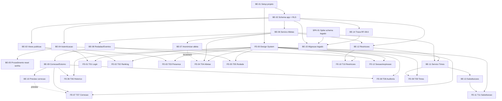

# TASK.md — Sistema de Ranking "Turma do Rola - Comary"

**Dono**: Tech Lead
**Status**: Rascunho pronto para o **Gate 3** do CTO (`capacity-and-timeline-validation`).
Não é considerado final até aprovação (Aprovado ou Aprovado com ressalvas) — reprovação
pontual reabre só a(s) tarefa(s)/risco(s) apontado(s), não o documento inteiro.
**Escopo desta decomposição**: Backend e Frontend. **Mobile fora de escopo** (Gate 1 do
CTO — "acessível pelo celular" é atendido por web responsivo, não por app nativo; o
próprio `UX-SPEC.md` confirma isso na abertura). QA e DevSecOps/DevOps consomem este
documento, mas suas tarefas próprias (`TEST-PLAN.md`, `SECURITY-REVIEW.md`, `DEPLOY.md`)
não são decompostas aqui.
**Input de origem**: `SDD.md` (Aprovado com ressalvas no Gate 2, 2026-09-02, incluindo
Anexo A com ADR-010/ADR-011) + `UX-SPEC.md` (completo, revisão 2026-09-02 pós-BLOCKER-001/
002) + `PRD-TECNICO.md` (RF-01 a RF-08, RNF-01 a RNF-12, RN-01 a RN-13) + `CTO-REVIEW.md`
(Gate 1 e Gate 2, pendências em aberto com dono e prazo) + `adr/001` a `adr/011` +
`BLOCKERS.md` (BLOCKER-001/002, ambos `Resolvido` — contexto de por que SDD.md/UX-SPEC.md
mudaram após a primeira versão).
**Skills aplicadas**: `task-decomposition` (Seção 3), `technical-spike-identification`
(Seção 2), `effort-estimation` (Seção 3 + Seção 5), `dependency-sequencing` (Seção 4),
`implementation-guideline-drafting` (Seção 1, com apoio de `coding-guidelines` como
camada base de comportamento), `task-md-drafting` (montagem final, incluindo Seção 6).
`guardrails-drafting` foi aplicada separadamente para produzir `GUARDRAILS.md`.

**Unidade de estimativa**: PD = pessoa-dia (~6h efetivas de trabalho focado), assumindo
um Backend developer e um Frontend developer full-time dedicados a este projeto (squad
pequeno, coerente com o porte "CRUD de grupo amador" já sinalizado pelo CTO no Gate 1).
Faixas: **S** = 1-2 PD, **M** = 3-5 PD, **L** = 6-8 PD, **XL** = timebox/spike, sem
compromisso de entrega fechada.

---

## 1. Diretrizes de Implementação

Esta seção faz o papel de `CLAUDE.md` consolidado do projeto (conforme
`PIPELINE-CONVENTIONS.md`, nota de consolidação — não existe arquivo `CLAUDE.md`
próprio; este é o lugar único). Traduz os ADRs em regras práticas de código, não
apenas cita a decisão.

### 1.0 Camada de comportamento base (agnóstica de stack)

Antes de qualquer regra específica de stack abaixo: pensar antes de codificar (não
gerar código para um requisito ainda ambíguo — verificar a Seção 6 ou o `SDD.md`/
`UX-SPEC.md` primeiro); preferir a solução mais simples que satisfaça o critério de
aceite, não a mais "impressionante"; nunca esconder incerteza — se uma implementação
não cobre 100% do requisito, isso vira comentário/`TODO` rastreável e nota no PR, nunca
lacuna silenciosa. Isso vale para todo código deste projeto, Backend e Frontend.

### 1.1 Stack e limites (derivados de ADR-001/002/003)

- **Obrigatório**: Next.js 14+, App Router, TypeScript em modo `strict` — frontend e
  camada de API (Route Handlers) no mesmo projeto/deploy (ADR-001/ADR-003). Nenhum
  serviço novo fora deste monólito sem passar por novo ADR do Software Architect.
- **Proibido**: introduzir microsserviço, fila de mensageria ou banco adicional
  "porque seria mais escalável" — ADR-001 já descartou isso; qualquer necessidade
  percebida de escalar horizontalmente é sinal para reabrir o `SDD.md` com o
  Software Architect, não uma decisão de implementação.
- **Proibido**: SPA pura consumindo Supabase diretamente do cliente para qualquer
  rota de escrita — ADR-003 já descartou essa opção porque não há lugar seguro para
  validar senha/usar a chave de serviço.

### 1.2 Banco de dados e Supabase (ADR-002, ADR-005, ADR-006, ADR-008, ADR-009)

- **Obrigatório**: toda tabela nova na schema `app` nasce com **RLS habilitado e
  `deny-by-default`** — nenhuma tabela vai para produção com RLS desabilitado
  "temporariamente". Checklist de PR: toda coluna sensível nova (equivalente a
  `contato`/`data_nascimento`) precisa de revisão explícita contra as views públicas
  (`ranking_publico`, `presenca_mensal_publica`) antes do merge — ADR-005 aceita
  conscientemente que o modo de falha aqui é "falhar fechado" (campo some da tela
  em vez de vazar), então a revisão é sobre completude de feature, não sobre
  segurança residual.
- **Proibido**: a role `anon` do Supabase (PostgREST) nunca recebe `INSERT`/
  `UPDATE`/`DELETE` em nenhuma tabela. Toda escrita passa exclusivamente pela API
  Route Handler com `service role`, nunca pela chave anônima do cliente.
- **Proibido**: a chave de serviço (`service role`) do Supabase nunca é referenciada
  em código que roda no navegador (nenhum `NEXT_PUBLIC_*` para ela) — só em
  variável de ambiente do lado servidor (Vercel).
- **Obrigatório**: toda operação que altera saldo acumulado de atleta (lançamento,
  correção, exclusão, estorno, anonimização) é implementada como **função/trigger
  PL/pgSQL** rodando dentro de uma única transação Postgres (ADR-006/ADR-011) —
  nunca orquestrada como múltiplas chamadas separadas da camada de aplicação
  TypeScript. Se uma feature nova parecer exigir 2+ escritas não-atômicas em
  tabelas que afetam saldo/histórico, ela **precisa** de uma função de banco nova,
  não uma sequência de chamadas de API.
- **Obrigatório**: `lancamento_pontos` é ledger **append-only** — nenhum código
  jamais faz `UPDATE`/`DELETE` num lançamento já gravado; correção/estorno sempre
  insere um novo lançamento de ajuste (RN-04/RN-07/RN-13/ADR-006).
- **Proibido**: recalcular pontuação histórica migrada do legado sob a tabela RN-05
  — RN-13 exige preservação exata; a tabela `configuracao_pontuacao` versiona
  valores vigentes, e código de cálculo deve sempre ler o valor vigente na data do
  evento, nunca hardcoded no TypeScript nem no PL/pgSQL.
- **Proibido**: excluir fisicamente uma linha de `atleta` por qualquer motivo,
  inclusive a pedido do titular — o mecanismo correto é a função
  `anonimizar_atleta` (ADR-011), nunca um `DELETE`.
- **Obrigatório**: scripts de migração do legado (RF-08) são **idempotentes e
  reexecutáveis** (ADR-008) — nenhum script assume que roda uma única vez sem
  erro; todo mapeamento origem→destino passa por `legado_migracao_registro`.

### 1.3 Autenticação e sessão (ADR-004)

- **Proibido**: Supabase Auth para a área interna — RN-12 exige papel único sem
  conta individual; usar apenas o módulo de autenticação custom.
- **Obrigatório**: hash de senha com **argon2id**, comparação em tempo constante
  (nunca `===` direto sobre o hash). TTL de sessão 8-12h, cookie
  `httpOnly`/`Secure`/`SameSite=Strict`, sem refresh token de longa duração.
- **Obrigatório**: rate limiting de tentativas de login em tabela Postgres própria
  (5 tentativas/15min por IP, backoff exponencial após o limite) — nunca introduzir
  serviço externo (ex.: Redis) para isso sem novo ADR (RNF-04).
- **Obrigatório**: mensagem de erro de login **sempre genérica** ("senha
  incorreta"), idêntica esteja ou não sob rate limiting — nunca diferenciar
  "senha errada" de "bloqueado" na resposta (RF-07.3).
- **Proibido**: qualquer rota de escrita da área interna sem verificação de sessão
  válida em middleware, executada **antes** de qualquer chamada à camada de dados.

### 1.4 Montagem de Times (ADR-007, ADR-010)

- **Obrigatório**: heurística determinística de duas fases (backtracking com poda
  + busca local) — nenhum solver de otimização genérico (CSP/ILP) e nenhuma
  heurística gulosa pura substituindo a fase de backtracking.
- **Obrigatório**: algoritmo parametrizado por `N` (número de times da rodada) —
  nunca hardcoded como `N=2` no backend, mesmo que a interface desta release só
  exponha `N=2` (ver decisão registrada na Seção 6).
- **Obrigatório**: explicação de conflito via decomposição em componentes conexos
  (union-find) — contrato de dado exato `restricoes_conflitantes`/`grupos_conflito`
  definido em ADR-010, não um formato simplificado "sem solução" (Opção B do
  ADR-010, rejeitada).

### 1.5 LGPD e dado pessoal (ADR-005, ADR-011, Seção 7 do SDD.md)

- **Proibido**: qualquer query/view/endpoint que devolva `contato` ou
  `data_nascimento` para um cliente não autenticado, mesmo indiretamente
  (ex.: em um campo de debug, em um payload de erro, em log de aplicação).
- **Obrigatório**: log de auditoria de anonimização grava **apenas marcadores
  redigidos** em `valores_antes` — nunca o dado pessoal real, mesmo temporariamente
  em memória de log de aplicação (não só no banco).
- **Obrigatório**: toda ação da área interna permanece sem campo de autor
  individual (RN-12/RN-07) — nenhuma feature nova adiciona identificação de "quem
  fez", nem "sistema"/"organizador desconhecido" como preenchimento.

### 1.6 Frontend, Design System e Acessibilidade (`UX-SPEC.md`)

- **Obrigatório**: mobile-first — toda tela implementada primeiro para `base`
  (<640px), depois adaptada para `sm`/`lg` (Seção 6 do `UX-SPEC.md`).
- **Obrigatório**: WCAG 2.1 nível AA como piso, aplicado tela a tela (não uma
  varredura genérica ao final) — critérios transversais da Seção 5.1 do
  `UX-SPEC.md` (contraste, foco visível, `aria-live`, alvo de toque 44×44px, etc.)
  valem para todo componente novo, mesmo os não listados explicitamente na Seção
  3.2 do `UX-SPEC.md`.
- **Obrigatório**: todo componente do design system (Seção 3.2 do `UX-SPEC.md`)
  implementado uma única vez e reutilizado — nenhuma tela cria uma variação
  paralela de `Button`/`Modal`/`Toast` "só para essa tela".
- **Proibido**: usar cor como único indicador de estado (presença, cartão,
  conflito) — sempre texto/ícone junto (WCAG 1.4.1, já checado pelo UX/UI).
- **Proibido**: `drag-and-drop` como única forma de interação em T09 (troca de
  jogador) — o seletor por modal é obrigatório mesmo em desktop, `drag-and-drop`
  é apenas atalho opcional (Seção 6.2 do `UX-SPEC.md`).

### 1.7 Segurança operacional e custo (RNF-03, RNF-04)

- **Proibido**: introduzir qualquer serviço de terceiro pago (rate limiting
  gerenciado, backup terceirizado, APM pago) sem aprovação explícita do CTO — vale
  o mesmo limite de autoridade que o Software Architect já aplicou nos ADRs.
- **Proibido**: commitar segredo (chave de serviço do Supabase, seed de hash) em
  qualquer arquivo versionado — sempre variável de ambiente do provedor de
  hospedagem (Vercel), nunca em `.env` versionado.
- **Obrigatório**: todo endpoint novo publicado incrementalmente em
  `API-CONTRACT.yaml` (OpenAPI 3.x) assim que o contrato estabilizar — não esperar
  o fim da tarefa inteira para documentar.

---

## 2. Spikes Técnicos Identificados

Nenhuma estimativa de esforço é dada "no escuro" para os itens abaixo — cada um é
tratado como investigação formal antes de estimar/implementar com confiança.

### SPK-01 — Descoberta do schema legado do Supabase (obrigatório, bloqueante de BE-15)

- **Motivo da incerteza**: o `SDD.md` (Seção 6.1) e o `PRD-TECNICO.md` (Seção 6,
  item 8) já tratam isso como spike formal — credenciais só disponíveis na fase de
  execução; schema exato desconhecido (tabelas, colunas, tipos, volume de linhas).
  **Nota importante desta decomposição**: este spike **não bloqueia o modelo de
  dados da schema nova (`app`)** — o `SDD.md` já fechou esse modelo (Seção 5,
  aprovado no Gate 2), e o `PRD-TECNICO.md` confirma que o schema pode ser
  redesenhado livremente (RF-08.3). O spike afeta exclusivamente o **script de
  migração/transformação** (BE-15) — o mapeamento campo a campo entre o legado e
  a schema `app`, não a definição da schema `app` em si.
- **Procedimento** (replicado do `SDD.md` Seção 6.1, sem alteração):
  1. Assim que as credenciais forem disponibilizadas, rodar introspecção via
     `information_schema.tables`, `information_schema.columns`, `pg_constraint`
     sobre **todo** o projeto legado (não só as tabelas citadas em alto nível).
  2. Documentar schema real (tabelas, colunas, tipos, relacionamentos, volume de
     linhas) como artefato de execução.
  3. Mapear campo a campo legado → `app`; todo campo sem correspondência clara
     exige confirmação explícita do organizador antes de descartar (RF-08.3) —
     nenhum dado descartado por incompatibilidade sem essa confirmação.
  4. Checar também a região/jurisdição de hospedagem do projeto Supabase legado
     (ponto de baixa severidade do Gate 2 do CTO, Risco/Compliance — "Localização/
     jurisdição") como item adicional do mesmo levantamento, sem custo extra.
  5. Só então iniciar o desenho fino do script de transformação (BE-15).
- **Dono**: Backend, com acompanhamento do Software Architect (interpretação de
  ambiguidade de schema é decisão de arquitetura, não só de implementação).
- **Timebox recomendado**: 2-3 PD após a liberação das credenciais — **não é uma
  estimativa de esforço de implementação**, é o teto de tempo de investigação
  antes de decidir se o mapeamento é trivial ou exige retrabalho de BE-15.
- **Saída esperada**: documento de mapeamento campo a campo + lista de
  divergências para confirmação do organizador — usado como input direto de BE-15.

### SPK-02 — Não identificado nenhum outro spike formal nesta decomposição

Os demais pontos de incerteza levantados pelo `UX-SPEC.md` (Seção 7.3 — quantidade
de "N" times, timeout do algoritmo de times, cálculo de preview de correção) **não
exigem spike** — são decisões de detalhe de baixa incerteza técnica, resolvidas
diretamente nesta decomposição e documentadas na Seção 6, conforme o guardrail de
"lacuna de detalhe decide, lacuna estrutural escala".

---

## 3. Lista de Tarefas

Convenção de ID: `BE-NN` (Backend), `FE-NN` (Frontend). Toda tarefa tem dono/time,
critério de aceite testável, estimativa (exceto BE-15, dependente de SPK-01, e
SPK-01 em si, tratadas como timebox, nunca estimativa forçada) e pertence a
exatamente um lote (Seção 3.0), referenciado pela coluna `Lote` das tabelas
3.1/3.2 abaixo.

### 3.0 Lotes

**Retrofit 2026-09-03**: esta subseção e a coluna `Lote` das tabelas 3.1/3.2 foram
adicionadas depois que `EXECUTION-FLOW.md` passou a operar pela unidade "lote"
(conjunto coerente de tarefas de Backend/Frontend que forma uma funcionalidade/
módulo com sentido próprio) em vez de tarefa individual — nenhuma definição de
tarefa, critério de aceite, estimativa, dependência ou status já registrado foi
alterada neste retrofit.

Cada lote agrupa as tarefas de todas as trilhas (Backend, Frontend) que formam uma
funcionalidade/módulo com sentido próprio, conforme `EXECUTION-FLOW.md` §1 — QA,
DevSecOps e deploy passam a operar por lote fechado, não por tarefa individual. O
agrupamento abaixo segue estritamente as dependências já mapeadas na Seção 4
(diagrama Mermaid de 4.1 + notas de paralelismo de 4.2 + bloqueios de 4.3), não um
agrupamento arbitrário.

| Lote | Nome | Tarefas | Ordem relativa entre lotes |
|---|---|---|---|
| **L0** | Fundação Técnica | BE-01, BE-02, FE-00 | Precede todos os demais lotes — nenhum outro lote tem tarefa que não dependa, direta ou transitivamente, de BE-01/BE-02 (backend) ou FE-00 (frontend), conforme o topo do diagrama de 4.1. |
| **L1** | Autenticação | BE-04, BE-05, FE-01, FE-12 | Depende de L0 (BE-04 depende de BE-01+BE-02, 4.1). Pode rodar em paralelo com L2 e L7. **L3 depende só do backend deste lote** (BE-06 exige BE-04 concluído, 4.1), não do frontend — o Backend de L3 pode começar assim que BE-04 estiver pronto, mesmo antes de FE-01/FE-12 fechar (4.2). |
| **L2** | Ranking e Presença Pública | BE-03, FE-02, FE-03 | Depende só de L0 (BE-03 depende de BE-02, 4.1). Independente de L1 — roda em paralelo com toda a área interna, conforme 4.2: "FE-02/FE-03 (público) podem rodar em paralelo com todo o desenvolvimento da área interna — não têm nenhuma dependência de autenticação". |
| **L3** | Cadastro de Atletas | BE-06, BE-07, FE-04 | Depende de L0 e do backend de L1 (BE-06 depende de BE-02 **e** BE-04, 4.1). Bloqueia L4 e L6 (ambos dependem de BE-06, 4.1/4.3). |
| **L4** | Lançamento de Rodada | BE-08, FE-05 | Depende de L3 (BE-08 depende de BE-06, 4.1). Bloqueia L5. |
| **L5** | Correção, Histórico e Auditoria de Rodadas | BE-09, BE-10, FE-06, FE-07, FE-08 | Depende de L4 (BE-09 depende de BE-08, 4.1). |
| **L6** | Montagem de Times, Restrições e Substituições | BE-11, BE-12, BE-13, FE-09, FE-10, FE-11 | Depende de L3 (BE-11/BE-12 dependem de BE-06, 4.1; BE-11 também depende de BE-12, 4.3). Independente de L4/L5 — ambos originados do mesmo ponto (L3), podem rodar em paralelo entre si. |
| **L7** | Migração do Legado | SPK-01, BE-14, BE-15 | Depende só de L0 (BE-14 depende de BE-02; BE-15 depende também de SPK-01 e BE-14, 4.1/4.3). Independente de todos os demais lotes, conforme 4.2: "SPK-01 roda de forma independente de todo o resto do backlog — não é bloqueante de nenhuma tarefa além de BE-15". |

**Atenção na retomada (estado real de execução em 2026-09-03 — para o próximo
`/executar` saber exatamente de onde retomar cada lote):**

- **L0 — Fundação Técnica**: 100% concluído (BE-01, BE-02, FE-00), todas as
  tarefas aprovadas pelo QA. Nenhuma ação de retomada de implementação
  necessária; falta apenas confirmar o fechamento formal do lote
  (`EXECUTION-FLOW.md` §5), que também depende de aprovação do DevSecOps — não
  referenciada em nenhum artefato lido até este retrofit, verificar antes de
  considerar o lote formalmente fechado.
- **L1 — Autenticação — lote com atenção prioritária na retomada**: parcialmente
  concluído. BE-04 e BE-05 `Concluída` e aprovadas pelo QA. **FE-01 está `Em
  andamento`, reprovada pelo QA em 2026-09-03** (`QA-REPORT.md` Seção 6,
  `BUG-QA-FE01-01` — open redirect em `redirectTarget.ts`, severidade Alta, em
  aberto). O `/executar` deve retomar este lote **corrigindo FE-01** (ajuste
  pontual de validação + caso de teste do vetor de barra invertida, conforme a
  ação já descrita na própria linha de status de FE-01 na Seção 3.2 — não é
  necessário refazer o restante da tarefa) antes de considerar o lote elegível a
  fechamento. FE-12 segue `Não iniciada` e pode começar em paralelo à correção de
  FE-01 (ambas dependem só de FE-00 + BE-04, já concluídos), mas o lote como um
  todo só fecha quando FE-01 for reaprovada pelo QA.
- **L2 — Ranking e Presença Pública**: parcialmente concluído. BE-03 e FE-02
  `Concluída` e aprovadas pelo QA (BE-03 já inclui o incremento do campo
  `ausencias`, resolução de `BLOCKER-005`). FE-03 segue `Não iniciada` — é a
  única pendência deste lote, sem bloqueio técnico registrado; retomada é
  simplesmente iniciar FE-03.
- **L3 a L7**: nenhuma tarefa iniciada em nenhum destes cinco lotes. Retomada
  segue a ordem relativa da tabela acima — L3 já está desbloqueada (BE-04, do
  qual depende, já foi concluído), L4 e L6 aguardam a conclusão de BE-06 (L3),
  L5 aguarda a conclusão de BE-08 (L4), e L7 é independente do restante,
  aguardando apenas a liberação das credenciais do legado para SPK-01 rodar.

### 3.1 Backend

| ID | Tarefa | Depende de | Critério de Aceite | Estimativa | Status | Lote |
|---|---|---|---|---|---|---|
| **BE-01** | Setup do projeto Next.js (App Router, TS strict), estrutura de módulos (atletas/rodadas/times/auditoria/migração), lint/format, variáveis de ambiente, esqueleto de CI | — | Projeto builda e roda localmente; lint/typecheck sem erro; `.env.example` documentado sem segredo real; estrutura de pastas reflete os módulos da Seção 2.1 do `SDD.md` | **M** (3 PD) | **Concluída** — desvio pequeno documentado: estrutura de módulos inclui, além dos 5 citados no nome da tarefa, `autenticacao` e `substituicoes` (também componentes próprios da Seção 2.1 do `SDD.md`); `restricoes` (BE-12) fica como submódulo de `times`, por ser consumida pelo algoritmo de montagem (ADR-007/010). Stack mantida na versão já estabelecida em paralelo por FE-00 (Next 14.2.5/React 18.3.1/TS 5.5.4 — satisfaz o piso "14+" do ADR-003) em vez de subir para a última versão, para não quebrar o trabalho já em andamento do Frontend. `zod` adotado como biblioteca de validação de input/env (decisão de detalhe, sem menção prévia em TASK.md/SDD.md). Corrigido também, como pré-requisito para "typecheck/test sem erro" do projeto: tipagem de `jest-axe` (faltava `@types/jest-axe`) e um bug de registro do matcher `toHaveNoViolations` em `vitest.setup.ts` (dupla aninhagem no `expect.extend`, mascarado antes por falta de tipos) — achado incidental ao validar o esqueleto de CI, não uma tarefa de Frontend reinterpretada. Nota: 1 teste de Frontend (`AppNav.test.tsx`) segue falhando por um problema no próprio componente `TopNav` (fora do escopo de BE-01, não corrigido aqui — fica para FE-00). | **L0** |
| **BE-02** | Migrations da schema `app` completa (todas as entidades da Seção 5 do `SDD.md`: `atleta`, `rodada`, `participacao_rodada`, `evento_jogo`, `lancamento_pontos`, `time`, `time_atleta`, `substituicao`, `restricao_obrigatoria`, `log_auditoria`, `legado_migracao_registro`, `configuracao_pontuacao`) + RLS habilitado `deny-by-default` em todas | BE-01 | Todas as tabelas criadas via migration versionada; `SELECT`/`INSERT`/`UPDATE`/`DELETE` da role `anon` negados por padrão em toda tabela, exceto onde explicitamente liberado nas views (BE-03); teste de integração confirma RLS ativo tabela a tabela | **L** (6 PD) | **Concluída** — 13 migrations em `supabase/migrations/` (`20260902100000` a `20260902101200`): 1 de setup da schema `app` (extensão `pgcrypto`, `GRANT USAGE`/`REVOKE ALL` na schema) + 12 tabelas (as 12 entidades citadas no critério). Todas com `ENABLE ROW LEVEL SECURITY`, nenhuma `POLICY` criada (deny-by-default literal), `REVOKE ALL ... FROM anon/public` explícito por tabela (defesa em profundidade além da ausência de GRANT), `GRANT ALL ... TO service_role` (única role que escreve, ADR-005/006). Validado de ponta a ponta contra Supabase local real (`supabase start` + `supabase db reset`, não só leitura do SQL): teste de integração novo (`src/lib/supabase/__tests__/app-schema-rls.integration.test.ts`, 72 casos = 12 tabelas × 6 verificações) confirma, tabela a tabela, (a) `pg_class.relrowsecurity = true` via conexão direta (`pg`), (b) `service_role` consegue `SELECT` (controle positivo — tabela existe e é alcançável), e (c) `anon` tem `SELECT`/`INSERT`/`UPDATE`/`DELETE` negados. Roda via `npm run test:integration` (config própria `vitest.integration.config.ts`, ambiente `node`, carrega `.env.test.local` via `dotenv` — nunca versionado); **não** entra no `npm test` padrão nem no job "Test" do CI compartilhado (`.github/workflows/ci.yml`), que não sobe Supabase local — sinalizado como follow-up para o DevOps decidir se/quando automatizar em CI, não decidido unilateralmente aqui. Passo "Convenção de rollback de migrations" do CI (`migration-convention-check`) verificado localmente com o mesmo grep do workflow: todas as 12 migrations de tabela têm bloco `-- ROLLBACK: DROP TABLE ...` (a de setup da schema é puramente aditiva, sem `DROP`/`ALTER ... DROP`, dispensado pelo `supabase/migrations/README.md`). `npm run lint`/`typecheck`/`build` e `npm test` (95 testes, suíte pré-existente) seguem verdes. **Reforço estrutural além do texto literal do critério de aceite** (documentado, não escalado — implementa diretamente `GUARDRAILS.md` regras 8 e 9, já obrigatórias, dentro do escopo de integridade de schema desta tarefa): trigger `app.forbid_lancamento_pontos_mutation` bloqueia `UPDATE`/`DELETE` em `lancamento_pontos` incondicionalmente (ledger append-only, ADR-006), e trigger `app.forbid_atleta_delete` bloqueia `DELETE` em `atleta` incondicionalmente (nunca exclusão física, ADR-011) — ambos válidos mesmo para `service_role`, porque trigger executa independente de RLS bypass; verificado empiricamente (não só lido), inclusive tentando a mutação bloqueada via conexão direta ao Postgres. **Desvios de detalhe documentados (modelagem física delegada pelo `SDD.md` Seção 5 ao Backend Developer — "não é modelagem física detalhada... isso cabe ao Backend Developer"), nenhum escalado**: (1) `lancamento_pontos` não ganhou coluna `participacao_id` apesar da relação `PARTICIPACAO_RODADA ||--o{ LANCAMENTO_PONTOS` do diagrama ER — a lista de campos da própria Seção 5 não inclui essa coluna; interpretação adotada: a relação é satisfeita indiretamente por `(atleta_id, rodada_id)`, consistente com RN-04/RN-05 corrigindo/calculando por atleta+rodada; (2) `rodada.status` (`lancada`/`excluida`) modelado como soft-delete, nunca `DELETE` físico da linha — motivo: preserva a FK de `log_auditoria.rodada_id`/`lancamento_pontos.rodada_id` e o ledger append-only (RF-04.1 reverte pontos via novo lançamento, não apaga o anterior); a função de exclusão em si (BE-09) ainda não existe, só a coluna que a suporta; (3) `evento_jogo` referencia `participacao_rodada` (não `atleta` direto), para que a garantia de RF-02.6 (bloquear evento para ausente) tenha apoio estrutural, não só de código de aplicação (checagem do `status` em si é escopo de BE-08); (4) `UNIQUE(rodada_id, atleta_id)` em `participacao_rodada`, `UNIQUE(tabela_origem, id_origem)` em `legado_migracao_registro` (suporta idempotência do ADR-008/BE-15) e `CHECK` de "atletas distintos" em `substituicao`/`restricao_obrigatoria` adicionados como reforço de integridade de dado, sem invalidar nenhum campo do diagrama. Nenhuma lacuna estrutural do `SDD.md` encontrada — nenhuma entrada nova em `BLOCKERS.md`. Dependências novas (`devDependencies`, sem impacto no bundle de produção): `pg`/`@types/pg` (cliente direto para o teste de integração) e `dotenv` (carrega `.env.test.local` no teste de integração); nenhuma nova dependência de produção. | **L0** |
| **BE-03** | Views públicas curadas (`ranking_publico`, `presenca_mensal_publica`) + RLS liberando `SELECT` para `anon` só nessas views, nunca nas tabelas base | BE-02 | View `ranking_publico` nunca retorna `contato`/`data_nascimento` mesmo com `SELECT *`; view `presenca_mensal_publica` agrupa por mês civil (RN-09); teste automatizado consulta ambas as views com a chave `anon` e falha se qualquer coluna sensível aparecer | **M** (2 PD) | **Concluída** — migration `supabase/migrations/20260902101300_create_public_views.sql`: cria `app.ranking_publico` e `app.presenca_mensal_publica` (nenhuma seleciona `contato`/`data_nascimento` de `app.atleta` em ponto algum da definição) e libera `GRANT SELECT` para `anon` **somente nas duas views** — nenhuma tabela base recebe grant novo, RLS deny-by-default de BE-02 permanece intocado. `ranking_publico`: `pontuacao_acumulada` = `pontuacao_inicial` + soma de `pontos_delta` (ledger `lancamento_pontos`); ordenada pela cascata completa de RN-08 (`pontuacao_acumulada` desc → `presencas` desc → `cartoes` asc → `nome_exibicao` asc) diretamente na definição da view, então `SELECT *` sem `order` já retorna a ordem final de exibição de T02. `presenca_mensal_publica`: uma linha por rodada com `status='lancada'`, expondo `ano`/`mes` (via `extract(year/month from rodada.data)`) para T03 agrupar no cliente pelo mês civil Gregoriano exigido por RN-09, mais `total_presentes`/`nomes_presentes` (array ordenado alfabeticamente). Documentado explicitamente na migration **por que nenhuma das duas views usa `security_invoker = true`**: com `security_invoker`, a checagem de permissão passaria a rodar como o role de quem consulta (`anon`, sem nenhum acesso às tabelas base), quebrando o próprio mecanismo do ADR-005 — a proteção correta já vem de a view rodar com o privilégio do seu dono (que enxerga as tabelas base normalmente) e nunca selecionar as colunas sensíveis, não de RLS "repassado" para dentro da view. **Duas decisões de detalhe documentadas na própria migration, não escaladas** (lacuna de implementação, não estrutural): (1) atleta anonimizado/inativo (`ativo=false`, ADR-011) é excluído **por completo** de ambas as views (não só o nome vira placeholder) — respalda diretamente o `UX-SPEC.md` (T04, pós-anonimização): "desaparece do ranking público e da presença mensal como identidade"; (2) rodada com `status='excluida'` (soft-delete, BE-02) não conta em presenças/cartões/lista de presentes em nenhuma das duas views — consistente com o próprio significado de "excluída" (pontos já revertidos via lançamento de estorno no ledger append-only, ADR-006); contar presença/cartão de uma rodada cujos pontos já foram revertidos deixaria o ranking público inconsistente com o saldo mostrado ao lado. Validado de ponta a ponta contra Supabase local real (mesmo rigor de BE-02, não só leitura do SQL): `supabase db reset` aplica a migration nova sem erro sobre as 12 tabelas existentes; teste de integração novo (`src/lib/supabase/__tests__/public-views.integration.test.ts`, 6 casos, roda via `npm run test:integration` junto aos 72 casos pré-existentes de BE-02 = **78 testes de integração, todos verdes**, confirmado em duas execuções seguidas para checar re-execução sem colisão) cobre literalmente o critério de aceite: seed via `service_role` de um atleta ativo + um atleta anonimizado/inativo + uma rodada `lancada` + uma rodada `excluida` (com presença/cartão em ambas), depois consulta as duas views **com a chave `anon`** e (a) falha se `contato`/`data_nascimento` aparecerem em qualquer linha de `SELECT *` (nenhuma linha, nunca — critério literal), (b) confirma que o atleta anonimizado não aparece em nenhuma das duas views, (c) confirma `pontuacao_acumulada`/`presencas`/`cartoes` corretos ignorando a rodada excluída, (d) confirma `ano=2026`/`mes=9` para uma rodada de `2026-09-05` (RN-09) e que a rodada excluída não aparece. Achado incidental corrigido durante a validação empírica (não é reinterpretação de requisito, é comportamento de infraestrutura verificado na prática): `INSERT` em lote do PostgREST resolve o conjunto de colunas pela união das chaves do corpo da requisição — uma linha do array que omitisse `ativo`/`anonimizado_em` (contando com o `DEFAULT`/`NULL` da coluna) recebia `NULL` explícito em vez do `DEFAULT`, violando o `NOT NULL` de `ativo`; corrigido declarando as mesmas chaves em todos os objetos do array de seed do teste, comentário deixado no próprio arquivo para quem reutilizar o padrão em testes futuros (BE-06 em diante). `npm test` (95 testes pré-existentes), `npm run lint`, `npx tsc --noEmit` e `npm run build` seguem verdes. Passo "Convenção de rollback de migrations" do CI verificado localmente com o mesmo grep do workflow: a migration é aditiva (nenhuma tabela alterada), mas contém `DROP VIEW` no próprio bloco `-- ROLLBACK:` (visto que `CREATE VIEW` não é `CREATE TABLE`, o bloco foi incluído mesmo assim para clareza e para não depender da leitura humana do verificador automático). **Publicado incrementalmente em `API-CONTRACT.yaml`** (`.md/API-CONTRACT.yaml`, primeira publicação do projeto, versão `0.1.0`): documenta os dois endpoints como parte da família "PostgREST autogerado do Supabase, consumido com a chave `anon` direto pelo Frontend" (já decidido no `SDD.md` Seção 7.5/linha "Consulta view `ranking_publico` via Supabase anon key" — T02/T03 não passam pela camada de API própria, então não há Route Handler novo nesta tarefa), com schema de resposta completo e nota explícita de que nenhuma das duas respostas inclui `contato`/`data_nascimento`. Nenhuma lacuna estrutural encontrada — nenhuma entrada nova em `BLOCKERS.md`. Nenhuma dependência nova (`@supabase/supabase-js` já usado por BE-02). — **Sub-item (2026-09-03, resolução de `BLOCKER-005`, SDD.md Seção 5.1)**: adicionado o campo `ausencias` à view `app.ranking_publico`, retomando sessão anterior interrompida por rate limit (trabalho parcial já em disco — migration e teste de integração — lido/auditado integralmente e conferido item a item contra a especificação exata do adendo, não recriado do zero; nenhuma lacuna encontrada no que já estava escrito, só validação empírica pendente). Nova migration **aditiva** `supabase/migrations/20260903091500_add_ausencias_to_ranking_publico.sql` (não edita `20260902101300_create_public_views.sql`, já aplicada), usando `CREATE OR REPLACE VIEW` reproduzindo as 5 colunas/ordem/tipos já existentes e acrescentando `ausencias` (contagem direta e simétrica de `participacao_rodada.status = 'ausente'` em rodada `lancada`, mesmo padrão de subquery de `presenca`/`cartao`, sem subtração) como 6ª coluna. `status='lesionado'` confirmado como terceira categoria que não conta nem em `presencas` nem em `ausencias` (RF-02.3/RN-05 amarram lesão só a pontos, não a esta métrica de exibição) — decisão do SDD.md, não reaberta aqui. Nenhuma coluna sensível (`contato`/`data_nascimento`) selecionada em nenhum ponto da view, mesma garantia do ADR-005. Validado empiricamente contra Supabase local real (`supabase start` + `supabase db reset`, mesmo rigor de BE-02/BE-03): migration aplica sem erro sobre as 16 migrations existentes; inspeção direta via `pg` confirma as 6 colunas na ordem/tipo esperados (`ausencias` como `bigint`, 6ª posição) e os `GRANT`s de `anon`/`service_role` preservados sem reemissão (Postgres realmente preserva `GRANT` de `CREATE OR REPLACE VIEW` quando colunas existentes não mudam de nome/ordem/tipo, confirmado na prática, não só na teoria da migration); `pg_get_viewdef` confere a definição completa não seleciona `contato`/`data_nascimento` em lugar algum. Teste de integração (`public-views.integration.test.ts`, já presente em disco) cobre os três casos exigidos: presente, ausente e lesionado (rodadas dedicadas para os dois últimos), com asserção explícita de que `presencas + ausencias` do atleta de teste (1 + 1) não soma o total de participações (4), provando que a rodada `lesionado` fica de fora de ambas as contagens por desenho — suíte de integração sobe de 6 para 7 casos nesta view (78 → 84 testes de integração no total, incluindo os 5 de BE-04), verde em duas execuções seguidas (checagem de re-execução sem colisão, mesmo critério de BE-03). `API-CONTRACT.yaml` atualizado: campo `ausencias` (tipo `integer`) adicionado a `RankingPublicoItem` (incluído em `required`, mesma descrição de derivação do adendo), `info.version` incrementado de `0.2.0` para `0.3.0`, e nova seção `x-changelog` (extensão válida do OpenAPI 3.x) criada ao final do arquivo com as 3 entradas de versão publicadas até aqui (`0.1.0`/BE-03, `0.2.0`/BE-04, `0.3.0`/este sub-item) — a seção "Changelog" referenciada em `info.description` desde a primeira publicação nunca tinha sido efetivamente criada; criada agora, sem reescrever o histórico das duas entradas anteriores (reconstruídas a partir do que já está documentado nas próprias linhas de status de BE-03/BE-04 acima). Passo "Convenção de rollback de migrations" do CI conferido localmente com o mesmo grep do workflow: migration não contém `DROP`/`ALTER ... DROP`/`ALTER ... ALTER COLUMN`, então o check nem é acionado (puramente aditiva); bloco `-- ROLLBACK:` documentado mesmo assim, por clareza, mesmo critério já usado em `20260902101300_create_public_views.sql`. `npm run lint`/`npm run typecheck`/`npm run format:check`/`npm test` (151 testes)/`npm run test:integration` (84 testes, ×2 execuções)/`npm run build` todos verdes. Nenhuma inconsistência estrutural nova encontrada entre a migration em disco e a especificação do `SDD.md` Seção 5.1 — nenhuma entrada nova em `BLOCKERS.md` necessária para este sub-item. | **L2** |
| **BE-04** | Módulo de autenticação custom: tabela de hash (argon2id), tabela de tentativas (rate limiting), Route Handler de login/logout, middleware de verificação de sessão em toda rota de escrita | BE-01, BE-02 | Login com senha correta emite cookie httpOnly/secure/SameSite=strict com TTL 8-12h; 5 tentativas erradas em 15 min bloqueiam com backoff; mensagem de erro idêntica em ambos os casos (RF-07.3); toda rota de escrita retorna 401 sem sessão válida | **L** (4 PD) | **Concluída** — módulo `src/modules/autenticacao/*` (`password.ts` argon2id via `@node-rs/argon2`, comparação em tempo constante feita pela própria biblioteca; `rate-limit.ts` lógica pura de backoff exponencial testável sem I/O; `session-token.ts` token assinado HMAC-SHA256 via Web Crypto — portátil entre Edge/Node — com comparação de assinatura em tempo constante manual, já que a Web Crypto não expõe `timingSafeEqual`; `session-cookie.ts`/`repository.ts`/`client-ip.ts`/`constants.ts`), duas migrations (`app.auth_interno` singleton com trigger que bloqueia `DELETE` incondicionalmente — troca de senha é sempre `UPDATE`, BE-05 — e `app.tentativa_login`, ambas RLS deny-by-default, só `service_role`), `POST /api/auth/login`/`POST /api/auth/logout` (`app/api/auth/`) e `middleware.ts` (Edge Runtime, `matcher: ["/api/:path*"]`, exige sessão em todo método de escrita exceto os dois endpoints de auth, executando a verificação antes de qualquer chamada à camada de dados — nenhum Route Handler de escrita futuro precisa reimplementar a checagem). Retomada de sessão anterior interrompida por rate limit: código e migrations já existentes no disco foram lidos e auditados integralmente (não recriados), critério de aceite conferido item a item contra a implementação já escrita, e validado empiricamente contra Supabase local real (`supabase start` + `supabase db reset`, mesmo rigor de BE-02/03), não só por leitura do código. Suíte de testes automatizados pré-existente cobre 100% do critério de aceite: 5 testes de integração (`app/api/auth/__tests__/auth.integration.test.ts`, via `npm run test:integration` contra Supabase local real) confirmam (a) senha correta emite cookie `HttpOnly`/`SameSite=Strict` com `Max-Age` entre 8h e 12h, (b) senha incorreta retorna 401 com a mensagem genérica e grava a tentativa falha, (c) corpo malformado retorna 400 (classe de erro diferente de RF-07.3), (d) 5 tentativas erradas bloqueiam a 6ª (mesmo com a senha certa) com resposta byte-a-byte idêntica e sem cookie emitido, (e) logout limpa o cookie (`Max-Age=0`) mesmo sem sessão prévia; mais 33 testes unitários (`rate-limit.test.ts`, `password.test.ts`, `session-token.test.ts`, `client-ip.test.ts`, `middleware.test.ts`) cobrindo backoff exponencial/teto de 15min/reset por sucesso, hash/verificação argon2id (incluindo `verifyPasswordOrDummy` para não vazar, por timing, que o sistema não tem senha configurada), token de sessão (TTL, expiração exata, adulteração de payload/assinatura, `SESSION_COOKIE_SECRET` ausente) e o middleware genérico (401 sem cookie, sessão expirada, cookie adulterado, GET nunca bloqueado, isenção de `/api/auth/login`/`/api/auth/logout`). Validação empírica adicional feita nesta retomada, além dos automatizados (protocolo do enunciado — "mesmo rigor das tarefas anteriores"): `npm run build`/`start` real na porta 3100 com `.env.local` apontando para o Supabase local, hash argon2id real semeado via `service_role`, e `curl` direto contra `POST /api/auth/login`/`POST /api/auth/logout`/`POST /api/atletas` (rota de escrita representativa) confirmando byte a byte o `Set-Cookie` (`HttpOnly`, `SameSite=strict`, `Max-Age=36000`), o bloqueio da 6ª tentativa com o mesmo corpo/status da 5ª, o `Max-Age=0` do logout e o 401 genérico do middleware (`{"error":"Sessão inválida ou expirada."}`) numa rota de escrita sem cookie — nenhum artefato de teste manual (`.env.local`, senha semeada) deixado no repositório (removido ao final, `.env.local` já coberto por `.gitignore`). **Dois achados incidentais corrigidos nesta retomada, não reinterpretação de requisito** (TASK.md Seção 1.0 — nunca lacuna silenciosa): (1) `npm run build` falhava (`Module parse failed`) porque o webpack do Next.js 14.2 tentava empacotar o binário nativo pré-compilado do `@node-rs/argon2` como módulo JS comum — corrigido com `experimental.serverComponentsExternalPackages: ["@node-rs/argon2"]` em `next.config.mjs` (mantém o pacote como `require()` externo em runtime Node.js, sem afetar o bundle do middleware/Edge nem do cliente, já que `password.ts` só é importado pelos Route Handlers); sem essa correção, o critério de aceite desta tarefa seria inverificável em produção (a Vercel também faz build via webpack). (2) `npm run format:check` apontava 8 arquivos deste módulo fora do padrão Prettier (mesma classe de débito já sinalizada em `BUG-QA-FE00-01`/`BUG-QA-BE01-02`) — corrigido com `prettier --write` nos arquivos de propriedade desta tarefa antes de considerá-la concluída, `typecheck`/`lint`/testes reconferidos depois (mudança puramente de formatação). `npm run lint`/`npm run typecheck`/`npm run format:check`/`npm test` (151 testes)/`npm run test:integration` (84 testes)/`npm run build` todos verdes ao final. Requisitos de segurança do SDD.md aplicados na implementação (não pendentes): RLS deny-by-default + só `service_role` nas duas tabelas novas (nenhum `GRANT` para `anon`), nenhum segredo commitado (`SESSION_COOKIE_SECRET`/hash de senha só em variável de ambiente, `.env.example` só com placeholder), sem refresh token de longa duração, payload de sessão sem identidade individual (RN-12). **Publicado em `API-CONTRACT.yaml`** (já incremental desde a sessão anterior — `POST /api/auth/login`/`POST /api/auth/logout`, com schemas `LoginRequest`/`AuthErroGenerico`/erro genérico de middleware); nenhuma mudança de contrato necessária nesta retomada. Nenhuma lacuna estrutural nova encontrada — nenhuma entrada nova em `BLOCKERS.md`; limitação conhecida já documentada no próprio código (`login/route.ts`) e não resolvida aqui, por estar fora do escopo literal do critério de aceite: a resposta de erro é idêntica byte a byte entre "senha incorreta" e "bloqueado", mas o tempo de execução não é artificialmente igualado entre os dois caminhos (o caminho bloqueado pula a verificação de senha por desenho) — candidato a revisão tática do DevSecOps (TASK.md Seção 5, risco #7), não um desvio desta tarefa. | **L1** |
| **BE-05** | Procedimento de redefinição da senha única compartilhada (Gate 2, item 7 — dono Tech Lead/Backend) — script/CLI operacional para gerar novo hash argon2id e substituir na tabela, documentado como runbook | BE-04 | Runbook documentado (passo a passo + comando/script) permite trocar a senha sem depender de fluxo de e-mail; testado manualmente uma vez em ambiente de homologação | **S** (1 PD) | **Concluída** — lógica testável em `src/modules/autenticacao/redefinir-senha.ts` (`validarNovaSenha`: tamanho mínimo 8 caracteres — decisão de detalhe documentada, nenhuma regra de complexidade de senha está definida em TASK.md/SDD.md/PRD-TECNICO.md para a senha única além do algoritmo de hash; `redefinirSenhaInterna`: gera o hash via `hashPassword`, já existente de BE-04, e faz `UPSERT` — nunca `DELETE`+`INSERT` — na linha singleton `id=1` de `app.auth_interno`, o único caminho possível já que a tabela bloqueia `DELETE` incondicionalmente mesmo para `service_role`, trigger de BE-04) + CLI de terminal em `scripts/redefinir-senha-interna.ts` (`npm run senha:redefinir`), que carrega `.env.local` se existir, pede a nova senha duas vezes com **entrada oculta** (nunca como argumento de CLI — vazaria em `ps`/histórico do shell, decisão de segurança de detalhe), pede confirmação explícita antes de gravar, e nunca imprime senha nem hash em nenhum momento (stdout/stderr). Nova dependência de detalhe (documentada, não escalada): `tsx` (devDependency) para executar o script TypeScript com resolução do path alias `@/*` do `tsconfig.json`, sem exigir Node ≥22 (engine mínimo do projeto é 20.9.0, abaixo do piso da suporte nativo a TS do Node). Runbook completo (pré-requisitos, passo a passo, o que o procedimento não faz — não invalida sessão já emitida, não notifica ninguém, RN-12 — e como validar o resultado) em `scripts/README.md`. Testes automatizados cobrindo o critério de aceite: unitário (`src/modules/autenticacao/__tests__/redefinir-senha.test.ts`, 5 casos, validação pura sem I/O) + integração contra Supabase local real (`src/modules/autenticacao/__tests__/redefinir-senha.integration.test.ts`, 4 casos, via `npm run test:integration`: hash substituído e válido, senha antiga deixa de validar e nova passa a validar — cenário real do runbook —, seguro rodar mais de uma vez seguida sem criar segunda linha, `atualizado_em` atualizado). **Validação manual de ponta a ponta contra Supabase local** (mesmo rigor/precedente de BE-02/03/04 — não há ambiente de homologação real provisionado ainda pelo DevOps, `infra/README.md` Seção 2: "Nenhum deploy real ocorreu ainda"; Supabase local é o ambiente mais próximo disponível nesta fase, mesma equivalência já usada nas tarefas anteriores): rodado `npm run senha:redefinir` via terminal contra Supabase local com senha nova, depois `npm run build && npm run start` e `curl` direto em `POST /api/auth/login` confirmando que a senha antiga (definida em BE-04) retorna 401 genérico e a senha nova retorna 200 com `Set-Cookie` válido (`HttpOnly`/`SameSite=strict`/`Max-Age=36000`) — prova de que o procedimento funciona de fato no fluxo real de login, não só que o script imprime "sucesso"; também validados os caminhos de cancelamento, senha curta e confirmação divergente. **Dois achados incidentais corrigidos nesta tarefa, não reinterpretação de requisito** (TASK.md Seção 1.0 — nunca lacuna silenciosa, ambos descobertos pela própria validação manual exigida pelo critério de aceite, não por leitura de código): (1) a primeira versão do CLI usava `readline.createInterface()`/`rl.question()` chamado repetidamente (uma vez por pergunta) — neste ambiente (Windows/Git Bash, Node 24), com `stdin` não-TTY (pipe, o caminho de teste automatizado), só a primeira chamada resolvia e a segunda ficava pendurada para sempre sem erro nem timeout, e como uma Promise pendurada não mantém o event loop vivo sozinha, o processo simplesmente encerrava (`exit code` 0) sem nunca pedir a segunda entrada nem confirmar nada — reproduzido isoladamente antes de corrigir; corrigido trocando para uma única instância de `readline.Interface` reaproveitada e lida via `rl[Symbol.asyncIterator]()` (padrão oficial do Node), testado com os mesmos cenários de entrada via pipe (cancelar, senha curta, confirmação divergente, sucesso) até confirmar determinístico; (2) `npm run test:integration` começou a falhar de forma reproduzível (não intermitente) depois do teste de integração novo desta tarefa — investigação mostrou que `vitest.integration.config.ts` roda arquivos de teste em paralelo por padrão, e `redefinir-senha.integration.test.ts` escreve concorrentemente na MESMA linha singleton de `app.auth_interno` que `auth.integration.test.ts` (BE-04) também usa, causando uma corrida real onde um arquivo trocava o hash vigente no meio da execução do outro; corrigido com `fileParallelism: false` em `vitest.integration.config.ts` (comentário no próprio arquivo explica o motivo) — suíte de integração completa (88 testes, 4 arquivos) reconfirmada verde em três execuções seguidas após a correção. Nenhuma mudança em `API-CONTRACT.yaml`: esta tarefa não expõe nenhum endpoint HTTP (é um script/CLI de acesso direto ao banco, por decisão já registrada na Seção 6.2 item 4), então a obrigação de publicação incremental de contrato não se aplica. Requisitos de segurança aplicados na implementação: senha nunca aceita como argumento de CLI, nunca logada, `service_role` exigida (mesmo `getServiceRoleClient()` de BE-01/04, nunca a chave anônima), `UPSERT` sempre (nunca burla o trigger de `DELETE` de BE-04), sem novo segredo commitado. `npm run lint`/`npm run typecheck`/`npm run format:check`/`npm test` (179 testes)/`npm run test:integration` (88 testes, ×3 execuções)/`npm run build` todos verdes ao final. Nenhuma lacuna estrutural encontrada — nenhuma entrada nova em `BLOCKERS.md`. | **L1** |
| **BE-06** | Serviço de Atletas: CRUD, cálculo de nível técnico (RN-03, view/query), alerta de duplicidade de nome completo (RF-01.5), validação de idade/consentimento (RF-01.3) | BE-02, BE-04 | Cadastro com idade <18 anos bloqueia salvar sem checkbox de consentimento marcado; nome duplicado dispara alerta antes de confirmar; nível técnico calculado corretamente com fallback de pontuação inicial para atleta sem presença | **M** (3 PD) | Não iniciada | **L3** |
| **BE-07** | Função `anonimizar_atleta` (ADR-011) + endpoint de acionamento + log de auditoria com valores redigidos | BE-02, BE-06 | Chamar a função sobrescreve `nome_completo`/`apelido_exibicao`/`contato`/`data_nascimento`, marca `ativo=false` e `anonimizado_em`, desativa `restricao_obrigatoria` associadas — tudo em uma transação; `lancamento_pontos`/`participacao_rodada`/`time_atleta`/`substituicao` não sofrem nenhuma alteração; `log_auditoria` grava `valores_antes` só com marcadores redigidos | **M** (2 PD) | Não iniciada | **L3** |
| **BE-08** | Serviço de Rodadas/Eventos: lançamento de presença/eventos, função de cálculo automático de pontos (RN-05, lendo `configuracao_pontuacao` vigente), bloqueio de evento para ausente (RF-02.6), alerta de rodada duplicada (RF-02.8) | BE-02, BE-06 | Confirmar lançamento aplica pontos corretos por evento; tentar lançar gol/cartão para atleta ausente retorna erro bloqueante; lançar rodada com data já existente exige confirmação explícita; toda a operação é atômica (uma transação) | **L** (5 PD) | Não iniciada | **L4** |
| **BE-09** | Serviço de Correção/Estorno: função PL/pgSQL de correção/exclusão com reversão em cascata (presença, gols, cartões, substituições vinculadas), gravação de log de auditoria na mesma transação, endpoint de consulta do log (RF-04.5) | BE-08 | Excluir uma rodada reverte 100% dos pontos daquela rodada para todos os atletas afetados numa única transação; corrigir um valor aplica só a diferença; toda correção/exclusão gera entrada em `log_auditoria` sem campo de autor; consulta do log ordena do mais recente ao mais antigo | **L** (5 PD) | Não iniciada | **L5** |
| **BE-10** | RPC `simular_correcao_rodada` (preview read-only, sem efeito colateral) para alimentar a pré-visualização de impacto de T07 — decisão de detalhe documentada na Seção 6 | BE-09 | Chamar a função com um valor hipotético novo retorna o delta de pontos calculado sem gravar nenhuma linha nova; usa a mesma tabela `configuracao_pontuacao` vigente que a correção real usaria | **S** (1.5 PD) | Não iniciada | **L5** |
| **BE-11** | Serviço de Times: heurística de duas fases (ADR-007) parametrizada por `N`, decomposição em componentes conexos para explicação de conflito (ADR-010, contrato `restricoes_conflitantes`/`grupos_conflito`), guarda de timeout (decisão Seção 6) | BE-02, BE-06, BE-12 | Para `N` times, gera divisão respeitando 100% das restrições obrigatórias ativas ou retorna `status: "conflito"` com o contrato exato do ADR-010; nível técnico + idade usados como soft constraint (RF-05.3); execução acima do timeout configurado retorna erro de "falha técnica real" (não trava a função serverless) | **L** (6 PD) | Não iniciada | **L6** |
| **BE-12** | CRUD de Restrições Obrigatórias (RF-05.5): criar/editar/desativar par de atletas, soft-delete (RN-11) | BE-02, BE-06 | Desativar uma restrição preserva o registro histórico com `desativado_em`, nunca exclui fisicamente; qualquer sessão válida pode criar/editar/desativar (sem hierarquia, RN-12) | **S** (1.5 PD) | Não iniciada | **L6** |
| **BE-13** | Serviço de Substituições (RF-06): registro de fidelidade histórica vinculado a rodada/time, sem efeito em pontuação | BE-11 | Registrar substituição não altera saldo de nenhum atleta; múltiplas substituições na mesma rodada sem limite (RF-06.2); tentar usar o mesmo atleta em "sai" e "entra" é bloqueado com mensagem clara | **S** (1.5 PD) | Não iniciada | **L6** |
| **BE-14** | Trava técnica complementar a RF-08.6 (Gate 2, item 5 — Software Architect/Tech Lead): revogar privilégio de `DROP`/`ALTER` destrutivo da role usada pela aplicação sobre a schema legada, liberado só após flag de validação explícita gravada em `legado_migracao_registro`/tabela de controle | BE-02 | Tentativa de remover/alterar destrutivamente a schema legada antes da flag de validação falha por permissão negada no próprio Postgres, não só por convenção de processo; após a flag de validação ser gravada, a operação de arquivamento passa a ser permitida | **S** (1 PD) | Não iniciada | **L7** |
| **BE-15** | Scripts de migração do legado (RF-08): transformação e carga schema legada → `app`, gravação em `legado_migracao_registro`, relatório de conferência (RF-08.5) | SPK-01, BE-02, BE-14 | Todo registro do legado (jogadores, rodadas, eventos, pontuação) aparece migrado ou explicitamente listado como divergência no relatório; script reexecutável sem duplicar dados já migrados; pontuação histórica preservada exatamente como estava (RN-13), sem reaplicar RN-05 | **Não estimado agora** — timebox de rascunho 3-5 PD, sujeito a revisão total após SPK-01 (guardrail: não estimar tarefa de incerteza alta sem spike prévio) | Não iniciada | **L7** |

### 3.2 Frontend

| ID | Tarefa | Depende de | Critério de Aceite | Estimativa | Status | Lote |
|---|---|---|---|---|---|---|
| **FE-00** | Fundação do Design System: tokens (Seção 3.1 do `UX-SPEC.md`) + componentes reutilizáveis base (`Button`, `TextInput`/`DateInput`/`NumberInput`, `PasswordInput`, `SegmentedControl`, `StepperCounter`, `Badge/Tag`, `Card`, `Tabs`, `Accordion`, `Modal/Dialog`, `Toast/Alert banner`, `EmptyState`, `Skeleton`, `Stepper`, `BottomTabBar`/`TopNav`, `SessionExpiryBanner`) | — | Cada componente implementado uma vez, com os 4 estados relevantes (default/hover/focus-visible/disabled quando aplicável) e conformidade com WCAG transversal (Seção 5.1 do `UX-SPEC.md`); nenhuma tela abaixo reimplementa um desses componentes | **L** (5 PD) | **Concluída** — sem dependência de API (tarefa contra tokens/mocks, conforme Seção 4.2), então nenhuma pendência de mock a fechar depois. Todos os 17 componentes da Seção 3.2 do `UX-SPEC.md` implementados uma única vez em `src/components/ui/*` (mais `TextInput`/`DateInput`/`NumberInput`/`PasswordInput` compartilhando o wrapper de acessibilidade `FormField`), barrel exportado em `src/components/ui/index.ts`, tokens em `src/design-system/tokens.css`/`tokens.ts` (Seção 3.1). Estados default/hover/focus-visible/disabled (e loading, onde a Seção 3.2 pede) cobertos por CSS Module + testes; WCAG transversal (Seção 5.1) aplicado componente a componente: `radiogroup`/`spinbutton`/`tablist`/`tabpanel`/`region`/`dialog` com roles reais (não `div`s estilizadas), foco inicial seguro em `Modal` (parametrizável via `initialFocusRef`, usado depois por T04/T07), `aria-live` polite/assertive em `Toast`/`AlertBanner`, alvo de toque 44×44px via token `--tap-target-min`, `prefers-reduced-motion` respeitado em `Skeleton`/transições. 95 testes automatizados (Vitest + Testing Library + jest-axe, 0 violação) + typecheck/lint/build limpos. Guia de estilo em `app/page.tsx` (vitrine manual de QA, não é tela de produto). Decisões de implementação documentadas inline (não lacunas silenciosas): `DateInput` usa `<input type="date">` nativo em vez do campo mascarado de 3 segmentos do wireframe (trade-off de acessibilidade — sinalizar ao `ux-ui` se dd/mm/aaaa exato for requisito rígido ao implementar T04/T05); `BottomTabBar`/`TopNav` alternam por CSS puro (`@media`), sem JS de resize. Scaffolding mínimo de projeto (Next.js/TS/Vitest) criado para poder começar sem esperar BE-01, depois reconciliado sem conflito real com o setup paralelo do Backend (BE-01 preservou os arquivos de configuração deste agente e só adicionou o que era dele). Corrigido, como parte desta tarefa (bug pré-existente no componente `TopNav`, apontado pelo BE-01 como fora do escopo dele): `TopNav`/`BottomTabBar` alternam visibilidade via `@media`, mas esse artifício de CSS não é avaliado da forma esperada pelo motor de layout do jsdom nos testes — ajustado o teste (mock do CSS Module) para isolar a asserção de conteúdo do comportamento responsivo real (que é validado visualmente via `app/page.tsx`), sem alterar o componente. | **L0** |
| **FE-01** | T01 — Login (senha única) | FE-00, BE-04 | Campo único de senha com toggle acessível; erro genérico anunciado via `aria-live="assertive"`; redireciona à última tela interna ou T05 por padrão após sucesso; link de retorno ao ranking sempre visível | **S** (1.5 PD) | **Em andamento** — **Reprovado pelo QA em 2026-09-03** (`QA-REPORT.md` Seção 6, `BUG-QA-FE01-01`: bug de severidade **Alta**, em aberto — `src/features/login/redirectTarget.ts` aceita como "seguro" um `?redirect=` com uma única barra invertida à frente do host, ex. `/\evil.example.com`; o `next/navigation` do App Router resolve esse caminho para uma origem externa e executa navegação real de página inteira via `window.location`, produzindo um open redirect reproduzível no próprio fluxo de sucesso de login — critério de aceite "redireciona à última tela interna" violado sob esse vetor. Ação: Frontend corrige a validação de `redirectTarget.ts` para rejeitar qualquer entrada cuja resolução via `new URL(alvo, origemInterna)` resulte em origem diferente da origem interna — não apenas os vetores `//`/`://` já cobertos — e adiciona caso de teste para o vetor de barra invertida antes de remarcar como `Concluída`; demais itens do critério de aceite já validados permanecem válidos, não é necessário refazer o restante). Nota histórica da entrega original do Frontend, mantida para contexto (revisar escopo do que precisa mudar após a correção do item acima): integrado contra o endpoint **real** `POST /api/auth/login` (BE-04, já `Concluída`/aprovado pelo QA — não é mock, nenhuma pendência de troca posterior). `src/features/login/{loginApi.ts,constants.ts,redirectTarget.ts,LoginForm.tsx,LoginForm.module.css}` + `app/login/page.tsx`. Reaproveita 100% do design system de FE-00 (`PasswordInput` com toggle acessível via `aria-pressed`/rótulo textual, `Button` com `loading`, `AlertBanner`) — nenhuma variação paralela criada. Estados da Seção 4 do `UX-SPEC.md` cobertos: vazio (formulário inicial), carregando (botão `loading` + campo desabilitado durante o envio), erro (mensagem exibida é sempre o `error` devolvido pelo servidor — idêntica para senha incorreta e para bloqueio por rate limiting, RF-07.3/GUARDRAILS.md regra 15, o cliente nunca infere qual dos dois casos ocorreu; fallback textual só se o corpo do 401 vier malformado) e sucesso (redireciona e nunca reexibe o formulário). Mensagem de erro anunciada via `AlertBanner variant="danger"`, que usa `role="alert"` — carrega `aria-live="assertive"` **implícito** (WAI-ARIA), atendendo o critério de aceite sem criar uma variação do componente só para expor o atributo explicitamente; registrado aqui por transparência (Seção 1.0 — nunca lacuna silenciosa), não é um desvio de comportamento perceptível a leitor de tela. **Duas decisões de detalhe do Frontend, documentadas, nenhuma escalada** (`UX-SPEC.md`/`TASK.md` não definem convenção de URL para telas internas): (1) destino padrão pós-login (T05, ainda não implementada por `FE-05`) fixado em `src/lib/routes.ts` (`ROUTES.lancamentoRodada = "/rodadas/nova"`), ponto único a ajustar se `FE-05` publicar rota diferente; (2) "última tela interna acessada" implementada via querystring `?redirect=/caminho` (`redirectTarget.ts`), validada contra open redirect (recusa URL absoluta/protocolo-relativo e o próprio `/login`, caindo no padrão) — mecanismo pronto para ser alimentado por `FE-12` (sessão expirada em ação de escrita, `UX-SPEC.md` Seção 1.3), não exercitado por nenhuma tela real ainda além deste próprio fallback. Erro de classe diferente de RF-07.3 (`400`/rede/`5xx` — contrato só define o par 200/400/401) usa mensagem técnica genérica própria (`"Não foi possível entrar. Tente novamente."`), nunca reaproveitando o texto de "senha incorreta" para não sugerir ao usuário que o problema foi a senha digitada. Validado empiricamente contra o servidor real (`next build && next start`, sem Supabase local): `POST /api/auth/login` com corpo vazio devolve `400`/`{"error":"Requisição inválida."}` byte a byte conforme `API-CONTRACT.yaml`, tratado pelo cliente como erro técnico (não como "senha incorreta"); com corpo válido mas sem banco disponível devolve `500`, também tratado como erro técnico genérico (nunca confundido com senha errada) — par `200`/`401` com senha real não re-testado aqui porque exigiria subir Supabase local e semear hash, já coberto empiricamente pela própria suíte de integração de `BE-04` (`auth.integration.test.ts`), cujo contrato de resposta (`AuthErroGenerico`, cookie `httpOnly`/`SameSite=Strict`) este cliente consome exatamente como documentado. 23 testes automatizados novos (Vitest + Testing Library + jest-axe, 0 violação): `loginApi.test.ts` (7, incluindo idêntico-para-os-dois-casos de RF-07.3 e fallback de corpo malformado), `redirectTarget.test.ts` (6, incluindo os vetores de open redirect), `LoginForm.test.tsx` (11 — estados vazio/carregando/erro/sucesso, toggle acessível, link de retorno sempre visível mesmo em erro, redirect padrão vs. `?redirect=` válido vs. malicioso). Suíte completa do projeto (179 testes/35 arquivos), `npm run typecheck`, `npm run lint` e `npm run build` (rota `/login` gerada, `○` estático com fallback `Suspense` para `useSearchParams`) verdes. `npm run format:check`: os dois únicos arquivos próprios desta tarefa (`LoginForm.test.tsx`, `redirectTarget.ts`) foram formatados antes de concluir — as 2 pendências remanescentes no repositório (`scripts/redefinir-senha-interna.ts`, `src/modules/autenticacao/__tests__/redefinir-senha.integration.test.ts`) são trabalho em andamento do Backend em `BE-05` (arquivos já em disco, tarefa ainda `Não iniciada` nesta versão do `TASK.md`), fora do escopo desta tarefa — não tocados, para não interferir em trabalho paralelo de outro agente. Nenhuma inconsistência estrutural de `UX-SPEC.md`/`API-CONTRACT.yaml` encontrada — nenhuma entrada nova em `BLOCKERS.md`. | **L1** |
| **FE-02** | T02 — Ranking Público | FE-00, BE-03 | Lista ordenada por RN-08 (cascata completa); nunca solicita `contato`/`data_nascimento` à view; top 3 com destaque textual, não só visual; vira `<table>` real em `lg` (Seção 6.2); timestamp de atualização visível | **M** (2.5 PD) | **Concluída** — integração contra a API **real** (BE-03 já está `Concluída`/validada pelo QA com Supabase local real, não um mock a substituir depois; colunas do `.select()` conferidas linha a linha contra a migration `20260902101300_create_public_views.sql`). `/` (raiz) passa a ser T02 (Server Component fino em `app/page.tsx`, só para poder exportar `metadata`, delegando todo estado a `PublicHomeShell`/`RankingList` em `src/features/ranking-publico/`); a vitrine de FE-00 foi realocada para `/dev/design-system` (rota liberada, conteúdo inalterado). `rankingApi.ts` nunca usa `select("*")` — lista literal de 5 colunas (nunca `contato`/`data_nascimento`, reforço em código além da garantia já existente no banco) — e reforça a cascata completa de RN-08 via `.order()` explícito (4 chamadas encadeadas), em vez de depender implicitamente da ordenação embutida na definição da view. Estados de tela (Seção 4 do UX-SPEC.md) implementados 1:1: carregando (`SkeletonGroup`/`Skeleton`, 5 linhas), vazio (`EmptyState` "Nenhum atleta cadastrado ainda"), erro ("Não foi possível carregar o ranking agora. Tente novamente." via `AlertBanner variant="danger"`, `role="alert"`, nunca vaza detalhe técnico do erro real) com botão "Tentar novamente" que reexecuta o fetch sem recarregar a página, e sucesso (tabela + timestamp). Top 3: ordinal textual ("1º"/"2º"/"3º", reforço obrigatório do UX-SPEC.md) + medalha decorativa `aria-hidden` + destaque visual (fundo/borda `--color-warning-bg`/`--color-warning-strong`) — nunca só cor/ícone (WCAG 1.4.1). Requisito "vira `<table>` real em `lg`" implementado como `<table>` real em **todos** os breakpoints (reforça, não contradiz, o critério — e satisfaz literalmente a Seção 5.1 do UX-SPEC.md: "Tabelas de ranking usam `<table>`/`<th scope=col>` reais mesmo quando visualmente exibidas como cards em mobile", requisito transversal que o próprio `Card.tsx` do FE-00 já antecipava não ser função dele): CSS reflui `tr`/`td` para o layout de cartão do wireframe em `base`/`sm` via CSS Grid, revertendo para `display:table*` real em `lg` (`min-width:1024px`, mesmo breakpoint de `--breakpoint-lg`); como mudar `display` de elementos de tabela tipicamente remove o papel implícito de tabela da árvore de acessibilidade em `base`/`sm`, `role="table"`/`"rowgroup"`/`"row"`/`"columnheader"`/`"cell"` são declarados explicitamente (papel ARIA explícito sempre prevalece sobre o mapeamento implícito por `display`) — semântica de tabela garantida em qualquer breakpoint, nunca removida via CSS. Timestamp "Atualizado em: DD/MM/AAAA" (`Intl.DateTimeFormat("pt-BR")`, RNF-08) capturado no momento do fetch bem-sucedido. 21 testes novos (Vitest + Testing Library + jest-axe): `format.test.ts` (pluralização/ordinal/data), `rankingApi.test.ts` (nunca seleciona `contato`/`data_nascimento`, cascata RN-08 via `.order()` verificada chamada a chamada, propagação de erro), `RankingList.test.tsx` (todos os 4 estados, ordem preservada, top3, singular/plural, timestamp, retry, 0 violação `jest-axe` em sucesso e erro), `PublicHomeShell.test.tsx` (aba padrão, troca de aba, link "Acesso interno", 0 violação `jest-axe`), `app/page.test.tsx` (metadata, smoke test). Total: **116 testes, 0 falha** (95 pré-existentes de FE-00 + 21 novos desta tarefa). `lint`/`typecheck`/`build` limpos; `npm run build` gerado com env placeholders (mesmo método do QA em BE-01) confirma `/` como rota estática de 94.6 kB First Load JS. **Débito de `format:check` (BUG-QA-FE00-01/BUG-QA-BE01-02) corrigido proativamente nesta entrega, antes de uma 3ª ocorrência**: `AppNav.test.tsx` reformatado (junto com todos os arquivos novos desta tarefa e a vitrine realocada) — `npm run format:check` limpo para todo arquivo de propriedade do Frontend; resta 1 arquivo de propriedade do Backend (`src/lib/supabase/__tests__/public-views.integration.test.ts`) ainda não formatado, fora do escopo/autoridade do Frontend para corrigir silenciosamente, não é um novo débito desta tarefa. **Uma inconsistência real encontrada, registrada em `BLOCKERS.md` (`BLOCKER-004`, escalada a `ux-ui`), não decidida sozinha**: `PRD-TECNICO.md` RF-03.1/`UX-SPEC.md` Seção 2 (prosa) mencionam "número de ausências" como campo a exibir, mas o wireframe da própria Seção 2, a Seção 6.2 (citada literalmente no critério de aceite desta tarefa) e o contrato de dado real de BE-03 (`ranking_publico`) concordam em não incluir esse campo, e não haveria como derivá-lo no cliente sem um total de rodadas por atleta (não exposto por nenhuma view atual). `FE-02` implementado seguindo as três fontes consistentes entre si (wireframe + Seção 6.2 + contrato real) — critério de aceite desta tarefa, como escrito no `TASK.md`, não cita ausências e está 100% satisfeito; nenhum campo foi inventado no cliente. | **L2** |
| **FE-03** | T03 — Presença Mensal (público) | FE-00, BE-03 | Navegação por mês civil (RN-09) com accordion de presentes por rodada; estado "nenhuma rodada lançada" tratado | **S** (2 PD) | Não iniciada | **L2** |
| **FE-04** | T04 — Cadastro/Edição de Atleta (núcleo: formulário, duplicidade, consentimento) **+ incremento de anonimização (reestimado, revisão 2026-09-02 do `UX-SPEC.md`, ADR-011)** | FE-00, BE-06 (núcleo) / BE-07 (incremento) | **Núcleo**: formulário completo com aviso de privacidade, bloco de consentimento condicional anunciado via `aria-live`, modal de duplicidade, nível técnico somente-leitura. **Incremento de anonimização**: ação "Solicitar exclusão/anonimização" em zona de risco, `TypedConfirmationModal` (digitar "ANONIMIZAR", foco inicial em "Cancelar", botão destrutivo `aria-disabled` até o texto bater), estado pós-anonimização com campos `aria-readonly` e placeholder, toast de sucesso/erro dedicado | Núcleo **M** (2.5 PD) + incremento de anonimização **S** (1.5 PD) — **total reestimado: 4 PD** (o `UX-SPEC.md`, Seção 3.3, marca esta mudança como "Precisa reestimar: Sim") | Não iniciada | **L3** |
| **FE-05** | T05 — Lançamento de Rodada (stepper 3 etapas) | FE-00, BE-08 | 3 etapas navegáveis com `Stepper`; controles de evento desabilitados (não escondidos) + texto explicativo para ausentes; etapa 3 dispara transação atômica com estado de carregamento explícito; erro nunca sugere salvamento parcial | **L** (4 PD) | Não iniciada | **L4** |
| **FE-06** | T06 — Histórico de Rodadas (lista) | FE-00, BE-09 | Lista cronológica decrescente; menu por rodada com "Corrigir"/"Excluir"; link permanente para T08 | **S** (1.5 PD) | Não iniciada | **L5** |
| **FE-07** | T07 — Correção/Estorno (detalhe) | FE-00, BE-09, BE-10 | Correção de campo único usa preview inline (não modal) consumindo BE-10; exclusão usa modal bloqueante explicando efeito em cascata antes de confirmar; foco inicial em "Cancelar" | **M** (3 PD) | Não iniciada | **L5** |
| **FE-08** | T08 — Log de Auditoria | FE-00, BE-09 | Lista somente leitura, mais recente → mais antigo; nunca exibe campo de autor, nem como placeholder | **S** (1 PD) | Não iniciada | **L5** |
| **FE-09** | T09 — Montagem de Times | FE-00, BE-11 | Geração de sugestão com indicadores de equilíbrio por time; estado de conflito consumindo `restricoes_conflitantes`/`grupos_conflito` via `ConflictList` (`role="alert"`); "Trocar jogador" via modal de seleção (nunca só drag-and-drop); layout desta release fixo em 2 colunas (decisão Seção 6); estado de "falha técnica real" reaproveitado para o caso de timeout do backend | **L** (5 PD) | Não iniciada | **L6** |
| **FE-10** | T10 — Gestão de Restrições Obrigatórias | FE-00, BE-12 | CRUD de pares com soft-delete visível (data de desativação, nunca remoção da lista); autocomplete de atleta nos dois seletores | **S** (1.5 PD) | Não iniciada | **L6** |
| **FE-11** | T11 — Substituição no Intervalo | FE-00, BE-13 | Acessível a partir de T09; "+ Registrar outra" sempre disponível; bloqueio acessível ao selecionar o mesmo atleta em "sai"/"entra"; reforço textual de "não altera pontos" | **S** (1.5 PD) | Não iniciada | **L6** |
| **FE-12** | Sessão e expiração transversal: `SessionExpiryBanner` + tratamento de 401 (preservar dados não salvos em memória, redirecionar a T01, retornar à tela de origem pós-login) | FE-00, BE-04 | Aviso não-bloqueante 2 minutos antes da expiração estimada em toda tela interna; qualquer 401 em ação de escrita preserva o que for tecnicamente possível e redireciona corretamente | **S** (1.5 PD) | Não iniciada | **L1** |

**Total estimado nesta decomposição** (exclui SPK-01 e BE-15, não estimados por
guardrail): Backend ≈ **41 PD**; Frontend ≈ **35.5 PD**. Este total é insumo direto
para o `capacity-and-timeline-validation` do CTO no Gate 3 — não é, por si só, um
compromisso de prazo calendário (depende de quantas pessoas por papel o CTO confirmar
como capacidade real).

---

## 4. Dependências e Ordem de Execução

### 4.1 Cadeia crítica (bloqueia o quê)

### 4.2 O que pode rodar em paralelo

- **BE-01 e FE-00** podem começar no mesmo dia (FE-00 não depende de nenhuma tabela
  real — usa tokens/mocks; integra com API depois, contrato-primeiro via
  `API-CONTRACT.yaml`).
- Uma vez `BE-02` (schema) e o endpoint correspondente publicados em
  `API-CONTRACT.yaml`, **Backend e Frontend da mesma tela podem rodar em
  paralelo** (ex.: BE-08 e FE-05 simultaneamente), desde que o contrato do
  endpoint já esteja estável — não é preciso esperar o Backend "terminar" a
  tarefa inteira, só o contrato do endpoint que a tela consome.
- **BE-06, BE-12** podem rodar em paralelo entre si (ambos dependem só de BE-02);
  **BE-08** só depende de BE-06 (atletas existirem), não de BE-12.
- **FE-02/FE-03** (público) podem rodar em paralelo com todo o desenvolvimento da
  área interna — não têm nenhuma dependência de autenticação.
- **SPK-01** roda de forma independente de todo o resto do backlog (só depende de
  quando as credenciais do legado forem liberadas) — não é bloqueante de nenhuma
  tarefa além de BE-15.
- **BE-05** (procedimento de reset de senha) é isolado — só depende de BE-04, pode
  ser feito a qualquer momento depois dela, inclusive em paralelo com qualquer
  outra tarefa.
- **FE-04** pode começar (núcleo) assim que BE-06 estiver pronto, sem esperar
  BE-07 — o incremento de anonimização é adicionado depois, como PR separado.

### 4.3 O que bloqueia o quê (resumo não-óbvio)

- `BE-14` (trava técnica RF-08.6) precisa estar pronta **antes** de `BE-15` rodar
  contra a schema legada real — nenhum script de migração deve ter acesso de
  escrita destrutiva à schema legada sem a trava ativa.
- `BE-11` (Times) depende de `BE-12` (Restrições) porque o algoritmo de
  backtracking consome `restricao_obrigatoria` ativa como input — sem restrições
  cadastráveis, `BE-11` não tem como ser testado com dado real (RN-11 é opcional
  em efeito, mas o CRUD precisa existir para o teste).
- `FE-09` não deve começar a integração final antes de `BE-11` publicar o
  contrato de `restricoes_conflitantes`/`grupos_conflito` — mas o layout visual
  de `ConflictList` já está confirmado pelo `UX-SPEC.md`/ADR-010, então o
  desenvolvimento de UI pode começar com dado mockado em paralelo.

---

## 5. Riscos de Prazo Sinalizados

Insumo direto para o `capacity-and-timeline-validation` do CTO no Gate 3. Nenhuma
destas pendências foi decidida silenciosamente — todas já têm dono nomeado em
`CTO-REVIEW.md`/`SDD.md`; aqui apenas se torna explícito o impacto de prazo.

| # | Risco | Impacto no prazo | Dono / ação necessária | Prazo |
|---|---|---|---|---|
| 1 | **BE-15 (migração do legado) não tem estimativa confiável** até `SPK-01` ser executado — schema real desconhecido, credenciais só na fase de execução | Se o schema legado for mais complexo que o esperado (múltiplas tabelas relacionadas, tipos de dado incompatíveis), o timebox de 3-5 PD pode não se sustentar; RF-08 bloqueia ida a produção com dados reais (`PRD-TECNICO.md` Seção 5.1) | Backend + Software Architect (interpretação de schema ambíguo) | Assim que credenciais forem liberadas na fase de execução |
| 2 | **Orçamento/tier do Supabase não confirmado** (Gate 2, item 2) — tier gratuito pode pausar por inatividade; sem gatilho quantitativo nem responsável de monitoramento definidos | Se o projeto pausar em produção por inatividade do tier gratuito, toda a aplicação fica indisponível sem aviso prévio — risco de disponibilidade não coberto por nenhuma tarefa deste `TASK.md` (fora do escopo Backend/Frontend, depende de decisão de orçamento) | PM/stakeholder (confirmar orçamento) + CTO (validar antes do Gate 3) | Antes do Gate 3 |
| 3 | **Plano de saída do ADR-002 (Opção B como rota de baixo custo) ainda não redigido** | Não bloqueia o início de nenhuma tarefa deste `TASK.md` (ADR-002 já está `Accepted`), mas é pendência formal de governança que o CTO pode voltar a cobrar no Gate 3 | Software Architect | Antes do Gate 3 (adendo ao ADR-002) |
| 4 | **Redação da base legal LGPD diferenciada adulto/menor (Seção 7.6 do `SDD.md`) ainda pendente** | Bloqueia apenas o "freeze" do texto final do aviso de privacidade em `FE-04` — o desenvolvimento de `FE-04` pode prosseguir com o rascunho de copy já usado no `UX-SPEC.md`, mas o texto final não pode ser congelado/traduzido para produção antes da correção do Software Architect | Software Architect | Antes da implementação final do aviso de privacidade em `FE-04` (não bloqueia o início da tarefa) |
| 5 | **Reestimativa de `FE-04`** (ação de anonimização, ADR-011) adicionou 1.5 PD de Frontend e uma tarefa inteira de Backend (`BE-07`, 2 PD) não previstos em nenhuma sinalização anterior de capacidade — como este é o primeiro `TASK.md` do projeto, não há baseline de orçamento anterior para comparar, mas fica registrado para o CTO calibrar a expectativa qualitativa do Gate 1 ("escopo compatível com equipe pequena, sem sinal óbvio de incompatibilidade orçamentária") contra o escopo real agora fechado | Aumento de escopo já absorvido nesta estimativa — risco é apenas de leitura incorreta de capacidade se o Gate 3 comparar contra uma expectativa desatualizada do Gate 1 | Tech Lead (já refletido nesta versão) / CTO (calibrar expectativa) | Gate 3 |
| 6 | **Complexidade combinatória do backtracking** (`BE-11`/`FE-09`, ADR-007) pode degradar tempo de resposta se presença > 60 atletas/rodada | Mitigado por guarda de timeout (decisão Seção 6), mas sem garantia de resultado ótimo quando o timeout é acionado — risco de UX (organizador precisa ajustar manualmente com mais frequência), não de prazo de entrega desta fase | Backend (implementação do guard) — já incluído em `BE-11` | Nenhum, já mitigado nesta decomposição |
| 7 | **Autenticação custom (ADR-004)** carrega responsabilidade de segurança inteiramente sobre o código do projeto, sem a robustez "pronta" de um provedor especializado | Não é risco de prazo direto do Tech Lead, mas sinaliza que o DevSecOps precisará de tempo de revisão tática adicional (hardening, timing-safe compare, revisão de biblioteca de hash) mais adiante — o CTO deve considerar isso ao validar capacidade de squad ponta a ponta no Gate 3 | DevSecOps (fase futura) | Antes de produção |
| 8 | **Decisão de N=2 fixo nesta release** (Seção 6) implica que, se o organizador confirmar necessidade real de `N≠2` **nesta mesma release** (não apenas como possibilidade futura), `FE-09` precisa de reestimativa para suportar seletor de quantidade de times na interface — o Backend (`BE-11`) já está parametrizado, então o retrabalho seria só de Frontend | Retrabalho não estimado agora, condicional a confirmação futura do organizador | Tech Lead (reestimar `FE-09` se e quando confirmado) | Se/quando o Business Analyst/organizador confirmar `N≠2` |

---

## 6. Lacunas Sinalizadas ao Software Architect

### 6.1 Pendências já atribuídas ao Software Architect (reiteradas aqui para rastreabilidade explícita, não decididas pelo Tech Lead)

Nenhuma delas é uma lacuna estrutural **nova** encontrada nesta decomposição — ambas
já estavam registradas em `CTO-REVIEW.md` (Gate 2) com dono explícito. Ficam
reiteradas aqui porque impactam diretamente o cronograma de `FE-04` e a governança
de `ADR-002`, e o usuário deste `TASK.md` (CTO, no Gate 3) pediu que não ficassem
implícitas:

1. **Plano de saída do ADR-002** (Opção B como rota de baixo custo) — adendo formal
   ainda não redigido pelo Software Architect. Ver Risco 3 (Seção 5).
2. **Redação da base legal LGPD diferenciada adulto/menor** (Seção 7.6 do
   `SDD.md`) — o aviso de privacidade de `FE-04` já antecipa a diferenciação em
   linguagem simples (herdado do `UX-SPEC.md`), mas o texto final de produção
   depende da correção desta seção pelo Software Architect. Ver Risco 4 (Seção 5).

Nenhuma das duas bloqueia o início de nenhuma tarefa de Backend/Frontend deste
`TASK.md` — ambas são pendências de documentação/governança com prazo "antes do
Gate 3" ou "antes do freeze final de copy", não bloqueios de implementação.

### 6.2 Decisões de detalhe tomadas pelo Tech Lead (documentadas, não escaladas)

Conforme o guardrail de limite de autoridade ("decide sozinho lacuna de detalhe,
documentando a escolha"), estas decisões resolvem lacunas de implementação que o
próprio `SDD.md`/`UX-SPEC.md`/ADRs explicitamente delegaram ao Tech Lead:

1. **Quantidade de times "N" por rodada (RF-05.1, lacuna do `PRD-TECNICO.md`,
   observação não bloqueante do `UX-SPEC.md` Seção 7.3, nota explícita do ADR-010
   delegando ao Tech Lead)**: decisão — **`N = 2` fixo na interface desta
   release** (layout de 2 colunas do `UX-SPEC.md` T09 permanece sem alteração),
   mas o **algoritmo do Backend (`BE-11`) é implementado de forma paramétrica em
   `N`** desde o início, porque o ADR-010 já exige essa parametrização
   internamente (custo adicional de generalizar é baixo — o algoritmo já
   precisa de `N` como variável, só não expõe seletor na UI). Se o organizador
   confirmar necessidade de `N≠2`, o Backend não precisa de retrabalho — só o
   Frontend (ver Risco 8, Seção 5), e a mudança seria registrada como nova linha
   no histórico de componente do `UX-SPEC.md` (Seção 3.3), com reestimativa.
2. **Cálculo de preview de impacto em T07 (correção de rodada) — frontend vs.
   endpoint dedicado (pergunta explícita do `UX-SPEC.md` Seção 7.3)**: decisão —
   **endpoint dedicado, RPC read-only `simular_correcao_rodada` (`BE-10`)**, não
   cálculo no cliente. Motivo: `configuracao_pontuacao` é versionada em banco
   (não hardcoded) justamente para permitir auditabilidade futura (SDD.md Seção
   5); duplicar a lógica de leitura de pontuação vigente no frontend criaria
   risco de divergência entre o preview e o resultado real da correção.
3. **Timeout do algoritmo de montagem de times em T09 (pergunta explícita do
   `UX-SPEC.md` Seção 7.3, sobre limite de execução serverless)**: decisão —
   guarda de tempo de **8 segundos** dentro da função de API que chama a
   heurística (margem de segurança abaixo do limite prático de execução
   serverless do tier gratuito/hobby da Vercel), retornando um erro do tipo
   "falha técnica real" já previsto genericamente na Seção 4 do `UX-SPEC.md`
   para T09 — **nenhuma tela nova é necessária**, reaproveita o estado de erro
   existente.
4. **Procedimento de redefinição da senha única compartilhada (Gate 2, item 7,
   já atribuído a Tech Lead/Backend, não ao Software Architect)**: decisão —
   resolvido operacionalmente via script/CLI de acesso direto ao banco (runbook,
   `BE-05`), sem introduzir fluxo de "esqueci minha senha" na interface — `T01`
   permanece exatamente como o `UX-SPEC.md` já desenhou (sem esse link).
5. **Valores do campo `legado_migracao_registro.status`** (não enumerados
   explicitamente no `SDD.md` Seção 5): decisão — enum
   `pendente | migrado | divergencia | erro`, usado por `BE-15`.
6. **Trava técnica complementar a RF-08.6 (Gate 2, item 5, atribuído
   conjuntamente a Software Architect/Tech Lead)**: decisão de implementação
   concreta — revogação de privilégio `DROP`/`ALTER` destrutivo da role de
   aplicação sobre a schema legada, liberado só após flag de validação explícita
   (`BE-14`). Caso o Software Architect prefira um mecanismo diferente (ex.: no
   nível de infraestrutura do projeto Supabase, fora do alcance de uma migration
   de aplicação), esta decisão pode ser revisada sem impacto em outras tarefas.

### 6.3 Nenhuma lacuna estrutural nova identificada

Nenhum ponto encontrado durante esta decomposição exigiu reabrir o `SDD.md` como
incompleto ou inconsistente de forma estrutural — todas as ambiguidades
encontradas já estavam antecipadas e delegadas explicitamente (pelo próprio
`SDD.md`, `UX-SPEC.md` ou `CTO-REVIEW.md`) como decisão de detalhe do Tech Lead, ou
já tinham dono e prazo nomeados no Gate 2. Se isso mudar durante a implementação
(Backend/Frontend encontrarem uma inconsistência real ao codificar), o registro
correto é uma nova entrada em `BLOCKERS.md` escalada para `software-architect`, não
uma decisão unilateral do Tech Lead ou dos times de execução.

---

## Checklist de Prontidão (`capacity-and-timeline-validation`, antes do Gate 3)

- [x] Toda tarefa tem dono/time responsável (Backend ou Frontend) — Seção 3.1/3.2,
      nenhuma linha sem a coluna de dono implícita no prefixo do ID.
- [x] Toda tarefa pertence a exatamente um lote (Seção 3.0), e todo lote tem pelo
      menos uma tarefa — 8 lotes (L0 a L7) cobrindo as 28 tarefas de Backend/
      Frontend (nenhum lote vazio, nenhuma tarefa fora de um lote); `SPK-01`
      (spike, Seção 2) também referenciado no lote L7 por coerência de retomada,
      ainda que não tenha coluna `Lote` própria (não é uma linha de 3.1/3.2).
      Retrofit 2026-09-03, ver nota no início da Seção 3.0.
- [x] Toda tarefa tem critério de aceite testável — Seção 3.1/3.2, coluna própria
      em cada tarefa, nenhuma célula vazia.
- [x] Toda tarefa não-spike tem estimativa de esforço; a única tarefa de
      incerteza técnica alta (`BE-15`) está marcada como dependente de spike, sem
      estimativa forçada — conforme guardrail.
- [x] Toda dependência entre tarefas está mapeada, com o que pode rodar em
      paralelo explícito — Seção 4.1 (diagrama), 4.2 (paralelização), 4.3
      (bloqueios não-óbvios).
- [x] Toda diretriz de implementação relevante está traduzida em regra prática,
      não só citação do ADR — Seção 1, cada subseção referencia o ADR de origem
      e converte em "Obrigatório"/"Proibido" concreto.
- [x] Toda lacuna estrutural encontrada no SDD.md está sinalizada na Seção 6,
      nunca decidida em silêncio; toda lacuna de detalhe tem a decisão
      documentada — Seção 6.1 (pendências reiteradas do Software Architect),
      6.2 (6 decisões de detalhe documentadas), 6.3 (nenhuma lacuna estrutural
      nova).
- [x] Nenhuma das 6 seções está vazia ou com placeholder.
- [x] Rascunho do `GUARDRAILS.md` produzido (`guardrails-drafting`) e submetido
      ao CTO junto com este `TASK.md` para o Gate 3 — ver `.md/GUARDRAILS.md`.

**Veredito deste rascunho**: pronto para submissão ao Gate 3 do CTO
(`capacity-and-timeline-validation`). Não é considerado final até aprovação
(Aprovado ou Aprovado com ressalvas) — reprovação pontual reabre só a(s)
tarefa(s)/risco(s) apontado(s) pelo CTO, não o documento inteiro. Backend e
Frontend permanecem bloqueados para iniciar implementação de produção até o
veredito do Gate 3 (podem preparar ambiente/scaffolding, mas não devem considerar
estimativas/ordem de execução acima como definitivas antes da aprovação).
