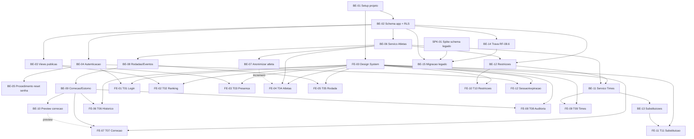

# TASK.md — Sistema de Ranking "Turma do Rola - Comary"

**Dono**: Tech Lead
**Status**: Rascunho pronto para o **Gate 3** do CTO (`capacity-and-timeline-validation`).
Não é considerado final até aprovação (Aprovado ou Aprovado com ressalvas) — reprovação
pontual reabre só a(s) tarefa(s)/risco(s) apontado(s), não o documento inteiro.
**Escopo desta decomposição**: Backend e Frontend. **Mobile fora de escopo** (Gate 1 do
CTO — "acessível pelo celular" é atendido por web responsivo, não por app nativo; o
próprio `UX-SPEC.md` confirma isso na abertura). QA e DevSecOps/DevOps consomem este
documento, mas suas tarefas próprias (`TEST-PLAN.md`, `SECURITY-REVIEW.md`, `DEPLOY.md`)
não são decompostas aqui.
**Input de origem**: `SDD.md` (Aprovado com ressalvas no Gate 2, 2026-09-02, incluindo
Anexo A com ADR-010/ADR-011) + `UX-SPEC.md` (completo, revisão 2026-09-02 pós-BLOCKER-001/
002) + `PRD-TECNICO.md` (RF-01 a RF-08, RNF-01 a RNF-12, RN-01 a RN-13) + `CTO-REVIEW.md`
(Gate 1 e Gate 2, pendências em aberto com dono e prazo) + `adr/001` a `adr/011` +
`BLOCKERS.md` (BLOCKER-001/002, ambos `Resolvido` — contexto de por que SDD.md/UX-SPEC.md
mudaram após a primeira versão).
**Skills aplicadas**: `task-decomposition` (Seção 3), `technical-spike-identification`
(Seção 2), `effort-estimation` (Seção 3 + Seção 5), `dependency-sequencing` (Seção 4),
`implementation-guideline-drafting` (Seção 1, com apoio de `coding-guidelines` como
camada base de comportamento), `task-md-drafting` (montagem final, incluindo Seção 6).
`guardrails-drafting` foi aplicada separadamente para produzir `GUARDRAILS.md`.

**Unidade de estimativa**: PD = pessoa-dia (~6h efetivas de trabalho focado), assumindo
um Backend developer e um Frontend developer full-time dedicados a este projeto (squad
pequeno, coerente com o porte "CRUD de grupo amador" já sinalizado pelo CTO no Gate 1).
Faixas: **S** = 1-2 PD, **M** = 3-5 PD, **L** = 6-8 PD, **XL** = timebox/spike, sem
compromisso de entrega fechada.

---

## 1. Diretrizes de Implementação

Esta seção faz o papel de `CLAUDE.md` consolidado do projeto (conforme
`PIPELINE-CONVENTIONS.md`, nota de consolidação — não existe arquivo `CLAUDE.md`
próprio; este é o lugar único). Traduz os ADRs em regras práticas de código, não
apenas cita a decisão.

### 1.0 Camada de comportamento base (agnóstica de stack)

Antes de qualquer regra específica de stack abaixo: pensar antes de codificar (não
gerar código para um requisito ainda ambíguo — verificar a Seção 6 ou o `SDD.md`/
`UX-SPEC.md` primeiro); preferir a solução mais simples que satisfaça o critério de
aceite, não a mais "impressionante"; nunca esconder incerteza — se uma implementação
não cobre 100% do requisito, isso vira comentário/`TODO` rastreável e nota no PR, nunca
lacuna silenciosa. Isso vale para todo código deste projeto, Backend e Frontend.

### 1.1 Stack e limites (derivados de ADR-001/002/003)

- **Obrigatório**: Next.js 14+, App Router, TypeScript em modo `strict` — frontend e
  camada de API (Route Handlers) no mesmo projeto/deploy (ADR-001/ADR-003). Nenhum
  serviço novo fora deste monólito sem passar por novo ADR do Software Architect.
- **Proibido**: introduzir microsserviço, fila de mensageria ou banco adicional
  "porque seria mais escalável" — ADR-001 já descartou isso; qualquer necessidade
  percebida de escalar horizontalmente é sinal para reabrir o `SDD.md` com o
  Software Architect, não uma decisão de implementação.
- **Proibido**: SPA pura consumindo Supabase diretamente do cliente para qualquer
  rota de escrita — ADR-003 já descartou essa opção porque não há lugar seguro para
  validar senha/usar a chave de serviço.

### 1.2 Banco de dados e Supabase (ADR-002, ADR-005, ADR-006, ADR-008, ADR-009)

- **Obrigatório**: toda tabela nova na schema `app` nasce com **RLS habilitado e
  `deny-by-default`** — nenhuma tabela vai para produção com RLS desabilitado
  "temporariamente". Checklist de PR: toda coluna sensível nova (equivalente a
  `contato`/`data_nascimento`) precisa de revisão explícita contra as views públicas
  (`ranking_publico`, `presenca_mensal_publica`) antes do merge — ADR-005 aceita
  conscientemente que o modo de falha aqui é "falhar fechado" (campo some da tela
  em vez de vazar), então a revisão é sobre completude de feature, não sobre
  segurança residual.
- **Proibido**: a role `anon` do Supabase (PostgREST) nunca recebe `INSERT`/
  `UPDATE`/`DELETE` em nenhuma tabela. Toda escrita passa exclusivamente pela API
  Route Handler com `service role`, nunca pela chave anônima do cliente.
- **Proibido**: a chave de serviço (`service role`) do Supabase nunca é referenciada
  em código que roda no navegador (nenhum `NEXT_PUBLIC_*` para ela) — só em
  variável de ambiente do lado servidor (Vercel).
- **Obrigatório**: toda operação que altera saldo acumulado de atleta (lançamento,
  correção, exclusão, estorno, anonimização) é implementada como **função/trigger
  PL/pgSQL** rodando dentro de uma única transação Postgres (ADR-006/ADR-011) —
  nunca orquestrada como múltiplas chamadas separadas da camada de aplicação
  TypeScript. Se uma feature nova parecer exigir 2+ escritas não-atômicas em
  tabelas que afetam saldo/histórico, ela **precisa** de uma função de banco nova,
  não uma sequência de chamadas de API.
- **Obrigatório**: `lancamento_pontos` é ledger **append-only** — nenhum código
  jamais faz `UPDATE`/`DELETE` num lançamento já gravado; correção/estorno sempre
  insere um novo lançamento de ajuste (RN-04/RN-07/RN-13/ADR-006).
- **Proibido**: recalcular pontuação histórica migrada do legado sob a tabela RN-05
  — RN-13 exige preservação exata; a tabela `configuracao_pontuacao` versiona
  valores vigentes, e código de cálculo deve sempre ler o valor vigente na data do
  evento, nunca hardcoded no TypeScript nem no PL/pgSQL.
- **Proibido**: excluir fisicamente uma linha de `atleta` por qualquer motivo,
  inclusive a pedido do titular — o mecanismo correto é a função
  `anonimizar_atleta` (ADR-011), nunca um `DELETE`.
- **Obrigatório**: scripts de migração do legado (RF-08) são **idempotentes e
  reexecutáveis** (ADR-008) — nenhum script assume que roda uma única vez sem
  erro; todo mapeamento origem→destino passa por `legado_migracao_registro`.

### 1.3 Autenticação e sessão (ADR-004)

- **Proibido**: Supabase Auth para a área interna — RN-12 exige papel único sem
  conta individual; usar apenas o módulo de autenticação custom.
- **Obrigatório**: hash de senha com **argon2id**, comparação em tempo constante
  (nunca `===` direto sobre o hash). TTL de sessão 8-12h, cookie
  `httpOnly`/`Secure`/`SameSite=Strict`, sem refresh token de longa duração.
- **Obrigatório**: rate limiting de tentativas de login em tabela Postgres própria
  (5 tentativas/15min por IP, backoff exponencial após o limite) — nunca introduzir
  serviço externo (ex.: Redis) para isso sem novo ADR (RNF-04).
- **Obrigatório**: mensagem de erro de login **sempre genérica** ("senha
  incorreta"), idêntica esteja ou não sob rate limiting — nunca diferenciar
  "senha errada" de "bloqueado" na resposta (RF-07.3).
- **Proibido**: qualquer rota de escrita da área interna sem verificação de sessão
  válida em middleware, executada **antes** de qualquer chamada à camada de dados.

### 1.4 Montagem de Times (ADR-007, ADR-010)

- **Obrigatório**: heurística determinística de duas fases (backtracking com poda
  + busca local) — nenhum solver de otimização genérico (CSP/ILP) e nenhuma
  heurística gulosa pura substituindo a fase de backtracking.
- **Obrigatório**: algoritmo parametrizado por `N` (número de times da rodada) —
  nunca hardcoded como `N=2` no backend, mesmo que a interface desta release só
  exponha `N=2` (ver decisão registrada na Seção 6).
- **Obrigatório**: explicação de conflito via decomposição em componentes conexos
  (union-find) — contrato de dado exato `restricoes_conflitantes`/`grupos_conflito`
  definido em ADR-010, não um formato simplificado "sem solução" (Opção B do
  ADR-010, rejeitada).

### 1.5 LGPD e dado pessoal (ADR-005, ADR-011, Seção 7 do SDD.md)

- **Proibido**: qualquer query/view/endpoint que devolva `contato` ou
  `data_nascimento` para um cliente não autenticado, mesmo indiretamente
  (ex.: em um campo de debug, em um payload de erro, em log de aplicação).
- **Obrigatório**: log de auditoria de anonimização grava **apenas marcadores
  redigidos** em `valores_antes` — nunca o dado pessoal real, mesmo temporariamente
  em memória de log de aplicação (não só no banco).
- **Obrigatório**: toda ação da área interna permanece sem campo de autor
  individual (RN-12/RN-07) — nenhuma feature nova adiciona identificação de "quem
  fez", nem "sistema"/"organizador desconhecido" como preenchimento.

### 1.6 Frontend, Design System e Acessibilidade (`UX-SPEC.md`)

- **Obrigatório**: mobile-first — toda tela implementada primeiro para `base`
  (<640px), depois adaptada para `sm`/`lg` (Seção 6 do `UX-SPEC.md`).
- **Obrigatório**: WCAG 2.1 nível AA como piso, aplicado tela a tela (não uma
  varredura genérica ao final) — critérios transversais da Seção 5.1 do
  `UX-SPEC.md` (contraste, foco visível, `aria-live`, alvo de toque 44×44px, etc.)
  valem para todo componente novo, mesmo os não listados explicitamente na Seção
  3.2 do `UX-SPEC.md`.
- **Obrigatório**: todo componente do design system (Seção 3.2 do `UX-SPEC.md`)
  implementado uma única vez e reutilizado — nenhuma tela cria uma variação
  paralela de `Button`/`Modal`/`Toast` "só para essa tela".
- **Proibido**: usar cor como único indicador de estado (presença, cartão,
  conflito) — sempre texto/ícone junto (WCAG 1.4.1, já checado pelo UX/UI).
- **Proibido**: `drag-and-drop` como única forma de interação em T09 (troca de
  jogador) — o seletor por modal é obrigatório mesmo em desktop, `drag-and-drop`
  é apenas atalho opcional (Seção 6.2 do `UX-SPEC.md`).

### 1.7 Segurança operacional e custo (RNF-03, RNF-04)

- **Proibido**: introduzir qualquer serviço de terceiro pago (rate limiting
  gerenciado, backup terceirizado, APM pago) sem aprovação explícita do CTO — vale
  o mesmo limite de autoridade que o Software Architect já aplicou nos ADRs.
- **Proibido**: commitar segredo (chave de serviço do Supabase, seed de hash) em
  qualquer arquivo versionado — sempre variável de ambiente do provedor de
  hospedagem (Vercel), nunca em `.env` versionado.
- **Obrigatório**: todo endpoint novo publicado incrementalmente em
  `API-CONTRACT.yaml` (OpenAPI 3.x) assim que o contrato estabilizar — não esperar
  o fim da tarefa inteira para documentar.

---

## 2. Spikes Técnicos Identificados

Nenhuma estimativa de esforço é dada "no escuro" para os itens abaixo — cada um é
tratado como investigação formal antes de estimar/implementar com confiança.

### SPK-01 — Descoberta do schema legado do Supabase (obrigatório, bloqueante de BE-15)

- **Motivo da incerteza**: o `SDD.md` (Seção 6.1) e o `PRD-TECNICO.md` (Seção 6,
  item 8) já tratam isso como spike formal — credenciais só disponíveis na fase de
  execução; schema exato desconhecido (tabelas, colunas, tipos, volume de linhas).
  **Nota importante desta decomposição**: este spike **não bloqueia o modelo de
  dados da schema nova (`app`)** — o `SDD.md` já fechou esse modelo (Seção 5,
  aprovado no Gate 2), e o `PRD-TECNICO.md` confirma que o schema pode ser
  redesenhado livremente (RF-08.3). O spike afeta exclusivamente o **script de
  migração/transformação** (BE-15) — o mapeamento campo a campo entre o legado e
  a schema `app`, não a definição da schema `app` em si.
- **Procedimento** (replicado do `SDD.md` Seção 6.1, sem alteração):
  1. Assim que as credenciais forem disponibilizadas, rodar introspecção via
     `information_schema.tables`, `information_schema.columns`, `pg_constraint`
     sobre **todo** o projeto legado (não só as tabelas citadas em alto nível).
  2. Documentar schema real (tabelas, colunas, tipos, relacionamentos, volume de
     linhas) como artefato de execução.
  3. Mapear campo a campo legado → `app`; todo campo sem correspondência clara
     exige confirmação explícita do organizador antes de descartar (RF-08.3) —
     nenhum dado descartado por incompatibilidade sem essa confirmação.
  4. Checar também a região/jurisdição de hospedagem do projeto Supabase legado
     (ponto de baixa severidade do Gate 2 do CTO, Risco/Compliance — "Localização/
     jurisdição") como item adicional do mesmo levantamento, sem custo extra.
  5. Só então iniciar o desenho fino do script de transformação (BE-15).
- **Dono**: Backend, com acompanhamento do Software Architect (interpretação de
  ambiguidade de schema é decisão de arquitetura, não só de implementação).
- **Timebox recomendado**: 2-3 PD após a liberação das credenciais — **não é uma
  estimativa de esforço de implementação**, é o teto de tempo de investigação
  antes de decidir se o mapeamento é trivial ou exige retrabalho de BE-15.
- **Saída esperada**: documento de mapeamento campo a campo + lista de
  divergências para confirmação do organizador — usado como input direto de BE-15.

**Nota de conclusão (2026-09-03, execução do spike)**: **Executado.** Credenciais
liberadas (`.env.local`, não versionado). Introspecção completa do projeto legado
real feita via raiz OpenAPI do PostgREST + chamadas agregadas (`count=exact`,
filtros por coluna) — método já validado por BE-14, reaproveitado e aprofundado
aqui, já que as credenciais disponíveis (URL + `service_role` + host, sem senha
de banco) não permitem conexão SQL bruta a `information_schema`/`pg_constraint`;
o conteúdo é equivalente (o próprio PostgREST expõe PK/FK/tipos via essas
fontes internamente), limite documentado no próprio artefato. Resultado completo
— schema real (6 tabelas em `public`: `goleiros`, `jogadores`, `rodadas`,
`presencas_rodada`, `substituicoes_rodada` + `migrations`, esta última só
infraestrutura do framework legado, fora de escopo de domínio), volume de linhas,
ausência confirmada de qualquer `FOREIGN KEY` real no legado, mapeamento campo a
campo para `app` e lista de 7 divergências (D1–D7) para confirmação do
organizador (RF-08.3, nenhuma descartada silenciosamente) — em
`.md/LEGADO-SCHEMA.md`. Região/jurisdição de hospedagem confirmada via
cross-reference do IP do host de conexão direta contra `ip-ranges.amazonaws.com`:
AWS `us-east-2` (Ohio, EUA), fora do Brasil — mantém, sem alterar, o risco de
baixa severidade já registrado no Gate 2 do CTO. Achado de qualidade de dados
mais relevante: 184/770 linhas (24%) de `presencas_rodada` órfãs de `rodadas`
(4 datas sem rodada correspondente, indício de exclusão sem cascata no legado) —
maior divergência de dado real da lista (D1). Timebox gasto: dentro do
recomendado de 2-3 PD (sessão única, sem retrabalho, graças ao método de
introspecção já validado por BE-14). Nenhuma credencial exposta em nenhum lugar
versionado, nenhuma escrita feita contra o legado (só `GET`). Este spike **não
altera nem reabre** o modelo de dados da schema `app` (`SDD.md` Seção 5, fechado
desde o Gate 2) — afeta exclusivamente o mapeamento de migração que `BE-15` vai
consumir como input direto. `BE-15` (próxima tarefa desta cadeia, execução
separada) ainda depende da liberação do adendo de "plano de saída" do ADR-002
(`GUARDRAILS.md` regra 35, `BLOCKER-003`) antes de poder rodar contra a schema
legada real — pode ser desenvolvido/testado contra dado de teste antes disso.

### SPK-02 — Não identificado nenhum outro spike formal nesta decomposição

Os demais pontos de incerteza levantados pelo `UX-SPEC.md` (Seção 7.3 — quantidade
de "N" times, timeout do algoritmo de times, cálculo de preview de correção) **não
exigem spike** — são decisões de detalhe de baixa incerteza técnica, resolvidas
diretamente nesta decomposição e documentadas na Seção 6, conforme o guardrail de
"lacuna de detalhe decide, lacuna estrutural escala".

---

## 3. Lista de Tarefas

Convenção de ID: `BE-NN` (Backend), `FE-NN` (Frontend). Toda tarefa tem dono/time,
critério de aceite testável, estimativa (exceto BE-15, dependente de SPK-01, e
SPK-01 em si, tratadas como timebox, nunca estimativa forçada) e pertence a
exatamente um lote (Seção 3.0), referenciado pela coluna `Lote` das tabelas
3.1/3.2 abaixo.

### 3.0 Lotes

**Retrofit 2026-09-03**: esta subseção e a coluna `Lote` das tabelas 3.1/3.2 foram
adicionadas depois que `EXECUTION-FLOW.md` passou a operar pela unidade "lote"
(conjunto coerente de tarefas de Backend/Frontend que forma uma funcionalidade/
módulo com sentido próprio) em vez de tarefa individual — nenhuma definição de
tarefa, critério de aceite, estimativa, dependência ou status já registrado foi
alterada neste retrofit.

Cada lote agrupa as tarefas de todas as trilhas (Backend, Frontend) que formam uma
funcionalidade/módulo com sentido próprio, conforme `EXECUTION-FLOW.md` §1 — QA,
DevSecOps e deploy passam a operar por lote fechado, não por tarefa individual. O
agrupamento abaixo segue estritamente as dependências já mapeadas na Seção 4
(diagrama Mermaid de 4.1 + notas de paralelismo de 4.2 + bloqueios de 4.3), não um
agrupamento arbitrário.

| Lote | Nome | Tarefas | Ordem relativa entre lotes |
|---|---|---|---|
| **L0** | Fundação Técnica | BE-01, BE-02, FE-00 | Precede todos os demais lotes — nenhum outro lote tem tarefa que não dependa, direta ou transitivamente, de BE-01/BE-02 (backend) ou FE-00 (frontend), conforme o topo do diagrama de 4.1. |
| **L1** | Autenticação | BE-04, BE-05, FE-01, FE-12 | Depende de L0 (BE-04 depende de BE-01+BE-02, 4.1). Pode rodar em paralelo com L2 e L7. **L3 depende só do backend deste lote** (BE-06 exige BE-04 concluído, 4.1), não do frontend — o Backend de L3 pode começar assim que BE-04 estiver pronto, mesmo antes de FE-01/FE-12 fechar (4.2). |
| **L2** | Ranking e Presença Pública | BE-03, FE-02, FE-03 | Depende só de L0 (BE-03 depende de BE-02, 4.1). Independente de L1 — roda em paralelo com toda a área interna, conforme 4.2: "FE-02/FE-03 (público) podem rodar em paralelo com todo o desenvolvimento da área interna — não têm nenhuma dependência de autenticação". |
| **L3** | Cadastro de Atletas | BE-06, BE-07, FE-04 | Depende de L0 e do backend de L1 (BE-06 depende de BE-02 **e** BE-04, 4.1). Bloqueia L4 e L6 (ambos dependem de BE-06, 4.1/4.3). |
| **L4** | Lançamento de Rodada | BE-08, FE-05 | Depende de L3 (BE-08 depende de BE-06, 4.1). Bloqueia L5. |
| **L5** | Correção, Histórico e Auditoria de Rodadas | BE-09, BE-10, FE-06, FE-07, FE-08 | Depende de L4 (BE-09 depende de BE-08, 4.1). |
| **L6** | Montagem de Times, Restrições e Substituições | BE-11, BE-12, BE-13, FE-09, FE-10, FE-11 | Depende de L3 (BE-11/BE-12 dependem de BE-06, 4.1; BE-11 também depende de BE-12, 4.3). Independente de L4/L5 — ambos originados do mesmo ponto (L3), podem rodar em paralelo entre si. |
| **L7** | Migração do Legado | SPK-01, BE-14, BE-15 | Depende só de L0 (BE-14 depende de BE-02; BE-15 depende também de SPK-01 e BE-14, 4.1/4.3). Independente de todos os demais lotes, conforme 4.2: "SPK-01 roda de forma independente de todo o resto do backlog — não é bloqueante de nenhuma tarefa além de BE-15". |

**Atenção na retomada (estado real de execução em 2026-09-03 — para o próximo
`/executar` saber exatamente de onde retomar cada lote):**

- **L0 — Fundação Técnica**: 100% concluído (BE-01, BE-02, FE-00), todas as
  tarefas aprovadas pelo QA. Nenhuma ação de retomada de implementação
  necessária; falta apenas confirmar o fechamento formal do lote
  (`EXECUTION-FLOW.md` §5), que também depende de aprovação do DevSecOps — não
  referenciada em nenhum artefato lido até este retrofit, verificar antes de
  considerar o lote formalmente fechado.
- **L1 — Autenticação**: 100% concluído — `BE-04`, `BE-05`, `FE-01`, `FE-12`
  todas `Concluída` e aprovadas pelo QA (`QA-REPORT.md` Seções 5, 7, 8, 9;
  veredito agregado do lote em Seção 10 — "Lote L1: Aprovado com ressalvas",
  ressalva restrita aos 2 débitos de baixa severidade já registrados em
  `BE-04`, nenhum bloqueante). `FE-01` foi reprovada pelo QA em 2026-09-03
  (`BUG-QA-FE01-01` — open redirect em `redirectTarget.ts`, severidade Alta),
  corrigida pelo Frontend no mesmo dia, e reaprovada pelo QA na revalidação
  (`QA-REPORT.md` Seção 8) — nenhuma ação de retomada de implementação
  necessária. Falta apenas confirmar o fechamento formal do lote
  (`EXECUTION-FLOW.md` §5), que também depende de aprovação do DevSecOps.
- **L2 — Ranking e Presença Pública**: parcialmente concluído. BE-03 e FE-02
  `Concluída` e aprovadas pelo QA (BE-03 já inclui o incremento do campo
  `ausencias`, resolução de `BLOCKER-005`). FE-03 segue `Não iniciada` — é a
  única pendência deste lote, sem bloqueio técnico registrado; retomada é
  simplesmente iniciar FE-03.
- **L6 — Montagem de Times, Restrições e Substituições**: 100% concluído —
  `BE-11`, `BE-12`, `BE-13`, `FE-09`, `FE-10`, `FE-11` todas `Concluída`
  (integração de Frontend contra API real em todos os casos, nenhuma
  pendência de mock). Falta apenas confirmar o fechamento formal do lote
  (`EXECUTION-FLOW.md` §5, aprovação do QA/DevSecOps), mesma pendência
  administrativa já registrada para L0/L1.
- **L3, L4, L5, L7**: nenhuma tarefa iniciada em nenhum destes quatro lotes.
  Retomada segue a ordem relativa da tabela acima — L3 já está desbloqueada
  (BE-04, do qual depende, já foi concluído), L4 aguarda a conclusão de BE-06
  (L3), L5 aguarda a conclusão de BE-08 (L4), e L7 é independente do
  restante, aguardando apenas a liberação das credenciais do legado para
  SPK-01 rodar.

### 3.1 Backend

| ID | Tarefa | Depende de | Critério de Aceite | Estimativa | Status | Lote |
|---|---|---|---|---|---|---|
| **BE-01** | Setup do projeto Next.js (App Router, TS strict), estrutura de módulos (atletas/rodadas/times/auditoria/migração), lint/format, variáveis de ambiente, esqueleto de CI | — | Projeto builda e roda localmente; lint/typecheck sem erro; `.env.example` documentado sem segredo real; estrutura de pastas reflete os módulos da Seção 2.1 do `SDD.md` | **M** (3 PD) | **Concluída** — desvio pequeno documentado: estrutura de módulos inclui, além dos 5 citados no nome da tarefa, `autenticacao` e `substituicoes` (também componentes próprios da Seção 2.1 do `SDD.md`); `restricoes` (BE-12) fica como submódulo de `times`, por ser consumida pelo algoritmo de montagem (ADR-007/010). Stack mantida na versão já estabelecida em paralelo por FE-00 (Next 14.2.5/React 18.3.1/TS 5.5.4 — satisfaz o piso "14+" do ADR-003) em vez de subir para a última versão, para não quebrar o trabalho já em andamento do Frontend. `zod` adotado como biblioteca de validação de input/env (decisão de detalhe, sem menção prévia em TASK.md/SDD.md). Corrigido também, como pré-requisito para "typecheck/test sem erro" do projeto: tipagem de `jest-axe` (faltava `@types/jest-axe`) e um bug de registro do matcher `toHaveNoViolations` em `vitest.setup.ts` (dupla aninhagem no `expect.extend`, mascarado antes por falta de tipos) — achado incidental ao validar o esqueleto de CI, não uma tarefa de Frontend reinterpretada. Nota: 1 teste de Frontend (`AppNav.test.tsx`) segue falhando por um problema no próprio componente `TopNav` (fora do escopo de BE-01, não corrigido aqui — fica para FE-00). | **L0** |
| **BE-02** | Migrations da schema `app` completa (todas as entidades da Seção 5 do `SDD.md`: `atleta`, `rodada`, `participacao_rodada`, `evento_jogo`, `lancamento_pontos`, `time`, `time_atleta`, `substituicao`, `restricao_obrigatoria`, `log_auditoria`, `legado_migracao_registro`, `configuracao_pontuacao`) + RLS habilitado `deny-by-default` em todas | BE-01 | Todas as tabelas criadas via migration versionada; `SELECT`/`INSERT`/`UPDATE`/`DELETE` da role `anon` negados por padrão em toda tabela, exceto onde explicitamente liberado nas views (BE-03); teste de integração confirma RLS ativo tabela a tabela | **L** (6 PD) | **Concluída** — 13 migrations em `supabase/migrations/` (`20260902100000` a `20260902101200`): 1 de setup da schema `app` (extensão `pgcrypto`, `GRANT USAGE`/`REVOKE ALL` na schema) + 12 tabelas (as 12 entidades citadas no critério). Todas com `ENABLE ROW LEVEL SECURITY`, nenhuma `POLICY` criada (deny-by-default literal), `REVOKE ALL ... FROM anon/public` explícito por tabela (defesa em profundidade além da ausência de GRANT), `GRANT ALL ... TO service_role` (única role que escreve, ADR-005/006). Validado de ponta a ponta contra Supabase local real (`supabase start` + `supabase db reset`, não só leitura do SQL): teste de integração novo (`src/lib/supabase/__tests__/app-schema-rls.integration.test.ts`, 72 casos = 12 tabelas × 6 verificações) confirma, tabela a tabela, (a) `pg_class.relrowsecurity = true` via conexão direta (`pg`), (b) `service_role` consegue `SELECT` (controle positivo — tabela existe e é alcançável), e (c) `anon` tem `SELECT`/`INSERT`/`UPDATE`/`DELETE` negados. Roda via `npm run test:integration` (config própria `vitest.integration.config.ts`, ambiente `node`, carrega `.env.test.local` via `dotenv` — nunca versionado); **não** entra no `npm test` padrão nem no job "Test" do CI compartilhado (`.github/workflows/ci.yml`), que não sobe Supabase local — sinalizado como follow-up para o DevOps decidir se/quando automatizar em CI, não decidido unilateralmente aqui. Passo "Convenção de rollback de migrations" do CI (`migration-convention-check`) verificado localmente com o mesmo grep do workflow: todas as 12 migrations de tabela têm bloco `-- ROLLBACK: DROP TABLE ...` (a de setup da schema é puramente aditiva, sem `DROP`/`ALTER ... DROP`, dispensado pelo `supabase/migrations/README.md`). `npm run lint`/`typecheck`/`build` e `npm test` (95 testes, suíte pré-existente) seguem verdes. **Reforço estrutural além do texto literal do critério de aceite** (documentado, não escalado — implementa diretamente `GUARDRAILS.md` regras 8 e 9, já obrigatórias, dentro do escopo de integridade de schema desta tarefa): trigger `app.forbid_lancamento_pontos_mutation` bloqueia `UPDATE`/`DELETE` em `lancamento_pontos` incondicionalmente (ledger append-only, ADR-006), e trigger `app.forbid_atleta_delete` bloqueia `DELETE` em `atleta` incondicionalmente (nunca exclusão física, ADR-011) — ambos válidos mesmo para `service_role`, porque trigger executa independente de RLS bypass; verificado empiricamente (não só lido), inclusive tentando a mutação bloqueada via conexão direta ao Postgres. **Desvios de detalhe documentados (modelagem física delegada pelo `SDD.md` Seção 5 ao Backend Developer — "não é modelagem física detalhada... isso cabe ao Backend Developer"), nenhum escalado**: (1) `lancamento_pontos` não ganhou coluna `participacao_id` apesar da relação `PARTICIPACAO_RODADA ||--o{ LANCAMENTO_PONTOS` do diagrama ER — a lista de campos da própria Seção 5 não inclui essa coluna; interpretação adotada: a relação é satisfeita indiretamente por `(atleta_id, rodada_id)`, consistente com RN-04/RN-05 corrigindo/calculando por atleta+rodada; (2) `rodada.status` (`lancada`/`excluida`) modelado como soft-delete, nunca `DELETE` físico da linha — motivo: preserva a FK de `log_auditoria.rodada_id`/`lancamento_pontos.rodada_id` e o ledger append-only (RF-04.1 reverte pontos via novo lançamento, não apaga o anterior); a função de exclusão em si (BE-09) ainda não existe, só a coluna que a suporta; (3) `evento_jogo` referencia `participacao_rodada` (não `atleta` direto), para que a garantia de RF-02.6 (bloquear evento para ausente) tenha apoio estrutural, não só de código de aplicação (checagem do `status` em si é escopo de BE-08); (4) `UNIQUE(rodada_id, atleta_id)` em `participacao_rodada`, `UNIQUE(tabela_origem, id_origem)` em `legado_migracao_registro` (suporta idempotência do ADR-008/BE-15) e `CHECK` de "atletas distintos" em `substituicao`/`restricao_obrigatoria` adicionados como reforço de integridade de dado, sem invalidar nenhum campo do diagrama. Nenhuma lacuna estrutural do `SDD.md` encontrada — nenhuma entrada nova em `BLOCKERS.md`. Dependências novas (`devDependencies`, sem impacto no bundle de produção): `pg`/`@types/pg` (cliente direto para o teste de integração) e `dotenv` (carrega `.env.test.local` no teste de integração); nenhuma nova dependência de produção. | **L0** |
| **BE-03** | Views públicas curadas (`ranking_publico`, `presenca_mensal_publica`) + RLS liberando `SELECT` para `anon` só nessas views, nunca nas tabelas base | BE-02 | View `ranking_publico` nunca retorna `contato`/`data_nascimento` mesmo com `SELECT *`; view `presenca_mensal_publica` agrupa por mês civil (RN-09); teste automatizado consulta ambas as views com a chave `anon` e falha se qualquer coluna sensível aparecer | **M** (2 PD) | **Concluída** — migration `supabase/migrations/20260902101300_create_public_views.sql`: cria `app.ranking_publico` e `app.presenca_mensal_publica` (nenhuma seleciona `contato`/`data_nascimento` de `app.atleta` em ponto algum da definição) e libera `GRANT SELECT` para `anon` **somente nas duas views** — nenhuma tabela base recebe grant novo, RLS deny-by-default de BE-02 permanece intocado. `ranking_publico`: `pontuacao_acumulada` = `pontuacao_inicial` + soma de `pontos_delta` (ledger `lancamento_pontos`); ordenada pela cascata completa de RN-08 (`pontuacao_acumulada` desc → `presencas` desc → `cartoes` asc → `nome_exibicao` asc) diretamente na definição da view, então `SELECT *` sem `order` já retorna a ordem final de exibição de T02. `presenca_mensal_publica`: uma linha por rodada com `status='lancada'`, expondo `ano`/`mes` (via `extract(year/month from rodada.data)`) para T03 agrupar no cliente pelo mês civil Gregoriano exigido por RN-09, mais `total_presentes`/`nomes_presentes` (array ordenado alfabeticamente). Documentado explicitamente na migration **por que nenhuma das duas views usa `security_invoker = true`**: com `security_invoker`, a checagem de permissão passaria a rodar como o role de quem consulta (`anon`, sem nenhum acesso às tabelas base), quebrando o próprio mecanismo do ADR-005 — a proteção correta já vem de a view rodar com o privilégio do seu dono (que enxerga as tabelas base normalmente) e nunca selecionar as colunas sensíveis, não de RLS "repassado" para dentro da view. **Duas decisões de detalhe documentadas na própria migration, não escaladas** (lacuna de implementação, não estrutural): (1) atleta anonimizado/inativo (`ativo=false`, ADR-011) é excluído **por completo** de ambas as views (não só o nome vira placeholder) — respalda diretamente o `UX-SPEC.md` (T04, pós-anonimização): "desaparece do ranking público e da presença mensal como identidade"; (2) rodada com `status='excluida'` (soft-delete, BE-02) não conta em presenças/cartões/lista de presentes em nenhuma das duas views — consistente com o próprio significado de "excluída" (pontos já revertidos via lançamento de estorno no ledger append-only, ADR-006); contar presença/cartão de uma rodada cujos pontos já foram revertidos deixaria o ranking público inconsistente com o saldo mostrado ao lado. Validado de ponta a ponta contra Supabase local real (mesmo rigor de BE-02, não só leitura do SQL): `supabase db reset` aplica a migration nova sem erro sobre as 12 tabelas existentes; teste de integração novo (`src/lib/supabase/__tests__/public-views.integration.test.ts`, 6 casos, roda via `npm run test:integration` junto aos 72 casos pré-existentes de BE-02 = **78 testes de integração, todos verdes**, confirmado em duas execuções seguidas para checar re-execução sem colisão) cobre literalmente o critério de aceite: seed via `service_role` de um atleta ativo + um atleta anonimizado/inativo + uma rodada `lancada` + uma rodada `excluida` (com presença/cartão em ambas), depois consulta as duas views **com a chave `anon`** e (a) falha se `contato`/`data_nascimento` aparecerem em qualquer linha de `SELECT *` (nenhuma linha, nunca — critério literal), (b) confirma que o atleta anonimizado não aparece em nenhuma das duas views, (c) confirma `pontuacao_acumulada`/`presencas`/`cartoes` corretos ignorando a rodada excluída, (d) confirma `ano=2026`/`mes=9` para uma rodada de `2026-09-05` (RN-09) e que a rodada excluída não aparece. Achado incidental corrigido durante a validação empírica (não é reinterpretação de requisito, é comportamento de infraestrutura verificado na prática): `INSERT` em lote do PostgREST resolve o conjunto de colunas pela união das chaves do corpo da requisição — uma linha do array que omitisse `ativo`/`anonimizado_em` (contando com o `DEFAULT`/`NULL` da coluna) recebia `NULL` explícito em vez do `DEFAULT`, violando o `NOT NULL` de `ativo`; corrigido declarando as mesmas chaves em todos os objetos do array de seed do teste, comentário deixado no próprio arquivo para quem reutilizar o padrão em testes futuros (BE-06 em diante). `npm test` (95 testes pré-existentes), `npm run lint`, `npx tsc --noEmit` e `npm run build` seguem verdes. Passo "Convenção de rollback de migrations" do CI verificado localmente com o mesmo grep do workflow: a migration é aditiva (nenhuma tabela alterada), mas contém `DROP VIEW` no próprio bloco `-- ROLLBACK:` (visto que `CREATE VIEW` não é `CREATE TABLE`, o bloco foi incluído mesmo assim para clareza e para não depender da leitura humana do verificador automático). **Publicado incrementalmente em `API-CONTRACT.yaml`** (`.md/API-CONTRACT.yaml`, primeira publicação do projeto, versão `0.1.0`): documenta os dois endpoints como parte da família "PostgREST autogerado do Supabase, consumido com a chave `anon` direto pelo Frontend" (já decidido no `SDD.md` Seção 7.5/linha "Consulta view `ranking_publico` via Supabase anon key" — T02/T03 não passam pela camada de API própria, então não há Route Handler novo nesta tarefa), com schema de resposta completo e nota explícita de que nenhuma das duas respostas inclui `contato`/`data_nascimento`. Nenhuma lacuna estrutural encontrada — nenhuma entrada nova em `BLOCKERS.md`. Nenhuma dependência nova (`@supabase/supabase-js` já usado por BE-02). — **Sub-item (2026-09-03, resolução de `BLOCKER-005`, SDD.md Seção 5.1)**: adicionado o campo `ausencias` à view `app.ranking_publico`, retomando sessão anterior interrompida por rate limit (trabalho parcial já em disco — migration e teste de integração — lido/auditado integralmente e conferido item a item contra a especificação exata do adendo, não recriado do zero; nenhuma lacuna encontrada no que já estava escrito, só validação empírica pendente). Nova migration **aditiva** `supabase/migrations/20260903091500_add_ausencias_to_ranking_publico.sql` (não edita `20260902101300_create_public_views.sql`, já aplicada), usando `CREATE OR REPLACE VIEW` reproduzindo as 5 colunas/ordem/tipos já existentes e acrescentando `ausencias` (contagem direta e simétrica de `participacao_rodada.status = 'ausente'` em rodada `lancada`, mesmo padrão de subquery de `presenca`/`cartao`, sem subtração) como 6ª coluna. `status='lesionado'` confirmado como terceira categoria que não conta nem em `presencas` nem em `ausencias` (RF-02.3/RN-05 amarram lesão só a pontos, não a esta métrica de exibição) — decisão do SDD.md, não reaberta aqui. Nenhuma coluna sensível (`contato`/`data_nascimento`) selecionada em nenhum ponto da view, mesma garantia do ADR-005. Validado empiricamente contra Supabase local real (`supabase start` + `supabase db reset`, mesmo rigor de BE-02/BE-03): migration aplica sem erro sobre as 16 migrations existentes; inspeção direta via `pg` confirma as 6 colunas na ordem/tipo esperados (`ausencias` como `bigint`, 6ª posição) e os `GRANT`s de `anon`/`service_role` preservados sem reemissão (Postgres realmente preserva `GRANT` de `CREATE OR REPLACE VIEW` quando colunas existentes não mudam de nome/ordem/tipo, confirmado na prática, não só na teoria da migration); `pg_get_viewdef` confere a definição completa não seleciona `contato`/`data_nascimento` em lugar algum. Teste de integração (`public-views.integration.test.ts`, já presente em disco) cobre os três casos exigidos: presente, ausente e lesionado (rodadas dedicadas para os dois últimos), com asserção explícita de que `presencas + ausencias` do atleta de teste (1 + 1) não soma o total de participações (4), provando que a rodada `lesionado` fica de fora de ambas as contagens por desenho — suíte de integração sobe de 6 para 7 casos nesta view (78 → 84 testes de integração no total, incluindo os 5 de BE-04), verde em duas execuções seguidas (checagem de re-execução sem colisão, mesmo critério de BE-03). `API-CONTRACT.yaml` atualizado: campo `ausencias` (tipo `integer`) adicionado a `RankingPublicoItem` (incluído em `required`, mesma descrição de derivação do adendo), `info.version` incrementado de `0.2.0` para `0.3.0`, e nova seção `x-changelog` (extensão válida do OpenAPI 3.x) criada ao final do arquivo com as 3 entradas de versão publicadas até aqui (`0.1.0`/BE-03, `0.2.0`/BE-04, `0.3.0`/este sub-item) — a seção "Changelog" referenciada em `info.description` desde a primeira publicação nunca tinha sido efetivamente criada; criada agora, sem reescrever o histórico das duas entradas anteriores (reconstruídas a partir do que já está documentado nas próprias linhas de status de BE-03/BE-04 acima). Passo "Convenção de rollback de migrations" do CI conferido localmente com o mesmo grep do workflow: migration não contém `DROP`/`ALTER ... DROP`/`ALTER ... ALTER COLUMN`, então o check nem é acionado (puramente aditiva); bloco `-- ROLLBACK:` documentado mesmo assim, por clareza, mesmo critério já usado em `20260902101300_create_public_views.sql`. `npm run lint`/`npm run typecheck`/`npm run format:check`/`npm test` (151 testes)/`npm run test:integration` (84 testes, ×2 execuções)/`npm run build` todos verdes. Nenhuma inconsistência estrutural nova encontrada entre a migration em disco e a especificação do `SDD.md` Seção 5.1 — nenhuma entrada nova em `BLOCKERS.md` necessária para este sub-item. | **L2** |
| **BE-04** | Módulo de autenticação custom: tabela de hash (argon2id), tabela de tentativas (rate limiting), Route Handler de login/logout, middleware de verificação de sessão em toda rota de escrita | BE-01, BE-02 | Login com senha correta emite cookie httpOnly/secure/SameSite=strict com TTL 8-12h; 5 tentativas erradas em 15 min bloqueiam com backoff; mensagem de erro idêntica em ambos os casos (RF-07.3); toda rota de escrita retorna 401 sem sessão válida | **L** (4 PD) | **Concluída** — módulo `src/modules/autenticacao/*` (`password.ts` argon2id via `@node-rs/argon2`, comparação em tempo constante feita pela própria biblioteca; `rate-limit.ts` lógica pura de backoff exponencial testável sem I/O; `session-token.ts` token assinado HMAC-SHA256 via Web Crypto — portátil entre Edge/Node — com comparação de assinatura em tempo constante manual, já que a Web Crypto não expõe `timingSafeEqual`; `session-cookie.ts`/`repository.ts`/`client-ip.ts`/`constants.ts`), duas migrations (`app.auth_interno` singleton com trigger que bloqueia `DELETE` incondicionalmente — troca de senha é sempre `UPDATE`, BE-05 — e `app.tentativa_login`, ambas RLS deny-by-default, só `service_role`), `POST /api/auth/login`/`POST /api/auth/logout` (`app/api/auth/`) e `middleware.ts` (Edge Runtime, `matcher: ["/api/:path*"]`, exige sessão em todo método de escrita exceto os dois endpoints de auth, executando a verificação antes de qualquer chamada à camada de dados — nenhum Route Handler de escrita futuro precisa reimplementar a checagem). Retomada de sessão anterior interrompida por rate limit: código e migrations já existentes no disco foram lidos e auditados integralmente (não recriados), critério de aceite conferido item a item contra a implementação já escrita, e validado empiricamente contra Supabase local real (`supabase start` + `supabase db reset`, mesmo rigor de BE-02/03), não só por leitura do código. Suíte de testes automatizados pré-existente cobre 100% do critério de aceite: 5 testes de integração (`app/api/auth/__tests__/auth.integration.test.ts`, via `npm run test:integration` contra Supabase local real) confirmam (a) senha correta emite cookie `HttpOnly`/`SameSite=Strict` com `Max-Age` entre 8h e 12h, (b) senha incorreta retorna 401 com a mensagem genérica e grava a tentativa falha, (c) corpo malformado retorna 400 (classe de erro diferente de RF-07.3), (d) 5 tentativas erradas bloqueiam a 6ª (mesmo com a senha certa) com resposta byte-a-byte idêntica e sem cookie emitido, (e) logout limpa o cookie (`Max-Age=0`) mesmo sem sessão prévia; mais 33 testes unitários (`rate-limit.test.ts`, `password.test.ts`, `session-token.test.ts`, `client-ip.test.ts`, `middleware.test.ts`) cobrindo backoff exponencial/teto de 15min/reset por sucesso, hash/verificação argon2id (incluindo `verifyPasswordOrDummy` para não vazar, por timing, que o sistema não tem senha configurada), token de sessão (TTL, expiração exata, adulteração de payload/assinatura, `SESSION_COOKIE_SECRET` ausente) e o middleware genérico (401 sem cookie, sessão expirada, cookie adulterado, GET nunca bloqueado, isenção de `/api/auth/login`/`/api/auth/logout`). Validação empírica adicional feita nesta retomada, além dos automatizados (protocolo do enunciado — "mesmo rigor das tarefas anteriores"): `npm run build`/`start` real na porta 3100 com `.env.local` apontando para o Supabase local, hash argon2id real semeado via `service_role`, e `curl` direto contra `POST /api/auth/login`/`POST /api/auth/logout`/`POST /api/atletas` (rota de escrita representativa) confirmando byte a byte o `Set-Cookie` (`HttpOnly`, `SameSite=strict`, `Max-Age=36000`), o bloqueio da 6ª tentativa com o mesmo corpo/status da 5ª, o `Max-Age=0` do logout e o 401 genérico do middleware (`{"error":"Sessão inválida ou expirada."}`) numa rota de escrita sem cookie — nenhum artefato de teste manual (`.env.local`, senha semeada) deixado no repositório (removido ao final, `.env.local` já coberto por `.gitignore`). **Dois achados incidentais corrigidos nesta retomada, não reinterpretação de requisito** (TASK.md Seção 1.0 — nunca lacuna silenciosa): (1) `npm run build` falhava (`Module parse failed`) porque o webpack do Next.js 14.2 tentava empacotar o binário nativo pré-compilado do `@node-rs/argon2` como módulo JS comum — corrigido com `experimental.serverComponentsExternalPackages: ["@node-rs/argon2"]` em `next.config.mjs` (mantém o pacote como `require()` externo em runtime Node.js, sem afetar o bundle do middleware/Edge nem do cliente, já que `password.ts` só é importado pelos Route Handlers); sem essa correção, o critério de aceite desta tarefa seria inverificável em produção (a Vercel também faz build via webpack). (2) `npm run format:check` apontava 8 arquivos deste módulo fora do padrão Prettier (mesma classe de débito já sinalizada em `BUG-QA-FE00-01`/`BUG-QA-BE01-02`) — corrigido com `prettier --write` nos arquivos de propriedade desta tarefa antes de considerá-la concluída, `typecheck`/`lint`/testes reconferidos depois (mudança puramente de formatação). `npm run lint`/`npm run typecheck`/`npm run format:check`/`npm test` (151 testes)/`npm run test:integration` (84 testes)/`npm run build` todos verdes ao final. Requisitos de segurança do SDD.md aplicados na implementação (não pendentes): RLS deny-by-default + só `service_role` nas duas tabelas novas (nenhum `GRANT` para `anon`), nenhum segredo commitado (`SESSION_COOKIE_SECRET`/hash de senha só em variável de ambiente, `.env.example` só com placeholder), sem refresh token de longa duração, payload de sessão sem identidade individual (RN-12). **Publicado em `API-CONTRACT.yaml`** (já incremental desde a sessão anterior — `POST /api/auth/login`/`POST /api/auth/logout`, com schemas `LoginRequest`/`AuthErroGenerico`/erro genérico de middleware); nenhuma mudança de contrato necessária nesta retomada. Nenhuma lacuna estrutural nova encontrada — nenhuma entrada nova em `BLOCKERS.md`; limitação conhecida já documentada no próprio código (`login/route.ts`) e não resolvida aqui, por estar fora do escopo literal do critério de aceite: a resposta de erro é idêntica byte a byte entre "senha incorreta" e "bloqueado", mas o tempo de execução não é artificialmente igualado entre os dois caminhos (o caminho bloqueado pula a verificação de senha por desenho) — candidato a revisão tática do DevSecOps (TASK.md Seção 5, risco #7), não um desvio desta tarefa. | **L1** |
| **BE-05** | Procedimento de redefinição da senha única compartilhada (Gate 2, item 7 — dono Tech Lead/Backend) — script/CLI operacional para gerar novo hash argon2id e substituir na tabela, documentado como runbook | BE-04 | Runbook documentado (passo a passo + comando/script) permite trocar a senha sem depender de fluxo de e-mail; testado manualmente uma vez em ambiente de homologação | **S** (1 PD) | **Concluída** — lógica testável em `src/modules/autenticacao/redefinir-senha.ts` (`validarNovaSenha`: tamanho mínimo 8 caracteres — decisão de detalhe documentada, nenhuma regra de complexidade de senha está definida em TASK.md/SDD.md/PRD-TECNICO.md para a senha única além do algoritmo de hash; `redefinirSenhaInterna`: gera o hash via `hashPassword`, já existente de BE-04, e faz `UPSERT` — nunca `DELETE`+`INSERT` — na linha singleton `id=1` de `app.auth_interno`, o único caminho possível já que a tabela bloqueia `DELETE` incondicionalmente mesmo para `service_role`, trigger de BE-04) + CLI de terminal em `scripts/redefinir-senha-interna.ts` (`npm run senha:redefinir`), que carrega `.env.local` se existir, pede a nova senha duas vezes com **entrada oculta** (nunca como argumento de CLI — vazaria em `ps`/histórico do shell, decisão de segurança de detalhe), pede confirmação explícita antes de gravar, e nunca imprime senha nem hash em nenhum momento (stdout/stderr). Nova dependência de detalhe (documentada, não escalada): `tsx` (devDependency) para executar o script TypeScript com resolução do path alias `@/*` do `tsconfig.json`, sem exigir Node ≥22 (engine mínimo do projeto é 20.9.0, abaixo do piso da suporte nativo a TS do Node). Runbook completo (pré-requisitos, passo a passo, o que o procedimento não faz — não invalida sessão já emitida, não notifica ninguém, RN-12 — e como validar o resultado) em `scripts/README.md`. Testes automatizados cobrindo o critério de aceite: unitário (`src/modules/autenticacao/__tests__/redefinir-senha.test.ts`, 5 casos, validação pura sem I/O) + integração contra Supabase local real (`src/modules/autenticacao/__tests__/redefinir-senha.integration.test.ts`, 4 casos, via `npm run test:integration`: hash substituído e válido, senha antiga deixa de validar e nova passa a validar — cenário real do runbook —, seguro rodar mais de uma vez seguida sem criar segunda linha, `atualizado_em` atualizado). **Validação manual de ponta a ponta contra Supabase local** (mesmo rigor/precedente de BE-02/03/04 — não há ambiente de homologação real provisionado ainda pelo DevOps, `infra/README.md` Seção 2: "Nenhum deploy real ocorreu ainda"; Supabase local é o ambiente mais próximo disponível nesta fase, mesma equivalência já usada nas tarefas anteriores): rodado `npm run senha:redefinir` via terminal contra Supabase local com senha nova, depois `npm run build && npm run start` e `curl` direto em `POST /api/auth/login` confirmando que a senha antiga (definida em BE-04) retorna 401 genérico e a senha nova retorna 200 com `Set-Cookie` válido (`HttpOnly`/`SameSite=strict`/`Max-Age=36000`) — prova de que o procedimento funciona de fato no fluxo real de login, não só que o script imprime "sucesso"; também validados os caminhos de cancelamento, senha curta e confirmação divergente. **Dois achados incidentais corrigidos nesta tarefa, não reinterpretação de requisito** (TASK.md Seção 1.0 — nunca lacuna silenciosa, ambos descobertos pela própria validação manual exigida pelo critério de aceite, não por leitura de código): (1) a primeira versão do CLI usava `readline.createInterface()`/`rl.question()` chamado repetidamente (uma vez por pergunta) — neste ambiente (Windows/Git Bash, Node 24), com `stdin` não-TTY (pipe, o caminho de teste automatizado), só a primeira chamada resolvia e a segunda ficava pendurada para sempre sem erro nem timeout, e como uma Promise pendurada não mantém o event loop vivo sozinha, o processo simplesmente encerrava (`exit code` 0) sem nunca pedir a segunda entrada nem confirmar nada — reproduzido isoladamente antes de corrigir; corrigido trocando para uma única instância de `readline.Interface` reaproveitada e lida via `rl[Symbol.asyncIterator]()` (padrão oficial do Node), testado com os mesmos cenários de entrada via pipe (cancelar, senha curta, confirmação divergente, sucesso) até confirmar determinístico; (2) `npm run test:integration` começou a falhar de forma reproduzível (não intermitente) depois do teste de integração novo desta tarefa — investigação mostrou que `vitest.integration.config.ts` roda arquivos de teste em paralelo por padrão, e `redefinir-senha.integration.test.ts` escreve concorrentemente na MESMA linha singleton de `app.auth_interno` que `auth.integration.test.ts` (BE-04) também usa, causando uma corrida real onde um arquivo trocava o hash vigente no meio da execução do outro; corrigido com `fileParallelism: false` em `vitest.integration.config.ts` (comentário no próprio arquivo explica o motivo) — suíte de integração completa (88 testes, 4 arquivos) reconfirmada verde em três execuções seguidas após a correção. Nenhuma mudança em `API-CONTRACT.yaml`: esta tarefa não expõe nenhum endpoint HTTP (é um script/CLI de acesso direto ao banco, por decisão já registrada na Seção 6.2 item 4), então a obrigação de publicação incremental de contrato não se aplica. Requisitos de segurança aplicados na implementação: senha nunca aceita como argumento de CLI, nunca logada, `service_role` exigida (mesmo `getServiceRoleClient()` de BE-01/04, nunca a chave anônima), `UPSERT` sempre (nunca burla o trigger de `DELETE` de BE-04), sem novo segredo commitado. `npm run lint`/`npm run typecheck`/`npm run format:check`/`npm test` (179 testes)/`npm run test:integration` (88 testes, ×3 execuções)/`npm run build` todos verdes ao final. Nenhuma lacuna estrutural encontrada — nenhuma entrada nova em `BLOCKERS.md`. | **L1** |
| **BE-06** | Serviço de Atletas: CRUD, cálculo de nível técnico (RN-03, view/query), alerta de duplicidade de nome completo (RF-01.5), validação de idade/consentimento (RF-01.3) | BE-02, BE-04 | Cadastro com idade <18 anos bloqueia salvar sem checkbox de consentimento marcado; nome duplicado dispara alerta antes de confirmar; nível técnico calculado corretamente com fallback de pontuação inicial para atleta sem presença | **M** (3 PD) | **Concluída** — módulo `src/modules/atletas/*` (`constants.ts`, `validation.ts` — `atletaBodySchema` `zod` + `calcularIdade`/`exigeConsentimentoResponsavel`/`normalizarNomeCompleto`/`derivarApelidoExibicao`/`encontrarDuplicatasDeNome`, todas funções puras testáveis sem banco —, `repository.ts`, `mutate.ts` — orquestra duplicidade+gravação —, `presenter.ts`), consumido por `app/api/atletas/route.ts` (`GET` lista, `POST` cria) e `app/api/atletas/[id]/route.ts` (`GET` busca, `PUT` edita) — mesmo padrão de separação lógica-pura/repositório/wiring de I/O já usado por `src/modules/autenticacao` (BE-04/05). Nova migration `supabase/migrations/20260903100000_create_atleta_nivel_tecnico_view.sql`: view interna `app.atleta_nivel_tecnico` (RN-03), `GRANT SELECT` só para `service_role` (nunca `anon`) — nível técnico = soma de pontos de `app.evento_jogo` (tipo × quantidade, valor vigente lido de `app.configuracao_pontuacao` na data da rodada, TASK.md Seção 1.2) dividida pelo número de `participacao_rodada` com `status IN (presente, lesionado)` em rodada `lancada`; fallback = `pontuacao_inicial` quando não há nenhuma presença (RN-10). **Decisões de detalhe documentadas na própria migration, nenhuma escalada**: (1) fonte é `evento_jogo`, nunca `lancamento_pontos` — o ledger append-only de BE-02 agrega presença+eventos num único `pontos_delta` por lançamento, sem coluna que distinga "pontos de evento de jogo" (exigido literalmente por RN-03, "excluindo pontos de presença/ausência"), então não dá para isolar a média a partir dele; mesmo padrão já usado por BE-03 para a coluna `cartoes` de `ranking_publico`; (2) denominador conta `lesionado` igual a `presente` (RF-02.3 trata lesão como presença para efeito de pontuação, e eventos de jogo podem ocorrer nesse status); (3) rodada `excluida` nunca conta (nem numerador nem denominador), mesmo motivo já registrado por BE-03 (pontos já revertidos via estorno no ledger); (4) se não houver `configuracao_pontuacao` vigente para um `tipo` na data da rodada (tabela ainda sem seed em nenhuma migration até esta tarefa — fora de escopo), aquele evento simplesmente não contribui para a soma (sem erro), comportamento que se corrige sozinho quando BE-08/operação semear a tabela. **Regra de negócio (RF-01.3/RN-02)**: idade sempre calculada em relação a "agora" (não só na criação — o mesmo formulário de cadastro/edição do UX-SPEC.md T04 recalcula o bloco de consentimento a cada salvamento), bloqueio reaplicado tanto em `POST` quanto em `PUT` (RF-01.6 não diz "só no cadastro inicial"). **RF-01.5 (duplicidade)**: comparação normalizada (trim + colapso de espaços internos + case-insensitive, decisão de detalhe — "nome completo idêntico" tratado como duplicidade mesmo com variação trivial de digitação) contra atletas `ativo=true`; sem `UNIQUE` no schema (BE-02), então é alerta, não bloqueio — `POST`/`PUT` recusam com `409` + lista de duplicatas quando `confirmar_duplicidade` não vem `true` no corpo, e o mesmo endpoint aceita o reenvio com `confirmar_duplicidade: true` para confirmar e gravar mesmo assim (decisão de contrato: um único endpoint de escrita por operação, sem endpoint especulativo de "verificar duplicidade" separado, alinhado ao texto do UX-SPEC.md — "modal de confirmação aparece antes de permitir salvar"). `data_nascimento`/`pontuacao_inicial` exigidos como obrigatórios na validação da API (RF-01.1, UX-SPEC.md T04 marca `*`) mesmo as colunas sendo `nullable` no banco — nulidade existe só para acomodar registro migrado do legado sem essa informação (RF-08.3/BE-15), não para tornar o campo opcional neste formulário operado pelo organizador. `apelido_exibicao` em branco deriva do primeiro "token" de `nome_completo` (RF-01.2/RN-06). Nenhuma rota de `DELETE` físico foi criada (GUARDRAILS.md regra 9) — só `anonimizar_atleta` (BE-07) pode "remover" um atleta, fora do escopo desta tarefa. Convenção de payload da API: campos em `snake_case` (mesma convenção já usada pelas respostas de `RankingPublicoItem`/`PresencaMensalPublicaItem`, decisão de consistência). **`middleware.ts` estendido** (não só os Route Handlers novos): `GET /api/atletas`/`GET /api/atletas/{id}` agora também exigem sessão válida, não só a escrita (`INTERNAL_READ_PROTECTED_PREFIXES`, novo) — primeira rota de leitura interna própria do projeto a devolver dado sensível (`contato`/`data_nascimento`, RN-01/GUARDRAILS.md regra 19); o próprio comentário de BE-04 já antecipava esse caso ("se uma tarefa futura introduzir uma rota de leitura interna nova, cabe a ela também exigir sessão") — decisão de escopo desta tarefa, não uma lacuna. Teste `__tests__/middleware.test.ts` pré-existente (BE-04) segue verde sem alteração (seu caso "nunca bloqueia GET" usa `/api/health`, prefixo não afetado). Testes automatizados cobrindo 100% do critério de aceite: 25 testes unitários novos (`src/modules/atletas/__tests__/validation.test.ts` — `calcularIdade` com aniversário exato/antes/depois, bloqueio/liberação de consentimento por idade, normalização de nome, derivação de apelido, `encontrarDuplicatasDeNome` com/sem variação de caixa e excluindo o próprio id, `atletaBodySchema` ponta a ponta) + 3 (`presenter.test.ts` — fallback de nível técnico); 11 testes de integração novos (`app/api/atletas/__tests__/atletas.integration.test.ts`, via `npm run test:integration` contra Supabase local real): criação de adulto sem exigir consentimento com nível técnico = pontuação inicial (fallback), derivação de apelido, bloqueio de menor sem consentimento (com confirmação de que nada foi persistido), liberação com consentimento marcado, alerta de duplicidade com `409` + não-persistência seguido de confirmação bem-sucedida com `confirmar_duplicidade: true` (incluindo variação de caixa/espaço), corpo malformado retorna `400`, cálculo de nível técnico ponta a ponta contra a view real (gol +3 numa rodada, cartão amarelo −1 noutra com o atleta `lesionado`, gol +5 numa rodada `excluida` que não deve contar — resultado esperado e confirmado: `(3 + (-1)) / 2 = 1`), listagem inclui `nivel_tecnico` em todo item, `404` para id inexistente em `GET`/`PUT`, e edição reaplicando o bloqueio de consentimento (RF-01.6). Suíte de integração rodada duas vezes seguidas (mesmo protocolo de BE-02/03/04) para checar re-execução sem colisão — o cenário de nível técnico usa `configuracao_pontuacao` com `evento` não prefixado por execução (precisa casar por igualdade de texto com o `CHECK` de `evento_jogo.tipo`, `gol`/`cartao_amarelo`), por isso limpa tudo que cria num bloco `try/finally` dedicado, em vez do padrão best-effort em `afterAll` usado pelo restante do arquivo (que já é seguro por ser sempre prefixado por `runId`). `npm run lint`/`npm run typecheck`/`npm run format:check`/`npm test` (242 testes, incluindo os 28 novos)/`npm run test:integration` (99 testes, ×2 execuções, incluindo os 11 novos)/`npm run build` todos verdes. Requisitos de segurança aplicados na implementação (não pendentes): `service_role` exclusivo para toda leitura/escrita (`anon` sem `GRANT` na view nova nem em `app.atleta`, já garantido por BE-02), sessão exigida em toda escrita e agora também em toda leitura deste recurso (extensão do middleware acima), nenhum dado sensível novo exposto a `anon`. **Publicado incrementalmente em `API-CONTRACT.yaml`** (versão `0.3.0` → `0.4.0`, entrada em `x-changelog`): `GET/POST /api/atletas` e `GET/PUT /api/atletas/{id}`, schemas `AtletaBody`/`AtletaResponse`/`ErroValidacaoAtleta`/`ErroDuplicidadeAtleta`/`ErroAtletaNaoEncontrado`, descrição da tag `interno` atualizada para documentar a exigência de sessão também em `GET` deste recurso — mudança puramente aditiva, nenhum endpoint publicado antes foi alterado. Nenhuma lacuna estrutural encontrada — nenhuma entrada nova em `BLOCKERS.md`. Nenhuma dependência nova (`zod`/`@supabase/supabase-js` já usados pelo projeto). | **L3** |
| **BE-07** | Função `anonimizar_atleta` (ADR-011) + endpoint de acionamento + log de auditoria com valores redigidos | BE-02, BE-06 | Chamar a função sobrescreve `nome_completo`/`apelido_exibicao`/`contato`/`data_nascimento`, marca `ativo=false` e `anonimizado_em`, desativa `restricao_obrigatoria` associadas — tudo em uma transação; `lancamento_pontos`/`participacao_rodada`/`time_atleta`/`substituicao` não sofrem nenhuma alteração; `log_auditoria` grava `valores_antes` só com marcadores redigidos | **M** (2 PD) | **Concluída** — nova migration `supabase/migrations/20260903110000_create_anonimizar_atleta_function.sql`: função PL/pgSQL `app.anonimizar_atleta(p_atleta_id uuid) returns void` (mesmo padrão arquitetural do ADR-006/TASK.md Seção 1.2 — sobrescrita de `app.atleta` + desativação de `app.restricao_obrigatoria` + `INSERT` em `app.log_auditoria` dentro da mesma chamada de função, uma única transação implícita, nunca uma sequência de chamadas TypeScript separadas), consumida via RPC (`client.rpc("anonimizar_atleta", { p_atleta_id })`, sempre `service_role`, nunca `anon` — sem `GRANT EXECUTE` para `anon`/`public`) por `src/modules/atletas/anonimizar.ts` (nova, exportada no barrel `index.ts`) e exposta em `POST /api/atletas/{id}/anonimizar` (`app/api/atletas/[id]/anonimizar/route.ts`) — escrita já coberta pelo middleware de sessão padrão (`WRITE_METHODS`, BE-04), nenhuma mudança em `middleware.ts` foi necessária. **Mecanismo, seguindo o texto literal do ADR-011** (fonte primária desta tarefa, lida por completo antes de codificar, conforme instrução de execução): `nome_completo` → `'Atleta anonimizado'` (string fixa), `apelido_exibicao` → `'Atleta #' || substring(id::text, 1, 8)`, `contato`/`data_nascimento` → `NULL`, `ativo=false`, `anonimizado_em=now()`; toda `restricao_obrigatoria` ativa onde o atleta seja `atleta_a_id`/`atleta_b_id` é desativada (`ativo=false`, `desativado_em=now()`, mesmo padrão de soft-delete de RN-11); `log_auditoria` recebe uma linha (`tipo_evento='anonimizacao'`, `atleta_id` preenchido, `rodada_id` nulo) com `valores_antes` contendo **somente** `'[REDACTED]'` nos quatro campos — a função nunca lê nem atribui a nenhuma variável PL/pgSQL o valor real de `nome_completo`/`apelido_exibicao`/`contato`/`data_nascimento` antes de sobrescrever (o `UPDATE` não precisa do valor antigo), então o dado pessoal real nunca chega a existir em memória de execução da função em momento algum (TASK.md Seção 1.5/GUARDRAILS.md regra 20, "nem temporariamente em memória de log de aplicação"); `valores_depois` grava os valores já anonimizados (não sensíveis). Nunca toca `lancamento_pontos`/`participacao_rodada`/`time_atleta`/`substituicao`/`legado_migracao_registro` — nenhuma referência a essas tabelas na função. **Decisão de detalhe documentada na própria migration, não escalada**: o mockup do `UX-SPEC.md` (T04, revisão 2026-09-02) mostra um texto ligeiramente diferente no wireframe do estado pós-anonimização ("[Atleta anonimizado #4821]" no campo nome completo, "[Anônimo]" no apelido) — tratado como ilustração visual do estado somente-leitura da tela, não como especificação literal de string, já que o ADR-011 é textualmente explícito e determinístico (instrução desta tarefa aponta o ADR como fonte primária); nenhuma reinterpretação do ADR, apenas leitura mais literal de uma fonte primária contra um wireframe ilustrativo — sinalizável ao UX/UI se o texto exato do wireframe for considerado vinculante, não decidido aqui. **Duas decisões de detalhe adicionais, nenhuma escalada** (nem exigidas literalmente pelo critério de aceite, mas consistentes com TASK.md Seção 1.0 — "nunca lacuna silenciosa"): (1) reprocessar um atleta já anonimizado (`anonimizado_em is not null`) é recusado pela própria função (`raise exception` com `errcode` de aplicação `AN001`) em vez de sobrescrever de novo silenciosamente — evita uma segunda entrada em `log_auditoria` para uma operação que é irreversível por desenho e só deveria acontecer uma vez por atleta (ADR-011); o endpoint traduz isso em `409` (`ErroAtletaJaAnonimizado`, novo em `API-CONTRACT.yaml`); atleta inexistente levanta `errcode` `P0002` (reaproveita o código convencional de "no_data_found" do próprio PL/pgSQL), traduzido em `404` (reaproveita `ErroAtletaNaoEncontrado`, já publicado por BE-06); (2) `SELECT ... FOR UPDATE` no início da função serializa chamadas concorrentes para o mesmo `atleta_id` (a segunda aguarda a primeira commitar antes de reler `anonimizado_em`), evitando duas gravações/logs para a mesma anonimização em corrida. Endpoint não exige nenhum campo de confirmação no corpo da requisição — a confirmação de dupla etapa ("digite ANONIMIZAR", `TypedConfirmationModal`) é responsabilidade de fluxo do Frontend (`UX-SPEC.md` T04), e o critério de aceite literal de BE-07 não define contrato de confirmação na API (TASK.md Seção 1.0, solução mais simples que satisfaz o critério). Testado de ponta a ponta contra Supabase local real (`supabase start` + `supabase db reset`, mesmo rigor de BE-02 a BE-06): novo teste de integração (`app/api/atletas/__tests__/anonimizar.integration.test.ts`, 2 casos, via `npm run test:integration`) cobre literalmente o critério de aceite — cenário principal cria 3 atletas (alvo, par de restrição, substituto), 1 restrição ativa, 1 rodada lançada com o alvo presente, 1 lançamento de pontos, 1 time com o alvo e 1 substituição envolvendo o alvo; após acionar o endpoint, confirma (consultando o banco diretamente via `service_role`, não só a resposta HTTP) que `nome_completo`/`apelido_exibicao`/`contato`/`data_nascimento`/`ativo`/`anonimizado_em` foram sobrescritos exatamente como o ADR-011 descreve, que a restrição foi desativada, que `participacao_rodada`/`lancamento_pontos`/`time_atleta`/`substituicao` permanecem byte a byte inalterados, que `log_auditoria` tem exatamente 1 linha com `valores_antes` igual a `{nome_completo, apelido_exibicao, contato, data_nascimento}` todos `"[REDACTED]"` (asserção adicional: o JSON serializado de `valores_antes` não contém em nenhum ponto o nome/contato/data de nascimento reais originais — prova negativa, não só ausência de asserção positiva), e que reprocessar o mesmo atleta retorna `409` sem criar uma segunda linha de log; segundo caso cobre `404` para id inexistente sem gravar `log_auditoria`. Suíte de integração completa rodada duas vezes seguidas (mesmo protocolo de BE-02 a BE-06) para checar re-execução sem colisão — subiu de 99 para **101 testes de integração**, verde nas duas execuções. Nenhum teste unitário dedicado para `anonimizar.ts` (mock de client) — mesmo padrão já usado por `mutate.ts` (BE-06), cuja lógica de orquestração também só é coberta por teste de integração contra banco real, não por mock; `validation.test.ts`/`presenter.test.ts` (BE-06) não têm código novo desta tarefa para cobrir. `npm run lint`/`npm run typecheck`/`npm run format:check`/`npm test` (242 testes, sem alteração — nenhum teste unitário novo)/`npm run test:integration` (101 testes, ×2 execuções)/`npm run build` todos verdes; verificado também localmente o mesmo grep do passo "Convenção de rollback de migrations" do CI contra a migration nova (`DROP FUNCTION` aparece dentro do próprio bloco `-- ROLLBACK:`, então o check exige e encontra o bloco — confirmado). Requisitos de segurança aplicados na implementação (não pendentes): `GRANT EXECUTE` só para `service_role` (`REVOKE ALL` de `public`/`anon` explícito, mesma defesa em profundidade de BE-02/03/06), `set search_path = app, pg_temp` na função (defesa em profundidade padrão de função PL/pgSQL, ainda que todo objeto referenciado já seja qualificado por schema), rota de escrita já exige sessão válida via middleware existente (nenhuma exceção nova em `EXEMPT_PATHS`), dado pessoal real nunca gravado em `log_auditoria` nem passageiro em variável de aplicação (verificado empiricamente pela asserção negativa do teste de integração, não só por leitura de código). **Publicado incrementalmente em `API-CONTRACT.yaml`** (versão `0.4.0` → `0.5.0`, entrada em `x-changelog`): `POST /api/atletas/{id}/anonimizar`, novo schema `ErroAtletaJaAnonimizado` (409), reaproveitando `AtletaResponse`/`ErroAtletaNaoEncontrado`/`SessaoInvalida` já publicados — mudança puramente aditiva; descrição de `AtletaResponse.anonimizado_em` atualizada (não é mais "sempre null até BE-07 existir"). Nenhuma lacuna estrutural encontrada — nenhuma entrada nova em `BLOCKERS.md`. Nenhuma dependência nova (`@supabase/supabase-js` já usado pelo projeto). | **L3** |
| **BE-08** | Serviço de Rodadas/Eventos: lançamento de presença/eventos, função de cálculo automático de pontos (RN-05, lendo `configuracao_pontuacao` vigente), bloqueio de evento para ausente (RF-02.6), alerta de rodada duplicada (RF-02.8) | BE-02, BE-06 | Confirmar lançamento aplica pontos corretos por evento; tentar lançar gol/cartão para atleta ausente retorna erro bloqueante; lançar rodada com data já existente exige confirmação explícita; toda a operação é atômica (uma transação) | **L** (5 PD) | **Concluída** — duas migrations novas: `supabase/migrations/20260903120000_seed_configuracao_pontuacao.sql` semeia `app.configuracao_pontuacao` com a tabela fixa RN-05 (`presenca=+2`, `ausencia=0`, `gol=+3`, `cartao_amarelo=-1`, `cartao_vermelho=-3`, `vigente_desde='2000-01-01'`) — decisão de detalhe documentada (não escalada): a própria dependência de RN-05 no `PRD-TECNICO.md` ("Bloqueia RF-02.1 a RF-02.5... o cálculo automático de pontos não pode ocorrer sem os valores de pontuação definidos/configurados") e a nota já deixada pela migration de nível técnico de BE-06 ("quem seed'ar `configuracao_pontuacao` (BE-08 ou operação manual) passa a ver o evento contar corretamente") indicam que semear essa tabela é pré-requisito de BE-08, não uma tarefa futura separada; e `supabase/migrations/20260903120100_create_lancar_rodada_function.sql` cria a função PL/pgSQL `app.lancar_rodada(p_data date, p_participacoes jsonb) returns uuid` (mesmo padrão arquitetural do ADR-006/TASK.md Seção 1.2 já usado por `app.anonimizar_atleta`, BE-07): insere `app.rodada` + uma `app.participacao_rodada` por atleta + `app.evento_jogo` por evento de gol/cartão + exatamente um `app.lancamento_pontos` por atleta (ledger append-only, soma de presença/ausência + todos os eventos daquele atleta na rodada — não uma linha por evento individual, mesma leitura de granularidade "por atleta+rodada" já documentada na migration de `lancamento_pontos` de BE-02) — tudo em uma única transação implícita; qualquer `raise exception` no meio do loop reverte 100% do que já tinha sido gravado na chamada (RNF-10), verificado empiricamente (não só lido) via chamada direta à RPC contornando a validação de API. RF-02.6 (bloqueio de evento para ausente) implementado em **duas camadas** (defesa em profundidade, nenhuma delegada só à borda): (1) `lancarRodadaBodySchema.superRefine` (`src/modules/rodadas/validation.ts`) recusa com `400` uma participação `status: "ausente"` com `eventos` não vazio antes de qualquer chamada ao banco; (2) a própria função `app.lancar_rodada` repete a mesma checagem (`errcode = 'RF026'`) — única garantia estrutural real, porque a validação de borda em TypeScript é só otimização de UX, não pode ser a única barreira (mesmo racional já deixado como nota pendente na migration de `evento_jogo` de BE-02: "implementação do bloqueio em si, incluindo checar o status, é escopo de BE-08"). RF-02.3/RN-05: `lesionado` grava `status='lesionado'` (nunca reescrito para `'presente'` — RF-02.3 exige que o dado continue distinguível para leitura futura), mas pontua pelo mesmo evento `"presenca"` de `configuracao_pontuacao` que `'presente'` usa. RF-02.8 (duplicidade de data) implementado como **alerta, não bloqueio** — mesmo contrato de RF-01.5/BE-06 (`confirmar_duplicidade`, checado em `src/modules/rodadas/repository.ts`/`lancar.ts` **antes** de acionar a RPC, não dentro da função PL/pgSQL, porque não há `UNIQUE(data)` em `app.rodada`, BE-02, e duas rodadas com a mesma data são um estado válido quando confirmado); decisão de detalhe documentada (não escalada): rodada `status='excluida'` (soft-delete) na mesma data nunca dispara o alerta, porque seus pontos já foram revertidos e ela deixou de representar um lançamento real naquela data (mesmo racional já usado por BE-03/06 para excluir rodada `excluida` de agregações). Módulo `src/modules/rodadas/*` (`constants.ts`, `validation.ts` — schema `zod` com `superRefine` duplo: bloqueio de RF-02.6 + recusa de `atleta_id` repetido na mesma requisição —, `repository.ts` — leitura de duplicidade + acionamento da RPC + releitura pós-sucesso, nunca orquestra a escrita multi-tabela em si —, `lancar.ts` — orquestração de duplicidade+RPC, mesmo padrão de `src/modules/atletas/mutate.ts`/`anonimizar.ts` —, `presenter.ts`), consumido por `POST /api/rodadas` (`app/api/rodadas/route.ts`) — já coberto pelo middleware de sessão padrão (`WRITE_METHODS`, BE-04), nenhuma mudança em `middleware.ts` necessária (nenhuma rota `GET` introduzida nesta tarefa — decisão de escopo: não faz parte do critério de aceite literal de BE-08; listagem/histórico de rodada ficam para BE-09/BE-10, lote `L5`). Testes automatizados cobrindo 100% do critério de aceite: 12 testes unitários novos (`src/modules/rodadas/__tests__/validation.test.ts` — forma básica do corpo, bloqueio de RF-02.6 para gol/cartão em participação ausente, aceitação de evento para `lesionado`, rejeição de `atleta_id` duplicado entre participações da mesma rodada) + 6 testes de integração novos (`app/api/rodadas/__tests__/rodadas.integration.test.ts`, via `npm run test:integration` contra Supabase local real): (a) pontos corretos por evento — presente com 2 gols + 1 cartão amarelo = `2+2*3-1=7`, lesionado com 1 gol = `2+3=5`, ausente = `0`, confirmado tanto na resposta HTTP quanto por leitura direta de `lancamento_pontos`/`participacao_rodada`/`evento_jogo` via `service_role`; (b) evento para ausente retorna `400` e não cria nenhuma rodada; (c) atomicidade — chamada direta à RPC `lancar_rodada` (contornando a validação da API) com um atleta válido processado primeiro no loop e um segundo atleta ausente com evento ilegal comprova que a função reverte 100% da transação, inclusive o primeiro atleta já processado com sucesso antes do erro (nenhum rastro em `lancamento_pontos`/`participacao_rodada` para ele); (d) duplicidade de data retorna `409` sem `confirmar_duplicidade` e `201` reenviando com `confirmar_duplicidade: true`, confirmado por contagem direta de linhas em `app.rodada`; (e) rodada `excluida` na mesma data não dispara o alerta; (f) corpo malformado retorna `400`. Suíte de integração completa rodada duas vezes seguidas (mesmo protocolo de BE-02 a BE-07) para checar re-execução sem colisão — subiu de 101 para **107 testes de integração**, verde nas duas execuções; datas de rodada usadas pelos testes derivadas de `Date.now()` no início da suíte (`rodadaData(indice)`, âncora `2031-01-01`) para nunca colidir com execuções anteriores do mesmo Supabase local persistente. **Achado incidental corrigido nesta tarefa** (TASK.md Seção 1.0 — nunca lacuna silenciosa, não é reinterpretação de requisito de BE-06): o teste de integração de nível técnico de BE-06 (`app/api/atletas/__tests__/atletas.integration.test.ts`) fazia `delete().in("evento", ["gol", "cartao_amarelo"])` sem filtrar por `vigente_desde` no `finally` de limpeza — com o seed permanente de RN-05 desta tarefa (mesmos dois `evento`, `vigente_desde='2000-01-01'`), essa limpeza passaria a apagar também as linhas permanentes a cada execução do teste de BE-06, quebrando o cálculo de pontos de qualquer rodada real lançada depois; corrigido escopando a limpeza também por `.eq("vigente_desde", "2020-01-01")` (a vigência específica que aquele bloco insere), sem alterar o comportamento nem a asserção do teste original. Requisitos de segurança aplicados na implementação (não pendentes): `GRANT EXECUTE` em `app.lancar_rodada` só para `service_role` (`REVOKE ALL` de `public`/`anon` explícito, mesma defesa em profundidade de BE-02/03/06/07), `set search_path = app, pg_temp` na função, rota de escrita já exige sessão válida via middleware existente, nenhum dado sensível novo exposto (rodada/participação/evento/lançamento não carregam `contato`/`data_nascimento`), sem campo de autor individual (RN-12). `npm run lint`/`npm run typecheck`/`npm run format:check`/`npm test` (254 testes, incluindo os 12 novos)/`npm run test:integration` (107 testes, ×2 execuções, incluindo os 6 novos)/`npm run build` todos verdes; verificado também localmente o mesmo grep do passo "Convenção de rollback de migrations" do CI contra as duas migrations novas (a de seed é puramente aditiva sem `DROP`/`ALTER`, dispensada; a da função contém `DROP FUNCTION` dentro do próprio bloco `-- ROLLBACK:`, então o check exige e encontra o bloco — confirmado, mesmo padrão de BE-07). **Publicado incrementalmente em `API-CONTRACT.yaml`** (versão `0.5.0` → `0.6.0`, entrada em `x-changelog`): `POST /api/rodadas`, schemas `LancarRodadaBody`/`ParticipacaoRodadaBody`/`EventoJogoBody`/`RodadaResponse`/`ParticipacaoRodadaResponse`/`ErroValidacaoRodada`/`ErroDuplicidadeRodada`, reaproveitando `#/components/responses/SessaoInvalida` já publicado — mudança puramente aditiva, nenhum contrato existente alterado; YAML validado sintaticamente (`js-yaml`) após a edição. Nenhuma lacuna estrutural encontrada — nenhuma entrada nova em `BLOCKERS.md`. Nenhuma dependência nova (`zod`/`@supabase/supabase-js` já usados pelo projeto). | **L4** |
| **BE-09** | Serviço de Correção/Estorno: função PL/pgSQL de correção/exclusão com reversão em cascata (presença, gols, cartões, substituições vinculadas), gravação de log de auditoria na mesma transação, endpoint de consulta do log (RF-04.5) | BE-08 | Excluir uma rodada reverte 100% dos pontos daquela rodada para todos os atletas afetados numa única transação; corrigir um valor aplica só a diferença; toda correção/exclusão gera entrada em `log_auditoria` sem campo de autor; consulta do log ordena do mais recente ao mais antigo | **L** (5 PD) | **Concluída** — duas migrations novas: `supabase/migrations/20260903130000_create_excluir_rodada_function.sql` cria `app.excluir_rodada(p_rodada_id uuid) returns void` e `supabase/migrations/20260903130100_create_corrigir_participacao_rodada_function.sql` cria `app.corrigir_participacao_rodada(p_rodada_id uuid, p_atleta_id uuid, p_novo_status text, p_novos_eventos jsonb) returns void` (mesmo padrão arquitetural do ADR-006/TASK.md Seção 1.2 já usado por `app.anonimizar_atleta`/`app.lancar_rodada`, BE-07/BE-08) — ambas leram por completo, antes de codificar, o `TASK.md` Seção 1 (com atenção à 1.2), `GUARDRAILS.md`, RN-04/RN-07/RN-13/RF-04.5 do `PRD-TECNICO.md` e a definição de tabelas do `SDD.md` Seção 5, conforme instrução de execução desta tarefa. **Mecanismo de exclusão** (`app.excluir_rodada`, RF-04.1): `app.lancamento_pontos` é ledger append-only (GUARDRAILS.md regra 8) — a função NUNCA edita/remove um lançamento já gravado; para cada atleta com participação na rodada, insere um NOVO lançamento (`origem='estorno'`) cujo `pontos_delta` é o NEGATIVO da soma líquida já gravada para aquele `(atleta_id, rodada_id)` (soma de TODOS os lançamentos existentes, não só o original — cobre também rodada já corrigida antes de ser excluída), garantindo que a soma líquida por atleta+rodada fique exatamente `0` após a operação (100% revertido, verificado empiricamente no teste de integração via leitura direta do ledger, não só a resposta HTTP); marca `rodada.status='excluida'` (soft-delete, coluna já preparada por BE-02); `app.participacao_rodada`/`app.evento_jogo` originais nunca são apagados/alterados (preservados como registro histórico — mesma filosofia não-destrutiva de ADR-006/008/011, já documentada na migration de `rodada` de BE-02); grava exatamente **uma** entrada em `log_auditoria` (`tipo_evento='estorno'`, `rodada_id` preenchido, `atleta_id` nulo — não uma entrada por atleta, RF-04.4 fala de "uma entrada", e o wireframe `UX-SPEC.md` T08 mostra "(20 atletas afetados)" como agregado único) com `valores_depois` contendo `atletas_afetados`/`pontos_revertidos` (array por atleta)/`substituicoes_vinculadas` (contagem informativa — decisão de detalhe abaixo). Reprocessar uma rodada já `excluida` é recusado pela própria função (`errcode='RD001'`, mesmo padrão de idempotência de `AN001` em BE-07) em vez de estornar/logar de novo — endpoint traduz em `409`; rodada inexistente levanta `errcode='P0002'` (reaproveitado de BE-07) → `404`. **Mecanismo de correção** (`app.corrigir_participacao_rodada`, RF-04.2): corrige a participação de UM atleta (status + lista de eventos, que SUBSTITUI por completo a atual — não incremental, refletindo o wireframe T07 "Gols: 1 → 2" como edição de total, não de incremento) numa rodada `lancada`; calcula o total "antes" como a soma líquida de TODOS os lançamentos já gravados para `(atleta_id, rodada_id)` (não só o lançamento original — mesmo racional de robustez da exclusão, cobre correção sobre correção anterior) e o total "depois" pela mesma leitura de `app.configuracao_pontuacao` vigente **na data da rodada** que `app.lancar_rodada` já usa (nunca o valor vigente "agora"/na data da correção — instrução explícita desta tarefa, para neutralizar exatamente o que foi lançado com o mesmo método de cálculo original); insere um ÚNICO novo lançamento (`origem='correcao'`, `pontos_delta` = exatamente a diferença, inclusive quando zero — RN-07: "toda correção gera log, inclusive correções triviais") — critério de aceite literal "aplica só a diferença" verificado no teste de integração checando que existem exatamente 2 linhas em `lancamento_pontos` (original + ajuste), nunca uma reescrita do valor total. `participacao_rodada.status`/`evento_jogo` (ao contrário de `lancamento_pontos`) não são ledger append-only — são atualizados/substituídos diretamente (`evento_jogo` antigo apagado e recriado a partir do novo conjunto), com o estado "antes" preservado no próprio `log_auditoria.valores_antes` da operação. RF-02.6 (bloqueio de evento para ausente) repetido dentro da função como defesa em profundidade (`errcode='RF026'`, mesmo código de BE-08), além da validação `zod` de borda. Corrigir uma rodada já `excluida` é recusado (`errcode='RD001'`, mesmo código/significado da exclusão) → `409`; atleta sem participação nesta rodada levanta `errcode='RD002'` (novo, distinto de "rodada não encontrada" para o endpoint devolver `404` mais preciso). **Decisão de detalhe documentada nas próprias migrations, nenhuma escalada**: "substituições vinculadas" (RF-04.3) nunca geram efeito numérico a reverter — RF-06.3 é explícito ("a substituição não deve gerar pontuação adicional por si só"); `app.substituicao` nunca é apagada/alterada por nenhuma das duas funções (preserva fidelidade histórica, RF-06.1); RF-04.3 é satisfeita por transitividade (a rodada a que a substituição pertence passa a `status='excluida'`) e por transparência de auditoria (contagem `substituicoes_vinculadas` incluída no `log_auditoria` da exclusão, mesmo sem mutação de dado). Módulo `src/modules/rodadas/*` estendido (reaproveita o módulo de BE-08, mesmo domínio/tabelas — mesmo padrão de `anonimizar.ts` dentro de `src/modules/atletas`, BE-07): `constants.ts` (novos `errcode`s `P0002`/`RD001`/`RD002`), `validation.ts` (`corrigirParticipacaoBodySchema`, mesmo `superRefine` de RF-02.6 de `lancarRodadaBodySchema`), `repository.ts` (`excluirRodadaViaRpc`/`corrigirParticipacaoViaRpc`/`somaPontosPorAtletaRodada`/`buscarParticipacaoComEventos`/`contarParticipantesPorRodada`), `excluir.ts`/`corrigir.ts` (novos, orquestração RPC+releitura, nunca a escrita multi-tabela em si — mesmo padrão de `lancar.ts`), `presenter.ts` (`paraRodadaExcluidaResponse`). Módulo `src/modules/auditoria/*` deixa de ser placeholder (BE-01) e ganha sua primeira implementação real — só o lado de CONSULTA (`validation.ts`/`repository.ts`/`presenter.ts`/`index.ts`), porque a gravação de `log_auditoria` sempre vive dentro das funções PL/pgSQL de cada operação (BE-07/BE-09), nunca num `INSERT` desta camada (TASK.md Seção 1.2). Três rotas novas: `DELETE /api/rodadas/{id}` e `PATCH /api/rodadas/{id}/participacoes/{atletaId}` (escrita, já cobertas pelo middleware de sessão padrão `WRITE_METHODS`, BE-04, nenhuma mudança necessária) e `GET /api/log-auditoria` (RF-04.5) — esta última exigiu estender `middleware.ts`/`INTERNAL_READ_PROTECTED_PREFIXES` (segundo prefixo depois de `/api/atletas`, BE-06) porque, embora não carregue `contato`/`data_nascimento`, é feature exclusiva da área interna (RF-07.1 lista "histórico/correção" entre as ações que exigem a senha interna). **Decisão de detalhe** (não exigida literalmente pelo critério de aceite, TASK.md Seção 1.0 — não escalada): `GET /api/log-auditoria` aceita `?limit=` opcional (`zod` `coerce.number`, default 50, teto 200) — `log_auditoria` é retido indefinidamente sem expurgo automático (RNF-06), então um teto evita crescimento não controlado da resposta ao longo do tempo, sem exigir paginação completa (fora do escopo literal desta tarefa). Testes automatizados cobrindo 100% do critério de aceite: 11 testes unitários novos (`src/modules/rodadas/__tests__/validation.test.ts`, 5 casos — forma básica + bloqueio de RF-02.6 de `corrigirParticipacaoBodySchema`; `src/modules/auditoria/__tests__/validation.test.ts`, 6 casos — default/coerção/teto/rejeição de `limit`) + 13 testes de integração novos, todos contra Supabase local real (`supabase start` + `supabase db reset`, mesmo rigor de BE-02 a BE-08): `app/api/rodadas/[id]/__tests__/excluir.integration.test.ts` (2 casos) cobre literalmente "reverte 100% dos pontos... numa única transação" (soma líquida por atleta+rodada = 0 após exclusão, lançamento original nunca alterado, `participacao_rodada`/`evento_jogo` preservados, exatamente 1 log sem campo de autor, reprocessamento recusado com `409` sem novo estorno/log) e `404` para rodada inexistente; `app/api/rodadas/[id]/participacoes/[atletaId]/__tests__/corrigir.integration.test.ts` (7 casos) cobre literalmente "aplica só a diferença" (exatamente 2 lançamentos — original+ajuste, nunca reescrita — para presente+1gol→presente+2gols e para presente→ausente), bloqueio de RF-02.6, `404` para rodada/participação inexistente, `409` para rodada já excluída, corpo malformado; `app/api/log-auditoria/__tests__/log-auditoria.integration.test.ts` (4 casos) cobre literalmente "ordena do mais recente ao mais antigo" (gera 2 entradas reais sequenciais via `corrigir_participacao_rodada`/`excluir_rodada` e confirma a ordem exata das duas últimas posições da lista, além da comparação numérica de `ocorrido_em`), nunca campo de autor, `limit` inválido/acima do teto → `400`, default aplicado quando ausente. Suíte de integração completa rodada duas vezes seguidas (mesmo protocolo de BE-02 a BE-08) para checar re-execução sem colisão — subiu de 107 para **120 testes de integração**, verde nas duas execuções; datas de rodada desta tarefa usam âncoras próprias (`2032-01-01` exclusão, `2033-01-01` correção, `2034-01-01` log) para nunca colidir com as âncoras já usadas por BE-08 (`2031-01-01`). Requisitos de segurança aplicados na implementação (não pendentes): `GRANT EXECUTE` em ambas as funções só para `service_role` (`REVOKE ALL` de `public`/`anon` explícito, mesma defesa em profundidade de BE-02/03/06/07/08), `set search_path = app, pg_temp` em ambas, rotas de escrita já exigem sessão via middleware existente, `GET /api/log-auditoria` passou a exigir sessão também (extensão documentada acima), nenhum dado sensível novo exposto (log/rodada/participação não carregam `contato`/`data_nascimento`), sem campo de autor individual em nenhum lugar (RN-12, verificado também por asserção negativa nos testes de integração, não só por leitura de código). `npm run lint`/`npm run typecheck`/`npm run format:check`/`npm run build`/`npm test` (265 testes, incluindo os 11 novos)/`npm run test:integration` (120 testes, ×2 execuções, incluindo os 13 novos) todos verdes; verificado também localmente o mesmo grep do passo "Convenção de rollback de migrations" do CI contra as duas migrations novas (ambas contêm `DROP FUNCTION` dentro do próprio bloco `-- ROLLBACK:`, mesmo padrão de BE-07/BE-08). **Publicado incrementalmente em `API-CONTRACT.yaml`** (versão `0.6.0` → `0.7.0`, entrada em `x-changelog`): `DELETE /api/rodadas/{id}`, `PATCH /api/rodadas/{id}/participacoes/{atletaId}` e `GET /api/log-auditoria`, schemas `RodadaExcluidaResponse`/`ErroRodadaNaoEncontrada`/`ErroRodadaJaExcluida`/`CorrigirParticipacaoBody`/`ParticipacaoCorrigidaResponse`/`ErroValidacaoCorrecaoParticipacao`/`ErroParticipacaoNaoEncontrada`/`LogAuditoriaItem`/`ErroConsultaLogAuditoria`, reaproveitando `#/components/responses/SessaoInvalida`/`EventoJogoBody` já publicados — mudança puramente aditiva, nenhum contrato existente alterado; YAML validado sintaticamente (`js-yaml`) após a edição. Nenhuma lacuna estrutural encontrada — nenhuma entrada nova em `BLOCKERS.md`. Nenhuma dependência nova (`zod`/`@supabase/supabase-js` já usados pelo projeto). | **L5** |
| **BE-10** | RPC `simular_correcao_rodada` (preview read-only, sem efeito colateral) para alimentar a pré-visualização de impacto de T07 — decisão de detalhe documentada na Seção 6 | BE-09 | Chamar a função com um valor hipotético novo retorna o delta de pontos calculado sem gravar nenhuma linha nova; usa a mesma tabela `configuracao_pontuacao` vigente que a correção real usaria | **S** (1.5 PD) | **Concluída** — duas migrations novas, seguindo à risca a recomendação explícita deixada pelo agente de BE-09 (nota de status de BE-09, TASK.md): `supabase/migrations/20260903140000_create_calcular_correcao_participacao_rodada_function.sql` extrai a lógica de cálculo de delta (busca de `app.configuracao_pontuacao` vigente na data da rodada + soma dos lançamentos existentes vs. o novo valor hipotético) para um helper PL/pgSQL PURAMENTE DE LEITURA, `app.calcular_correcao_participacao_rodada` (nenhum INSERT/UPDATE/DELETE em nenhum ponto do corpo — só `SELECT`, inclusive `FOR UPDATE`, que é uma clausula de leitura com bloqueio de linha, não uma escrita), e redefine `app.corrigir_participacao_rodada` (BE-09) via `CREATE OR REPLACE FUNCTION` para delegar todo o cálculo a esse helper (mesma assinatura/tipo de retorno, mesmo comportamento observável — os 7 testes de integração de `corrigir.integration.test.ts` de BE-09 continuam cobrindo a função sem alteração e permanecem verdes); `supabase/migrations/20260903140100_create_simular_correcao_rodada_function.sql` cria `app.simular_correcao_rodada(p_rodada_id, p_atleta_id, p_novo_status, p_novos_eventos)`, que só chama o mesmo helper e devolve o resultado — nenhuma query de cálculo duplicada entre a função que grava (BE-09) e a que só previsualiza (BE-10), conforme a recomendação. Decisão de detalhe documentada nas próprias migrations, não escalada (`supabase/migrations/README.md`: "nunca editar um arquivo de migration já aplicado... mudança sempre é uma nova migration"): a redefinição de `corrigir_participacao_rodada` acontece por uma migration NOVA e aditiva (`CREATE OR REPLACE FUNCTION`), nunca editando o arquivo já aplicado de BE-09. **Achado incidental corrigido durante a validação empírica desta tarefa** (TASK.md Seção 1.0 — nunca lacuna silenciosa): a primeira versão do helper nomeava os `OUT params` com o mesmo literal das colunas reais (ex.: `participacao_id`), o que faz o PL/pgSQL levantar `"column reference \"participacao_id\" is ambiguous"` ao comparar o parâmetro (sem qualificador) contra a coluna homônima de `app.evento_jogo` dentro do próprio corpo da função — reproduzido de fato pelo teste de integração (não suposição), corrigido renomeando todos os `OUT params` do helper com o prefixo `o_` (`o_participacao_id`, `o_status_atual`, `o_eventos_atual`, `o_pontos_antes`, `o_pontos_depois`, `o_delta`), documentado na própria migration para quem reutilizar o padrão em funções futuras. Módulo `src/modules/rodadas/*` estendido (reaproveita o módulo de BE-08/BE-09, mesmo domínio/tabelas): `repository.ts` (`simularCorrecaoParticipacaoViaRpc`, aciona a RPC nova via `.single()`), `simular-correcao.ts` (novo, orquestração read-only — mesmo padrão de separação de `corrigir.ts`/`excluir.ts`, nunca a lógica de cálculo em si, que vive inteira na função PL/pgSQL). **Decisão de detalhe documentada, não escalada**: o corpo de `POST .../simular-correcao` reaproveita `corrigirParticipacaoBodySchema` (BE-09) sem nenhuma duplicação de schema — o "valor hipotético novo" do critério de aceite é exatamente o mesmo par `(status, eventos)` que `PATCH .../participacoes/{atletaId}` já valida, inclusive o bloqueio de RF-02.6. Rota nova `POST /api/rodadas/{id}/participacoes/{atletaId}/simular-correcao` (`app/api/rodadas/[id]/participacoes/[atletaId]/simular-correcao/route.ts`) — método `POST` (não `GET`) por decisão de detalhe documentada no próprio código: o "valor hipotético" é um corpo estruturado, mesmo contrato de `PATCH .../participacoes/{atletaId}`; por ser `POST`, a rota já é coberta pelo middleware de sessão padrão (`WRITE_METHODS`, BE-04) sem nenhuma mudança em `middleware.ts`/`INTERNAL_READ_PROTECTED_PREFIXES` — satisfaz literalmente a exigência de sessão válida em toda rota da área interna (TASK.md Seção 1.3/GUARDRAILS.md regra 17) sem exigir nenhum código novo de autenticação. Testes automatizados cobrindo 100% do critério de aceite: 7 testes de integração novos (`app/api/rodadas/[id]/participacoes/[atletaId]/simular-correcao/__tests__/simular-correcao.integration.test.ts`, via `npm run test:integration` contra Supabase local real) — o teste principal cobre literalmente os dois critérios de aceite juntos: (a) "sem gravar nenhuma linha nova" — snapshot de `lancamento_pontos`/`evento_jogo`/`log_auditoria`/`participacao_rodada.status` antes e depois da chamada de preview, todos idênticos (nenhuma linha nova, nenhum campo alterado); (b) "usa a mesma configuração de pontuação vigente que a correção real usaria" — confere `pontos_depois` calculado (presente + 2 gols = 2 + 3×2 = 8, valores seedados por BE-08) e, na sequência, aplica a correção REAL (`PATCH`) com o MESMO cenário e confirma que o `pontos_delta` de fato gravado no ledger é EXATAMENTE o `pontos_delta` que o preview previu (mesmo helper compartilhado, nenhuma divergência possível por construção); demais casos: delta negativo (presente→ausente) sem escrita, bloqueio de RF-02.6 (`400`) sem escrita, `404` rodada inexistente, `404` atleta sem participação, `409` rodada já excluída, corpo malformado (`400`). Suíte de integração completa (127 testes — 120 pré-existentes + 7 novos) rodada duas vezes seguidas (mesmo protocolo de BE-02 a BE-09) para checar re-execução sem colisão — verde nas duas execuções; datas de rodada desta tarefa usam âncora própria (`2035-01-01`), distinta das âncoras já usadas por BE-08/BE-09 (`2031`-`2034`). Requisitos de segurança aplicados na implementação (não pendentes): `GRANT EXECUTE` no helper e na função de preview só para `service_role` (`REVOKE ALL` de `public`/`anon` explícito, mesma defesa em profundidade de BE-02 a BE-09), `set search_path = app, pg_temp` em ambas, rota já exige sessão via middleware existente (método `POST`), nenhum dado sensível novo exposto (preview de rodada/participação não carrega `contato`/`data_nascimento`), sem campo de autor individual (RN-12 — a função é read-only, não grava `log_auditoria` nenhuma). `npm run lint`/`npm run typecheck`/`npm run format:check`/`npm run build`/`npm test` (265 testes, sem alteração — nenhum teste unitário novo, decisão de detalhe: a validação de corpo já é 100% coberta pelos testes unitários existentes de `corrigirParticipacaoBodySchema`, BE-09, reaproveitado sem alteração)/`npm run test:integration` (127 testes, ×2 execuções, incluindo os 7 novos) todos verdes; verificado também localmente o mesmo grep do passo "Convenção de rollback de migrations" do CI contra as duas migrations novas (ambas contêm `DROP FUNCTION` dentro do próprio bloco `-- ROLLBACK:` — a primeira também documenta como reverter `corrigir_participacao_rodada` para a versão pré-BE-10 reexecutando a migration de BE-09 via `CREATE OR REPLACE FUNCTION`, nunca editando o arquivo original). **Publicado incrementalmente em `API-CONTRACT.yaml`** (versão `0.7.0` → `0.8.0`, entrada em `x-changelog`): `POST /api/rodadas/{id}/participacoes/{atletaId}/simular-correcao`, schema novo `PreviewCorrecaoParticipacaoResponse` — reaproveita `CorrigirParticipacaoBody`/`EventoJogoBody`/`ErroRodadaNaoEncontrada`/`ErroRodadaJaExcluida`/`ErroParticipacaoNaoEncontrada`/`ErroValidacaoCorrecaoParticipacao`/`#/components/responses/SessaoInvalida` já publicados (nenhum schema de erro novo); descrições desses schemas reutilizados estendidas (não alteradas de forma incompatível) para mencionar o novo endpoint; mudança puramente aditiva, nenhum contrato existente alterado; YAML validado sintaticamente (`js-yaml`) após a edição. Nenhuma lacuna estrutural encontrada — nenhuma entrada nova em `BLOCKERS.md`. Nenhuma dependência nova (`zod`/`@supabase/supabase-js` já usados pelo projeto). Nota para o Tech Lead: com esta tarefa, o Lote **L5** fica completo do lado Backend (BE-09 + BE-10) — o lote como um todo (`TASK.md` Seção 3.0) só fecha quando FE-06/FE-07/FE-08 (Frontend) também concluírem, fora do escopo desta execução. | **L5** |
| **BE-11** | Serviço de Times: heurística de duas fases (ADR-007) parametrizada por `N`, decomposição em componentes conexos para explicação de conflito (ADR-010, contrato `restricoes_conflitantes`/`grupos_conflito`), guarda de timeout (decisão Seção 6) | BE-02, BE-06, BE-12 | Para `N` times, gera divisão respeitando 100% das restrições obrigatórias ativas ou retorna `status: "conflito"` com o contrato exato do ADR-010; nível técnico + idade usados como soft constraint (RF-05.3); execução acima do timeout configurado retorna erro de "falha técnica real" (não trava a função serverless) | **L** (6 PD) | **Concluída** — módulo novo `src/modules/times/*` (`grafo.ts` — union-find + componentes conexos, ADR-010 passos 1-2 —, `backtracking.ts` — Fase 1 do ADR-007, coloração por componente com poda real e retrocesso, nunca uma gulosa pura substituindo-a: cada vértice tenta exaustivamente as `N` cores, com `cores.delete` desfazendo a atribuição quando um ramo esgota, exatamente a propriedade que uma heurística gulosa não teria —, `busca-local.ts` — Fase 2, rebalanceio de tamanho + "swap iterativo entre times" (texto literal do ADR-007) minimizando o custo agregado de nível técnico/idade —, `timeout.ts`, `repository.ts`, `validation.ts`, `montar.ts`, `presenter.ts`), consumido por `app/api/times/sugestao/route.ts` (`POST`) — mesmo padrão de módulo/`zod`/separação `repository`/orquestração/`presenter` já usado por `src/modules/times/restricoes` (BE-12). Algoritmo genuinamente parametrizado por `N` (aceito como `quantidade_times` no corpo, `2..10`, nunca hardcoded `N=2` em nenhum ponto do backend — TASK.md Seção 1.4/Seção 6.2 item 1). **Decisão de detalhe documentada, não escalada — origem de `atletas_ids`**: o endpoint recebe a lista de presentes diretamente no corpo (`atletas_ids`), não um `rodada_id` — fundamentado no próprio grafo de dependências desta decomposição (TASK.md Seção 4.1: `BE-11` depende de `BE-02`/`BE-06`/`BE-12`, **nunca de `BE-08`**), e em RF-05.1 ("lista de presentes definida", sem exigir que ela já esteja gravada em `app.participacao_rodada`); evita acoplar a montagem de times à existência de uma rodada já lançada. **Guarda de timeout (TASK.md Seção 6.2 item 3, 8s)**: implementada em `timeout.ts` com duas semânticas deliberadamente diferentes por fase, documentadas no próprio arquivo — Fase 1 usa `Deadline.verificar()` (lança `TimeoutError`, convertido por `montar.ts` em `{ tipo: "falha_tecnica" }` → `500`): estourar o tempo aqui significa que o algoritmo ainda não provou nem `"ok"` nem `"conflito"`, então a única resposta honesta é falha técnica; Fase 2 usa `Deadline.vencido()` (checagem que não lança): ao chegar na Fase 2 a partição já é 100% válida quanto a RF-05.1, então um timeout aqui só interrompe o refinamento de soft constraint (RF-05.3 não exige otimalidade) e devolve a melhor partição já encontrada, nunca descarta um resultado correto. **Decisão de detalhe — sem função/trigger PL/pgSQL**: TASK.md Seção 1.2 só exige isso para operação que altera saldo acumulado/histórico multi-tabela do atleta; montagem de times não grava nada (nem em `app.time`/`app.time_atleta`, ver gap abaixo), então o algoritmo roda inteiro em TypeScript (mais natural para backtracking/busca local, mais simples de testar) com apenas leitura ao banco (`repository.ts`) — mesmo racional já aplicado ao CRUD de `app.atleta` (BE-06) e `app.restricao_obrigatoria` (BE-12), documentado aqui explicitamente para não ficar como lacuna silenciosa (pedido explícito desta tarefa). **Fórmula de soft constraint (RF-05.3, decisão de detalhe — nem RF-05.3 nem o ADR-007 fixam uma fórmula exata)**: custo = variância das médias de nível técnico entre os times, normalizada pela variância populacional do nível técnico entre todos os presentes, mais o mesmo cálculo para idade — um "coeficiente de variação" que soma as duas escalas numéricas muito diferentes (nível técnico ~0-15, idade ~10-60) sem depender de uma constante de conversão arbitrária; idade `null` (atleta sem `data_nascimento`, RF-08.3) é excluída do cálculo, nunca tratada como `0`. **Balanceamento de tamanho (decisão de detalhe, não é requisito literal de RF-05.1/RF-05.3)**: times-alvo do tamanho mais igual possível (`floor`/`ceil` da divisão), com hard constraint sempre vencendo tamanho (RF-05.1 está acima de qualquer preferência de tamanho) — se nenhum jogador puder ser movido/trocado com segurança para fechar a capacidade, o desequilíbrio residual é aceito em vez de violar uma restrição. **GAP sinalizado ao Tech Lead (TASK.md Seção 1.0 — nunca lacuna silenciosa, não uma reinterpretação de escopo)**: este endpoint nunca persiste `app.time`/`app.time_atleta` — devolve só a sugestão (RF-05.4, "ajustar manualmente antes de confirmar"); o critério de aceite literal de `BE-11` cobre apenas gerar a divisão (e o caso de conflito), e nenhuma outra tarefa desta decomposição (`BE-12`, `BE-13`) cobre a persistência da divisão confirmada literalmente também, embora `BE-13` (Substituições) pareça precisar de `time_id` já existente — como `BE-13` é a próxima tarefa desta mesma cadeia de execução, a persistência ficará resolvida ali (ou como pré-requisito seu) se for esse o caso, em vez de decidida agora sem necessidade. Testes automatizados cobrindo 100% do critério de aceite: unitários sem banco (`src/modules/times/__tests__/{grafo,backtracking,busca-local,validation,presenter}.test.ts`, 42 testes) cobrindo componentes conexos determinísticos, coloração com poda/retrocesso real (par em conflito sempre separado, triângulo inviável com `N=2` e viável com `N=3`, `TimeoutError` com deadline vencido), rebalanceio de tamanho e busca local sempre respeitando restrições (inclusive um caso construído de propósito para o candidato de swap INSEGURO ser avaliado antes do seguro, provando que o guard é exercitado, não só nunca alcançado), e o contrato de resposta exato do ADR-010; integração real (`app/api/times/sugestao/__tests__/sugestao.integration.test.ts`, 9 testes — corpo malformado `400`, `quantidade_times > atletas_ids.length` `400`, atleta inexistente `404`, geração sem restrição, soft constraint convergindo ao ótimo global no cenário testado (níveis `[8,6,4,2]` → médias `5`/`5`), restrição obrigatória respeitada, conflito com o contrato exato do ADR-010 para um trio mutuamente restrito com `N=2`, o mesmo trio viável com `N=3`, e uma restrição desativada nunca tratada como conflito) + `src/modules/times/__tests__/montar.integration.test.ts` (2 testes — chama `montarSugestaoTimes` diretamente com `orcamentoMsOverride` negativo, uma sobrescrita de teste documentada em `montar.ts` e nunca repassada pelo Route Handler, para exercitar o caminho real de timeout — DB real + `TimeoutError`/`Deadline` reais — de forma determinística e instantânea, sem esperar os 8s reais nem montar uma entrada adversária artificialmente densa). Nível técnico controlado nos testes via `pontuacao_inicial` (fallback de `app.atleta_nivel_tecnico` para atleta sem presença, mesma regra já validada por BE-06), sem precisar lançar rodada nenhuma. Suíte de integração completa (158 testes — 147 pré-existentes + 11 novos) rodada duas vezes seguidas (mesmo protocolo de BE-02 a BE-12) — verde nas duas execuções. `npm run lint`/`npm run typecheck`/`npm run format:check`/`npm run build`/`npm test` (314 testes — 272 pré-existentes + 42 novos) todos verdes. Requisitos de segurança aplicados na implementação (não pendentes): `POST /api/times/sugestao` é escrita, já coberta pelo middleware de sessão padrão (`WRITE_METHODS`) sem nenhuma mudança necessária em `middleware.ts`; `service_role` exclusivo para toda leitura (`anon` sem `GRANT` em `app.atleta`/`app.atleta_nivel_tecnico`/`app.restricao_obrigatoria`, já garantido por BE-02/BE-06/BE-12); nenhum dado sensível novo exposto (`apelido_exibicao`/`nivel_tecnico`/idade calculada, nunca `contato`/`data_nascimento` bruto). **Publicado incrementalmente em `API-CONTRACT.yaml`** (versão `0.9.0` → `0.10.0`, entrada em `x-changelog`): `POST /api/times/sugestao` — schemas novos `SugestaoTimesBody`/`SugestaoTimesOkResponse`/`AtletaMontadoResponse`/`TimeMontadoResponse`/`SugestaoTimesConflitoResponse`/`RestricaoConflitanteItem`/`GrupoConflitoItem`/`ErroValidacaoSugestaoTimes`/`ErroFalhaTecnicaMontagemTimes`; reaproveita `#/components/responses/SessaoInvalida` e `#/components/schemas/ErroAtletaReferenciadoNaoEncontrado` (BE-12) já publicados; resposta `200` documentada com `oneOf`/`discriminator` cobrindo `status: "ok"`/`status: "conflito"` (os dois são resultado válido do algoritmo, não erro); `500` documentado para o caso de timeout (primeiro `500` "esperado" — não apenas defensivo — publicado neste contrato); mudança puramente aditiva, nenhum contrato existente alterado; YAML validado sintaticamente (`js-yaml`) após a edição. Nenhuma entrada nova em `BLOCKERS.md` (o gap de persistência acima não bloqueia `BE-11`, que está 100% funcional e testado conforme seu próprio critério de aceite literal — é um aviso para quando `BE-13`/T09 forem implementados, não um impedimento desta tarefa). Nenhuma dependência nova (`zod`/`@supabase/supabase-js` já usados pelo projeto). | **L6** |
| **BE-12** | CRUD de Restrições Obrigatórias (RF-05.5): criar/editar/desativar par de atletas, soft-delete (RN-11) | BE-02, BE-06 | Desativar uma restrição preserva o registro histórico com `desativado_em`, nunca exclui fisicamente; qualquer sessão válida pode criar/editar/desativar (sem hierarquia, RN-12) | **S** (1.5 PD) | **Concluída** — módulo novo `src/modules/times/restricoes/` (`validation.ts`/`repository.ts`/`presenter.ts`/`mutate.ts`/`index.ts`), consumido por `app/api/restricoes/route.ts` (`GET`/`POST`), `app/api/restricoes/[id]/route.ts` (`PUT`), `app/api/restricoes/[id]/desativar/route.ts` e `app/api/restricoes/[id]/reativar/route.ts` (ambos `POST`) — mesmo padrão de módulo/validação `zod`/separação `repository`/`mutate`/`presenter` já usado por `src/modules/atletas` (BE-06). Opera direto sobre `app.restricao_obrigatoria` (tabela já criada por BE-02) via `service_role`, sem função/trigger PL/pgSQL de escrita dedicada — decisão de detalhe, não escalada: TASK.md Seção 1.2 só exige isso para operação que altera saldo acumulado/histórico multi-tabela do atleta, e este CRUD não altera nenhum dos dois (mesmo racional já aplicado ao CRUD de `app.atleta`, BE-06). Soft-delete (RN-11) via `UPDATE ativo=false/desativado_em=now()`, nunca `DELETE` — reforçado estruturalmente também no banco por um trigger novo (`supabase/migrations/20260903150000_forbid_restricao_obrigatoria_delete.sql`) que bloqueia `DELETE` incondicionalmente em `app.restricao_obrigatoria`, mesmo para `service_role` (trigger roda independente de RLS bypass), mesmo padrão já adotado em `app.atleta`/`app.lancamento_pontos` (GUARDRAILS.md regras 8/9) — decisão de detalhe (não escalada): RN-11 não tem regra numerada própria no `GUARDRAILS.md`, mas o critério de aceite literal desta tarefa pede exatamente a mesma garantia estrutural, então reaproveitar o padrão das duas tabelas irmãs evita uma segunda convenção paralela. `desativar`/`reativar` são idempotentes (chamar de novo não sobrescreve `desativado_em`, preservando a data real da primeira desativação como o registro histórico). **Decisão de detalhe documentada, não escalada**: além dos três verbos citados literalmente por RF-05.5/RN-11 ("cadastrar, editar, desativar"), foi adicionado `POST /api/restricoes/{id}/reativar` — o `UX-SPEC.md` (T10, wireframe) já desenha um botão "Reativar" para toda restrição desativada, e RN-11 (diferente da anonimização de atleta, ADR-011, explicitamente irreversível) não descreve a desativação de restrição como irreversível; sem esse endpoint, `FE-10` (que depende desta tarefa) ficaria sem suporte de API para um botão já aprovado a montante. Nenhuma verificação de duplicidade de par já cadastrado (diferente de RF-01.5 para `nome_completo` de atleta) — decisão de detalhe: nem RF-05.5 nem RN-11 pedem esse alerta, e um par duplicado é inofensivo por construção para o grafo de conflito do ADR-010 (aresta repetida não muda a checagem por componente conexo que `BE-11` vai fazer). `atleta_a_id`/`atleta_b_id` inexistente é validado explicitamente antes do `INSERT`/`UPDATE` (`404`), em vez de deixar a `FK` do banco (`references app.atleta`, BE-02) estourar como erro genérico `23503`. Resposta (`RestricaoObrigatoriaResponse`) inclui `atleta_a_nome`/`atleta_b_nome` (via `apelido_exibicao`, RN-06) já resolvidos — nomes de campo escolhidos de propósito para espelhar o contrato `restricoes_conflitantes` do ADR-010 que `BE-11` vai devolver a partir desta mesma tabela, sem inventar um formato novo. `GET /api/restricoes` exige sessão válida mesmo sendo leitura — adicionado a `INTERNAL_READ_PROTECTED_PREFIXES` (`middleware.ts`), mesmo racional já usado para `GET /api/log-auditoria` (BE-09): não devolve dado pessoal sensível, mas é feature exclusiva da área interna (T10, um dos 5 destinos da navegação interna do `UX-SPEC.md`). RN-12 (sem hierarquia): nenhuma função/rota deste módulo recebe ou verifica identidade de quem chama — a única checagem de autorização é a sessão válida binária já resolvida pelo middleware antes do Route Handler ser alcançado; nenhum campo de autor individual em lugar nenhum (GUARDRAILS.md regra 18). Testes automatizados cobrindo 100% do critério de aceite: unitário (`src/modules/times/restricoes/__tests__/validation.test.ts`, 5 testes — forma do corpo, uuid inválido, par obrigatoriamente distinto) e 2 casos novos em `__tests__/middleware.test.ts` (GET `/api/restricoes` exige sessão); integração real (`app/api/restricoes/__tests__/restricoes.integration.test.ts`, 9 testes via `npm run test:integration` contra Supabase local) cobrindo literalmente os dois critérios de aceite: (a) desativar marca `ativo=false`/`desativado_em` preenchido, chamar de novo é idempotente (mesma data), a linha nunca desaparece de `GET /api/restricoes`, e uma tentativa de `DELETE` direto no banco (inclusive via `service_role`) é bloqueada pelo trigger novo — prova de "nunca exclui fisicamente" mais forte que apenas "a API não chama DELETE"; (b) criar/editar/desativar/reativar funcionam sem nenhum parâmetro de identidade em nenhuma assinatura de função tocada pelo teste, demonstrando RN-12 na prática; mais os casos de borda (`404` id de restrição inexistente, `404` atleta referenciado inexistente, `400` corpo malformado/par igual, listagem com nomes resolvidos). Suíte de integração completa (136 testes — 127 pré-existentes + 9 novos) rodada duas vezes seguidas (mesmo protocolo de BE-02 a BE-10) — verde nas duas execuções. `npm run lint`/`npm run typecheck`/`npm run format:check`/`npm run build`/`npm test` (272 testes — 265 pré-existentes + 5 unitários novos + 2 de middleware) todos verdes. **Publicado incrementalmente em `API-CONTRACT.yaml`** (versão `0.8.0` → `0.9.0`, entrada em `x-changelog`): `GET/POST /api/restricoes`, `PUT /api/restricoes/{id}`, `POST /api/restricoes/{id}/desativar`, `POST /api/restricoes/{id}/reativar` — schemas novos `RestricaoBody`/`RestricaoObrigatoriaResponse`/`ErroValidacaoRestricao`/`ErroAtletaReferenciadoNaoEncontrado`/`ErroRestricaoNaoEncontrada`; reaproveita `#/components/responses/SessaoInvalida` já publicado; mudança puramente aditiva, nenhum contrato existente alterado; YAML validado sintaticamente (`js-yaml`) após a edição. Nenhuma lacuna estrutural encontrada — nenhuma entrada nova em `BLOCKERS.md`. Nenhuma dependência nova. Nota para o Tech Lead: `BE-11` (Times) já pode consumir `app.restricao_obrigatoria` com o par `(atleta_a_id, atleta_b_id, ativo)` exatamente como o `SDD.md` Seção 5/ADR-010 descrevem — nenhuma mudança de formato de dado necessária no lado de leitura que `BE-11` fará diretamente no banco. | **L6** |
| **BE-13** | Serviço de Substituições (RF-06): registro de fidelidade histórica vinculado a rodada/time, sem efeito em pontuação | BE-11 | Registrar substituição não altera saldo de nenhum atleta; múltiplas substituições na mesma rodada sem limite (RF-06.2); tentar usar o mesmo atleta em "sai" e "entra" é bloqueado com mensagem clara | **S** (1.5 PD) | **Concluída** — **escopo AMPLIADO por decisão EXPLÍCITA do usuário nesta execução** (não uma interpretação do Backend): além do Serviço de Substituições propriamente dito, esta mesma execução também implementou a persistência da divisão de times confirmada (`POST /api/rodadas/{id}/times`), resolvendo o GAP estrutural que a própria nota de status de `BE-11` já sinalizava — `POST /api/times/sugestao` (BE-11) só gera/devolve a SUGESTÃO de divisão (RF-05.4), nunca grava `app.time`/`app.time_atleta`; nenhuma tarefa da decomposição original do `TASK.md` cobria literalmente esse "confirmar", e `BE-13` (Substituições, RF-06.1 — "vincular... ao time correspondente") depende de um `time_id` já persistido para funcionar. O usuário decidiu explicitamente ampliar o escopo desta execução de `BE-13` para incluir essa persistência como pré-requisito, em vez de tratá-la como lacuna silenciosa ou de o Backend decidir sozinho absorver um desvio de escopo dessa natureza (o que violaria o limite de autoridade deste agente — desvio grande de escopo estrutural exige decisão de quem tem autoridade para isso, não do próprio Backend). **Parte 1 — confirmação/persistência de times (pré-requisito, escopo ampliado)**: `POST /api/rodadas/{id}/times` (`app/api/rodadas/[id]/times/route.ts`), módulo novo `src/modules/times/confirmacao/*` (`validation.ts`/`repository.ts`/`mutate.ts`/`presenter.ts`/`index.ts`, mesmo padrão de módulo já usado por `src/modules/times/restricoes`, BE-12). Corpo aceito: formato de entrada equivalente ao `status: "ok"` de `POST /api/times/sugestao` (só `atletas_ids` obrigatório por time; `label` opcional, default "Time A"/"Time B"/... gerado pela API a partir da posição, mesmo texto do wireframe T09 do `UX-SPEC.md`, quando ausente). Persistência atômica via nova função PL/pgSQL `app.confirmar_times_rodada` (migration `supabase/migrations/20260903160000_create_confirmar_times_rodada_function.sql`), acionada por RPC — **decisão de detalhe documentada por completo na própria migration, não escalada**: TASK.md Seção 1.2 só exige função/trigger PL/pgSQL para operação que altera saldo/histórico multi-tabela do ATLETA, e persistir `app.time`/`app.time_atleta` não altera saldo nem `lancamento_pontos` (mesmo racional que já dispensou função dedicada em BE-11/BE-12); ainda assim, uma função PL/pgSQL foi necessária aqui por um motivo TÉCNICO diferente, não de saldo — é o único mecanismo disponível nesta stack para atomicidade multi-tabela real: o cliente `service_role` deste projeto fala com o Postgres exclusivamente via PostgREST (`src/lib/supabase/server-client.ts`, ADR-002/003), sem transação client-side abrangendo múltiplas chamadas HTTP separadas, e o requisito explícito desta tarefa ("todos os times de uma rodada são gravados juntos ou nenhum é") só é satisfazível concentrando todas as escritas (delete da divisão anterior + insert da nova) dentro de uma única chamada de função — mesmo padrão arquitetural já usado por `app.lancar_rodada`/`app.excluir_rodada`/`app.anonimizar_atleta` (ADR-006), aplicado aqui por analogia de necessidade técnica de atomicidade, não porque a operação altera saldo. **Reconfirmação (rodada que já tem uma divisão persistida) — decisão de detalhe, `UX-SPEC.md` T09 consultado antes de decidir livremente conforme pedido, sem resposta explícita encontrada lá (só um fluxo linear único "Gerar → ajustar → Confirmar Times", sem tela de "editar divisão já confirmada" nem menção a bloqueio de nova confirmação)**: reconfirmar SUBSTITUI a divisão anterior por completo (delete + insert na mesma transação), EXCETO se já existir `app.substituicao` registrada contra os times atuais da rodada — nesse caso a reconfirmação é bloqueada (`409`, `errcode` PL/pgSQL `TM001`, mensagem clara) para preservar a fidelidade histórica das substituições já registradas (RF-06.1); esse bloqueio já é reforçado estruturalmente pela própria FK `on delete restrict` de `app.substituicao.time_id` (BE-02) — a checagem explícita na função só existe para devolver mensagem clara em vez de erro genérico de constraint. Defesa em profundidade adicional (mesmo espírito de RF-02.6 em `app.lancar_rodada`): um mesmo atleta não pode aparecer em mais de um time na mesma chamada (`errcode TM002`, já bloqueado antes pela validação `zod`, `confirmarTimesBodySchema.superRefine`). Resposta `200` sempre (nunca `201` puro — reconfirmar é operação válida e esperada). **Parte 2 — Serviço de Substituições (RF-06) propriamente dito**: `GET`/`POST /api/rodadas/{id}/substituicoes` (`app/api/rodadas/[id]/substituicoes/route.ts`), módulo novo `src/modules/times/substituicoes/*` (mesmo padrão de módulo). `POST` grava em `app.substituicao` (tabela já criada por BE-02, nenhuma migration nova necessária aqui) — **sem função/trigger PL/pgSQL** (decisão de detalhe, não escalada: ao contrário da Parte 1, uma substituição é um único `INSERT` numa única tabela por chamada, já atômico por natureza de uma única chamada HTTP ao PostgREST — mesmo racional já aplicado ao CRUD de `app.restricao_obrigatoria`, BE-12); nunca escreve em `app.lancamento_pontos` ou qualquer tabela de saldo (RF-06.3) — única escrita de todo o módulo é `inserirSubstituicao` em `repository.ts`. `time_id` do corpo precisa pertencer à rodada da URL (`404` caso contrário, mesmo padrão de escopo por path de `app/api/rodadas/[id]/participacoes/[atletaId]`, BE-09) — decisão de detalhe: não verifica se `atleta_sai_id` de fato integra aquele time em `app.time_atleta`, por não ser exigido literalmente pelo critério de aceite (TASK.md Seção 1.0, solução mais simples). Bloqueio de "mesmo atleta em sai/entra" via `substituicaoBodySchema.refine` (zod) com mensagem clara, reforçado em profundidade pela constraint `substituicao_atletas_distintos_check` já existente no banco desde BE-02. Sem limite de quantidade (RF-06.2) — nenhuma checagem de teto. RN-12 preservada — nenhuma função de nenhuma das duas partes recebe/verifica identidade de quem chama. **Middleware**: `/api/rodadas` adicionado a `INTERNAL_READ_PROTECTED_PREFIXES` (`middleware.ts`) — primeiro caso de leitura interna protegida sob este prefixo (`GET /api/rodadas/{id}/substituicoes`, feature exclusiva da área interna, T11 do `UX-SPEC.md`, mesmo racional de `GET /api/restricoes`/`GET /api/log-auditoria`); as rotas de `/api/rodadas` já existentes antes de `BE-13` eram só de escrita, já cobertas por `WRITE_METHODS`, então nunca precisaram entrar nesta lista antes — 2 casos novos em `__tests__/middleware.test.ts` confirmam 401 sem sessão / passagem com sessão válida para este prefixo. Testes automatizados cobrindo 100% dos critérios de aceite de ambas as partes: 15 testes unitários novos (`src/modules/times/confirmacao/__tests__/validation.test.ts`, 10 casos — mínimo de 2 times, máximo de 10, `atletas_ids` vazio, uuid inválido, id repetido no mesmo time, mesmo atleta em times diferentes, label vazio, corpo vazio; `src/modules/times/substituicoes/__tests__/validation.test.ts`, 5 casos — par válido, `atleta_sai_id === atleta_entra_id` com mensagem contendo "diferentes", uuid inválido, campo ausente, corpo vazio) + 18 testes de integração novos contra Supabase local real (`app/api/rodadas/[id]/times/__tests__/times.integration.test.ts`, 10 casos: confirmação com labels padrão "Time A"/"Time B", label personalizado, atomicidade "tudo ou nada" — atleta inexistente recusa com 404 e NADA é persistido, confirmado consultando `app.time` diretamente —, corpo malformado, menos de 2 times, mesmo atleta em times diferentes, rodada inexistente, rodada excluída, reconfirmação substituindo a divisão anterior por completo — times antigos confirmados removidos do banco —, e reconfirmação BLOQUEADA quando já existe substituição registrada, com a divisão original permanecendo intacta; `app/api/rodadas/[id]/substituicoes/__tests__/substituicoes.integration.test.ts`, 8 casos: registro com prova negativa direta de "não altera saldo" — consulta `app.lancamento_pontos` da rodada e confirma zero linhas —, 5 substituições sucessivas na mesma rodada sem nenhum bloqueio de limite + `GET` lista todas na ordem cronológica correta, bloqueio 400 de mesmo atleta sai/entra com verificação de que nada foi persistido, `time_id` de outra rodada → 404, `time_id` inexistente → 404, atleta inexistente em sai/entra → 404 cada, corpo malformado → 400, `GET` de rodada sem substituições → lista vazia). Suíte de integração completa (183 testes — 165 pré-existentes + 18 novos) rodada duas vezes seguidas contra `supabase db reset` real (mesmo protocolo de BE-02 a BE-12) — verde nas duas execuções, sem colisão. `npm run lint`/`npm run typecheck`/`npm run format:check`/`npm run build`/`npm test` (331 testes, incluindo os 15 novos) todos verdes. Verificado também localmente o grep do passo "Convenção de rollback de migrations" do CI contra a migration nova (`DROP FUNCTION` aparece dentro do próprio bloco `-- ROLLBACK:`, então o check exige e encontra o bloco — confirmado). Requisitos de segurança aplicados na implementação de ambas as partes (não pendentes): `service_role` exclusivo para toda leitura/escrita em ambos os módulos (`anon` sem `GRANT` em `app.time`/`app.time_atleta`/`app.substituicao`, já garantido por BE-02); `GRANT EXECUTE` de `app.confirmar_times_rodada` só para `service_role` (`REVOKE ALL` de `public`/`anon` explícito, `set search_path = app, pg_temp`, mesma defesa em profundidade padrão já usada em `app.lancar_rodada`/`app.anonimizar_atleta`); toda rota de escrita já coberta pelo middleware de sessão padrão (`WRITE_METHODS`), e a rota de leitura nova (`GET .../substituicoes`) explicitamente adicionada à proteção de sessão em `GET`; nenhum dado sensível novo exposto (`apelido_exibicao` apenas, nunca `contato`/`data_nascimento`); RN-12 preservada em ambas as partes. **Publicado incrementalmente em `API-CONTRACT.yaml`** (versão `0.10.0` → `0.11.0`, entrada em `x-changelog`): `POST /api/rodadas/{id}/times` e `GET`/`POST /api/rodadas/{id}/substituicoes`, schemas novos `TimeConfirmadoInput`/`ConfirmarTimesBody`/`AtletaConfirmadoResponse`/`TimeConfirmadoResponse`/`TimesConfirmadosResponse`/`ErroValidacaoConfirmarTimes`/`ErroSubstituicaoExistenteBloqueiaReconfirmacao`/`SubstituicaoBody`/`SubstituicaoResponse`/`ErroValidacaoSubstituicao`/`ErroTimeNaoEncontradoNaRodada`; reaproveita `#/components/responses/SessaoInvalida`, `#/components/schemas/ErroRodadaNaoEncontrada`/`ErroRodadaJaExcluida` (BE-09) e `#/components/schemas/ErroAtletaReferenciadoNaoEncontrado` (BE-12) já publicados, sem duplicar schema para a mesma situação; mudança puramente aditiva, nenhum contrato existente alterado; YAML validado sintaticamente (`js-yaml`) após a edição. Nenhuma lacuna estrutural nova encontrada além da já resolvida pelo escopo ampliado — nenhuma entrada nova em `BLOCKERS.md` (o gap sinalizado por `BE-11` está agora fechado; não há mais pendência para `FE-09`/`FE-11` no que depende de persistência de times/substituições). Nenhuma dependência nova (`zod`/`@supabase/supabase-js` já usados pelo projeto). | **L6** |
| **BE-14** | Trava técnica complementar a RF-08.6 (Gate 2, item 5 — Software Architect/Tech Lead): revogar privilégio de `DROP`/`ALTER` destrutivo da role usada pela aplicação sobre a schema legada, liberado só após flag de validação explícita gravada em `legado_migracao_registro`/tabela de controle | BE-02 | Tentativa de remover/alterar destrutivamente a schema legada antes da flag de validação falha por permissão negada no próprio Postgres, não só por convenção de processo; após a flag de validação ser gravada, a operação de arquivamento passa a ser permitida | **S** (1 PD) | **Concluída** — migration nova `supabase/migrations/20260903170000_travar_schema_legada_ate_validacao.sql`. **Confirmação de contexto antes de codificar (não especulativo)**: introspecção read-only do projeto legado real (raiz OpenAPI do PostgREST, sem nenhuma escrita) confirma que a schema legada exposta é literalmente `public` ("standard public schema", com tabelas reais como `goleiros`/`presencas_rodada`) — a mesma schema `public` que já existe (vazia) em qualquer stack local/CI, então a migration referencia `public` por nome com segurança, funcionando nos dois ambientes sem assumir nenhuma tabela legada específica presente localmente (TASK.md Seção 4 desta tarefa). **Achado empírico crítico durante a validação desta tarefa** (TASK.md Seção 1.0 — nunca lacuna silenciosa): `pg_event_trigger_ddl_commands()` (a função de sistema que dá acesso a `schema_name`/`object_identity` por comando, válida dentro de um trigger de `ddl_command_end`) **não reporta nenhuma linha para comandos `DROP`** — reproduzido empiricamente contra o Supabase local (o event trigger disparava normalmente, mas o loop não encontrava nada a bloquear); `ALTER TABLE` funciona corretamente neste mesmo evento. Corrigido usando dois event triggers (mesma função única, ramificada por `tg_event`): `ddl_command_end` (`pg_event_trigger_ddl_commands()`) para `ALTER TABLE`, e `sql_drop` (`pg_event_trigger_dropped_objects()`) para `DROP TABLE`/`DROP SCHEMA` — os dois validados empiricamente linha a linha (script Node/`pg` descartável, não commitado) antes de escrever o teste automatizado. **Decisão de detalhe 1 — por que event trigger, não só um `REVOKE`** (não escalada; o próprio critério de aceite já sugeria esse caminho): em Postgres, `DROP`/`ALTER TABLE` não são privilégios concedíveis via `GRANT`/`REVOKE` (dependem de ser dono do objeto ou superusuário) — não existe `REVOKE DROP ON TABLE`. A única forma de bloquear **no próprio motor do banco** (não só convenção) é interceptar o comando via event trigger, suportado sem superusuário literal graças à extensão `supautils` que o Supabase instala em todo projeto (local e hospedado), liberando a role `postgres` (a mesma usada por `supabase db push`/`db reset`) para `CREATE EVENT TRIGGER`. **Decisão de detalhe 2 — qual campo é a "flag de validação explícita"** (TASK.md Seção 6.2 item 6 já previa essa decisão): `legado_migracao_registro` (BE-02) é por desenho uma tabela POR REGISTRO (mapeamento origem→destino), sem nenhum campo que represente um evento GLOBAL único de "organizador validou o relatório de conferência" (RF-08.5) — criada tabela nova mínima e dedicada, `app.legado_migracao_validacao`, singleton (`id smallint primary key default 1 check (id=1)`, mesmo padrão já usado por `app.auth_interno`/BE-04), sem coluna de autor individual (RN-12/GUARDRAILS.md regra 18), imutável (`DELETE` bloqueado incondicionalmente, mesmo trigger-pattern de `app.atleta`/`app.lancamento_pontos`/`app.restricao_obrigatoria`). Sem endpoint HTTP novo nesta tarefa — RF-08.5/RF-08.6 é evento operacional único na janela de execução de BE-15, gravado via acesso direto ao banco, mesmo padrão já decidido pelo Tech Lead para o procedimento de redefinição de senha (TASK.md Seção 6.2 item 4); se o Software Architect/CTO decidirem que esse evento precisa de UI dedicada no futuro, é desvio de escopo novo, fora desta tarefa. **Decisão de detalhe 3 — escopo da trava aplicado a QUALQUER role/conexão** (não só "a role da aplicação" citada no critério de aceite): a aplicação Next.js nunca abre conexão SQL bruta (fala só via PostgREST, que nem expõe DDL); quem de fato poderia emitir `DROP`/`ALTER TABLE` é um script com conexão direta (BE-15/acesso administrativo) — como Postgres não tem como restringir DROP/ALTER "só para uma role" via GRANT, a trava construída (event trigger) protege `public` contra qualquer role/conexão, inclusive `postgres`/acesso direto, estrutural e literalmente mais forte do que "só a role de aplicação". **Decisão de detalhe 4 — REVOKE complementar de escrita comum (INSERT/UPDATE/DELETE/TRUNCATE), permanente**: GUARDRAILS.md regra 11 é mais ampla que só DROP/ALTER ("a schema legada permanece intocada — SOMENTE LEITURA — até validação explícita"); como BE-15/ADR-008 só lê da schema legada, revogadas essas 4 privilégios das roles padrão do Supabase (`anon`/`authenticated`/`service_role`) sobre toda tabela hoje existente em `public` (mais `ALTER DEFAULT PRIVILEGES` para tabelas futuras criadas pela mesma role de migration) — camada **permanente**, nunca reconcedida pela flag (a flag libera especificamente "a operação de arquivamento", não escrita comum); limite honesto documentado na própria migration: o `REVOKE` só alcança tabelas que já existem no momento em que a migration roda (não uma regra "viva"), o que não é um problema real porque a schema legada do projeto reaproveitado já existe inteira hoje, antes desta migration rodar contra o projeto remoto de verdade. Mensagem de erro usa `errcode = '42501'` (`insufficient_privilege`, o mesmo SQLSTATE nativo do Postgres para permissão negada) — satisfaz o critério de aceite literal "falha por permissão negada no próprio Postgres, não só por convenção de processo" de forma exata, não apenas por analogia. Testes automatizados cobrindo 100% do critério de aceite: 17 testes de integração novos (`src/lib/supabase/__tests__/trava-schema-legada.integration.test.ts`, via `npm run test:integration` contra Supabase local real, conexão `pg` direta — não PostgREST, já que `DROP`/`ALTER TABLE` não são operações que o PostgREST expõe, mesmo tipo de conexão bruta que um script operacional real usaria) cobrindo: estrutura (os dois event triggers existem/habilitados, RLS ativo em `app.legado_migracao_validacao`); `DROP TABLE`/`ALTER TABLE` em `public.*` falhando com `errcode 42501` antes da flag (e nenhuma mudança persistida, confirmado consultando `information_schema`/`to_regclass` depois da tentativa); DDL em `app.*` nunca afetado pela trava; `DROP TABLE`/`ALTER TABLE` em `public.*` passando a funcionar depois da flag gravada; `INSERT`/`UPDATE`/`DELETE`/`TRUNCATE` negados para `anon`/`authenticated`/`service_role` mesmo após a flag (permanente), `SELECT` continua permitido; `DELETE`/segunda linha em `app.legado_migracao_validacao` sempre bloqueados (imutabilidade/singleton). **Decisão de detalhe sobre o que a suíte nunca testa** (documentada, não lacuna silenciosa): a migration também bloqueia `DROP SCHEMA public` (mesmo mecanismo do `DROP TABLE`, já validado empiricamente de forma manual durante esta tarefa), mas emitir esse comando literalmente dentro da suíte automatizada não é seguro — se a flag já estivesse gravada (ex.: reexecução sem reset), o comando teria sucesso de verdade e destruiria a schema `public` compartilhada por todos os outros arquivos de teste de integração desta suíte; risco desproporcional ao ganho marginal de cobertura (mesmo mecanismo já coberto por `DROP TABLE`). **Idempotência entre execuções validada de fato**: a flag, uma vez gravada, é imutável (`DELETE` bloqueado) — os testes de "antes da flag" usam `it.skipIf` computado a partir de uma checagem feita no **top-level do módulo** (antes do `describe`, achado empírico documentado no próprio teste: `it.skipIf`/`describe.skipIf` avaliam a condição na fase de coleta, antes de qualquer `beforeAll` rodar — uma variável só atribuída dentro de `beforeAll` sempre seria lida com o valor inicial errado). Suíte completa rodada duas vezes seguidas sem reset entre as execuções (mesmo protocolo de BE-02 a BE-13): 1ª execução 182 testes verdes (165 pré-existentes + 17 novos); 2ª execução 180 verdes + 2 pulados (as duas asserções de "antes da flag", puladas de propósito porque a flag já ficou permanentemente gravada na 1ª execução) — sem colisão com nenhum outro arquivo. `npm run lint`/`npm run typecheck`/`npm run format:check`/`npm run build`/`npm test` (331 testes, sem alteração — nenhum teste unitário novo, tarefa é inteiramente de banco/DB) todos verdes; grep local do passo "Convenção de rollback de migrations" do CI confirmado contra a migration nova (contém `DROP TABLE`/`ALTER TABLE`/`DROP SCHEMA` como literais dentro do filtro `WHEN TAG`, então o check exige e encontra o bloco `-- ROLLBACK:` — confirmado). Requisitos de segurança aplicados na implementação (não pendentes): RLS deny-by-default em `app.legado_migracao_validacao` (GUARDRAILS.md regra 5), `service_role` exclusivo (`anon` sem `GRANT`), função de event trigger `SECURITY DEFINER` com `set search_path = app, pg_temp` (defesa contra search_path hijacking, já que precisa ler a flag independente de quem disparou o DDL bloqueado — dono da função isento de RLS na própria tabela por padrão do Postgres, sem `FORCE ROW LEVEL SECURITY`), `GRANT EXECUTE` restrito a `service_role`. Sem endpoint novo → nenhuma entrada em `API-CONTRACT.yaml` (decisão de detalhe documentada acima). Nenhuma lacuna estrutural encontrada — nenhuma entrada nova em `BLOCKERS.md`. Nenhuma credencial exposta em nenhum lugar versionado (checagem de introspecção do legado usada só localmente, read-only, nunca gravada em arquivo commitado). Nota para o Tech Lead: `BE-15` (próxima da cadeia, depende também de `SPK-01`) já pode contar com a trava ativa antes de rodar contra a schema legada real — a flag deve ser gravada via `INSERT INTO app.legado_migracao_validacao (observacao) VALUES (...)` só depois da validação explícita do organizador sobre o relatório de conferência (RF-08.5). | **L7** |
| **BE-15** | Scripts de migração do legado (RF-08): transformação e carga schema legada → `app`, gravação em `legado_migracao_registro`, relatório de conferência (RF-08.5) | SPK-01, BE-02, BE-14 | Todo registro do legado (jogadores, rodadas, eventos, pontuação) aparece migrado ou explicitamente listado como divergência no relatório; script reexecutável sem duplicar dados já migrados; pontuação histórica preservada exatamente como estava (RN-13), sem reaplicar RN-05 | **Não estimado agora** — timebox de rascunho 3-5 PD, sujeito a revisão total após SPK-01 (guardrail: não estimar tarefa de incerteza alta sem spike prévio) | **Concluída (implementação/testes contra fixtures) — execução real contra o legado permanece bloqueada por governança (GUARDRAILS.md regra 35/BLOCKERS.md BLOCKER-003)**. Script de migração implementado em `src/modules/migracao/` (`tipos.ts`, `transformar.ts`, `migrar.ts` — orquestrador puro em I/O, testável sem rede —, `relatorio.ts`, `governanca.ts`, `deps-supabase.ts`/`legado-client.ts` — wiring real, sem teste próprio, mesmo padrão de `redefinir-senha-interna.ts`) e CLI `scripts/migrar-legado.ts` (`npm run legado:migrar`), runbook em `scripts/README.md` ("Migração do Legado"). Testado inteiramente contra fixtures em memória (`src/modules/migracao/__tests__/`, 13 testes novos) que reproduzem fielmente a estrutura real de `LEGADO-SCHEMA.md` (6 tabelas, sem FKs reais) incluindo pelo menos um caso de cada divergência D1-D7, com ênfase em D1 (24% de `presencas_rodada` órfãs de rodada nos dados reais) — cobre idempotência (reexecutar não duplica `app.atleta`/`app.rodada`/`app.participacao_rodada`, nem dobra `app.lancamento_pontos`, ledger append-only), tratamento de D1 (presença órfã vira divergência explícita no relatório, nunca migrada nem descartada — decisão desta execução: reconstituir rodada só a partir da data exigiria inventar `nome_time_a`/`nome_time_b`/`formacao`, proibido pelo critério de aceite; listada para confirmação do organizador, RF-08.3), preservação exata de pontuação histórica (RN-13 — ex. lesionado legado=3 preservado vs. RN-05 vigente geraria 2; vermelho legado=2 preservado vs. RN-05 vigente geraria -1) e o relatório de conferência (RF-08.5: resumo por tabela, divergências individuais D1/D0, catálogo fixo de divergências estruturais D2-D7 sempre listadas — pendentes de confirmação do organizador —, decisões de detalhe aplicadas e validação de saldo por atleta comparando `pontuacao_atual` do legado com o ledger migrado). Decisões de detalhe documentadas, não escaladas: `app.atleta.apelido_exibicao` (`NOT NULL`, sem correspondência no legado) nasce igual a `nome_completo`; `ativo` nasce `true`; `consentimento_responsavel_obtido` (D3) nasce `false`/pendente; `app.rodada.status` nasce `'lancada'`; `app.time`/`app.time_atleta`/`app.substituicao` **não** são migrados nesta versão (Divergência D7 — cobertura real de `presencas_rodada.time` baixa demais, ~2,9%, para gerar composição de time sem inventar dado; qualquer linha de `substituicoes_rodada` que apareça é listada como divergência, nunca descartada); `migrations` (tabela de framework do backend legado) não é migrada. **Restrição de governança aplicada, não lacuna silenciosa**: por instrução explícita recebida para esta execução, nenhuma conexão real foi feita contra o projeto Supabase legado (`ipnbdrejlikrmqyxggsp`) nem as credenciais `LEGACY_SUPABASE_*` de `.env.local` foram usadas para carga real (permanecem reservadas ao uso read-only já feito por `SPK-01`) — reforçado tecnicamente, não só por documentação, por `verificarAutorizacaoGovernanca()` (`src/modules/migracao/governanca.ts`, testada), que bloqueia por padrão a execução real do CLI até uma variável de ambiente explícita (`LEGADO_MIGRACAO_AUTORIZACAO`) ser definida — só deveria acontecer após confirmação formal do Tech Lead/Software Architect/CTO. **Nota de discrepância registrada por transparência**: no estado atual de `BLOCKERS.md`, `BLOCKER-003` já aparece `Status: Resolvido` (o Software Architect já adicionou o parágrafo de "plano de saída" ao `ADR-002`, condição que `GUARDRAILS.md` regra 35 prevê como auto-extintora da própria regra) — mesmo assim, o Backend não decidiu sozinho reinterpretar esse estado nesta execução (limite de autoridade deste agente); a confirmação formal de que a condição da regra 35 está satisfeita, e a consequente liberação de `LEGADO_MIGRACAO_AUTORIZACAO` para uma execução real, ficam para um próximo ciclo, dono Tech Lead/Software Architect/CTO. `npm run lint`/`npm run typecheck`/`npm test` verdes (55 arquivos de teste, 344 testes, incluindo os 13 novos deste módulo). | **L7** |
| **BE-16** | Leitura de rodadas: `GET /api/rodadas` (listagem cronológica decrescente) e `GET /api/rodadas/{id}` (detalhe — participações por atleta, eventos de jogo, `pontos_delta` já gravado) | BE-08 | Listagem devolve rodadas em ordem cronológica decrescente; detalhe devolve status/eventos/pontos por atleta corretamente, incluindo rodada `excluida` (status visível, nunca escondida); id inexistente retorna 404; leitura exige sessão válida | **S** (2 PD) | **Concluída** — tarefa criada por **decisão explícita do usuário**, fora da decomposição original do `TASK.md`, ao identificar um bloqueio real durante a implementação do Frontend em sequência: **origem da lacuna** — as tarefas de rodada (`BE-08`/`BE-09`/`BE-10`) foram desenhadas em torno de escrita (lançar/corrigir/excluir) e do log de auditoria, mas nenhuma delas cobria literalmente LEITURA de listagem/detalhe de rodada; `BE-08` já documentou essa omissão explicitamente na própria nota de status na época ("nenhuma rota GET introduzida nesta tarefa... listagem/histórico de rodada ficam para BE-09/BE-10, lote L5"), mas nem `BE-09` (que cobriu só `GET /api/log-auditoria`, RF-04.5) nem `BE-10` (que cobriu só o preview de correção, `POST .../simular-correcao`) de fato fecharam essa promessa — nenhuma tarefa entre BE-08 e BE-15 tinha "listar rodadas"/"detalhar rodada" no critério de aceite literal. A lacuna só ficou visível ao implementar `FE-06` (Histórico de Rodadas) em sequência: sem nenhum endpoint de leitura de rodadas publicado em `API-CONTRACT.yaml`, a tela ficou bloqueada (`HistoricoIndisponivelError`/GAP documentado por extenso em `src/features/historico/historicoApi.ts`, decisão correta do Frontend de nunca implementar contra um endpoint inexistente nem inventar dado) — `FE-07` (Correção/Estorno) também dependeria do detalhe para montar a tela de campo único com preview inline (BE-10). O usuário decidiu explicitamente fechar essa lacuna agora, como tarefa nova (`BE-16`), antes de `FE-06`/`FE-07` serem finalizadas — mesmo padrão já usado para o GAP de persistência de times sinalizado por `BE-11` e fechado por escopo ampliado de `BE-13`: desvio estrutural de decomposição não é absorvido silenciosamente pelo Backend, precisa de decisão de quem tem autoridade para isso. **Implementação**: leitura pura sobre `app.rodada`/`app.participacao_rodada`/`app.evento_jogo`/`app.lancamento_pontos` — nenhuma função/trigger PL/pgSQL nova (não altera nenhuma tabela, TASK.md Seção 1.2 só exige função dedicada para operação que altera saldo/histórico multi-tabela do atleta). Módulo `src/modules/rodadas/*` estendido (reaproveita o módulo de BE-08/09/10, mesmo domínio/tabelas): `repository.ts` ganhou `listarRodadasResumo` (rodadas ordenadas por `data desc`/`criado_em desc` como desempate, com `presentes` contado por uma segunda query agregada em memória, mesmo padrão sem `JOIN` já usado por `listarParticipacoesComEventos`) e `buscarApelidosAtletas` (cópia local do mesmo helper já usado por `src/modules/times/restricoes/repository.ts`, BE-12 — módulos mantidos independentes de propósito); dois arquivos de orquestração novos, `listar.ts`/`detalhar.ts` (mesmo racional de testabilidade sem `Request`/`NextResponse` já usado por `lancar.ts`/`excluir.ts`/`corrigir.ts`) — `detalharRodada` soma corretamente TODOS os lançamentos por atleta (não só o mais recente, cobrindo rodada já corrigida/estornada) via `listarLancamentosPorRodada` já existente; `validation.ts` ganhou `listarRodadasQuerySchema` (`?limit=`, default 50/teto 200, mesmo padrão/mesmos valores de `logAuditoriaQuerySchema`, BE-09 — decisão de detalhe, não exigida literalmente pelo critério de aceite, documentada no próprio schema); `presenter.ts` ganhou `paraRodadaResumoResponse`/`paraRodadasResumoResponse`/`paraRodadaDetalheResponse`. Duas rotas novas: `GET /api/rodadas` (`app/api/rodadas/route.ts`, ao lado do `POST` já existente de BE-08) e `GET /api/rodadas/{id}` (`app/api/rodadas/[id]/route.ts`, ao lado do `DELETE` já existente de BE-09) — **nenhuma mudança em `middleware.ts` foi necessária**: `/api/rodadas` já estava em `INTERNAL_READ_PROTECTED_PREFIXES` desde `BE-13` (por causa de `GET .../substituicoes`), então os dois `GET` novos já nasceram exigindo sessão válida; 4 casos novos em `__tests__/middleware.test.ts` (401 sem sessão / passagem com sessão válida para `GET /api/rodadas` e `GET /api/rodadas/123`) confirmam isso explicitamente, embora já cobertos genericamente pelo prefixo. **Decisão de detalhe — rodada `excluida` (soft-delete) aparece em ambas as rotas, com o status visível, nunca escondida silenciosamente**: mesmo racional já usado para `restricao_obrigatoria` desativada em T10/`BE-12` (histórico permanece visível); quem decide o que fazer com uma rodada excluída na UI é o Frontend (FE-06/FE-07), não uma omissão do Backend. **Decisão de detalhe — `pontos_delta` do detalhe é o total LÍQUIDO** (soma de todos os lançamentos existentes por atleta+rodada — `origem: "lancamento"` + `"correcao"` + `"estorno"`), mesma semântica já publicada em `ParticipacaoCorrigidaResponse.pontos_delta` (BE-09): para uma rodada nunca corrigida é o valor original; para uma já corrigida reflete o ajuste; para uma excluída é sempre `0` (100% estornado, verificado no teste de integração). Testes automatizados cobrindo 100% do critério de aceite: 6 testes unitários novos (`src/modules/rodadas/__tests__/validation.test.ts` — default/coerção/teto/rejeição de `limit` de `listarRodadasQuerySchema`, mesmo padrão dos 6 já existentes para `logAuditoriaQuerySchema`) + 8 testes de integração novos contra Supabase local real (`app/api/rodadas/__tests__/listar.integration.test.ts`, 4 casos: ordem cronológica decrescente entre 3 rodadas conhecidas — criadas em ordem crescente de data, devolvidas em ordem inversa —, `presentes` contado corretamente, rodada excluída aparece com status visível, `?limit=` respeitado, `400` para `limit` inválido/acima do teto; `app/api/rodadas/[id]/__tests__/detalhar.integration.test.ts`, 4 casos: participações/eventos/`pontos_delta` corretos por atleta incluindo `lesionado`/`ausente` e `apelido_exibicao`, `pontos_delta` líquido após correção real via `PATCH .../participacoes/{atletaId}` — confirmado também por leitura direta de `lancamento_pontos` —, detalhe de rodada já excluída com `pontos_delta = 0`, `404` para id inexistente) + 4 casos novos em `__tests__/middleware.test.ts`. Suíte de integração completa (190 testes — 182 pré-existentes + 8 novos) rodada duas vezes seguidas contra o mesmo Supabase local persistente (mesmo protocolo de BE-02 a BE-15) — verde nas duas execuções, sem colisão (âncoras de data `2036-01-01`/`2037-01-01`, nunca usadas por nenhuma outra suíte deste projeto). `npm run lint`/`npm run typecheck`/`npm run format:check`/`npm run build`/`npm test` (519 testes, incluindo os 6 novos de validação + 4 de middleware) todos verdes. Sem migration nova — nada a verificar quanto à convenção de rollback do CI. Requisitos de segurança aplicados na implementação (não pendentes): leitura exclusiva via `service_role` (`anon` nunca lê `app.rodada`/`app.participacao_rodada`/`app.evento_jogo`/`app.lancamento_pontos`/`app.atleta`, já garantido desde BE-02/06/08), ambas as rotas já exigem sessão válida via `middleware.ts` (nenhuma mudança necessária, prefixo já protegido desde BE-13), nenhum dado sensível novo exposto (`apelido_exibicao` apenas, nunca `contato`/`data_nascimento` — RN-01), sem campo de autor individual em nenhum lugar (RN-12). **Publicado incrementalmente em `API-CONTRACT.yaml`** (versão `0.11.0` → `0.12.0`, entrada em `x-changelog`): `GET /api/rodadas` e `GET /api/rodadas/{id}`, schemas novos `RodadaResumoItem`/`ErroConsultaRodadas`/`ParticipacaoDetalheItem`/`RodadaDetalheResponse`, reaproveitando `#/components/responses/SessaoInvalida` e `#/components/schemas/ErroRodadaNaoEncontrada` (BE-09) já publicados, sem duplicar schema; mudança puramente aditiva, nenhum contrato existente alterado; YAML validado sintaticamente (`js-yaml`) após a edição. Lacuna estrutural que motivou esta tarefa agora fechada — nenhuma entrada nova em `BLOCKERS.md` (não havia entrada formal para este gap; o bloqueio ficou documentado só no código do Frontend, `historicoApi.ts`, e agora está resolvido). Nenhuma dependência nova (`zod`/`@supabase/supabase-js` já usados pelo projeto). | **L5** |

### 3.2 Frontend

| ID | Tarefa | Depende de | Critério de Aceite | Estimativa | Status | Lote |
|---|---|---|---|---|---|---|
| **FE-00** | Fundação do Design System: tokens (Seção 3.1 do `UX-SPEC.md`) + componentes reutilizáveis base (`Button`, `TextInput`/`DateInput`/`NumberInput`, `PasswordInput`, `SegmentedControl`, `StepperCounter`, `Badge/Tag`, `Card`, `Tabs`, `Accordion`, `Modal/Dialog`, `Toast/Alert banner`, `EmptyState`, `Skeleton`, `Stepper`, `BottomTabBar`/`TopNav`, `SessionExpiryBanner`) | — | Cada componente implementado uma vez, com os 4 estados relevantes (default/hover/focus-visible/disabled quando aplicável) e conformidade com WCAG transversal (Seção 5.1 do `UX-SPEC.md`); nenhuma tela abaixo reimplementa um desses componentes | **L** (5 PD) | **Concluída** — sem dependência de API (tarefa contra tokens/mocks, conforme Seção 4.2), então nenhuma pendência de mock a fechar depois. Todos os 17 componentes da Seção 3.2 do `UX-SPEC.md` implementados uma única vez em `src/components/ui/*` (mais `TextInput`/`DateInput`/`NumberInput`/`PasswordInput` compartilhando o wrapper de acessibilidade `FormField`), barrel exportado em `src/components/ui/index.ts`, tokens em `src/design-system/tokens.css`/`tokens.ts` (Seção 3.1). Estados default/hover/focus-visible/disabled (e loading, onde a Seção 3.2 pede) cobertos por CSS Module + testes; WCAG transversal (Seção 5.1) aplicado componente a componente: `radiogroup`/`spinbutton`/`tablist`/`tabpanel`/`region`/`dialog` com roles reais (não `div`s estilizadas), foco inicial seguro em `Modal` (parametrizável via `initialFocusRef`, usado depois por T04/T07), `aria-live` polite/assertive em `Toast`/`AlertBanner`, alvo de toque 44×44px via token `--tap-target-min`, `prefers-reduced-motion` respeitado em `Skeleton`/transições. 95 testes automatizados (Vitest + Testing Library + jest-axe, 0 violação) + typecheck/lint/build limpos. Guia de estilo em `app/page.tsx` (vitrine manual de QA, não é tela de produto). Decisões de implementação documentadas inline (não lacunas silenciosas): `DateInput` usa `<input type="date">` nativo em vez do campo mascarado de 3 segmentos do wireframe (trade-off de acessibilidade — sinalizar ao `ux-ui` se dd/mm/aaaa exato for requisito rígido ao implementar T04/T05); `BottomTabBar`/`TopNav` alternam por CSS puro (`@media`), sem JS de resize. Scaffolding mínimo de projeto (Next.js/TS/Vitest) criado para poder começar sem esperar BE-01, depois reconciliado sem conflito real com o setup paralelo do Backend (BE-01 preservou os arquivos de configuração deste agente e só adicionou o que era dele). Corrigido, como parte desta tarefa (bug pré-existente no componente `TopNav`, apontado pelo BE-01 como fora do escopo dele): `TopNav`/`BottomTabBar` alternam visibilidade via `@media`, mas esse artifício de CSS não é avaliado da forma esperada pelo motor de layout do jsdom nos testes — ajustado o teste (mock do CSS Module) para isolar a asserção de conteúdo do comportamento responsivo real (que é validado visualmente via `app/page.tsx`), sem alterar o componente. | **L0** |
| **FE-01** | T01 — Login (senha única) | FE-00, BE-04 | Campo único de senha com toggle acessível; erro genérico anunciado via `aria-live="assertive"`; redireciona à última tela interna ou T05 por padrão após sucesso; link de retorno ao ranking sempre visível | **S** (1.5 PD) | **Concluída** — **Reaprovada pelo QA em 2026-09-03** (`QA-REPORT.md` Seção 8 — "FE-01: Reaprovado — Concluída"), fechando o Lote L1 junto com `BE-04`/`BE-05`/`FE-12` (`QA-REPORT.md` Seção 10, "Lote L1: Aprovado com ressalvas"). Reprovada pelo QA em 2026-09-03 (`QA-REPORT.md` Seção 6, `BUG-QA-FE01-01`, severidade **Alta**): `getSafeRedirectTarget` (`src/features/login/redirectTarget.ts`) aceitava como "seguro" um `?redirect=` com uma única barra invertida à frente do host (ex. `/\evil.example.com`); o `next/navigation` do App Router resolve esse caminho para uma origem externa e executa navegação real de página inteira via `window.location`, produzindo um open redirect reproduzível no próprio fluxo de sucesso de login. **O que mudou**: a validação, que checava apenas prefixos ad-hoc (`startsWith("/")`/`!startsWith("//")`/`!includes("://")`), foi substituída por resolução real de URL — `new URL(rawParam, INTERNAL_ORIGIN_SENTINEL)` (sentinela opaca, mesma técnica usada internamente pelo próprio `next/navigation` para decidir se uma navegação é interna) — aceitando o valor somente se a origem resolvida for idêntica à sentinela; a checagem de prefixo único-`/`-sem-`//` foi mantida em paralelo (necessária porque a resolução de URL sozinha aceitaria `rodadas/nova`, sem barra inicial, como mesma origem). **O que o novo teste cobre** (`redirectTarget.test.ts`, 3 casos novos): `/\evil.example.com` (o vetor exato do bug, agora rejeitado, cai no destino padrão), `/\/evil.example.com` (variante com barra dupla após a invertida, também rejeitada) e `/%5cevil.example.com` (barra invertida percent-encoded — verificado que **não** é um vetor de bypass, pois o parser de URL não a renormaliza para host; aceito corretamente como caminho interno legítimo, não é regressão). Nenhum outro item do critério de aceite foi tocado — escopo pontual, conforme delimitado pelo próprio QA. `npm run lint`/`npm run typecheck`/`npm run format:check`/`npm run build` limpos; suíte completa **182 testes/35 arquivos, 0 falha** (179 pré-existentes + 3 novos). Nota histórica da entrega original do Frontend, mantida para contexto: integrado contra o endpoint **real** `POST /api/auth/login` (BE-04, já `Concluída`/aprovado pelo QA — não é mock, nenhuma pendência de troca posterior). `src/features/login/{loginApi.ts,constants.ts,redirectTarget.ts,LoginForm.tsx,LoginForm.module.css}` + `app/login/page.tsx`. Reaproveita 100% do design system de FE-00 (`PasswordInput` com toggle acessível via `aria-pressed`/rótulo textual, `Button` com `loading`, `AlertBanner`) — nenhuma variação paralela criada. Estados da Seção 4 do `UX-SPEC.md` cobertos: vazio (formulário inicial), carregando (botão `loading` + campo desabilitado durante o envio), erro (mensagem exibida é sempre o `error` devolvido pelo servidor — idêntica para senha incorreta e para bloqueio por rate limiting, RF-07.3/GUARDRAILS.md regra 15, o cliente nunca infere qual dos dois casos ocorreu; fallback textual só se o corpo do 401 vier malformado) e sucesso (redireciona e nunca reexibe o formulário). Mensagem de erro anunciada via `AlertBanner variant="danger"`, que usa `role="alert"` — carrega `aria-live="assertive"` **implícito** (WAI-ARIA), atendendo o critério de aceite sem criar uma variação do componente só para expor o atributo explicitamente; registrado aqui por transparência (Seção 1.0 — nunca lacuna silenciosa), não é um desvio de comportamento perceptível a leitor de tela. **Duas decisões de detalhe do Frontend, documentadas, nenhuma escalada** (`UX-SPEC.md`/`TASK.md` não definem convenção de URL para telas internas): (1) destino padrão pós-login (T05, ainda não implementada por `FE-05`) fixado em `src/lib/routes.ts` (`ROUTES.lancamentoRodada = "/rodadas/nova"`), ponto único a ajustar se `FE-05` publicar rota diferente; (2) "última tela interna acessada" implementada via querystring `?redirect=/caminho` (`redirectTarget.ts`), validada contra open redirect via resolução de URL/comparação de origem (ver correção de `BUG-QA-FE01-01` no início desta nota — a validação original, baseada só em prefixos ad-hoc, foi substituída) — mecanismo pronto para ser alimentado por `FE-12` (sessão expirada em ação de escrita, `UX-SPEC.md` Seção 1.3), não exercitado por nenhuma tela real ainda além deste próprio fallback. Erro de classe diferente de RF-07.3 (`400`/rede/`5xx` — contrato só define o par 200/400/401) usa mensagem técnica genérica própria (`"Não foi possível entrar. Tente novamente."`), nunca reaproveitando o texto de "senha incorreta" para não sugerir ao usuário que o problema foi a senha digitada. Validado empiricamente contra o servidor real (`next build && next start`, sem Supabase local): `POST /api/auth/login` com corpo vazio devolve `400`/`{"error":"Requisição inválida."}` byte a byte conforme `API-CONTRACT.yaml`, tratado pelo cliente como erro técnico (não como "senha incorreta"); com corpo válido mas sem banco disponível devolve `500`, também tratado como erro técnico genérico (nunca confundido com senha errada) — par `200`/`401` com senha real não re-testado aqui porque exigiria subir Supabase local e semear hash, já coberto empiricamente pela própria suíte de integração de `BE-04` (`auth.integration.test.ts`), cujo contrato de resposta (`AuthErroGenerico`, cookie `httpOnly`/`SameSite=Strict`) este cliente consome exatamente como documentado. 26 testes automatizados (Vitest + Testing Library + jest-axe, 0 violação; 23 da entrega original + 3 da correção de `BUG-QA-FE01-01`): `loginApi.test.ts` (7, incluindo idêntico-para-os-dois-casos de RF-07.3 e fallback de corpo malformado), `redirectTarget.test.ts` (9, incluindo os vetores de open redirect e os 3 casos novos da correção — vetor de barra invertida, variante com barra dupla, e barra invertida percent-encoded confirmada como não sendo um vetor de bypass), `LoginForm.test.tsx` (11 — estados vazio/carregando/erro/sucesso, toggle acessível, link de retorno sempre visível mesmo em erro, redirect padrão vs. `?redirect=` válido vs. malicioso). Suíte completa do projeto (182 testes/35 arquivos), `npm run typecheck`, `npm run lint` e `npm run build` (rota `/login` gerada, `○` estático com fallback `Suspense` para `useSearchParams`) verdes. `npm run format:check`: os dois únicos arquivos próprios desta tarefa (`LoginForm.test.tsx`, `redirectTarget.ts`) foram formatados antes de concluir — as 2 pendências remanescentes no repositório (`scripts/redefinir-senha-interna.ts`, `src/modules/autenticacao/__tests__/redefinir-senha.integration.test.ts`) são trabalho em andamento do Backend em `BE-05` (arquivos já em disco, tarefa ainda `Não iniciada` nesta versão do `TASK.md`), fora do escopo desta tarefa — não tocados, para não interferir em trabalho paralelo de outro agente. Nenhuma inconsistência estrutural de `UX-SPEC.md`/`API-CONTRACT.yaml` encontrada — nenhuma entrada nova em `BLOCKERS.md`. | **L1** |
| **FE-02** | T02 — Ranking Público | FE-00, BE-03 | Lista ordenada por RN-08 (cascata completa); nunca solicita `contato`/`data_nascimento` à view; top 3 com destaque textual, não só visual; vira `<table>` real em `lg` (Seção 6.2); timestamp de atualização visível | **M** (2.5 PD) | **Concluída** — integração contra a API **real** (BE-03 já está `Concluída`/validada pelo QA com Supabase local real, não um mock a substituir depois; colunas do `.select()` conferidas linha a linha contra a migration `20260902101300_create_public_views.sql`). `/` (raiz) passa a ser T02 (Server Component fino em `app/page.tsx`, só para poder exportar `metadata`, delegando todo estado a `PublicHomeShell`/`RankingList` em `src/features/ranking-publico/`); a vitrine de FE-00 foi realocada para `/dev/design-system` (rota liberada, conteúdo inalterado). `rankingApi.ts` nunca usa `select("*")` — lista literal de 5 colunas (nunca `contato`/`data_nascimento`, reforço em código além da garantia já existente no banco) — e reforça a cascata completa de RN-08 via `.order()` explícito (4 chamadas encadeadas), em vez de depender implicitamente da ordenação embutida na definição da view. Estados de tela (Seção 4 do UX-SPEC.md) implementados 1:1: carregando (`SkeletonGroup`/`Skeleton`, 5 linhas), vazio (`EmptyState` "Nenhum atleta cadastrado ainda"), erro ("Não foi possível carregar o ranking agora. Tente novamente." via `AlertBanner variant="danger"`, `role="alert"`, nunca vaza detalhe técnico do erro real) com botão "Tentar novamente" que reexecuta o fetch sem recarregar a página, e sucesso (tabela + timestamp). Top 3: ordinal textual ("1º"/"2º"/"3º", reforço obrigatório do UX-SPEC.md) + medalha decorativa `aria-hidden` + destaque visual (fundo/borda `--color-warning-bg`/`--color-warning-strong`) — nunca só cor/ícone (WCAG 1.4.1). Requisito "vira `<table>` real em `lg`" implementado como `<table>` real em **todos** os breakpoints (reforça, não contradiz, o critério — e satisfaz literalmente a Seção 5.1 do UX-SPEC.md: "Tabelas de ranking usam `<table>`/`<th scope=col>` reais mesmo quando visualmente exibidas como cards em mobile", requisito transversal que o próprio `Card.tsx` do FE-00 já antecipava não ser função dele): CSS reflui `tr`/`td` para o layout de cartão do wireframe em `base`/`sm` via CSS Grid, revertendo para `display:table*` real em `lg` (`min-width:1024px`, mesmo breakpoint de `--breakpoint-lg`); como mudar `display` de elementos de tabela tipicamente remove o papel implícito de tabela da árvore de acessibilidade em `base`/`sm`, `role="table"`/`"rowgroup"`/`"row"`/`"columnheader"`/`"cell"` são declarados explicitamente (papel ARIA explícito sempre prevalece sobre o mapeamento implícito por `display`) — semântica de tabela garantida em qualquer breakpoint, nunca removida via CSS. Timestamp "Atualizado em: DD/MM/AAAA" (`Intl.DateTimeFormat("pt-BR")`, RNF-08) capturado no momento do fetch bem-sucedido. 21 testes novos (Vitest + Testing Library + jest-axe): `format.test.ts` (pluralização/ordinal/data), `rankingApi.test.ts` (nunca seleciona `contato`/`data_nascimento`, cascata RN-08 via `.order()` verificada chamada a chamada, propagação de erro), `RankingList.test.tsx` (todos os 4 estados, ordem preservada, top3, singular/plural, timestamp, retry, 0 violação `jest-axe` em sucesso e erro), `PublicHomeShell.test.tsx` (aba padrão, troca de aba, link "Acesso interno", 0 violação `jest-axe`), `app/page.test.tsx` (metadata, smoke test). Total: **116 testes, 0 falha** (95 pré-existentes de FE-00 + 21 novos desta tarefa). `lint`/`typecheck`/`build` limpos; `npm run build` gerado com env placeholders (mesmo método do QA em BE-01) confirma `/` como rota estática de 94.6 kB First Load JS. **Débito de `format:check` (BUG-QA-FE00-01/BUG-QA-BE01-02) corrigido proativamente nesta entrega, antes de uma 3ª ocorrência**: `AppNav.test.tsx` reformatado (junto com todos os arquivos novos desta tarefa e a vitrine realocada) — `npm run format:check` limpo para todo arquivo de propriedade do Frontend; resta 1 arquivo de propriedade do Backend (`src/lib/supabase/__tests__/public-views.integration.test.ts`) ainda não formatado, fora do escopo/autoridade do Frontend para corrigir silenciosamente, não é um novo débito desta tarefa. **Uma inconsistência real encontrada, registrada em `BLOCKERS.md` (`BLOCKER-004`, escalada a `ux-ui`), não decidida sozinha**: `PRD-TECNICO.md` RF-03.1/`UX-SPEC.md` Seção 2 (prosa) mencionam "número de ausências" como campo a exibir, mas o wireframe da própria Seção 2, a Seção 6.2 (citada literalmente no critério de aceite desta tarefa) e o contrato de dado real de BE-03 (`ranking_publico`) concordam em não incluir esse campo, e não haveria como derivá-lo no cliente sem um total de rodadas por atleta (não exposto por nenhuma view atual). `FE-02` implementado seguindo as três fontes consistentes entre si (wireframe + Seção 6.2 + contrato real) — critério de aceite desta tarefa, como escrito no `TASK.md`, não cita ausências e está 100% satisfeito; nenhum campo foi inventado no cliente. | **L2** |
| **FE-03** | T03 — Presença Mensal (público) | FE-00, BE-03 | Navegação por mês civil (RN-09) com accordion de presentes por rodada; estado "nenhuma rodada lançada" tratado | **S** (2 PD) | **Concluída** — integração contra a API **real** (BE-03 já `Concluída`/aprovada pelo QA com Supabase local real, view `app.presenca_mensal_publica` — não é mock a substituir depois). Novo módulo `src/features/presenca-mensal/` (`types.ts`, `presencaMensalApi.ts`, `format.ts`, `PresencaMensal.tsx`, `PresencaMensal.module.css`), mesmo padrão de módulo/chamada de API/estrutura de pasta já usado por `src/features/ranking-publico` (FE-02): `presencaMensalApi.ts` nunca usa `select("*")` — lista literal de 6 colunas do contrato (`ano, mes, rodada_id, rodada_data, total_presentes, nomes_presentes`, nunca `contato`/`data_nascimento`) —, filtra no servidor via `?ano=eq.&mes=eq.` (sintaxe já documentada em `API-CONTRACT.yaml` para este endpoint, evita trazer o histórico inteiro só para descartar no cliente) e reforça `.order("rodada_data", { ascending: true })` explicitamente (o contrato não documenta garantia formal de ordem para este endpoint, ao contrário de `ranking_publico`). `src/features/ranking-publico/PublicHomeShell.tsx` (FE-02) alterado para renderizar `<PresencaMensal />` no lugar do placeholder honesto "Presença mensal em breve" que a própria FE-02 havia deixado explicitamente para esta tarefa — nenhuma outra mudança de FE-02. Reaproveita 100% do design system: `Accordion` (FE-00 já havia antecipado literalmente o formato de título `"DD/MM · Presentes: N"` no seu próprio teste, seguido à risca), `Button` (variant `ghost`, navegação anterior/próximo mês, ícone SVG `aria-hidden` + `aria-label` textual — alvo de toque 44×44 garantido pelo token `--tap-target-min` do próprio `Button`), `SkeletonGroup`/`Skeleton`, `EmptyState`, `AlertBanner` — nenhuma variação paralela criada. Estados da Seção 4 do UX-SPEC.md implementados 1:1: carregando (`SkeletonGroup`), vazio ("Nenhuma rodada lançada neste mês", texto literal da Seção 4), erro (mensagem adaptada ao contexto — "Não foi possível carregar a presença mensal agora. Tente novamente." — mesmo padrão estrutural de T02, texto trocado do substantivo "ranking" para "presença mensal", já que a célula da Seção 4 diz "Idem T02" quanto ao *comportamento*, não literalmente a mesma string sobre "ranking" — com botão "Tentar novamente" que reexecuta o fetch do mês atual sem recarregar a página) e sucesso (accordion de rodadas do mês, fechado por padrão, cada painel expondo `nomes_presentes` já ordenado alfabeticamente pela própria view — nunca reordenado de novo no cliente; rodada com `total_presentes = 0` tratada explicitamente no painel, "Nenhum presente registrado nesta rodada.", nunca um painel vazio sem explicação). Navegação por mês civil (RN-09): mês inicial é o mês civil corrente, calculado só dentro de um `useEffect` (nunca no render inicial) — mesma decisão de "primeira renderização sempre determinística, nunca dependente de `new Date()` direto no render" já documentada em `RankingList.tsx`/FE-02, aqui reforçada porque é a própria data corrente (não só o resultado de um fetch) que depende do relógio do cliente; `shiftMesCivil()` (função pura testada isoladamente) faz rollover de ano corretamente em qualquer direção. Região de resultado (`aria-live="polite"`) envolvendo o corpo abaixo do navegador de mês — cuidado extra de acessibilidade, além do já exigido: anuncia a troca de conteúdo disparada pela navegação de mês (carregando → resultado) sem exigir que o usuário de leitor de tela procure manualmente o novo conteúdo (WCAG 4.1.3, requisito transversal da Seção 5.1). **Uma decisão de detalhe documentada, não escalada a `ux-ui`** (TASK.md Seção 1.0 — nunca lacuna silenciosa, mas também não é uma ambiguidade que impeça a implementação, então não se enquadra no caso de escalonamento obrigatório): o wireframe da Seção 2 do UX-SPEC.md ilustra uma linha "19/09 (ainda não lançada)" dentro do mês corrente, ao lado de rodadas já lançadas — mas não há, em nenhum outro ponto do `PRD-TECNICO.md`/`SDD.md`/`UX-SPEC.md`, o conceito de "rodada agendada/esperada" (rodadas nascem ad-hoc via "Lançamento de Rodada", RF-02, nunca pré-agendadas) e a própria view real de BE-03 só devolve uma linha por rodada com `status='lancada'` — não há dado algum de onde derivar essa linha ilustrativa sem inventar uma data. Diferente do precedente `BLOCKER-004` (ausências), onde 2 menções de prosa independentes confirmavam o requisito como firme contra 3 fontes divergentes, aqui a única fonte é o próprio desenho ilustrativo do wireframe, sem apoio de nenhuma prosa — e o critério de aceite literal desta tarefa ("estado 'nenhuma rodada lançada' tratado") mais a própria célula de estados da Seção 4 ("Lista de rodadas do mês com contagem de presentes") já definem exatamente o comportamento implementado, plenamente satisfazível sem essa linha ilustrativa. Comportamento responsivo (Seção 6.2: "`lg`: pode exibir em grade de mês... mesma informação, layout mais denso") — "pode", não "deve": mantido o accordion vertical em todos os breakpoints (decisão de detalhe, solução mais simples que já satisfaz o critério de aceite literal "accordion de presentes por rodada" em qualquer largura, TASK.md Seção 1.0), reforçando densidade só via largura máxima de conteúdo centralizada e lista de presentes em 2 colunas CSS em `lg` (`PresencaMensal.module.css`), sem inventar uma segunda representação visual de calendário que nem o critério de aceite nem o wireframe (fora do trecho "pode") exigem como obrigatória. 21 testes automatizados novos (Vitest + Testing Library + jest-axe, 0 violação): `format.test.ts` (7 — mês/ano civil pt-BR, `DD/MM` sem shift de fuso horário por manipulação de string pura em vez de `new Date()`, rollover de ano em ambas as direções inclusive delta > 12 meses), `presencaMensalApi.test.ts` (5 — nunca seleciona `contato`/`data_nascimento`, filtro `.eq()` por ano/mês, reforço de `.order()`, sucesso, propagação de erro), `PresencaMensal.test.tsx` (9 — busca o mês corrente ao montar, skeleton, vazio, sucesso com accordion fechado por padrão expondo presentes ao expandir + rodada com zero presentes tratada + nunca renderiza contato/nascimento, navegação anterior/próximo com refetch e ano/mês corretos incluindo rollover, erro com retry, 3 casos de `jest-axe` — sucesso/vazio/erro). `PublicHomeShell.test.tsx` (FE-02) ajustado para refletir o conteúdo real da aba "Presença Mensal" no lugar do placeholder (mesma contagem de 3 casos, 1 deles reescrito). Suíte completa do projeto: **58 arquivos de teste, 365 testes, 0 falha** (3 arquivos novos deste módulo). `npm run lint`, `npx tsc --noEmit`, `npm run format:check` e `npm run build` (rota `/` regenerada como estática, `○`, agora servindo T02+T03 no mesmo shell) todos limpos. Nenhuma inconsistência estrutural de `UX-SPEC.md`/`API-CONTRACT.yaml` que impedisse a implementação como especificada — nenhuma entrada nova em `BLOCKERS.md`. | **L2** |
| **FE-04** | T04 — Cadastro/Edição de Atleta (núcleo: formulário, duplicidade, consentimento) **+ incremento de anonimização (reestimado, revisão 2026-09-02 do `UX-SPEC.md`, ADR-011)** | FE-00, BE-06 (núcleo) / BE-07 (incremento) | **Núcleo**: formulário completo com aviso de privacidade, bloco de consentimento condicional anunciado via `aria-live`, modal de duplicidade, nível técnico somente-leitura. **Incremento de anonimização**: ação "Solicitar exclusão/anonimização" em zona de risco, `TypedConfirmationModal` (digitar "ANONIMIZAR", foco inicial em "Cancelar", botão destrutivo `aria-disabled` até o texto bater), estado pós-anonimização com campos `aria-readonly` e placeholder, toast de sucesso/erro dedicado | Núcleo **M** (2.5 PD) + incremento de anonimização **S** (1.5 PD) — **total reestimado: 4 PD** (o `UX-SPEC.md`, Seção 3.3, marca esta mudança como "Precisa reestimar: Sim") | **Concluída** — integração contra a API **real** (BE-06/BE-07, ambas `Concluída`/em uso; não é mock a substituir depois): `createAtleta`/`updateAtleta`/`fetchAtletaPorId`/`fetchAtletas`/`anonimizarAtleta` (`src/features/atletas/atletasApi.ts`) consomem `POST/GET /api/atletas`, `GET/PUT /api/atletas/{id}`, `POST /api/atletas/{id}/anonimizar` exatamente como documentado em `API-CONTRACT.yaml` (formato de request/erro `400`/`404`/`409` conferido campo a campo, inclusive `atletas_duplicados`/`detalhes[].path`). Primeira tela interna real desta trilha de execução (FE-01/FE-12 só tinham login/mecanismo de sessão prontos) — construído `app/(interno)/layout.tsx` + `src/features/shell/InternalShell.tsx` (nav fixa de 5 destinos + logout via `AppNav`, `SessionExpiryStatus` de FE-12 montado uma única vez, nunca por tela — GUARDRAILS.md regra 31), decisão já antecipada explicitamente pela nota de conclusão de FE-12 ("só a primeira tela interna real tem contexto para decidir nome de rota/agrupamento de arquivos"); `ROUTES` (`src/lib/routes.ts`) ganhou `atletas`/`novoAtleta`/`historico`/`times`/`restricoes` — os três últimos apontam para rotas que `T06`/`T09`/`T10` (FE-06/FE-09/FE-10, ainda não implementadas nesta trilha) vão criar depois, mesmo padrão já aceito por `lancamentoRodada` (FE-01, rota definida antes da tela existir). Nenhuma tela interna usa middleware de página para redirecionar — `GET /api/atletas*` já exige sessão mesmo sendo leitura (BE-06/`middleware.ts`), então todo 401 (inclusive de leitura) é tratado pelo mecanismo já existente de FE-12 (`assertSessionAlive`/`SessionExpiredError`/`useHandleSessionExpired`), reaproveitado sem alteração — `atletasApi.ts` envolve toda resposta, `AtletasList`/`AtletaForm`/`AnonimizacaoZona` capturam `SessionExpiredError` e chamam o hook, que preserva o rascunho do formulário (`unsavedData`), limpa o marcador de expiração, mostra o toast "Sessão expirada, faça login novamente." e redireciona para `/login?redirect=<origem>` (`getSafeRedirectTarget` de FE-01 consome do outro lado, incluindo a correção de `BUG-QA-FE01-01` — sem duplicar validação). Rotas: `/atletas` (lista — ver decisão de escopo abaixo), `/atletas/novo` (criação), `/atletas/{id}` (edição + anonimização), todas dentro do grupo de rota `app/(interno)/` (não altera a URL). **Núcleo**: `AtletaForm.tsx` é o mesmo componente para criação e edição (diferenciado por `atletaId` estar presente); aviso de privacidade fixo no topo (texto literal do wireframe da Seção 2 do UX-SPEC.md — a redação final diferenciando base legal adulto/menor continua pendente da correção do Software Architect na Seção 7.6 do SDD.md, TASK.md Seção 6.1 item 2, não decidida por este agente); bloco de consentimento (RN-02) dentro de um `
` **permanente** (nunca um `display:none` silencioso) que aparece quando a idade calculada localmente (`src/features/atletas/idade.ts`, cópia byte a byte da mesma aritmética UTC de `src/modules/atletas/validation.ts`/BE-06, documentada como duplicação deliberada para não arrastar código de servidor para o bundle do cliente) é < 18, **e também** se o servidor devolver o erro de RF-01.3 mesmo com o bloco oculto no cliente (defesa contra divergência de relógio cliente/servidor perto da virada do dia do aniversário — achado do próprio teste automatizado desta tarefa, corrigido antes da entrega, não uma lacuna deixada para depois); validação client-side (defesa em profundidade, mesmo padrão de `LoginForm`/FE-01) bloqueia o submit localmente antes de gastar uma chamada de rede quando o consentimento é obrigatório e não está marcado. Duplicidade de nome (RF-01.5, `409`): modal (`Modal` do design system, não uma variação nova) lista os atletas duplicados e reenvia a mesma requisição com `confirmar_duplicidade: true` ao confirmar — foco inicial em "Cancelar" também aqui (extensão do padrão de ação segura por padrão já exigido para T04 Anonimização/T07, não contradiz nada, documentado como decisão de detalhe). Nível técnico (RF-01.4): nunca um campo de entrada — exibido como texto somente-leitura na edição (nunca na criação, atleta ainda não existe) e também na lista de atletas, satisfazendo literalmente "exibido apenas em modo leitura na lista/perfil do atleta" do UX-SPEC.md Seção 2. **Incremento de anonimização**: `TypedConfirmationModal` (`src/components/ui/TypedConfirmationModal/`) — colocado no **design system**, não dentro de `src/features/atletas/`, decisão de detalhe documentada inline no próprio componente: o UX-SPEC.md Seção 3.2 já o lista na tabela de "Componentes reutilizáveis" (mesma categoria "novo, específico do domínio" de `ConflictList`/`DiffViewer`, que também vivem no inventário compartilhado apesar de hoje terem um consumidor só) e o padrão em si (título/descrição/palavra de confirmação parametrizados, sem nenhuma referência a "atleta") é genérico o bastante para qualquer ação futura irreversível reaproveitar sem duplicar a lógica de "`aria-disabled` até o texto bater" — apesar de **só T04 consumir isto hoje**, `Modal.tsx` (FE-00) já antecipava essa extensão no próprio comentário sem dizer que precisaria viver fora do design system. Construído sobre o `Modal` existente (não uma reimplementação): foco inicial em "Cancelar" via `initialFocusRef` (herdado, nunca no botão destrutivo); botão de ação usa `aria-disabled` (não `disabled` nativo) enquanto o texto digitado não bate exatamente com "ANONIMIZAR", com texto de status associado via `aria-describedby` (nunca só cor); estado `loading` (ação em voo, já confirmada) usa `disabled` nativo normalmente, semântica distinta e documentada do gate de "texto ainda não confere". Texto do corpo do modal (efeitos: sobrescrita/preservação de histórico/irreversibilidade) é literal da Seção 2 do UX-SPEC.md. Placeholder pós-anonimização: `nome_completo` = `"Atleta anonimizado"` e `apelido_exibicao` = `"Atleta #" + 8 primeiros chars do id` são exibidos **exatamente como a API real devolve** (conferido contra a migration `20260903110000_create_anonimizar_atleta_function.sql` de BE-07) — não o texto hipotético combinado do wireframe ("Atleta anonimizado #4821"), conforme a própria nota de execução desta tarefa exigia; `contato`/`data_nascimento` nulos exibidos como "—". Todos os 4 campos pessoais usam `readOnly` + `aria-readonly="true"` (nunca `disabled`) depois de anonimizado; "Zona de risco" e botão "Salvar Atleta" somem inteiramente nesse estado (nada mais editável/anonimizável); toasts dedicados de sucesso ("Dados pessoais anonimizados") e erro ("Não foi possível anonimizar. Nenhuma alteração foi salva." — texto literal da Seção 4 do UX-SPEC.md, mesma mensagem para 404/409/falha técnica, nunca para 401, que segue o fluxo de sessão expirada em vez de toast de erro). **Decisão de detalhe documentada, não escalada** (UX-SPEC.md Seção 2 desenha só o formulário de criação/edição de T04, nunca uma tela de lista — mas menciona "nível técnico... exibido apenas em modo leitura na lista/perfil do atleta", que pressupõe a existência de uma lista, e não há nenhuma outra forma de o organizador alcançar a edição de um atleta existente/a ação de anonimização, disponível só na edição): `AtletasList.tsx` implementado como lista mínima (nome, nível técnico, badge textual "Inativo"/"Anonimizado" — nunca só cor, WCAG 1.4.1 — para atleta `ativo=false`), mesmo padrão visual/estados de carregando-vazio-erro já usado por `RankingList`/`PresencaMensal` (FE-02/FE-03); não é uma lacuna estrutural que impeça a implementação como especificada (o critério de aceite literal desta tarefa não cita lista alguma), então não bloqueou nem foi escalada ao `ux-ui`. Mobile-first + responsivo (UX-SPEC.md Seção 6.2, T04 Formulários): campos empilhados em `base`, pareados em duas colunas a partir de `sm` (`nome+apelido`, `contato+data_nascimento`) via CSS Grid/Flex, sem alterar a ordem de tabulação no DOM. Acessibilidade validada como parte da implementação (não revisão à parte): `jest-axe` sem violação em todo estado de tela testado (criação, edição carregada, pós-anonimização, modal de duplicidade aberto, `TypedConfirmationModal` aberto), alvo de toque 44×44 herdado dos componentes do design system, `aria-invalid`/`aria-describedby` em todo campo com erro. **80 testes automatizados novos** (Vitest + Testing Library + jest-axe, 0 violação): `TypedConfirmationModal.test.tsx` (9), `idade.test.ts` (9), `format.test.ts` (3), `atletasApi.test.ts` (20 — sucesso/`400`/`401`/`404`/`409` de cada endpoint, corpo de `confirmar_duplicidade` conferido), `AnonimizacaoZona.test.tsx` (7), `AtletasList.test.tsx` (8), `AtletaForm.test.tsx` (18 — núcleo completo + edição + anonimização de ponta a ponta) e `InternalShell.test.tsx` (6 — nav com 5 destinos, `aria-current`, logout chama `POST /api/auth/logout` e redireciona mesmo se a chamada de rede falhar). Suíte completa do projeto: **445 testes/66 arquivos, 0 falha**. `npm run lint`, `npx tsc --noEmit`, `npm run format:check` e `npm run build` limpos (`/atletas` estático, `/atletas/novo` estático, `/atletas/[id]` dinâmico, conforme esperado). Validação manual adicional (mesmo rigor das tarefas anteriores): `npm run build && npm run start` real contra o Supabase configurado em `.env.local` — `GET /api/atletas` sem sessão devolve `401`/`{"error":"Sessão inválida ou expirada."}` byte a byte conforme o contrato; `/atletas`, `/atletas/novo`, `/atletas/{id}` e `/` respondem `200` (as três primeiras são Client Components que renderizam a casca e só depois tratam o `401` da API via o mecanismo de FE-12 — nenhuma rota de página usa middleware para redirecionar, decisão consistente com o middleware real de BE-04/BE-06 só proteger `/api/*`). Um achado de teste (não uma lacuna de UX-SPEC.md/API-CONTRACT.yaml, corrigido nesta própria tarefa antes da entrega): a região `aria-live` do bloco de consentimento só renderizava seu conteúdo quando o cálculo local de idade indicava menor — se o servidor um dia discordasse (RF-01.3 aplicado no `PUT`/`POST`), o erro de campo ficaria "órfão" (setado em `fieldErrors` mas sem UI para o usuário agir); corrigido para também exibir o bloco quando há erro de servidor para este campo, mesmo com o cálculo local dizendo adulto — nenhuma entrada nova em `BLOCKERS.md`, achado interno resolvido dentro do próprio ciclo desta tarefa (TASK.md Seção 1.0). Nenhuma outra inconsistência estrutural de `UX-SPEC.md`/`API-CONTRACT.yaml`/`GUARDRAILS.md` encontrada que impedisse a implementação como especificada. | **L3** |
| **FE-05** | T05 — Lançamento de Rodada (stepper 3 etapas) | FE-00, BE-08 | 3 etapas navegáveis com `Stepper`; controles de evento desabilitados (não escondidos) + texto explicativo para ausentes; etapa 3 dispara transação atômica com estado de carregamento explícito; erro nunca sugere salvamento parcial | **L** (4 PD) | **Concluída** — integração contra a API **real** (BE-08, `Concluída`/em uso; não é mock a substituir depois): `lancarRodada` (`src/features/rodadas/rodadasApi.ts`) consome `POST /api/rodadas` exatamente como documentado em `API-CONTRACT.yaml` (formato de `LancarRodadaBody`/`RodadaResponse`, erro `400`/`409` conferido campo a campo, inclusive `rodadas_duplicadas`/`detalhes[].path`). `Stepper`/`StepperCounter`/`SegmentedControl` já existiam desde FE-00 (`src/components/ui/`) — reaproveitados sem alteração, nenhum componente paralelo criado. Fluxo: Etapa 1 (Presença) — `DateInput` da data da rodada + um `SegmentedControl` `radiogroup` (Presente/Ausente/Lesionado) por atleta ativo, "Continuar" bloqueado até a data ser preenchida; Etapa 2 (Eventos) — `StepperCounter` de gols/cartão amarelo/cartão vermelho por atleta, controles de um atleta "Ausente" ficam **desabilitados via `disabled` real (nunca escondidos)** com texto explicativo visível "Eventos bloqueados — atleta ausente (RF-02.6)" logo acima, conferido também no lado do estado local (mudar um atleta para "Ausente" zera imediatamente os contadores em memória, nunca deixa um valor não-zerado "pendurado" que pudesse ser reenviado); Etapa 3 (Revisão e Confirmação) — resumo agregado (presentes/ausentes/lesionados, gols/cartões) somente-leitura + botão "Confirmar Lançamento" que dispara a **transação atômica única**: um único `POST /api/rodadas` (TASK.md Seção 1.2 — `app.lancar_rodada` já roda dentro de uma única transação Postgres no backend; o cliente nunca fragmenta isso em chamadas incrementais por etapa, etapas 1/2 só editam estado local em memória), com `aria-busy`/spinner explícito no botão (herdado de `Button`/`Stepper`, já testado desde FE-00) e navegação para "← Voltar" **removida** (não só desabilitada) durante o envio, satisfazendo literalmente "etapas anteriores bloqueadas para edição durante o envio" (UX-SPEC.md Seção 4, linha T05). Falha de transação (validação `400` de defesa em profundidade, ou falha técnica genérica) exibe a mensagem literal exigida pelo UX-SPEC.md Seção 4 — "Não foi possível lançar a rodada. Nada foi salvo — tente novamente." — nunca reformulada, reforçando RNF-10 (nunca estado parcial visível); sucesso mostra toast "Rodada lançada com sucesso" e redireciona para `/historico` (T06, ainda não implementada nesta trilha — rota já reservada em `ROUTES.historico` desde FE-04). Duplicidade de data (RF-02.8, `409`): como `API-CONTRACT.yaml` não expõe nenhum endpoint de checagem antecipada (só o `POST` em si devolve `409`), o alerta "⚠ já existe rodada nesta data" do wireframe da Etapa 1 é implementado via **modal de confirmação explícita na tentativa de envio** — mesmo padrão já usado por `AtletaForm`/BE-06 (RF-01.5): `Modal` do design system (não uma variação nova) lista as rodadas duplicadas e só reenvia com `confirmar_duplicidade: true` após clique explícito em "Lançar mesmo assim", foco inicial em "Cancelar" (ação seguro-por-padrão, mesmo critério de FE-04/FE-07); decisão de detalhe documentada inline no código, não escalada ao `ux-ui` (o requisito funcional de RF-02.8 — "alertar antes de permitir a confirmação" — é satisfeito, só o *quando* do alerta muda de "ao digitar a data" para "ao tentar confirmar", coerente com o que o contrato de API realmente permite verificar). Vazio (UX-SPEC.md Seção 4, T05): "sempre há lista de atletas ativos a marcar" — se `GET /api/atletas` devolver zero atletas com `ativo: true`, a tela nunca mostra um estado vazio próprio; redireciona para `/atletas/novo` (T04) com toast de aviso "Cadastre ao menos um atleta ativo antes de lançar uma rodada.", tratado como dependência de outra tela, exatamente como a especificação descreve. **Decisão de detalhe documentada, não escalada** (nem `UX-SPEC.md` nem `TASK.md` fixam o valor inicial de presença de cada atleta ao entrar na Etapa 1): todo atleta ativo inicia como "Presente" (maioria comparece numa rodada típica de futebol amador; o organizador ajusta os poucos ausentes/lesionados, revisando tudo de novo na Etapa 3 antes de confirmar) — atletas inativos/anonimizados (`ativo: false`) nunca aparecem na lista de presença, mesmo filtro de "atleta ativo" já usado implicitamente pelo resto do domínio. Rota `/rodadas/nova` (`app/(interno)/rodadas/nova/page.tsx`) usa exatamente o valor já reservado em `ROUTES.lancamentoRodada` desde FE-01 — nenhuma rota nova inventada; `InternalShell`/`AppNav` (FE-04) já apontavam para essa rota antes de a tela existir, então nenhuma alteração de navegação foi necessária. `GET /api/atletas` (reaproveitado de `src/features/atletas/atletasApi.ts`, nenhuma duplicação) já exige sessão mesmo sendo leitura — todo 401 (carregar atletas ou confirmar lançamento) tratado pelo mecanismo já existente de FE-12 (`assertSessionAlive`/`SessionExpiredError`/`useHandleSessionExpired`), preservando o rascunho da rodada (`unsavedData`) antes de redirecionar para `/login?redirect=/rodadas/nova`. Mobile-first + responsivo (UX-SPEC.md Seção 6.2, T05): uma coluna em `base`; a partir de `lg`, linhas de atleta ganham mais respiro horizontal (rótulo + controle lado a lado) sem deixar de funcionar 100% em mobile, mesmo wireframe de uma coluna. Acessibilidade validada como parte da implementação: `SegmentedControl`/`StepperCounter`/`Stepper`/`Modal` já eram WCAG AA desde FE-00 (radiogroup semântico, spinbutton com `aria-disabled`, foco inicial seguro, `aria-busy`); `jest-axe` sem violação nas 3 etapas do wizard. **30 testes automatizados novos** (Vitest + Testing Library + jest-axe, 0 violação): `format.test.ts` (2), `participacaoState.test.ts` (6 — corpo do `POST` montado corretamente, inclusive nunca enviar eventos para ausente mesmo com contador não-zerado em memória), `rodadasApi.test.ts` (7 — sucesso/`400`/`401`/`409`/5xx/rede, corpo de `confirmar_duplicidade` conferido) e `LancamentoRodadaForm.test.tsx` (15 — navegação entre as 3 etapas incluindo bloqueio de "Continuar" sem data, controles desabilitados com texto explicativo para ausente, resumo agregado correto, transação atômica única com loading explícito e "Voltar" removido durante envio, mensagem de erro literal sem sugerir salvamento parcial, fluxo completo de duplicidade com confirmação explícita, cancelamento do modal não reenvia nada, 401 preserva rascunho e redireciona, lista vazia redireciona para T04, axe em cada etapa). Suíte completa do projeto: **475 testes/70 arquivos, 0 falha**. `npm run lint`, `npx tsc --noEmit`, `npm run format:check` e `npm run build` limpos (`/rodadas/nova` estático, conforme esperado). Nenhuma inconsistência estrutural de `UX-SPEC.md`/`API-CONTRACT.yaml`/`GUARDRAILS.md` encontrada que impedisse a implementação como especificada. | **L4** |
| **FE-06** | T06 — Histórico de Rodadas (lista) | FE-00, BE-09 | Lista cronológica decrescente; menu por rodada com "Corrigir"/"Excluir"; link permanente para T08 | **S** (1.5 PD) | **Concluída** — histórico desta tarefa: inicialmente entregue como **Bloqueada — aguardando endpoint de leitura de rodadas** (GAP estrutural de Backend, TASK.md Seção 1.0 — "nunca lacuna silenciosa" — registrado aqui, não escondido; fora do escopo deste agente Frontend resolver sozinho, escalado ao usuário para decisão sobre o Backend). **GAP confirmado**: `API-CONTRACT.yaml` só publica `POST /api/rodadas` (BE-08) e `DELETE /api/rodadas/{id}`/`PATCH .../participacoes/{atletaId}`/`POST .../simular-correcao` (BE-09/BE-10) — não existe nenhum `GET /api/rodadas` (lista) nem `GET /api/rodadas/{id}` (detalhe). `GET /api/log-auditoria` (BE-09), também publicado, não serve como fonte alternativa: lista só eventos de correção/exclusão/anonimização (`app.log_auditoria`), não toda rodada lançada — uma rodada nunca corrigida/excluída simplesmente não aparece lá, então não há como montar "lista cronológica decrescente de rodadas" (critério de aceite literal) sem inventar dado. Decisão (TASK.md Seção 1.0/GUARDRAILS.md — nunca implementar contra endpoint inexistente, nunca inventar dado): implementado o máximo possível sem essa leitura — `src/features/historico/{types.ts,historicoApi.ts,RodadaActionMenu.tsx,ExcluirRodadaModal.tsx,RodadaListItem.tsx,HistoricoRodadasList.tsx}` + `app/(interno)/historico/page.tsx`. `listarRodadas()` (`historicoApi.ts`) documenta o GAP inline e sempre rejeita com `HistoricoIndisponivelError` (nenhuma chamada de rede, nenhum mock permanente) — é a única função a reescrever quando `GET /api/rodadas` existir; assinatura/tipo de retorno (`RodadaHistoricoItem`) já definidos. Todos os estados de UX-SPEC.md Seção 4 (linha "T06 Histórico") estão implementados e testados com dado injetado, prontos para funcionar sem mudança de UI assim que o endpoint existir: carregando (`Skeleton`), vazio ("Nenhuma rodada lançada ainda"), erro genérico (texto literal "Não foi possível carregar o histórico" + retry) e sucesso (lista ordenada decrescente no cliente via `data.localeCompare`, não confia em ordenação do futuro endpoint). Acrescentado um quinto estado, não previsto pelo UX-SPEC.md porque o UX/UI não tinha como antecipar este GAP de contrato: `"indisponivel"`, com mensagem distinta e honesta sobre a causa estrutural (nunca reaproveita o texto de erro genérico, que sugeriria "tente novamente" resolveria algo que só o Backend pode resolver) — na prática, hoje, o único estado alcançável em produção. Menu "⋮" (`RodadaActionMenu`) implementado como disclosure simples (link + botão reais, não o padrão ARIA `menu`/`menuitem` completo — decisão de detalhe documentada inline, não escalada) com fechamento por `Escape`/clique fora, foco inicial no primeiro item ao abrir e foco devolvido ao gatilho ao fechar. "Corrigir" navega para `ROUTES.corrigirRodada(id)` (`/rodadas/{id}/corrigir`, rota nova reservada em `src/lib/routes.ts` para T07/FE-07, ainda não implementada nesta trilha — mesmo padrão já usado por `ROUTES.lancamentoRodada`/`ROUTES.historico`). "Excluir rodada" **é a única parte desta tarefa 100% funcional contra API real, sem pendência de mock nem de GAP**: abre `ExcluirRodadaModal` (modal bloqueante, focus trap herdado de `Modal`, foco inicial em "Cancelar" — ação segura por padrão, RN-04/UX-SPEC.md Seção 5.2 T07) que chama `DELETE /api/rodadas/{id}` (BE-09, endpoint real, já `Concluída`) só após confirmação explícita; erro 404/409/técnico usa a mesma mensagem literal do UX-SPEC.md (linha T07, já que a exclusão pertence ao mesmo fluxo RF-04, mesmo racional de reuso já usado por `AnonimizacaoZona`/FE-04); 401 aciona `useHandleSessionExpired` (FE-12). **Desvio pequeno de detalhe, documentado, não escalado** (TASK.md Seção 1.0 — "lacuna de detalhe decide"): o wireframe da Seção 2 do UX-SPEC.md mostra a contagem exata de atletas afetados já no aviso PRÉ-confirmação ("...para 20 atletas") — T06 (lista) não tem esse dado disponível sem `GET /api/rodadas`/`GET /api/rodadas/{id}`, então o aviso pré-confirmação usa linguagem simples sem número exato (ainda satisfaz RN-04 — nunca some pontos silenciosamente, o efeito de cascata é explicado antes de confirmar) e a contagem real (`atletas_afetados`, devolvida pelo próprio `DELETE`) aparece depois, no toast de sucesso. Link permanente para T08 (`ROUTES.logAuditoria = "/historico/auditoria"`, rota nova reservada para FE-08, ainda não implementada nesta trilha) sempre visível no rodapé, independente do estado de carregamento da lista (inclusive nos estados de erro/indisponível), conforme UX-SPEC.md Seção 2 ("sempre visível"). Mobile-first + WCAG 2.1 AA aplicados: `Card` como `<li>` (Seção 3.2), alvo de toque 44×44px no gatilho do menu e nos itens do painel, `@media (min-width: 1024px)` dá mais respiro horizontal ao item da lista — nota: a Seção 6.2 do UX-SPEC.md não tem uma linha própria para T06 na tabela de adaptações responsivas (só T02/T05/T09/T04-T07-T10/T03 têm); tratado como lacuna de detalhe de baixa incerteza (não escalada ao UX/UI) porque a Seção 3.2 já cobre `Card`/"substitui tabela densa em mobile... em telas largas pode virar tabela" para T02/T06/T09, suficiente para decidir sozinho um comportamento responsivo simples para uma lista de 2 campos + menu. **43 testes automatizados** (Vitest + Testing Library + jest-axe, 0 violação): `historicoApi.test.ts` (7, incluindo a asserção de que `listarRodadas()` nunca chama `fetch`), `RodadaActionMenu.test.tsx` (6), `ExcluirRodadaModal.test.tsx` (7), `RodadaListItem.test.tsx` (5), `HistoricoRodadasList.test.tsx` (9, incluindo os 5 estados de tela e o GAP). Suíte completa do projeto: **75 arquivos/509 testes, 0 falha**. `npm run lint`, `npx tsc --noEmit`, `npm run format:check` e `npm run build` limpos (`/historico` estático, `3.58 kB`). **Escalado ao usuário** (não a `backend` diretamente — TASK.md Seção "Bloqueios e Escalonamento" deste agente: "endpoint ausente não é escalado diretamente para backend — a tarefa só aguarda, registrada como Bloqueada com o motivo"): esta tarefa só pode ser fechada como `Concluída` depois que o Backend publicar `GET /api/rodadas` (lista, com o formato de `RodadaHistoricoItem` conferido campo a campo contra o schema real publicado) em `API-CONTRACT.yaml`, momento em que `listarRodadas()` é a única função a reescrever. **Finalização (esta execução, 2026-09-04)**: `BE-16` (`Concluída`) publicou `GET /api/rodadas` + `GET /api/rodadas/{id}` em `API-CONTRACT.yaml` (versão 0.12.0), fechando exatamente o GAP descrito acima — destravando esta tarefa, agora fechada contra a API **real** (`Concluída`/em uso, sem nenhuma pendência de mock). `RodadaResumoItem` conferido campo a campo contra o schema publicado (e contra `src/modules/rodadas/presenter.ts`, `paraRodadaResumoResponse`, do lado do servidor): `id`/`data`/`status`/`criado_em`/`presentes`, exatamente como `RodadaHistoricoItem` já previa — nenhum campo extra, nenhum campo faltando; `types.ts` ganhou só `criado_em` (usado como critério de desempate de ordenação no cliente, nunca exibido). `historicoApi.ts`: `listarRodadas()` reescrita (única função a mudar, como planejado) para chamar `GET /api/rodadas` de fato — sem `limit` explícito (decisão de detalhe documentada inline: nem o critério de aceite nem o wireframe da Seção 2 do `UX-SPEC.md` preveem paginação nesta tela; o `limit` do contrato é só um teto de segurança do Backend, usa o padrão `50` do servidor). `HistoricoIndisponivelError` **removida** (decisão de detalhe, documentada inline em `historicoApi.ts`, não escalada): não existe mais nenhum caminho real que a produza; não foi mantida como "erro de rede/servidor genérico" para não duplicar a nova `HistoricoApiError` sem ganho algum — mesmo padrão de uma única classe de erro genérico por módulo já usado por `atletasApi.ts`/`rodadasApi.ts`. O `request()` interno de `historicoApi.ts` (compartilhado entre `listarRodadas`/T06 e `excluirRodada`/T07) foi generalizado para aceitar uma fábrica de erro de rede por chamada (`onNetworkError`), já que os dois endpoints deste módulo têm mensagens/classe de erro genérico diferentes (`HistoricoApiError` vs. `RodadaExclusaoApiError`) — a checagem de sessão (`assertSessionAlive`) permanece fora do bloco `try/catch` de rede, `SessionExpiredError` nunca é reinterpretada como falha de rede. `HistoricoRodadasList.tsx`: estado `"indisponivel"` removido (não existe mais nenhum caminho real que o alcance); `ordenarDecrescente` mantida como defesa em profundidade (mesmo padrão já usado por `rankingApi.ts`/FE-02 para RN-08, não mais desconfiança de GAP), agora com desempate por `criado_em` (ISO 8601, ordenável lexicograficamente) em caso de duas rodadas na mesma data civil (`confirmar_duplicidade`, RF-02.8) — mesmo critério de desempate documentado pelo contrato real (`data desc, criado_em desc`). **Decisão de detalhe sobre rodada `excluida` na lista, documentada, não escalada** (explicitamente delegada ao Frontend pelo próprio contrato de `RodadaResumoItem`: "quem decide o que fazer com uma rodada excluída na tela é o Frontend, não uma omissão do Backend" — não é uma ambiguidade de `UX-SPEC.md` que peça decisão do `ux-ui`, já que a Seção 2 do `UX-SPEC.md` não tem wireframe algum para esse estado, e a Seção 3.2 já estabelece o padrão de "rótulo textual + cor, nunca só cor" para status): `RodadaListItem.tsx` nunca esconde uma rodada excluída da lista — sinalizada com `Badge variant="neutral"` textual "Excluída" ao lado da data (nunca só cor, WCAG 1.4.1), mesmo padrão já usado por `AtletasList.tsx`/FE-04 para "Inativo"/"Anonimizado". As ações do menu "⋮" permanecem visíveis (não desabilitadas) para uma rodada excluída — reexcluir já é tratado pelo fluxo de idempotência existente (`RodadaJaExcluidaError`, 409, `RD001`); corrigir uma rodada excluída (`409` documentado por `RodadaDetalheResponse`/BE-16) é tratado por T07 (FE-07, fora do escopo desta tarefa). `ExcluirRodadaModal.tsx`: docstring da decisão de não exibir a contagem exata de atletas afetados antes da confirmação atualizada (a razão deixou de ser "endpoint inexistente" e passou a ser "`RodadaResumoItem.presentes` não equivale a `atletas_afetados`" — `presentes` só conta `status = "presente"`, enquanto a exclusão reverte pontos de presentes + ausentes + lesionados; usar `presentes` ali subestimaria a contagem real), nenhuma mudança de comportamento. **19 testes atualizados/novos** (Vitest + Testing Library + jest-axe, 0 violação): `historicoApi.test.ts` (12, incluindo sucesso/vazio/401/400/5xx/rede de `listarRodadas`, GAP removido), `HistoricoRodadasList.test.tsx` (11, incluindo desempate por `criado_em` e rodada excluída visível com badge, GAP removido), `RodadaListItem.test.tsx` (6, incluindo badge "Excluída") — `RodadaActionMenu.test.tsx`/`ExcluirRodadaModal.test.tsx` inalterados. Suíte completa do projeto: **75 arquivos/527 testes, 0 falha**. `npm run lint`, `npx tsc --noEmit`, `npm run format:check` e `npm run build` limpos (`/historico` ainda estático, `3.51 kB`). Nenhuma inconsistência estrutural de `UX-SPEC.md`/`API-CONTRACT.yaml`/`GUARDRAILS.md` encontrada que impedisse a finalização como especificada — nenhuma entrada nova em `BLOCKERS.md`. | **L5** |
| **FE-07** | T07 — Correção/Estorno (detalhe) | FE-00, BE-09, BE-10 | Correção de campo único usa preview inline (não modal) consumindo BE-10; exclusão usa modal bloqueante explicando efeito em cascata antes de confirmar; foco inicial em "Cancelar" | **M** (3 PD) | **Concluída** — dependência não-formal também satisfeita: `BE-16` (`GET /api/rodadas/{id}`, `Concluída`, publicada em `API-CONTRACT.yaml` versão 0.12.0) fornece o detalhe da rodada a corrigir; sem ela esta tarefa ficaria bloqueada, mesmo GAP que atrasou FE-06. Implementado contra as três APIs **reais** (BE-16/BE-09/BE-10), nenhuma pendência de mock. Novo componente de design system `DiffViewer` (`src/components/ui/DiffViewer/*`, UX-SPEC.md Seção 3.2 — "novo, específico do domínio... T07, T08") implementado uma única vez para T08/FE-08 reutilizar depois, sem duplicação — `<dl>` semântico "antes → depois", cada item comunica alteração por texto "(alterado)", nunca só cor (WCAG 1.4.1). Nova feature `src/features/correcao-rodada/{types.ts,correcaoApi.ts,ParticipacaoCorrecaoRow.tsx,CorrecaoRodadaDetalhe.tsx}` + página `app/(interno)/rodadas/[id]/corrigir/page.tsx`, servindo exatamente `ROUTES.corrigirRodada(id)` (`/rodadas/{id}/corrigir`) já reservada por FE-06/`src/lib/routes.ts`. `types.ts` reaproveita `StatusParticipacao`/`EventoJogoBody`/`TipoEvento` de `@/features/rodadas/types` (mesmo racional de reuso entre features já usado por `RodadaListItem.tsx`/FE-06 com `formatDataExibicao`) — nenhum tipo duplicado para o mesmo formato de dado. **Correção de campo único (critério de aceite literal — preview inline, nunca modal)**: `ParticipacaoCorrecaoRow` — uma linha por atleta (`SegmentedControl` de presença + `StepperCounter` de gols/cartões, mesmos componentes/padrões de acessibilidade já usados por T05/FE-05, incluindo o bloqueio de eventos para "ausente", RF-02.6); assim que `status`/`eventos` divergem do valor original, dispara automaticamente `POST .../simular-correcao` (BE-10, ESTRITAMENTE read-only — testado explicitamente: `corrigirParticipacao`/`PATCH` real nunca é chamado só pela mudança de campo) e exibe o resultado numa região `aria-live="polite"` com `DiffViewer` (só os campos de fato alterados, mesmo recorte do wireframe T07) + uma linha de total ("±N pts líquido"); só o clique em "Confirmar Correção" dispara o `PATCH` real (BE-09) — "Cancelar" reverte para os valores originais sem chamar nenhuma API. Sem debounce na chamada de preview (decisão de detalhe, documentada no código, não escalada: volume de correções é baixo — algumas dezenas de atletas por rodada, no máximo — e testes determinísticos pesam mais aqui do que economizar uma chamada de rede read-only). **Decisão de detalhe sobre o wireframe de preview** (não escalada ao UX/UI — o próprio UX-SPEC.md Seção 7 já sinalizava esta suposição como pendente de confirmação do Tech Lead, resolvida pelo contrato real de BE-10): o wireframe mostra uma quebra por componente ("-2 pts (presença) + 3 pts (gol extra) = -2 pts líquido"), mas `PreviewCorrecaoParticipacaoResponse` só devolve o delta líquido (`pontos_antes`/`pontos_depois`/`pontos_delta`), sem separar presença de eventos — implementado mostrando status antes→depois, eventos antes→depois (por tipo) e o delta líquido total, sem fabricar uma quebra que a API não fornece. **Exclusão (segunda entrada, a partir do detalhe, não duplicando a de T06)**: confirmado que T07 tem sua própria "Zona de risco" (mesmo padrão visual de `AnonimizacaoZona`/T04) com botão "Excluir rodada" — e que ela **reaproveita integralmente** `ExcluirRodadaModal` já criado por FE-06 (`src/features/historico/ExcluirRodadaModal.tsx`), sem nenhuma variação paralela (só o destino pós-sucesso muda: aqui `router.push(ROUTES.historico)`, já que a própria rodada em edição deixa de existir para correção). Rodada `status: "excluida"` (BE-16 devolve o detalhe normalmente mesmo nesse caso): decisão de detalhe documentada no código, não escalada — como `PATCH`/`simular-correcao` recusam com `409` para rodada já excluída, a tela mostra as participações em modo somente-leitura (`Badge` por status — `success`/`danger`/`warning` para presente/ausente/lesionado, nunca só cor) em vez de oferecer controles que o Backend garantidamente recusaria, e a "Zona de risco" some (nada a excluir de novo). Erros tratados: 404 no carregamento do detalhe ("Rodada não encontrada.", com link permanente de volta a T06 sempre visível); 404 de participação inexistente e 409 de rodada já excluída no preview/confirmação (mesma mensagem genérica literal do `UX-SPEC.md` Seção 4 — "Não foi possível aplicar a correção. Nenhuma alteração foi salva." — nunca sugere salvamento parcial, RNF-10/TASK.md Seção 1.0); 401 tratado pelo mecanismo já existente (`useHandleSessionExpired`/FE-12) em toda chamada de escrita (preview, correção real, exclusão). Sucesso de correção mostra o toast literal do `UX-SPEC.md` Seção 4 ("Correção aplicada, log de auditoria atualizado") e retorna a T06 (`router.push(ROUTES.historico)`), mesmo texto/comportamento exigido pela tabela de estados de tela. Mobile-first + WCAG 2.1 AA aplicados: campos empilhados em `base`, mais respiro em `lg` (UX-SPEC.md Seção 6.2, "T04/T07/T10 Formulários"); `SegmentedControl`/`StepperCounter` com `aria-label` específico por atleta (mesmo padrão de T05); preview em região viva; modal de exclusão com focus trap e foco inicial em "Cancelar" (herdado do `ExcluirRodadaModal` já testado por FE-06). **42 testes automatizados novos** (Vitest + Testing Library + jest-axe, 0 violação): `DiffViewer.test.tsx` (5), `correcaoApi.test.ts` (17, cobrindo `detalharRodada`/`simularCorrecao`/`corrigirParticipacao` — sucesso, 404 de rodada, 404 de participação, 409 de rodada já excluída, 401, falha de rede/técnica), `ParticipacaoCorrecaoRow.test.tsx` (11, incluindo a asserção explícita de que o preview nunca chama o `PATCH` real e que 401 no preview/confirmação aciona `onSessionExpired` sem toast de erro genérico), `CorrecaoRodadaDetalhe.test.tsx` (9, carregando/erro/404/sucesso, rodada excluída somente-leitura, retorno a T06 após correção e após exclusão, zona de risco com foco inicial em Cancelar) — a exclusão em si (modal, `DELETE`, foco inicial) permanece coberta pelos 7 testes já existentes de `ExcluirRodadaModal.test.tsx` (FE-06), reaproveitado sem duplicação de cobertura. Suíte completa do projeto: **79 arquivos/569 testes, 0 falha** (era 527 antes desta tarefa). `npm run lint`, `npx tsc --noEmit`, `npm run format:check` e `npm run build` limpos (`/rodadas/[id]/corrigir`, `3.38 kB`, rota dinâmica). Nenhuma inconsistência estrutural de `UX-SPEC.md`/`API-CONTRACT.yaml`/`GUARDRAILS.md` encontrada que impedisse a implementação como especificada — nenhuma entrada nova em `BLOCKERS.md`. | **L5** |
| **FE-08** | T08 — Log de Auditoria | FE-00, BE-09 | Lista somente leitura, mais recente → mais antigo; nunca exibe campo de autor, nem como placeholder | **S** (1 PD) | **Concluída** — integração contra a API **real** (`GET /api/log-auditoria`, BE-09, `Concluída`/em uso; não é mock a substituir depois). Nova feature `src/features/log-auditoria/{types.ts,format.ts,logAuditoriaApi.ts,enrichment.ts,entryPresenter.ts,LogAuditoriaEntry.tsx,LogAuditoriaList.tsx}` + página `app/(interno)/historico/auditoria/page.tsx`, servindo exatamente `ROUTES.logAuditoria` (`/historico/auditoria`) já reservada por FE-06/`src/lib/routes.ts` — link permanente do rodapé de T06 aponta para cá sem nenhuma alteração necessária. Reaproveita `DiffViewer` (`src/components/ui/DiffViewer`, criado por FE-07 especificamente para T07/T08, `UX-SPEC.md` Seção 3.2) para o "antes → depois" de cada entrada — nenhuma variação paralela criada — além de `Card`/`EmptyState`/`Skeleton`/`SkeletonGroup`/`AlertBanner`/`Button` já existentes. Lista **somente leitura**: `LogAuditoriaEntry` não recebe nenhum callback de mutação, nenhum elemento interativo de escrita na tela. Ordenação "mais recente → mais antigo" (RF-04.5): `GET /api/log-auditoria` já devolve `ocorrido_em desc` — reforçada no cliente via `ordenarDecrescente` (defesa em profundidade, mesmo padrão já usado por `rankingApi.ts`/FE-02 e `historicoApi.ts`/FE-06). Estados da Seção 4 do `UX-SPEC.md` (linha "T08 Log de Auditoria") implementados 1:1: carregando (`SkeletonGroup`/`Skeleton`, 3 linhas), vazio ("Nenhuma correção registrada até agora", texto literal), erro ("Não foi possível carregar o log" + botão "Tentar novamente" que reexecuta o fetch) e sucesso (lista ordenada, 3 `tipo_evento` renderizados). 401 tratado pelo mecanismo já existente de FE-12 (`SessionExpiredError`/`useHandleSessionExpired`). **Nunca exibe campo de autor, em nenhum estado** (RN-12/RN-07/GUARDRAILS.md regra 18) — garantia estrutural, não só de conteúdo: `LogAuditoriaItem`/`LogAuditoriaEntryViewModel` (`types.ts`/`entryPresenter.ts`) simplesmente não têm nenhum campo de autoria para renderizar, e nenhuma função deste módulo insere "sistema"/"organizador desconhecido" como preenchimento — verificado também por teste automatizado (busca textual por "autor"/variações em todos os estados e nos 3 tipos de evento, sempre ausente). **Decisão de detalhe documentada no código, não escalada ao `ux-ui`** (`enrichment.ts`): nem `LogAuditoriaItem` (`API-CONTRACT.yaml`) nem o modelo `LOG_AUDITORIA` (`SDD.md` Seção 5) denormalizam a data da rodada ou o nome do atleta — só trazem `rodada_id`/`atleta_id` crus (uuid), diferente de `ParticipacaoDetalheItem`/BE-16 (T07), que já resolve `apelido_exibicao` do lado do servidor. O wireframe da Seção 2 do `UX-SPEC.md`, porém, mostra "Rodada 05/09/2026" e "Carlinhos" (não o id cru). Diferente do precedente `BLOCKER-004` (FE-02, ausências), aqui o dado **não precisa ser inventado**: já existe, real, em dois endpoints internos já publicados e já consumidos pelo resto do projeto (`GET /api/rodadas` via `listarRodadas()`/FE-06, `GET /api/atletas` via `fetchAtletas()`/FE-04) — `buildLookupMaps()` só correlaciona localmente ids já reais do log com registros já reais dessas duas listas, nenhum dado fabricado; por isso tratada como decisão de detalhe (dado derivável), não como lacuna estrutural a escalar. Enriquecimento é **melhor esforço, nunca bloqueante** (`Promise.allSettled`, não `Promise.all`): falha de qualquer uma das duas chamadas degrada só o rótulo humano da entrada afetada para o id truncado (`"Rodada #a1b2c3d4"`/`"Atleta #a1b2c3d4"`, mesmo recorte de 8 caracteres já usado pelo placeholder pós-anonimização de BE-07) — nunca quebra a lista principal; pulado inteiramente quando a lista vem vazia (evita 2 chamadas de rede sem necessidade). `fetchLogAuditoria()` não envia `limit` explícito — mesma decisão de detalhe já registrada por `listarRodadas()`/FE-06 (nem o critério de aceite nem o wireframe preveem paginação; o `limit` do contrato, padrão 50/teto 200, é só um teto de segurança do Backend). Os 3 `tipo_evento` (RF-04.4/RF-04.5) tratados em `entryPresenter.ts` (lógica pura, testável isoladamente sem montar componente, mesmo racional de `format.ts` das demais features): **`correcao`** — título "Rodada {data} — correção" + subtítulo "Atleta: {nome}" + `DiffViewer` com presença/gols/cartões/pontos acumulados alterados (mesmo recorte de `montarDiffItems` de `ParticipacaoCorrecaoRow.tsx`/FE-07) + resumo "Ajuste aplicado: ±N pts" (`ajuste_aplicado`); **`estorno`** — UI usa o texto "exclusão" (mesmo termo do wireframe da Seção 2, embora `tipo_evento` grave o valor interno "estorno") — título "Rodada {data} — exclusão" + `DiffViewer` do status da rodada (Lançada → Excluída) + resumo "(N atletas afetados)" (formato literal do wireframe, `atletas_afetados`) e, quando presente como número simples, "Total revertido: N pts" (`pontos_revertidos`) — `substituicoes_vinculadas` deliberadamente fora do resumo primário (campo só informativo, RF-06.3); **`anonimizacao`** — título fixo "Anonimização de atleta" + subtítulo "Atleta: {nome}" + `DiffViewer` campo a campo dos dados pessoais redigidos (nome completo/apelido/contato/data de nascimento), sempre "Dado redigido" → placeholder seguro já devolvido pela própria anonimização (ex.: "Atleta anonimizado", "Atleta #a1b2c3d4"). **Defesa em profundidade deliberada, além da garantia já existente no Backend** (Seção 1.5 desta tarefa — "log de auditoria de anonimização grava apenas marcadores redigidos em `valores_antes`"): `montarDiffAnonimizacao` só monta uma linha para uma chave se `valores_antes[chave]` for **exatamente** o literal `"[REDACTED]"` — o valor de "antes" exibido é sempre o texto fixo "Dado redigido", nunca `valores_antes[chave]` em si; mesmo que o Backend um dia tivesse um bug que gravasse o dado pessoal real ali, esta tela jamais o renderizaria (modo de falha "fechado", mesmo racional de ADR-005) — coberto por teste automatizado explícito com um "vazamento hipotético" no fixture, confirmando que o valor real nunca aparece no DOM. Leitura defensiva de `valores_antes`/`valores_depois` (jsonb livre, `{}` no OpenAPI) via funções de type-guard locais (`isRecord`/`asString`/`asNumber`/`asEventoContagem`) — nunca lança em payload malformado/inesperado (testado explicitamente), degrada para diff vazio em vez de quebrar a tela. Mobile-first + WCAG 2.1 AA aplicados: `Card` como `<li>` somente leitura, `DiffViewer` já WCAG AA desde FE-07 (`<dl>` semântico, "(alterado)" textual nunca só cor), mais respiro horizontal em `lg` (`LogAuditoriaEntry.module.css`, mesmo racional já usado por T06 para telas sem linha própria na tabela da Seção 6.2). **49 testes automatizados novos** (Vitest + Testing Library + jest-axe, 0 violação, distribuídos em 6 arquivos): `format.test.ts` (3), `enrichment.test.ts` (4, sucesso + as 3 combinações de falha parcial/total, sempre resolve sem lançar), `entryPresenter.test.ts` (19 — os 3 tipos de evento, fallback de rótulo sem lookup, `rodada_id`/`atleta_id` nulos, robustez contra payload malformado, defesa em profundidade do "Dado redigido", nunca menciona autor em nenhum caso), `logAuditoriaApi.test.ts` (6 — sucesso sem `limit`, lista vazia, 401/400/5xx/rede), `LogAuditoriaEntry.test.tsx` (4, incluindo axe), `LogAuditoriaList.test.tsx` (13 — skeleton, vazio sem enriquecer, ordenação, os 3 tipos de evento renderizados, nunca menciona autor, erro com retry, 401 redireciona, enriquecimento degrada sem quebrar, 3 casos de axe). Suíte completa do projeto: **85 arquivos/618 testes, 0 falha** (79/569 antes desta tarefa). `npm run lint`, `npx tsc --noEmit`, `npm run format:check` e `npm run build` limpos (`/historico/auditoria` estático, `3.05 kB`). Nenhuma inconsistência estrutural de `UX-SPEC.md`/`API-CONTRACT.yaml`/`GUARDRAILS.md` encontrada que impedisse a implementação como especificada — nenhuma entrada nova em `BLOCKERS.md`. | **L5** |
| **FE-09** | T09 — Montagem de Times | FE-00, BE-11 | Geração de sugestão com indicadores de equilíbrio por time; estado de conflito consumindo `restricoes_conflitantes`/`grupos_conflito` via `ConflictList` (`role="alert"`); "Trocar jogador" via modal de seleção (nunca só drag-and-drop); layout desta release fixo em 2 colunas (decisão Seção 6); estado de "falha técnica real" reaproveitado para o caso de timeout do backend | **L** (5 PD) | **Concluída** — integração contra as três APIs **reais** (`BE-11`/`BE-13`/`BE-16`, todas `Concluída`/em uso; nenhuma pendência de mock a fechar depois). Novo componente de design system `ConflictList` (`src/components/ui/ConflictList/*`, `UX-SPEC.md` Seção 3.2 — "novo, específico do domínio... T09") implementado uma única vez e exportado no barrel: `role="alert"` no próprio componente (anúncio automático ao aparecer, WCAG 4.1.3/Seção 5.2 "T09"), agrupa pares por `grupoConflito` exibindo a `mensagem` de cada `GrupoConflitoItem`, ícone `⚡` sempre `aria-hidden` com texto "(não podem ficar juntos)" associado (nunca só o ícone, WCAG 1.1.1/1.4.1) — recebe o subconjunto já com nomes resolvidos (`atleta_a_nome`/`atleta_b_nome`, RN-06), mesma fronteira já usada por `DiffViewer`. Nova feature `src/features/times/{types.ts,timesApi.ts,times.ts,PresencaSelecao.tsx,TrocarJogadorModal.tsx,TimesResultado.tsx,MontagemTimesShell.tsx}` + página `app/(interno)/times/page.tsx`, servindo exatamente `ROUTES.times` (`/times`) já reservada por FE-04/`InternalShell` (nav "Times" já apontava para cá, nenhuma alteração de navegação necessária). `times.ts` concentra toda a lógica pura testável isoladamente (sem componente): `recomputeTeamStats` (mesma fórmula de `TimeMontadoResponse` — exclui `null` do cálculo, nunca trata como `0`), `swapAtletas` (troca dois atletas entre times, recalcula só os dois times afetados, imutável), `buildRoundRobinTimes` (fallback, ver abaixo) e `labelParaIndice` ("Time A"/"Time B", mesmo texto default gerado pelo próprio `BE-13` quando `label` está ausente). **Decisão de detalhe documentada no código, não escalada — escolha da "rodada atual"** (nem `UX-SPEC.md` nem `TASK.md` definem como T09 escolhe a rodada ao ser acessada pelo item de navegação de primeiro nível, já que o wireframe só mostra um cabeçalho fixo "Times — Rodada {data}"; `POST /api/times/sugestao`, BE-11, é deliberadamente desacoplado de `rodada_id`, mas `POST /api/rodadas/{id}/times`, BE-13, exige um): a rodada `status: "lancada"` mais recente (`buscarRodadaAtual`, `GET /api/rodadas`) fornece cabeçalho e pré-preenchimento de presentes (`buscarPresentesDaRodada`, `GET /api/rodadas/{id}`, participações `status: "presente"`, `apelido_exibicao` já resolvido por RN-06); sem nenhuma rodada lançada, mesmo padrão de dependência já usado por `FE-05` para "nenhum atleta ativo" — toast de aviso + redireciona para `/rodadas/nova`. Fase de seleção (`PresencaSelecao.tsx`, estado "Vazio" do `UX-SPEC.md` Seção 4 — texto literal "Selecione os presentes da rodada para gerar times" reproduzido) pré-marca os presentes já registrados na rodada, mas cada um pode ser desmarcado individualmente via `SegmentedControl` Presente/Ausente por atleta (mesmo padrão de `radiogroup`/`aria-label` específico já usado por `PresencaStep`/T05); botão "Gerar sugestão de times" desabilitado com menos de `QUANTIDADE_TIMES` (2, decisão Seção 6 item 1) selecionados; texto literal "Calculando divisão de times…" (`role="status"`) durante a chamada. `N` sempre `2` nesta release (`QUANTIDADE_TIMES`, `times.ts`), embora `BE-11` já seja paramétrico — nenhum seletor de quantidade de times na UI, conforme decisão já registrada. Resultado de sucesso (`TimesResultado.tsx`, "Times exibidos lado a lado + indicadores de equilíbrio"): `Card` por time (nível técnico médio/idade média, "—" quando `null`, nunca um número inventado) em grid CSS — 1 coluna em `base` (Time A acima de Time B), 2 colunas a partir de `lg` (1024px, `UX-SPEC.md` Seção 6.2, "T09 Montagem de Times"). "Trocar jogador" (RF-05.4) via `TrocarJogadorModal.tsx` — modal de seleção listando candidatos do(s) outro(s) time(s), nunca `drag-and-drop`: o atalho de arrastar em `lg` é só "pode oferecer" (Seção 6.2), não "deve", e o modal sozinho já satisfaz 100% o requisito de teclado/leitor de tela (2.1.1/2.1.2, GUARDRAILS.md regra 30) — decisão de detalhe documentada no próprio componente, nenhum `drag-and-drop` nativo implementado nesta tarefa; troca recalculada inteiramente no cliente (`swapAtletas`), sem nova chamada de rede. Estado de conflito (RF-05.2): `ConflictList` alimentada por `restricoes_conflitantes`/`grupos_conflito` do próprio `BE-11`, com o texto de introdução do wireframe ("⚠ Não foi possível gerar uma divisão que satisfaça todas as restrições obrigatórias.") e as duas ações — "Ajustar lista de presentes" (volta à fase de seleção preservando a seleção atual) e "Gerar mesmo assim, ciente do conflito". **Decisão de detalhe documentada, não escalada — "Gerar mesmo assim"**: `API-CONTRACT.yaml` não expõe nenhum mecanismo de bypass (`SugestaoTimesConflitoResponse` nunca devolve uma divisão, só prova que nenhuma existe) e nenhum ADR define um; implementado como fallback 100% client-side (`buildRoundRobinTimes`) — divide os mesmos presentes selecionados em `N` times por posição `% N`, como ponto de partida para ajuste manual via "Trocar jogador" (RF-05.4 já permite ajuste manual mesmo sobre a sugestão do algoritmo). `nivel_tecnico`/`idade` de cada atleta ficam `null` neste fallback (dado só calculado pelo algoritmo do Backend, indisponível ao ignorá-lo) — exibidos como "—", nunca um número inventado — com `AlertBanner variant="warning"` persistente no resultado avisando que a divisão ignora restrições obrigatórias (RF-05.2, "informar, não ignorar", mesmo depois de prosseguir). "Confirmar Times" chama `POST /api/rodadas/{id}/times` (`BE-13`, RF-05.4) com o corpo montado por `buildConfirmarTimesInput`; sucesso mostra toast "Divisão de times confirmada." (sem texto literal no `UX-SPEC.md` para esta ação — wireframe de T09 não cobre o pós-confirmação — decisão de detalhe documentada, tom consistente com as demais mensagens de escrita do projeto); erros tratados pelo contrato exato: `404` ("Rodada não encontrada."), `409 RD001` (rodada já excluída) e `409 TM001` (`SubstituicaoExistenteError`, mensagem exibida **literalmente a do servidor** — único erro deste módulo específico o bastante para valer a pena, os demais são genéricos por design) via toast `danger`; `401` em qualquer chamada de escrita/leitura (carregar rodada, gerar sugestão, confirmar times) tratado pelo mecanismo já existente de FE-12 (`SessionExpiredError`/`useHandleSessionExpired`). **85 testes automatizados novos** (Vitest + Testing Library + jest-axe, 0 violação, 7 arquivos): `ConflictList.test.tsx` (6), `times.test.ts` (15 — lógica pura: `recomputeTeamStats` exclui `null`/nunca trata como `0`, `buildRoundRobinTimes` nunca inventa dado, `swapAtletas` imutável e com defesa em profundidade para id inexistente/mesmo time), `timesApi.test.ts` (21 — sucesso/erro de cada endpoint, incluindo o contrato exato do ADR-010 no `status: "conflito"`, a mensagem literal de `TimesFalhaTecnicaError`, e os dois sub-casos de `409` de `confirmarTimes`), `PresencaSelecao.test.tsx` (10), `TrocarJogadorModal.test.tsx` (7 — nunca só drag-and-drop, candidatos são `button` nativo focável), `TimesResultado.test.tsx` (9), `MontagemTimesShell.test.tsx` (17 — integração completa: carregamento/skeleton, dependência de "nenhuma rodada" com redirect, erro com retry, 401 no carregamento/geração/confirmação, geração com sucesso e com desmarcação manual, falha técnica com mensagem literal, conflito com `ConflictList`, "ajustar" e "gerar mesmo assim", confirmação com sucesso/`409`/`404`, axe). Suíte completa do projeto: **92 arquivos/703 testes, 0 falha** (85/618 antes desta tarefa). `npm run lint`, `npx tsc --noEmit`, `npm run format:check` e `npm run build` limpos (`/times`, `5.01 kB`, estático). Validação manual adicional (mesmo rigor das tarefas anteriores): `npm run build && npm run start` real — `GET /times` sem sessão devolve `200` (Client Component, casca renderiza e só depois trata `401` da API via FE-12, mesmo padrão de `/atletas`/`/historico`); `POST /api/times/sugestao` e `POST /api/rodadas/{id}/times` sem sessão devolvem `401`/`{"error":"Sessão inválida ou expirada."}` byte a byte conforme `API-CONTRACT.yaml`. Nenhuma inconsistência estrutural de `UX-SPEC.md`/`API-CONTRACT.yaml`/`GUARDRAILS.md` encontrada que impedisse a implementação como especificada — nenhuma entrada nova em `BLOCKERS.md`. | **L6** |
| **FE-10** | T10 — Gestão de Restrições Obrigatórias | FE-00, BE-12 | CRUD de pares com soft-delete visível (data de desativação, nunca remoção da lista); autocomplete de atleta nos dois seletores | **S** (1.5 PD) | **Concluída** — integração contra as APIs **reais** (`GET/POST /api/restricoes`, `PUT /api/restricoes/{id}`, `POST /api/restricoes/{id}/desativar`, `POST /api/restricoes/{id}/reativar`, BE-12, já `Concluída`/aprovada pelo QA; nenhuma pendência de mock a fechar depois — validado manualmente contra `npm run build && npm run start`: `GET`/`POST /api/restricoes` sem sessão devolvem `401`/`{"error":"Sessão inválida ou expirada."}` byte a byte conforme `API-CONTRACT.yaml`). Novo componente de design system `Combobox` (`src/components/ui/Combobox/*`, não nomeado explicitamente na Seção 3.2 do `UX-SPEC.md`, ao lado de `Select`/FE-11) — decisão de detalhe documentada no próprio componente e aqui, não escalada ao `ux-ui`: diferente de T11 (`Select` nativo bastava — o wireframe só pedia a afordance "▾"), o próprio texto do wireframe de T10 exige "autocomplete por nome", comportamento mais rico (filtragem por texto digitado + navegação por teclado sobre o subconjunto filtrado) que um `<select>` simples não satisfaria; implementa o padrão ARIA 1.2 "Combobox with List Autocomplete" (`role="combobox"`, `aria-expanded`/`aria-controls`/`aria-autocomplete="list"`/`aria-activedescendant`, `listbox`/`option` reais), reaproveitando 100% do wrapper/tokens já usados por `TextInput`/`Select` (`FormField`, `input.module.css`) — nenhuma decisão visual nova. Sinalizado para o `ux-ui` avaliar se quer formalizar `Combobox` na Seção 3.2/3.3 do `UX-SPEC.md` (mesmo ponto já pendente para `Select`, FE-11), sem bloquear a entrega. Nova feature `src/features/restricoes/{types.ts,restricoesApi.ts,format.ts,RestricaoFormModal.tsx,RestricoesList.tsx}` + página `app/(interno)/restricoes/page.tsx`, servindo exatamente `ROUTES.restricoes` (`/restricoes`) já reservada por FE-04/`InternalShell` (nav "Restrições" já apontava para cá, nenhuma alteração de navegação necessária). `restricoesApi.ts` segue o mesmo padrão de `request()`/`assertSessionAlive` de `atletasApi.ts`/`timesApi.ts`/`substituicoesApi.ts`; `GET /api/restricoes` também exige sessão válida mesmo sendo leitura (já reforçado por `middleware.ts`/`INTERNAL_READ_PROTECTED_PREFIXES` desde `BE-12`). CRUD completo (RF-05.5 "cadastrar, editar, desativar" + `reativar`, já publicado por `BE-12`): "+ Nova restrição"/"Editar" abrem `RestricaoFormModal` (dois `Combobox`, um por atleta); "Desativar"/"Reativar" chamam os dois endpoints de toggle diretamente da lista, sem modal de confirmação — decisão de detalhe documentada, não escalada: o wireframe de T10 desenha as duas ações como clique único (sem etapa de confirmação, diferente da anonimização de atleta em FE-04, que É irreversível por desenho/ADR-011), e RN-11 trata a desativação como reversível via "Reativar". Soft-delete (RN-11) sempre visível: a lista nunca remove uma restrição desativada — mostra "Desativada em DD/MM/AAAA" (`formatDataDesativacao`, RNF-08/pt-BR) + botão "Reativar", enquanto a ativa mostra "Ativa" + "Editar"/"Desativar" (coberto por teste explícito — as duas linhas continuam presentes simultaneamente). "Editar" (RF-05.5) é uma adição desta tarefa não desenhada literalmente no wireframe (que só mostra "Desativar"/"Reativar" por item) — decisão de detalhe documentada, não escalada: o critério de aceite literal desta tarefa ("CRUD de pares...") e o próprio `PUT /api/restricoes/{id}` publicado por `BE-12` exigem a operação; disponível só para restrições ainda ativas. **Decisão de detalhe documentada, não escalada**: os dois seletores do formulário só oferecem atletas `ativo` como opção nova, mas editar um par cujo atleta tenha se tornado inativo/anonimizado depois de criado ainda mostra o nome já resolvido pelo servidor (`atleta_a_nome`/`atleta_b_nome`) só para aquele campo específico — nunca um campo em branco escondendo qual atleta estava de fato selecionado (TASK.md Seção 1.0, nunca lacuna silenciosa; coberto por teste). Estados da Seção 4 do UX-SPEC.md (linha "T10 Restrições") implementados literalmente: vazio ("Nenhuma restrição obrigatória cadastrada"), carregando (`SkeletonGroup`, "Skeleton de lista"), erro ("Não foi possível salvar a restrição" — texto literal, usado como fallback genérico de `criar`/`editar`/`desativar`/`reativar` quando o servidor não devolve um erro de campo específico; falha ao **carregar** a lista usa tom equivalente às demais telas, "Não foi possível carregar as restrições agora. Tente novamente.", não literal na Seção 4 mas decisão de detalhe consistente com `AtletasList`/`SubstituicoesModal`) e sucesso ("Toast de sucesso + lista atualizada" — "Restrição criada."/"Restrição atualizada."/"Restrição desativada."/"Restrição reativada.", tons inventados de forma consistente com o resto do projeto, sem texto literal no UX-SPEC.md para essas quatro ações específicas). Texto explicativo do par literal do wireframe, "(não podem ficar no mesmo time)", sempre abaixo do nome (ícone `⚡` sempre `aria-hidden`, WCAG 1.4.1/1.1.1 — nunca só o ícone comunica o vínculo). `401` em qualquer chamada (carregar, criar/editar, desativar, reativar) tratado pelo mecanismo já existente de FE-12 (`SessionExpiredError`/`useHandleSessionExpired`). **41 testes automatizados novos** (Vitest + Testing Library + jest-axe, 0 violação, 5 arquivos): `Combobox.test.tsx` (11 — filtro por nome tolerante a acento/caixa, seleção por clique/teclado, invalidação de seleção ao digitar, limpeza ao perder foco sem seleção válida, mensagem de "nenhum atleta encontrado", erro/disabled/pré-preenchimento externo, axe), `restricoesApi.test.ts` (17), `format.test.ts` (1), `RestricaoFormModal.test.tsx` (12 — criação/edição, validação local de campos vazios/par igual, erro de validação do servidor mapeado por campo, 404 de atleta/restrição com o erro genérico literal, 401, edição de par com atleta inativo, axe), `RestricoesList.test.tsx` (11 — skeleton, vazio, ambos os status simultâneos na lista, ações Editar/Desativar/Reativar, criação end-to-end, 401 e erro com retry, axe). Suíte completa do projeto: **101 arquivos/788 testes, 0 falha** (96/736 antes desta tarefa). `npm run lint`, `npx tsc --noEmit`, `npm run format:check` e `npm run build` limpos (`/restricoes`, `2.93 kB`, estático). Nenhuma inconsistência estrutural de `UX-SPEC.md`/`API-CONTRACT.yaml`/`GUARDRAILS.md` encontrada que impedisse a implementação como especificada — nenhuma entrada nova em `BLOCKERS.md`; único ponto sinalizado (não bloqueante) é a formalização do componente `Combobox` na Seção 3.2/3.3 do `UX-SPEC.md`, a critério do `ux-ui` (mesmo ponto já pendente para `Select`, FE-11). Com esta tarefa, todas as tarefas do **Lote L6** (BE-11, BE-12, BE-13, FE-09, FE-10, FE-11) estão `Concluída`. | **L6** |
| **FE-11** | T11 — Substituição no Intervalo | FE-00, BE-13 | Acessível a partir de T09; "+ Registrar outra" sempre disponível; bloqueio acessível ao selecionar o mesmo atleta em "sai"/"entra"; reforço textual de "não altera pontos" | **S** (1.5 PD) | **Concluída** — integração contra a API **real** (`GET/POST /api/rodadas/{id}/substituicoes`, `BE-13`, `Concluída`/aprovada pelo QA; nenhuma pendência de mock a fechar depois — validado manualmente contra `npm run build && npm run start`: os dois métodos devolvem `401` sem sessão). Implementada como `Modal` (design system) aberto a partir de T09 — decisão de detalhe documentada, não escalada: a própria Seção 1.1 do `UX-SPEC.md` já descreve T11 como "sub-tela/modal de T09", então o `onClose` do `Modal` cumpre o papel do "←" do wireframe, sem precisar de rota própria nem de um novo endpoint de leitura (nenhum `GET` de "times de uma rodada" existe no contrato — a divisão persistida (`time_id` real, só existe após "Confirmar Times") já fica disponível em memória no componente pai, `MontagemTimesShell`/`TimesResultado`, de FE-09). Botão "Substituições" novo por time em `TimesResultado.tsx`, visível só quando `confirmados` (resultado de `POST /api/rodadas/{id}/times`) existe e casa por `label` com o time exibido — antes da primeira confirmação (ou depois de gerar uma nova sugestão/"Gerar mesmo assim", que invalida a confirmação anterior) o botão não aparece, satisfazendo literalmente "Acessível a partir de T09, quando a rodada está em andamento (times já definidos)". Novo componente de design system `Select` (`src/components/ui/Select/*`, não nomeado explicitamente na Seção 3.2 do `UX-SPEC.md` ao lado de `TextInput`/`DateInput`/`NumberInput`/`PasswordInput`) — decisão de detalhe do Frontend, documentada no código e aqui, não escalada ao `ux-ui`: reutiliza 100% do wrapper/tokens já aprovados de `TextInput` (`FormField`, `input.module.css`), nenhuma decisão visual/interativa nova, só a aplicação do padrão já existente a um `<select>` nativo, exatamente a afordance "▾" pedida pelo wireframe de T11; sinalizado neste relatório para o `ux-ui` avaliar se quer formalizá-lo na Seção 3.2/3.3 do `UX-SPEC.md` (mecanismo de histórico de componente), sem bloquear a entrega. Nova feature `src/features/times/{substituicoes.ts,substituicoesApi.ts,SubstituicoesModal.tsx}` + tipos novos em `types.ts` (`Substituicao`/`SubstituicaoInput`). `substituicoes.ts` concentra a lógica pura testável isoladamente: `rosterAtualDoTime` deriva o roster "ao vivo" de um time (persistido + histórico de substituições já registradas para aquele `time_id`, aplicado em ordem cronológica) — decisão de detalhe documentada: nem `UX-SPEC.md` nem `API-CONTRACT.yaml` atualizam `app.time_atleta` ao registrar uma substituição (é puro registro histórico, RF-06.3), então o seletor "Sai" de um registro seguinte precisa recalcular localmente quem de fato segue em campo, sem escrever nada de volta no servidor; `labelDoTime` resolve o rótulo do time de cada item da lista "Substituições registradas", que mostra o histórico completo da rodada (todos os times, não só o time em cujo contexto T11 foi aberto) — literal do wireframe ("João Pedro ↔ Bruno (Time A)", sufixo de time presente mesmo dentro da tela de um time específico). "Sai" lista só o roster ao vivo do time atual; "Entra" lista todo atleta ativo (`GET /api/atletas`, BE-06, já `Concluída`) sem excluir quem já está no roster deste time — decisão de detalhe documentada: `API-CONTRACT.yaml`/BE-13 não restringe a origem de `atleta_entra_id` a nenhum grupo, e o critério de aceite literal ("bloqueio acessível ao selecionar o mesmo atleta em 'sai'/'entra'") só é alcançável pela interface se os dois seletores puderem, de fato, apresentar o mesmo atleta como opção; filtrar "Entra" para excluir o roster esconderia esse cenário em vez de expô-lo. Bloqueio implementado como mensagem de erro associada ao campo "Entra" via `aria-describedby`/`aria-invalid` (nunca só desabilitar o submit em silêncio, UX-SPEC.md Seção 5.2) + botão "Registrar Substituição" desabilitado enquanto a condição persistir. "+ Registrar outra" (RF-06.2, sem limite de quantidade) implementado como botão sempre visível abaixo da lista, que limpa os dois campos e devolve o foco ao seletor "Sai" — decisão de detalhe documentada: o formulário já permanece sempre utilizável (nunca se esconde após um registro), então este botão existe como a afordance explícita adicional pedida pelo wireframe. Reforço textual literal "Substituição não altera pontos, apenas registro histórico" (RF-06.3) sempre visível no topo da tela, antes de qualquer estado de carregamento/erro/lista. Estados cobertos (UX-SPEC.md Seção 4, linha "T11 Substituição"): vazio ("Nenhuma substituição registrada nesta rodada", literal), carregando (`SkeletonGroup`, sem texto literal prescrito para o carregamento inicial da lista — só para a ação de registrar — decisão de detalhe, mesmo tom genérico de `AtletasList`/`RODADA_ATUAL_ERROR_MESSAGE`), erro (banner + retry no carregamento inicial; mensagem literal "Não foi possível registrar — verifique se o atleta já está em outro time." para qualquer falha de registro, `400`/`404`, sem sub-caso distinto, mesmo critério já usado por `gerarSugestao`/`confirmarTimes` em FE-09), sucesso (lista atualizada na mesma tela + toast "Substituição registrada.", sem texto literal no `UX-SPEC.md` para esta ação, tom consistente com as demais mensagens de escrita do projeto). `401` em qualquer chamada (carregar substituições/atletas, registrar) tratado pelo mecanismo já existente de FE-12 (`SessionExpiredError`/`useHandleSessionExpired`). **51 testes automatizados novos** (Vitest + Testing Library + jest-axe, 0 violação): `Select.test.tsx` (5), `substituicoes.test.ts` (7 — lógica pura do roster/rótulo), `substituicoesApi.test.ts` (8), `SubstituicoesModal.test.tsx` (11 — carregamento/skeleton, título dinâmico, reforço textual, roster "Sai" vs. lista completa "Entra", bloqueio acessível de mesmo atleta, registro com sucesso limpando o formulário, "+ Registrar outra" sempre disponível, erro de registro com mensagem literal, 401 no carregamento, erro de carregamento com retry, axe), mais 2 novos testes em `TimesResultado.test.tsx` (gating do botão "Substituições" por `confirmados`/abertura do modal). Suíte completa do projeto: **96 arquivos/736 testes, 0 falha** (703/92 antes desta tarefa). `npm run lint`, `npx tsc --noEmit`, `npm run format:check` e `npm run build` limpos (`/times`, `5.44 kB`, estático, subiu de `5.01 kB` da FE-09). Nenhuma inconsistência estrutural de `UX-SPEC.md`/`API-CONTRACT.yaml`/`GUARDRAILS.md` encontrada que impedisse a implementação como especificada — nenhuma entrada nova em `BLOCKERS.md`; único ponto sinalizado (não bloqueante) é a formalização do componente `Select` na Seção 3.2/3.3 do `UX-SPEC.md`, a critério do `ux-ui`. | **L6** |
| **FE-12** | Sessão e expiração transversal: `SessionExpiryBanner` + tratamento de 401 (preservar dados não salvos em memória, redirecionar a T01, retornar à tela de origem pós-login) | FE-00, BE-04 | Aviso não-bloqueante 2 minutos antes da expiração estimada em toda tela interna; qualquer 401 em ação de escrita preserva o que for tecnicamente possível e redireciona corretamente | **S** (1.5 PD) | **Concluída** — integração contra o mecanismo **real** de sessão de BE-04 (`Concluída`/aprovada pelo QA — TTL lido diretamente de `SESSION_TTL_MS` em `src/modules/autenticacao/constants.ts`, não um valor mockado), nenhuma pendência de troca posterior. Executada em paralelo à correção de `FE-01` (lote L1), sem tocar em nenhum arquivo de `src/features/login/*` além de reaproveitar (import, sem edição) `ROUTES`/o mecanismo `?redirect=` já existente — nenhum conflito real com o outro agente. Nova pasta `src/features/sessao/` (6 módulos + barrel `index.ts`), infraestrutura transversal pronta para consumo pelas telas internas ainda não implementadas (`FE-04` em diante, L3-L6) — nenhuma delas existe ainda nesta trilha de execução (só `T01`/login e as duas telas públicas estão implementadas), então, assim como `redirectTarget.ts` foi construído por `FE-01` "pronto para ser alimentado por FE-12" sem ser exercitado por nenhuma tela real além do próprio fallback, esta tarefa entrega o mecanismo completo, testado e documentado como contrato de uso para quem construir a primeira tela interna — precedente já estabelecido nesta decomposição, não uma lacuna nova. **Aviso de expiração (2 min antes)**: `sessionExpiryMarker.ts` (marcador client-side `now + SESSION_TTL_MS` em `sessionStorage`, já que o cookie de sessão é `httpOnly` e o cliente não tem como ler seu `Max-Age` real — decisão de detalhe documentada inline, coerente com o próprio UX-SPEC.md qualificar a janela como "estimada"; ancorado na primeira leitura da aba, tipicamente o mount da primeira tela interna) + `useSessionExpiryWarning.ts` (hook com `setTimeout` único, não polling, dispara exatamente 2 min antes do marcador, ou imediatamente se montado já dentro da janela) + `SessionExpiryStatus.tsx` (casca que liga o hook ao `SessionExpiryBanner` já existente de FE-00 — reutilizado tal como está, nenhuma variação paralela criada, GUARDRAILS.md regra 31; pretendida para montagem única no futuro componente de layout da área interna). **Tratamento de 401 em ação de escrita**: `writeActionSession.ts` (`SessionExpiredError`/`assertSessionAlive` para qualquer cliente de API de escrita futuro envolver a resposta do `fetch`; `buildSessionExpiredRedirectUrl` alimenta o `?redirect=` já validado do lado de T01 pelo `getSafeRedirectTarget` de FE-01, incluindo a correção de `BUG-QA-FE01-01`, sem duplicar validação; `saveUnsavedData`/`takeUnsavedData` — preservação best-effort em `sessionStorage`, nunca lança mesmo com dado não serializável, leitura única) + `useHandleSessionExpired.ts` (hook que amarra `useRouter`/`usePathname`/`useToast` — `ToastProvider`, já montado globalmente em `app/layout.tsx` desde FE-00, sobrevive à navegação client-side para T01 porque vive no layout raiz, por isso a mensagem aparece na tela de login sem precisar editar nenhum arquivo de `src/features/login/*`; ordem: preserva dado não salvo se fornecido → limpa o marcador de expiração → exibe toast com a mensagem literal do UX-SPEC.md ("Sessão expirada, faça login novamente.") → `router.replace` para T01 com `?redirect=<tela de origem>`). Decisão de detalhe documentada, não escalada: `SESSION_TTL_MS` é importado diretamente do módulo de autenticação (BE-04) em vez de duplicado como constante própria — é um valor puro sem I/O nem segredo (conferido: `constants.ts` de origem não importa nada), reaproveitá-lo evita que as duas metades do sistema divirjam silenciosamente se o TTL mudar. 32 testes automatizados novos (Vitest + Testing Library + jest-axe, 0 violação): `sessionExpiryMarker.test.ts` (7 — criação/persistência/expiração do marcador, corrupção de valor armazenado, degradação graciosa se `sessionStorage` lançar), `useSessionExpiryWarning.test.ts` (5, fake timers — não mostra antes da janela, mostra exatamente ao atingir 2 min, mostra imediatamente se montado dentro da janela, dismiss não reaparece sozinho, cleanup de timeout ao desmontar), `SessionExpiryStatus.test.tsx` (4 — integração hook+componente, dismiss via `fireEvent` síncrono já que `userEvent` trava sob fake timers, axe com timers reais restaurados antes da chamada assíncrona), `writeActionSession.test.ts` (10 — `assertSessionAlive` encadeável/lança só em 401, `buildSessionExpiredRedirectUrl` com encoding de caracteres especiais, round-trip/leitura-única/isolamento por chave/degradação graciosa de `saveUnsavedData`/`takeUnsavedData`), `useHandleSessionExpired.test.ts` (6, mocka `next/navigation`/`@/components/ui` — mensagem literal via toast `variant: "warning"`, redirect com `pathname` atual codificado, preservação de dado não salvo com chave padrão/própria, nenhuma escrita em storage se nenhum dado for passado, limpeza do marcador). Suíte completa do projeto (214 testes/40 arquivos, confirmado em execução completa via `npm test`), `npm run typecheck`, `npm run lint`, `npm run format:check` e `npm run build` verdes; validação manual adicional (mesmo rigor das tarefas anteriores): `npm run build && npm run start` real, `curl` contra `/login` e `/` confirmando `200` em ambos (nenhuma regressão introduzida pela nova pasta/importação cruzada de `src/modules/autenticacao/constants`). **Duas decisões de escopo documentadas, nenhuma escalada** (`UX-SPEC.md`/`TASK.md` não definem quem monta o layout físico da área interna): (1) esta tarefa **não** cria `app/(interno)/layout.tsx` nem decide rotas/URLs para T04/T06/T09/T10 — isso depende de decisões que só a primeira tela interna real (FE-04, L3) tem contexto para tomar (nome de rota, agrupamento de arquivos); construir isso agora arriscaria uma estrutura que colide com a de quem implementar FE-04; (2) "preservar dados não salvos em memória" (UX-SPEC.md Seção 1.3) é implementado via `sessionStorage`, não heap JS em processo — porque o próprio redirecionamento para T01 desmonta a árvore de componentes da tela de origem (rota diferente no App Router), nenhuma variável em memória de processo sobreviveria de qualquer forma; `sessionStorage` nunca sai do navegador do usuário, mesmo espírito de "memória local" da frase. Nenhuma inconsistência estrutural de `UX-SPEC.md`/`GUARDRAILS.md` encontrada — nenhuma entrada nova em `BLOCKERS.md`. | **L1** |

**Total estimado nesta decomposição** (exclui SPK-01 e BE-15, não estimados por
guardrail): Backend ≈ **41 PD**; Frontend ≈ **35.5 PD**. Este total é insumo direto
para o `capacity-and-timeline-validation` do CTO no Gate 3 — não é, por si só, um
compromisso de prazo calendário (depende de quantas pessoas por papel o CTO confirmar
como capacidade real).

---

## 4. Dependências e Ordem de Execução

### 4.1 Cadeia crítica (bloqueia o quê)

### 4.2 O que pode rodar em paralelo

- **BE-01 e FE-00** podem começar no mesmo dia (FE-00 não depende de nenhuma tabela
  real — usa tokens/mocks; integra com API depois, contrato-primeiro via
  `API-CONTRACT.yaml`).
- Uma vez `BE-02` (schema) e o endpoint correspondente publicados em
  `API-CONTRACT.yaml`, **Backend e Frontend da mesma tela podem rodar em
  paralelo** (ex.: BE-08 e FE-05 simultaneamente), desde que o contrato do
  endpoint já esteja estável — não é preciso esperar o Backend "terminar" a
  tarefa inteira, só o contrato do endpoint que a tela consome.
- **BE-06, BE-12** podem rodar em paralelo entre si (ambos dependem só de BE-02);
  **BE-08** só depende de BE-06 (atletas existirem), não de BE-12.
- **FE-02/FE-03** (público) podem rodar em paralelo com todo o desenvolvimento da
  área interna — não têm nenhuma dependência de autenticação.
- **SPK-01** roda de forma independente de todo o resto do backlog (só depende de
  quando as credenciais do legado forem liberadas) — não é bloqueante de nenhuma
  tarefa além de BE-15.
- **BE-05** (procedimento de reset de senha) é isolado — só depende de BE-04, pode
  ser feito a qualquer momento depois dela, inclusive em paralelo com qualquer
  outra tarefa.
- **FE-04** pode começar (núcleo) assim que BE-06 estiver pronto, sem esperar
  BE-07 — o incremento de anonimização é adicionado depois, como PR separado.

### 4.3 O que bloqueia o quê (resumo não-óbvio)

- `BE-14` (trava técnica RF-08.6) precisa estar pronta **antes** de `BE-15` rodar
  contra a schema legada real — nenhum script de migração deve ter acesso de
  escrita destrutiva à schema legada sem a trava ativa.
- `BE-11` (Times) depende de `BE-12` (Restrições) porque o algoritmo de
  backtracking consome `restricao_obrigatoria` ativa como input — sem restrições
  cadastráveis, `BE-11` não tem como ser testado com dado real (RN-11 é opcional
  em efeito, mas o CRUD precisa existir para o teste).
- `FE-09` não deve começar a integração final antes de `BE-11` publicar o
  contrato de `restricoes_conflitantes`/`grupos_conflito` — mas o layout visual
  de `ConflictList` já está confirmado pelo `UX-SPEC.md`/ADR-010, então o
  desenvolvimento de UI pode começar com dado mockado em paralelo.

---

## 5. Riscos de Prazo Sinalizados

Insumo direto para o `capacity-and-timeline-validation` do CTO no Gate 3. Nenhuma
destas pendências foi decidida silenciosamente — todas já têm dono nomeado em
`CTO-REVIEW.md`/`SDD.md`; aqui apenas se torna explícito o impacto de prazo.

| # | Risco | Impacto no prazo | Dono / ação necessária | Prazo |
|---|---|---|---|---|
| 1 | **BE-15 (migração do legado) não tem estimativa confiável** até `SPK-01` ser executado — schema real desconhecido, credenciais só na fase de execução | Se o schema legado for mais complexo que o esperado (múltiplas tabelas relacionadas, tipos de dado incompatíveis), o timebox de 3-5 PD pode não se sustentar; RF-08 bloqueia ida a produção com dados reais (`PRD-TECNICO.md` Seção 5.1) | Backend + Software Architect (interpretação de schema ambíguo) | Assim que credenciais forem liberadas na fase de execução |
| 2 | **Orçamento/tier do Supabase não confirmado** (Gate 2, item 2) — tier gratuito pode pausar por inatividade; sem gatilho quantitativo nem responsável de monitoramento definidos | Se o projeto pausar em produção por inatividade do tier gratuito, toda a aplicação fica indisponível sem aviso prévio — risco de disponibilidade não coberto por nenhuma tarefa deste `TASK.md` (fora do escopo Backend/Frontend, depende de decisão de orçamento) | PM/stakeholder (confirmar orçamento) + CTO (validar antes do Gate 3) | Antes do Gate 3 |
| 3 | **Plano de saída do ADR-002 (Opção B como rota de baixo custo) ainda não redigido** | Não bloqueia o início de nenhuma tarefa deste `TASK.md` (ADR-002 já está `Accepted`), mas é pendência formal de governança que o CTO pode voltar a cobrar no Gate 3 | Software Architect | Antes do Gate 3 (adendo ao ADR-002) |
| 4 | **Redação da base legal LGPD diferenciada adulto/menor (Seção 7.6 do `SDD.md`) ainda pendente** | Bloqueia apenas o "freeze" do texto final do aviso de privacidade em `FE-04` — o desenvolvimento de `FE-04` pode prosseguir com o rascunho de copy já usado no `UX-SPEC.md`, mas o texto final não pode ser congelado/traduzido para produção antes da correção do Software Architect | Software Architect | Antes da implementação final do aviso de privacidade em `FE-04` (não bloqueia o início da tarefa) |
| 5 | **Reestimativa de `FE-04`** (ação de anonimização, ADR-011) adicionou 1.5 PD de Frontend e uma tarefa inteira de Backend (`BE-07`, 2 PD) não previstos em nenhuma sinalização anterior de capacidade — como este é o primeiro `TASK.md` do projeto, não há baseline de orçamento anterior para comparar, mas fica registrado para o CTO calibrar a expectativa qualitativa do Gate 1 ("escopo compatível com equipe pequena, sem sinal óbvio de incompatibilidade orçamentária") contra o escopo real agora fechado | Aumento de escopo já absorvido nesta estimativa — risco é apenas de leitura incorreta de capacidade se o Gate 3 comparar contra uma expectativa desatualizada do Gate 1 | Tech Lead (já refletido nesta versão) / CTO (calibrar expectativa) | Gate 3 |
| 6 | **Complexidade combinatória do backtracking** (`BE-11`/`FE-09`, ADR-007) pode degradar tempo de resposta se presença > 60 atletas/rodada | Mitigado por guarda de timeout (decisão Seção 6), mas sem garantia de resultado ótimo quando o timeout é acionado — risco de UX (organizador precisa ajustar manualmente com mais frequência), não de prazo de entrega desta fase | Backend (implementação do guard) — já incluído em `BE-11` | Nenhum, já mitigado nesta decomposição |
| 7 | **Autenticação custom (ADR-004)** carrega responsabilidade de segurança inteiramente sobre o código do projeto, sem a robustez "pronta" de um provedor especializado | Não é risco de prazo direto do Tech Lead, mas sinaliza que o DevSecOps precisará de tempo de revisão tática adicional (hardening, timing-safe compare, revisão de biblioteca de hash) mais adiante — o CTO deve considerar isso ao validar capacidade de squad ponta a ponta no Gate 3 | DevSecOps (fase futura) | Antes de produção |
| 8 | **Decisão de N=2 fixo nesta release** (Seção 6) implica que, se o organizador confirmar necessidade real de `N≠2` **nesta mesma release** (não apenas como possibilidade futura), `FE-09` precisa de reestimativa para suportar seletor de quantidade de times na interface — o Backend (`BE-11`) já está parametrizado, então o retrabalho seria só de Frontend | Retrabalho não estimado agora, condicional a confirmação futura do organizador | Tech Lead (reestimar `FE-09` se e quando confirmado) | Se/quando o Business Analyst/organizador confirmar `N≠2` |

---

## 6. Lacunas Sinalizadas ao Software Architect

### 6.1 Pendências já atribuídas ao Software Architect (reiteradas aqui para rastreabilidade explícita, não decididas pelo Tech Lead)

Nenhuma delas é uma lacuna estrutural **nova** encontrada nesta decomposição — ambas
já estavam registradas em `CTO-REVIEW.md` (Gate 2) com dono explícito. Ficam
reiteradas aqui porque impactam diretamente o cronograma de `FE-04` e a governança
de `ADR-002`, e o usuário deste `TASK.md` (CTO, no Gate 3) pediu que não ficassem
implícitas:

1. **Plano de saída do ADR-002** (Opção B como rota de baixo custo) — adendo formal
   ainda não redigido pelo Software Architect. Ver Risco 3 (Seção 5).
2. **Redação da base legal LGPD diferenciada adulto/menor** (Seção 7.6 do
   `SDD.md`) — o aviso de privacidade de `FE-04` já antecipa a diferenciação em
   linguagem simples (herdado do `UX-SPEC.md`), mas o texto final de produção
   depende da correção desta seção pelo Software Architect. Ver Risco 4 (Seção 5).

Nenhuma das duas bloqueia o início de nenhuma tarefa de Backend/Frontend deste
`TASK.md` — ambas são pendências de documentação/governança com prazo "antes do
Gate 3" ou "antes do freeze final de copy", não bloqueios de implementação.

### 6.2 Decisões de detalhe tomadas pelo Tech Lead (documentadas, não escaladas)

Conforme o guardrail de limite de autoridade ("decide sozinho lacuna de detalhe,
documentando a escolha"), estas decisões resolvem lacunas de implementação que o
próprio `SDD.md`/`UX-SPEC.md`/ADRs explicitamente delegaram ao Tech Lead:

1. **Quantidade de times "N" por rodada (RF-05.1, lacuna do `PRD-TECNICO.md`,
   observação não bloqueante do `UX-SPEC.md` Seção 7.3, nota explícita do ADR-010
   delegando ao Tech Lead)**: decisão — **`N = 2` fixo na interface desta
   release** (layout de 2 colunas do `UX-SPEC.md` T09 permanece sem alteração),
   mas o **algoritmo do Backend (`BE-11`) é implementado de forma paramétrica em
   `N`** desde o início, porque o ADR-010 já exige essa parametrização
   internamente (custo adicional de generalizar é baixo — o algoritmo já
   precisa de `N` como variável, só não expõe seletor na UI). Se o organizador
   confirmar necessidade de `N≠2`, o Backend não precisa de retrabalho — só o
   Frontend (ver Risco 8, Seção 5), e a mudança seria registrada como nova linha
   no histórico de componente do `UX-SPEC.md` (Seção 3.3), com reestimativa.
2. **Cálculo de preview de impacto em T07 (correção de rodada) — frontend vs.
   endpoint dedicado (pergunta explícita do `UX-SPEC.md` Seção 7.3)**: decisão —
   **endpoint dedicado, RPC read-only `simular_correcao_rodada` (`BE-10`)**, não
   cálculo no cliente. Motivo: `configuracao_pontuacao` é versionada em banco
   (não hardcoded) justamente para permitir auditabilidade futura (SDD.md Seção
   5); duplicar a lógica de leitura de pontuação vigente no frontend criaria
   risco de divergência entre o preview e o resultado real da correção.
3. **Timeout do algoritmo de montagem de times em T09 (pergunta explícita do
   `UX-SPEC.md` Seção 7.3, sobre limite de execução serverless)**: decisão —
   guarda de tempo de **8 segundos** dentro da função de API que chama a
   heurística (margem de segurança abaixo do limite prático de execução
   serverless do tier gratuito/hobby da Vercel), retornando um erro do tipo
   "falha técnica real" já previsto genericamente na Seção 4 do `UX-SPEC.md`
   para T09 — **nenhuma tela nova é necessária**, reaproveita o estado de erro
   existente.
4. **Procedimento de redefinição da senha única compartilhada (Gate 2, item 7,
   já atribuído a Tech Lead/Backend, não ao Software Architect)**: decisão —
   resolvido operacionalmente via script/CLI de acesso direto ao banco (runbook,
   `BE-05`), sem introduzir fluxo de "esqueci minha senha" na interface — `T01`
   permanece exatamente como o `UX-SPEC.md` já desenhou (sem esse link).
5. **Valores do campo `legado_migracao_registro.status`** (não enumerados
   explicitamente no `SDD.md` Seção 5): decisão — enum
   `pendente | migrado | divergencia | erro`, usado por `BE-15`.
6. **Trava técnica complementar a RF-08.6 (Gate 2, item 5, atribuído
   conjuntamente a Software Architect/Tech Lead)**: decisão de implementação
   concreta — revogação de privilégio `DROP`/`ALTER` destrutivo da role de
   aplicação sobre a schema legada, liberado só após flag de validação explícita
   (`BE-14`). Caso o Software Architect prefira um mecanismo diferente (ex.: no
   nível de infraestrutura do projeto Supabase, fora do alcance de uma migration
   de aplicação), esta decisão pode ser revisada sem impacto em outras tarefas.

### 6.3 Nenhuma lacuna estrutural nova identificada

Nenhum ponto encontrado durante esta decomposição exigiu reabrir o `SDD.md` como
incompleto ou inconsistente de forma estrutural — todas as ambiguidades
encontradas já estavam antecipadas e delegadas explicitamente (pelo próprio
`SDD.md`, `UX-SPEC.md` ou `CTO-REVIEW.md`) como decisão de detalhe do Tech Lead, ou
já tinham dono e prazo nomeados no Gate 2. Se isso mudar durante a implementação
(Backend/Frontend encontrarem uma inconsistência real ao codificar), o registro
correto é uma nova entrada em `BLOCKERS.md` escalada para `software-architect`, não
uma decisão unilateral do Tech Lead ou dos times de execução.

---

## Checklist de Prontidão (`capacity-and-timeline-validation`, antes do Gate 3)

- [x] Toda tarefa tem dono/time responsável (Backend ou Frontend) — Seção 3.1/3.2,
      nenhuma linha sem a coluna de dono implícita no prefixo do ID.
- [x] Toda tarefa pertence a exatamente um lote (Seção 3.0), e todo lote tem pelo
      menos uma tarefa — 8 lotes (L0 a L7) cobrindo as 28 tarefas de Backend/
      Frontend (nenhum lote vazio, nenhuma tarefa fora de um lote); `SPK-01`
      (spike, Seção 2) também referenciado no lote L7 por coerência de retomada,
      ainda que não tenha coluna `Lote` própria (não é uma linha de 3.1/3.2).
      Retrofit 2026-09-03, ver nota no início da Seção 3.0.
- [x] Toda tarefa tem critério de aceite testável — Seção 3.1/3.2, coluna própria
      em cada tarefa, nenhuma célula vazia.
- [x] Toda tarefa não-spike tem estimativa de esforço; a única tarefa de
      incerteza técnica alta (`BE-15`) está marcada como dependente de spike, sem
      estimativa forçada — conforme guardrail.
- [x] Toda dependência entre tarefas está mapeada, com o que pode rodar em
      paralelo explícito — Seção 4.1 (diagrama), 4.2 (paralelização), 4.3
      (bloqueios não-óbvios).
- [x] Toda diretriz de implementação relevante está traduzida em regra prática,
      não só citação do ADR — Seção 1, cada subseção referencia o ADR de origem
      e converte em "Obrigatório"/"Proibido" concreto.
- [x] Toda lacuna estrutural encontrada no SDD.md está sinalizada na Seção 6,
      nunca decidida em silêncio; toda lacuna de detalhe tem a decisão
      documentada — Seção 6.1 (pendências reiteradas do Software Architect),
      6.2 (6 decisões de detalhe documentadas), 6.3 (nenhuma lacuna estrutural
      nova).
- [x] Nenhuma das 6 seções está vazia ou com placeholder.
- [x] Rascunho do `GUARDRAILS.md` produzido (`guardrails-drafting`) e submetido
      ao CTO junto com este `TASK.md` para o Gate 3 — ver `.md/GUARDRAILS.md`.

**Veredito deste rascunho**: pronto para submissão ao Gate 3 do CTO
(`capacity-and-timeline-validation`). Não é considerado final até aprovação
(Aprovado ou Aprovado com ressalvas) — reprovação pontual reabre só a(s)
tarefa(s)/risco(s) apontado(s) pelo CTO, não o documento inteiro. Backend e
Frontend permanecem bloqueados para iniciar implementação de produção até o
veredito do Gate 3 (podem preparar ambiente/scaffolding, mas não devem considerar
estimativas/ordem de execução acima como definitivas antes da aprovação).
