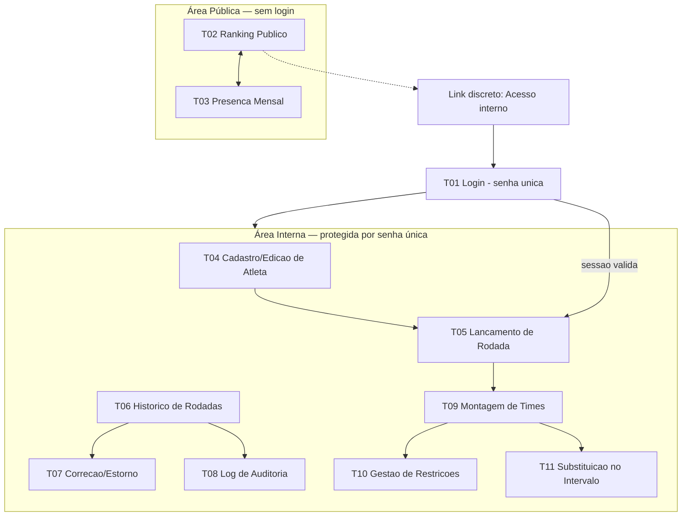

# UX-SPEC.md — Sistema de Ranking "Turma do Rola - Comary"

**Dono**: UX/UI
**Status**: Completo — publicado integralmente para o Tech Lead (Frontend/Mobile ficam
como consumidores de contexto futuro; não há Mobile neste projeto, conforme Gate 1 do
CTO — "acessível pelo celular" é atendido por web responsivo, não por app nativo).
**Revisão 2026-09-02 (pós-resolução de BLOCKER-001/BLOCKER-002)**: BLOCKER-001 e
BLOCKER-002, escalados ao Software Architect a partir da versão anterior deste
documento, foram resolvidos (`ADR-010`, `ADR-011`, `SDD.md` Seção 2.1/5/7.7/Anexo A;
`BLOCKERS.md` ambos `Resolvido`). Esta revisão incorpora: (a) confirmação do contrato
de dado de `ConflictList` em T09 — sem redesenho; (b) nova ação de anonimização de
dado pessoal em T04; (c) uma observação não bloqueante para o Tech Lead confirmar em
`TASK.md` (quantidade de times "N" por rodada). Mudanças marcadas explicitamente onde
ocorrem, conforme o mecanismo de histórico de componente (Seção 3.3).

**Revisão 2026-09-03 (resolução de BLOCKER-004, escalado pelo Frontend)**: o
Frontend, ao implementar `FE-02` (T02), identificou divergência entre a prosa da
Seção 2 (que já mencionava "ausências", ecoando RF-03.1 do `PRD-TECNICO.md`) e três
outras fontes — o wireframe ASCII da própria Seção 2, a tabela da Seção 6.2, e o
contrato de dado real de `BE-03` (`app.ranking_publico`) — que concordavam entre si
em **omitir** o campo. Verificado RF-03.1 (EARS, "o sistema deve sempre exibir...
número de presenças e número de ausências") e o fluxo 4.3 do `PRD-TECNICO.md`
(diagrama Mermaid, nó D: "Exibe nome de exibição + pontuação + presenças/ausências")
— o requisito de negócio é firme, repetido em dois pontos independentes do
`PRD-TECNICO.md` (Seção 1 e Seção 4), não um resíduo de rascunho. **Decisão: leitura
2** — a lacuna está no wireframe/Seção 6.2/contrato de dado, não na prosa da Seção 2.
Wireframe de T02 (Seção 2) e Seção 6.2 corrigidos nesta revisão para incluir
"ausências"; novo bloqueio (`BLOCKER-005`) escalado a `software-architect`/`backend`
pedindo o campo `ausencias` na view `app.ranking_publico` (reabre `BE-03`, já
aprovado pelo QA). `BLOCKER-004` marcado `Resolvido` em `BLOCKERS.md`. Mudança
visível registrada em Seção 3.3 (histórico de componente) — Tech Lead precisa
reestimar `FE-02`.
**Input de origem**: `SDD.md` (aprovado com ressalvas no Gate 2 do CTO, 2026-09-02;
Anexo A registra a resolução pós-Gate 2) + ADRs 001-011 (especialmente 003, 004, 005,
007, 010, 011) + `PRD-TECNICO.md` (Business Analyst, Seção 4 — fluxos de usuário — e
RF-01 a RF-08) + `CTO-REVIEW.md` (Gate 1: risco estratégico #1 LGPD, #2 senha única,
#3 algoritmo de times; Gate 2: ressalvas que tocavam experiência, itens 3 e 6, ambas
resolvidas nesta revisão) + `BLOCKERS.md` (BLOCKER-001, BLOCKER-002, `Resolvido`).
**Skills aplicadas**: `user-flow-to-screen-mapping` (Seções 1-2),
`technical-constraint-check` (Seção 7, aplicada em paralelo a cada tela mapeada),
`design-system-consistency-check` (Seção 3), `accessibility-review` (Seção 5),
`responsive-behavior-spec` (Seção 6), `ux-spec-drafting` (montagem final).

**Atualização (2026-09-04) — Iniciativa de Redesenho Visual, `PRD-TECNICO.md`
Parte II**: este `UX-SPEC.md` recebeu um **delta de UX/UI**, registrado
integralmente na **Parte II**, ao final deste documento, seguindo o mesmo
guardrail de não reescrita já aplicado por `PRD.md`/`PRD-TECNICO.md`/`SDD.md`
nesta mesma iniciativa — nenhuma das 11 telas descritas na Parte I é reaberta em
mérito funcional; o delta cobre exclusivamente a camada visual (paleta, tipografia,
composição/layout, iconografia) sobre o comportamento já aprovado. Ver Parte II
para: (a) a captura versionada do mockup aprovado pelo organizador (RF-D03,
já que o link do Artifact de origem foi confirmado, nesta revisão, como "casca
vazia" sem conteúdo verificável — ver Parte II, Seção 2.0); (b) a resolução formal
da ambiguidade de paleta dupla Grupo Rola/Clube Comary; (c) a decisão de cobertura
de profundidade de composição para as 5 telas fora do mockup original (T04, T07,
T08, T10, T11); (d) o gate obrigatório de `accessibility-review` pré-merge sobre
as 11 telas, exigido pelo Gate 2 do CTO desta iniciativa.

**Nota metodológica**: este é o primeiro `UX-SPEC.md` do projeto — não existe design
system prévio a reaproveitar. Por isso, **todo** componente listado na Seção 3 está
marcado como "Novo (baseline desta primeira versão)" — não é omissão de
`design-system-consistency-check`, é o próprio ato de fundação do design system.
Mudanças futuras a qualquer componente aqui definido, depois que o Tech Lead já tiver
estimado esforço sobre ele, serão registradas como **alteração visível** nesta mesma
seção (histórico de mudança), nunca como sobrescrita silenciosa.

---

## 1. Fluxos de Tela

### 1.1 Mapa de telas (a partir dos fluxos do PRD-TECNICO.md, Seção 4)

| Fluxo do PRD-TECNICO.md | Tela(s) mapeada(s) | Área |
|---|---|---|
| Pré-requisito implícito a todo fluxo de escrita (RF-07) | **T01 — Login (senha única)** | Interna (gate de entrada) |
| 4.1 Cadastro de Atleta (RF-01) | **T04 — Cadastro/Edição de Atleta** | Interna |
| 4.2 Lançamento de Rodada (RF-02) | **T05 — Lançamento de Rodada** | Interna |
| 4.3 Consulta de Ranking (RF-03.1, RF-03.2, RF-03.4) | **T02 — Ranking Público** | Pública |
| 4.3 Consulta de Ranking — visão mensal (RF-03.3) | **T03 — Presença Mensal** | Pública |
| 4.4 Correção de Histórico (RF-04) | **T06 — Histórico de Rodadas** (lista) + **T07 — Correção/Estorno** (detalhe) | Interna |
| RF-04.5 (log de auditoria, sem tela própria no PRD, mas exigido) | **T08 — Log de Auditoria** | Interna |
| 4.5 Montagem de Times (RF-05.1 a RF-05.4) | **T09 — Montagem de Times** | Interna |
| RF-05.5 (gestão de restrições obrigatórias, sem tela própria no PRD, mas exigido) | **T10 — Gestão de Restrições Obrigatórias** | Interna |
| 4.6 Substituições (RF-06) | **T11 — Substituição no Intervalo** (sub-tela/modal de T09, no contexto da rodada em andamento) | Interna |
| RF-08 (Migração do banco legado) | **Não aplicável — sem tela dedicada.** Confirmado pelo próprio PRD-TECNICO.md (checklist, Seção 4): é processo técnico de carga única, executado pelo Software Architect/execução, não um fluxo de usuário recorrente. Relatório de conferência (RF-08.5) é artefato técnico de validação do organizador fora da interface do produto nesta release — se isso mudar (ex.: organizador precisar revisar o relatório dentro do próprio app), volta como novo fluxo a mapear. | — |

Todo fluxo do PRD-TECNICO.md tem tela correspondente ou justificativa explícita de
não aplicabilidade — critério de pronto atendido.

### 1.2 Arquitetura de navegação (site map)



**Racional de navegação**:
- Nenhuma hierarquia de permissão (RN-12) → nenhum item de menu escondido ou
  condicionado a papel. Toda ação disponível a quem tem sessão válida.
- A área pública nunca exige navegação até o login; o link de acesso interno é
  discreto (rodapé/canto), não um CTA competindo com o ranking, que é o produto
  principal para o visitante comum.
- Dentro da área interna, a navegação é uma barra fixa com 5 destinos + logout
  (T04 Atletas, T05 Rodada, T06 Histórico, T09 Times, T10 Restrições) — T07, T08 e
  T11 são acessadas a partir de T06/T09, não itens de primeiro nível, para não
  sobrecarregar a barra de navegação mobile (RNF-07).

### 1.3 Sessão e expiração (aplica-se a toda tela da área interna)

TTL curto (8-12h, ADR-004) sem refresh token de longa duração. Toda tela da área
interna precisa lidar com o caso "sessão expirou no meio do uso" — especificado uma
vez aqui para não repetir em cada tela:

- Aos 2 minutos antes da expiração estimada, exibir aviso não-bloqueante ("Sua sessão
  expira em breve — salve o que estiver fazendo") — atende WCAG 2.2.1 (Timing
  Adjustable), evitando perda de trabalho em formulário longo (T04, T05, T07).
- Se uma ação de escrita retornar 401 (sessão inválida/expirada), a tela deve:
  preservar os dados não salvos em memória local (o que for tecnicamente possível),
  exibir mensagem "Sessão expirada, faça login novamente" e redirecionar para T01,
  retornando à tela de origem após novo login bem-sucedido.

---

## 2. Wireframes / Descrição de Layout por Tela

Convenção: layout descrito para viewport mobile (base, <640px) primeiro — mobile-first
(RNF-07). Adaptação para telas maiores está na Seção 6 (Comportamento Responsivo), não
repetida aqui.

### T01 — Login (senha única)

```
┌─────────────────────────────┐
│      Turma do Rola           │
│      Comary                  │
│                               │
│   [ Acesso interno ]         │
│                               │
│   Senha                      │
│   [________________] 👁      │
│                               │
│   [   Entrar   ]              │
│                               │
│   (mensagem de erro aqui,     │
│    quando houver)             │
│                               │
│   ← Voltar ao ranking público │
└─────────────────────────────┘
```

- Tela isolada, sem barra de navegação da área interna (ainda não autenticado).
- Único campo: senha (não há campo de usuário/e-mail — RN-12, ADR-004).
- Botão "mostrar/ocultar senha" (ícone olho) — acessível, não só visual.
- Link de retorno ao ranking público sempre visível (a consulta pública nunca depende
  de login, RF-07.2).
- Não existe link "esqueci minha senha" nesta versão — ver Seção 7 (ponto sinalizado).

### T02 — Ranking Público

```
┌─────────────────────────────┐
│ Turma do Rola - Comary        │
│ [Ranking] [Presenca Mensal]   │  <- tabs
├─────────────────────────────┤
│ 🥇 1  João Pedro   42 pts     │
│      12 presenças · 2 ausências · 1 cartão │
│ 🥈 2  Carlinhos    38 pts     │
│      10 presenças · 4 ausências · 0 cartão │
│  3   Rafa "Foguinho" 35 pts   │
│      11 presenças · 3 ausências · 2 cartões│
│  ...                          │
├─────────────────────────────┤
│ Atualizado em: 02/09/2026     │
│ Acesso interno (rodapé)       │
└─────────────────────────────┘
```

- Lista ordenada (cascata de desempate RN-08), cartão por atleta em mobile (não
  tabela densa) — nome de exibição (RN-06), pontuação, presenças, ausências.
  **Nunca** exibe contato ou data de nascimento (RN-01/RF-03.1) — nem como campo
  oculto no DOM (ver Seção 7, constraint aplicada de ADR-005: a garantia é no banco,
  mas o frontend também nunca deve *solicitar* essas colunas à view pública).
  **Correção (revisão 2026-09-03, resolução de `BLOCKER-004`)**: o wireframe acima
  agora exibe explicitamente a contagem de ausências por atleta, alinhado à prosa
  desta mesma seção e a RF-03.1/fluxo 4.3 do `PRD-TECNICO.md`. Antes desta revisão o
  wireframe mostrava apenas "12 presenças · 1 cartão", sem ausências — inconsistência
  identificada pelo Frontend ao implementar `FE-02` (`BLOCKER-004`). O campo depende
  de um novo campo `ausencias` na view `app.ranking_publico`, ainda não existente —
  ver `BLOCKER-005` (escalado a `software-architect`/`backend`) e Seção 7.2, item 4.
  Até a resolução de `BLOCKER-005`, esta tela permanece implementada (`FE-02`) sem a
  coluna de ausências, com a divergência documentada, não escondida.
- Top 3 com indicador visual (medalha/posição destacada) — reforçado por texto
  "1º, 2º, 3º", nunca só cor/ícone (WCAG 1.4.1).
- Cartões amarelo/vermelho exibidos como contagem com rótulo textual, não só cor.
- Rodapé com timestamp da última atualização (transparência sobre RF-03.4 — "estado
  mais recente do histórico").

### T03 — Presença Mensal (público)

```
┌─────────────────────────────┐
│ [Ranking] [Presenca Mensal]   │
├─────────────────────────────┤
│  ◀  Setembro/2026  ▶          │
├─────────────────────────────┤
│ 05/09  Presentes: 18          │
│ 12/09  Presentes: 15          │
│ 19/09  (ainda não lançada)     │
├─────────────────────────────┤
│ Ver lista de presentes ⌄      │
└─────────────────────────────┘
```

- Navegação por mês civil (RN-09), seletor anterior/próximo.
- Cada rodada do mês é expansível para ver lista de nomes de exibição presentes
  (accordion) — ainda dentro do limite de dado público (RN-01).

### T04 — Cadastro/Edição de Atleta

```
┌─────────────────────────────┐
│ ☰  Atletas                    │
├─────────────────────────────┤
│ 🔒 Aviso de privacidade        │
│ "Contato e data de nascimento │
│ são usados apenas internamente│
│ e nunca aparecem no ranking   │
│ público."                     │
├─────────────────────────────┤
│ Nome completo *               │
│ [______________________]      │
│ Apelido de exibição            │
│ [______________________]      │
│ (se em branco, usa 1º nome)    │
│ Contato                        │
│ [______________________]      │
│ Data de nascimento *           │
│ [__/__/____]                   │
│ Pontuação inicial *            │
│ [______] (mínimo 0)            │
│                                │
│ ⚠ Menor de 18 anos detectado   │
│ ☐ Confirmo que o consentimento │
│   do responsável legal foi     │
│   obtido                       │
│                                │
│ [ Salvar Atleta ]              │
└─────────────────────────────┘
```

- Aviso de privacidade fixo no topo do formulário (LGPD, transparência no ato do
  cadastro — SDD.md Seção 7.6, delegado explicitamente ao UX/UI). Texto diferencia,
  na prática, a base legal por trás: dado de adulto tratado sob legítimo interesse do
  organizador; dado de possível menor tratado sob consentimento do responsável — ver
  nota em Seção 7 sobre a redação pendente de ajuste na Seção 7.6 do SDD.md.
  ***Este componente antecipa a correção pendente do SDD.md 7.6 (ressalva Gate 2, item
  4) — a redação final deve ser revisada quando o Software Architect atualizar a
  seção correspondente.***
- Bloco de consentimento (RN-02) só aparece condicionalmente, quando idade calculada
  < 18 anos — nunca oculto por CSS apenas (ver a11y).
- Nível técnico **não é campo do formulário** (RF-01.4 — é derivado, exibido apenas
  em modo leitura na lista/perfil do atleta, nunca editável aqui).
- Ao detectar nome completo duplicado (RF-01.5), modal de confirmação aparece antes
  de permitir salvar (ver Seção 4, estado "erro/aviso").

**Ação nova (revisão 2026-09-02 — desbloqueada por BLOCKER-002/ADR-011): "Solicitar
exclusão/anonimização de dados pessoais"**

Disponível na tela de edição de um atleta já existente (não no formulário de
criação), como ação secundária destrutiva — visualmente separada das ações de
salvamento normal, no mesmo padrão de "zona de risco" usado para exclusão de rodada
em T07:

```
┌─────────────────────────────┐
│ ☰  Editar Atleta — Carlinhos   │
│  (... campos normais acima ...)│
├─────────────────────────────┤
│ Zona de risco                  │
│ Solicitar exclusão/anonimização│
│ de dados pessoais               │
│ [ Solicitar anonimização ]      │
└─────────────────────────────┘
```

Estado de **confirmação (ação irreversível)** — modal bloqueante, mesmo padrão de
foco inicial seguro de T07 (foco em "Cancelar", não no botão destrutivo):

```
┌─────────────────────────────┐
│ Anonimizar dados de Carlinhos?  │
│                                 │
│ Esta ação substitui nome        │
│ completo, apelido de exibição,  │
│ contato e data de nascimento    │
│ por valores não identificáveis, │
│ e marca o atleta como inativo.  │
│                                 │
│ O histórico de pontuação        │
│ (ranking, presenças, gols,      │
│ cartões) é preservado — não     │
│ é apagado nem recalculado.      │
│                                 │
│ Esta ação NÃO PODE SER          │
│ DESFEITA. Não há como recuperar │
│ o nome ou contato originais     │
│ depois de confirmar.            │
│                                 │
│ Digite "ANONIMIZAR" para        │
│ confirmar:                      │
│ [________________________]      │
│                                 │
│ [ Cancelar ]  [ Confirmar       │
│                anonimização ]   │
└─────────────────────────────┘
```

- Exige digitação de uma palavra de confirmação (padrão "digite para confirmar"),
  mais rigoroso que o "Sim, excluir" simples de T07 — justificativa: em T07 o estorno
  reverte números (auditável e, na prática, refazível lançando de novo); aqui o dado
  pessoal original é perdido para sempre (ADR-011, "irreversibilidade por desenho"),
  o que pede uma barreira de confirmação mais alta.
- Texto explicita, em linguagem simples, os três efeitos definidos no `ADR-011`: (1)
  o que é sobrescrito, (2) o que é preservado (ledger), (3) que não há reversão.

Estado de **resultado visível** (após confirmação bem-sucedida), na mesma tela de
edição, refletindo o placeholder não identificável definido no `ADR-011`:

```
┌─────────────────────────────┐
│ ☰  Editar Atleta                │
├─────────────────────────────┤
│ ⚠ Este atleta foi anonimizado    │
│ em 02/09/2026 e está inativo.    │
│ Dados pessoais não podem mais    │
│ ser editados ou recuperados.     │
├─────────────────────────────┤
│ Nome completo                    │
│ [Atleta anonimizado #4821]       │
│ Apelido de exibição               │
│ [Anônimo]                         │
│ Contato                           │
│ [—]                               │
│ Data de nascimento                │
│ [—]                               │
│                                    │
│ Pontuação/histórico: preservados  │
│ (ver ranking e histórico de       │
│ rodadas)                          │
└─────────────────────────────┘
```

- Todos os campos pessoais viram somente-leitura após anonimização — nenhum formulário
  de edição aceita entrada nesses campos, consistente com "a operação não tem função
  inversa" (`ADR-011`).
- O atleta anonimizado **desaparece do ranking público (T02) e da presença mensal
  (T03) como identidade** (ele já não tem `apelido_exibicao` reconhecível), mas os
  pontos/eventos históricos que ele gerou continuam contabilizados agregadamente no
  histórico de rodadas (T06/T07) — o UX/UI não recalcula nem remove eventos, apenas
  exibe o nome-placeholder onde antes aparecia o nome do atleta, refletindo
  diretamente o comportamento de dados definido no `ADR-011`.
- Nível técnico e listas de restrição obrigatória (T10) que referenciassem esse
  atleta aparecem com a mesma etiqueta placeholder e a restrição é exibida como
  desativada automaticamente (efeito colateral do `ADR-011` sobre
  `RESTRICAO_OBRIGATORIA`) — sem ação adicional do organizador nessa tela.

### T05 — Lançamento de Rodada

Layout tipo *stepper* (etapas), dado o volume de dados por atleta em uma tela só
seria inviável em mobile:

```
Etapa 1/3: Presença
┌─────────────────────────────┐
│ Rodada: 05/09/2026            │
│ ⚠ já existe rodada nesta data  │  <- RF-02.8, condicional
├─────────────────────────────┤
│ João Pedro                    │
│ ( ) Presente (•) Ausente ( ) Lesionado │
│ Carlinhos                     │
│ (•) Presente ( ) Ausente ( ) Lesionado │
│ ...                            │
│                                │
│ [ Continuar → ]                │
└─────────────────────────────┘

Etapa 2/3: Eventos
┌─────────────────────────────┐
│ Carlinhos (Presente)           │
│ Gols:   [ - ] 1 [ + ]          │
│ 🟨 Amarelo [ - ] 0 [ + ]        │
│ 🟥 Vermelho [ - ] 0 [ + ]       │
│                                │
│ João Pedro (Ausente)           │
│ Eventos bloqueados — atleta    │
│ ausente (RF-02.6)              │
│                                │
│ [ ← Voltar ]   [ Continuar → ] │
└─────────────────────────────┘

Etapa 3/3: Revisão e Confirmação
┌─────────────────────────────┐
│ Resumo da rodada 05/09/2026    │
│ 18 presentes · 3 ausentes      │
│ 4 gols · 2 cartões amarelos     │
│                                │
│ [ ← Voltar ]  [ Confirmar     │
│                Lançamento ]    │
└─────────────────────────────┘
```

- Etapa 2 mostra atletas ausentes com os controles de evento visivelmente
  desabilitados (não escondidos) + texto explicando o porquê (RF-02.6) — evita
  confusão de "por que não consigo marcar gol para esse atleta".
- Etapa 3 é o ponto de não-retorno: confirmar dispara a transação atômica no banco
  (RNF-10). Botão de confirmação tem estado de carregamento explícito (ver Seção 4).
- Substituições **não** entram neste fluxo (T05) — são registradas depois, durante a
  rodada em andamento, a partir de T09/T11 (RF-06 depende de times já definidos).

### T06 — Histórico de Rodadas (lista)

```
┌─────────────────────────────┐
│ ☰  Histórico                  │
├─────────────────────────────┤
│ 19/09/2026  18 presentes  ⋮   │
│ 12/09/2026  15 presentes  ⋮   │
│ 05/09/2026  20 presentes  ⋮   │
│                                │
│ [ Ver log de auditoria ]      │
└─────────────────────────────┘
```

- Lista cronológica decrescente. Menu "⋮" por rodada: "Corrigir" / "Excluir rodada".
- Link para T08 (log de auditoria) sempre visível no rodapé da lista.

### T07 — Correção/Estorno (detalhe de uma rodada)

```
┌─────────────────────────────┐
│ ← Corrigir rodada 05/09/2026   │
├─────────────────────────────┤
│ Carlinhos                     │
│ Presença: Presente → [Ausente ▾] │
│ Gols: 1 → [ 2 ]                │
│                                │
│ Pré-visualização do impacto:   │
│ Carlinhos: -2 pts (presença)   │
│            +3 pts (gol extra)  │
│            = -2 pts líquido    │  <- ver nota de suposição, Secao 7
│                                │
│ [ Cancelar ]  [ Confirmar      │
│                Correção ]      │
└─────────────────────────────┘
```

Fluxo de **exclusão** de rodada (diferente de correção de campo):

```
┌─────────────────────────────┐
│ Excluir rodada 05/09/2026?    │
│                                │
│ Isso reverte automaticamente   │
│ TODOS os pontos desta rodada   │
│ (presença, gols, cartões,      │
│ substituições vinculadas) para │
│ 20 atletas. Esta ação gera      │
│ registro no log de auditoria   │
│ e não pode ser desfeita.        │
│                                │
│ [ Cancelar ]  [ Sim, excluir e │
│                estornar ]       │
└─────────────────────────────┘
```

- Toda correção/exclusão explica em linguagem simples o efeito de estorno automático
  (RN-04) **antes** da confirmação — nunca some pontos silenciosamente.
- Diálogo de confirmação de exclusão é modal bloqueante (ação destrutiva e em
  cascata) — correção de campo único usa preview inline, não modal (menos disruptivo
  para ajustes triviais, ex.: corrigir 1 gol).

### T08 — Log de Auditoria

```
┌─────────────────────────────┐
│ ← Log de Auditoria             │
├─────────────────────────────┤
│ 02/09/2026 14:32               │
│ Rodada 05/09/2026 — correção   │
│ Carlinhos: presença            │
│   Antes: Presente → Depois:    │
│   Ausente                      │
├─────────────────────────────┤
│ 01/09/2026 09:10               │
│ Rodada 29/08/2026 — exclusão   │
│ (20 atletas afetados)          │
└─────────────────────────────┘
```

- Ordenado do mais recente ao mais antigo (RF-04.5), somente leitura.
- **Nunca** exibe campo de autor (RN-12/RN-07) — nem "sistema", nem "organizador
  desconhecido" — simplesmente omitido, para não sugerir uma identidade que não
  existe.
- Cada entrada mostra timestamp, rodada afetada, valores antes/depois — igual ao
  contrato de dado definido no modelo (`LOG_AUDITORIA`, SDD.md Seção 5).

### T09 — Montagem de Times

```
┌─────────────────────────────┐
│ ☰  Times — Rodada 05/09/2026   │
├─────────────────────────────┤
│ Presentes selecionados: 18     │
│ [ Gerar sugestão de times ]     │
├─────────────────────────────┤
│ Time A            Time B       │
│ João Pedro         Carlinhos   │
│ Rafa               Marquinhos  │
│ ...                ...         │
│                                │
│ Nível técnico médio:            │
│ A: 6.2   B: 6.0  (diferença ok) │
│                                │
│ [ Trocar jogador ]  [ Confirmar│
│                       Times ]   │
└─────────────────────────────┘
```

Estado de **conflito não resolvido** (RF-05.2 — tratamento central desta release,
ressalva explícita do Gate 2 do CTO):

```
┌─────────────────────────────┐
│ ⚠ Não foi possível gerar uma    │
│ divisão que satisfaça todas as  │
│ restrições obrigatórias.        │
│                                 │
│ Restrições em conflito:         │
│ • João Pedro ⚡ Carlinhos        │
│   (não podem ficar juntos)      │
│ • Carlinhos ⚡ Marquinhos        │
│   (não podem ficar juntos)      │
│ → Com apenas 2 times, não é      │
│   possível separar os três        │
│   simultaneamente.                │
│                                 │
│ [ Ajustar lista de presentes ] │
│ [ Gerar mesmo assim,           │
│   ciente do conflito ]          │
└─────────────────────────────┘
```

- Cada linha de conflito é um **par específico de atletas em restrição**, com o
  motivo (visual + texto, nunca só ícone). **Confirmado (revisão 2026-09-02,
  resolução de BLOCKER-001/ADR-010)**: o backend devolve `restricoes_conflitantes`
  (lista de pares `{atleta_a_id, atleta_b_id, motivo, ...}`, um por componente conexo
  do grafo de restrições sem divisão válida) e `grupos_conflito` — uma superestrutura
  aditiva da suposição original deste layout. O contrato confirma exatamente o
  formato assumido; **nenhum redesenho de T09/`ConflictList` foi necessário** — ver
  confirmação em Seção 7.2, item 1.
- Segunda opção ("Gerar mesmo assim, ciente do conflito") é uma via de escape
  explícita: o organizador pode prosseguir mesmo sem solução perfeita, mas o sistema
  nunca decide isso silenciosamente por ele (alinhado a RF-05.2 — "informar, não
  ignorar").
- "Trocar jogador" (ajuste manual, RF-05.4): em mobile, ao tocar em um jogador, abre
  seletor "trocar com quem?" (ver Seção 6 — evita drag-and-drop em touch, que tem
  baixa confiabilidade e pior acessibilidade).
- Idade/nível técnico usados no equilíbrio (RF-05.3) são exibidos como média
  agregada por time — nunca como "ranking" competitivo entre times (não é o
  propósito da tela).
- **Observação nova (revisão 2026-09-02, não bloqueante)**: este wireframe assume
  exatamente **2 times por rodada** ("Time A"/"Time B", inclusive no texto de
  conflito "com apenas 2 times, não é possível separar..."). O `PRD-TECNICO.md` não
  confirma esse número "N" explicitamente (RF-05 não define quantidade de times).
  Isso **não é um conflito entre experiência e restrição técnica** (não há
  restrição do SDD.md sendo contornada) — é uma lacuna do próprio requisito de
  produto. Não escalado ao Software Architect por esse motivo; registrado aqui como
  **ponto para o Tech Lead confirmar em `TASK.md`** antes de estimar/implementar T09
  — ver Seção 7.3. Se "N" for diferente de 2 ou variável por rodada, o layout lado a
  lado (2 colunas) e o texto de conflito acima precisam ser ajustados — mudança que
  será marcada visivelmente nesta seção quando ocorrer.

### T10 — Gestão de Restrições Obrigatórias

```
┌─────────────────────────────┐
│ ☰  Restrições                  │
├─────────────────────────────┤
│ [ + Nova restrição ]           │
├─────────────────────────────┤
│ João Pedro ⚡ Carlinhos          │
│ (não podem ficar no mesmo time) │
│ Ativa            [Desativar]   │
├─────────────────────────────┤
│ Rafa ⚡ Marquinhos               │
│ Desativada em 20/08/2026        │
│                    [Reativar]  │
└─────────────────────────────┘
```

- CRUD simples de pares. Desativação é soft-delete (RN-11) — histórico permanece
  visível (com data de desativação), nunca excluído fisicamente da tela.
- Formulário "+ Nova restrição": dois seletores de atleta (autocomplete por nome),
  sem campo de "motivo" obrigatório no PRD-TECNICO (fora de escopo desta release).

### T11 — Substituição no Intervalo

Acessível a partir de T09, quando a rodada está em andamento (times já definidos):

```
┌─────────────────────────────┐
│ ← Substituições — Time A        │
├─────────────────────────────┤
│ Sai:   [ João Pedro     ▾ ]    │
│ Entra: [ Bruno (banco)   ▾ ]   │
│ [ Registrar Substituição ]      │
├─────────────────────────────┤
│ Substituições registradas:      │
│ João Pedro ↔ Bruno (Time A)     │
│ [ + Registrar outra ]           │
└─────────────────────────────┘
```

- Sem limite de quantidade (RF-06.2) — "+ Registrar outra" sempre disponível.
- Nenhum campo de pontuação aqui — reforço textual "Substituição não altera pontos,
  apenas registro histórico" (RF-06.3), para não criar expectativa equivocada no
  organizador.

---

## 3. Design System e Componentes

**Todo componente abaixo é Novo (baseline desta primeira versão do design system)** —
não há sistema prévio no projeto.

### 3.1 Tokens visuais

| Token | Valor/Descrição | Uso |
|---|---|---|
| `color.primary` | Verde (identidade "campo de futebol"), tom único definido pelo Frontend na implementação a partir desta especificação | Botões primários, links de destaque, tabs ativas |
| `color.neutral.50…900` | Escala de cinza para texto/fundo/bordas | Texto, cards, divisores |
| `color.success` | Verde-sucesso (distinto do `color.primary` em matiz para não confundir "ação" com "confirmação") | Toasts de sucesso, badge "Presente" |
| `color.warning` | Amarelo | Badge "Lesionado", avisos não bloqueantes, cartão amarelo |
| `color.danger` | Vermelho | Erros, exclusão, cartão vermelho, badge "Ausente" |
| `color.info` | Azul | Avisos informativos (ex.: sessão expirando) |
| `spacing.1…8` | Escala de espaçamento (múltiplos de 4px) | Todo padding/margin |
| `radius.sm/md/lg` | Cantos arredondados | Cards, botões, inputs |
| `type.scale` | Escala tipográfica mobile-first (base 16px, nunca menor que 14px para texto de corpo — WCAG 1.4.4) | Títulos, corpo, legendas |
| `elevation.0…3` | Sombra para cards/modais | Diferenciação de camadas (modal sobre conteúdo) |
| `motion.duration` | Transições curtas (150-250ms), respeitando `prefers-reduced-motion` | Toasts, accordions, steppers |

### 3.2 Componentes reutilizáveis

| Componente | Descrição | Usado em |
|---|---|---|
| `Button` (primary/secondary/danger/ghost) | Estados: default, hover, focus-visible, disabled, loading (spinner + texto mantido, nunca só ícone) | Todas as telas |
| `TextInput` / `DateInput` / `NumberInput` | Label sempre visível (nunca só placeholder), mensagem de erro associada via `aria-describedby` | T01, T04, T05, T07, T10 |
| `PasswordInput` | Toggle mostrar/ocultar senha acessível, `autocomplete="current-password"` | T01 |
| `SegmentedControl` | Grupo de opção única visualmente destacado (ex.: Presente/Ausente/Lesionado) — implementado como `radiogroup` semântico, não `div`s clicáveis | T05 |
| `StepperCounter` | Contador +/- para gols/cartões, com `aria-label` descrevendo o campo | T05 |
| `Badge/Tag` | Rótulo textual + cor (nunca só cor) — status de presença, cartões | T02, T05, T06 |
| `Card` (lista responsiva) | Substitui tabela densa em mobile; em telas largas pode virar tabela (ver Seção 6) | T02, T06, T09 |
| `Tabs` | Navegação entre 2 views relacionadas (Ranking/Presença Mensal) | T02/T03 |
| `Accordion` | Expansão de detalhe (lista de presentes por rodada) | T03 |
| `Modal/Dialog` | Focus trap, fecha com `Esc`, foco retorna ao elemento que abriu | T04 (duplicidade), T07 (exclusão) |
| `Toast/Alert banner` | Não-modal, `aria-live="polite"` (ou `assertive` para erro crítico) | Todas as telas com ação de escrita |
| `EmptyState` | Ilustração textual + call-to-action, nunca uma tela em branco sem explicação | T02, T03, T06, T08, T09, T10 |
| `Skeleton` | Placeholder de carregamento, respeitando `prefers-reduced-motion` (sem "pulso" para quem desativou animação) | T02, T05, T06 |
| `Stepper` (wizard de etapas) | Cabeçalho "Etapa X/3", navegação linear com "voltar" | T05 |
| `ConflictList` **(novo, específico do domínio)** | Lista de pares de atletas em conflito de restrição, com ícone + texto explicando o motivo | T09 — contrato de dado **confirmado** (revisão 2026-09-02, ver Seção 7.2, item 1); sem mudança de desenho |
| `DiffViewer` **(novo, específico do domínio)** | Exibição "antes → depois" para correção e log de auditoria | T07, T08 |
| `TypedConfirmationModal` **(novo, específico do domínio — adicionado na revisão 2026-09-02)** | Variante de `Modal/Dialog` para ações destrutivas e **irreversíveis** (sem função inversa): exige digitar uma palavra de confirmação exata antes de habilitar o botão de ação destrutiva, além do padrão de foco inicial seguro (foco em "Cancelar") já usado em `Modal/Dialog` | T04 (anonimização de dado pessoal, ADR-011) |
| `BottomTabBar` (mobile) / `TopNav` (desktop) | Navegação principal da área interna | Todas as telas internas |
| `SessionExpiryBanner` | Aviso não-bloqueante de expiração próxima de sessão | Todas as telas internas |

### 3.3 Histórico de mudanças de componente (mecanismo obrigatório)

`[Data] — Componente alterado — O que mudou — Motivo — Precisa reestimar: Sim/Não`

| Data | Componente/Tela alterado | O que mudou | Motivo | Precisa reestimar |
|---|---|---|---|---|
| 2026-09-02 | T04 (Cadastro/Edição de Atleta) | Adicionada ação "Solicitar exclusão/anonimização de dados pessoais": botão em "zona de risco", novo componente `TypedConfirmationModal`, e novo estado de tela pós-anonimização (campos pessoais somente-leitura com placeholder) | Resolução de BLOCKER-002 — mecanismo de anonimização definido em `ADR-011` (LGPD Art. 18), antes deliberadamente omitido enquanto o SDD.md não o desenhava | **Sim** |
| 2026-09-02 | T09 (Montagem de Times) / `ConflictList` | Nenhuma mudança de desenho — contrato de dado assumido (`[{atleta_a, atleta_b, motivo}]`) **confirmado** como subconjunto de `restricoes_conflitantes`/`grupos_conflito` | Resolução de BLOCKER-001 — mecanismo de RF-05.2 detalhado em `ADR-010` | **Não** (confirmação, não alteração) |
| 2026-09-03 | T02 (Ranking Público) / `Card` (mobile) e `<table>` (desktop, Seção 6.2) | Adicionada a coluna/linha "ausências" por atleta, no wireframe (Seção 2) e na tabela de adaptação responsiva (Seção 6.2) — campo já previsto em prosa na Seção 2 e em RF-03.1, mas ausente do wireframe/6.2 desde a versão anterior deste documento (`FE-02` já foi implementado sem esse campo, seguindo as fontes então consistentes) | Resolução de `BLOCKER-004` (escalado pelo Frontend) — RF-03.1/fluxo 4.3 do `PRD-TECNICO.md` confirmam o requisito como firme, não resíduo de rascunho | **Sim** — depende também de `BLOCKER-005` (novo campo `ausencias` na view `app.ranking_publico`, escalado a `software-architect`/`backend`); `FE-02` (já `Concluída`) precisa de incremento quando o campo existir no contrato |

Nenhuma outra mudança registrada além das três acima. A partir de agora, qualquer
alteração subsequente a componente já estimado pelo Tech Lead deve ser adicionada como
nova linha aqui.

---

## 4. Estados de Tela (vazio, carregando, erro, sucesso)

| Tela | Vazio | Carregando | Erro | Sucesso |
|---|---|---|---|---|
| **T01 Login** | Formulário sem senha digitada (estado inicial) | Botão "Entrar" com spinner, campo desabilitado | Mensagem genérica "Senha incorreta" (RF-07.3) — **idêntica** mesmo sob rate limiting (ver Seção 7, não é bug, é requisito) | Redireciona para última tela interna acessada (ou T05 por padrão) |
| **T02 Ranking Público** | "Nenhum atleta cadastrado ainda" (pré-migração/pré-cadastro) | Skeleton de 5 linhas de card | "Não foi possível carregar o ranking agora. Tente novamente." + botão retry | Lista renderizada, ordenada (RN-08), timestamp de atualização visível |
| **T03 Presença Mensal** | "Nenhuma rodada lançada neste mês" | Skeleton de calendário/lista | Idem T02 | Lista de rodadas do mês com contagem de presentes |
| **T04 Cadastro/Edição** | N/A — formulário de criação começa vazio por natureza (não é "estado a tratar", é o estado inicial normal) | Botão "Salvar" com spinner; botão "Confirmar anonimização" com spinner (revisão 2026-09-02) | Erro de validação por campo (idade/consentimento não confirmado bloqueia salvar, RF-01.3) + modal de duplicidade (RF-01.5); "Não foi possível anonimizar. Nenhuma alteração foi salva." se a transação de anonimização falhar (revisão 2026-09-02) | Toast "Atleta salvo com sucesso" + retorno à lista; para anonimização (revisão 2026-09-02): toast "Dados pessoais anonimizados" + tela permanece em modo somente-leitura para os campos pessoais, refletindo o placeholder (ver Seção 2, estado de resultado) |
| **T05 Lançamento de Rodada** | N/A — sempre há lista de atletas ativos a marcar (se não houver nenhum atleta cadastrado, a tela redireciona para T04 com aviso, tratado como dependência, não como "vazio" desta tela) | Etapa 3: botão "Confirmar Lançamento" com spinner, etapas anteriores bloqueadas para edição durante o envio | Falha na transação atômica: "Não foi possível lançar a rodada. Nada foi salvo — tente novamente." (reforça RNF-10: nunca estado parcial) | Toast de sucesso + redireciona para T06 com a nova rodada no topo |
| **T06 Histórico** | "Nenhuma rodada lançada ainda" | Skeleton de lista | "Não foi possível carregar o histórico" + retry | Lista cronológica decrescente |
| **T07 Correção/Estorno** | N/A — sempre parte de uma rodada existente selecionada em T06 | Botão "Confirmar Correção"/"Sim, excluir" com spinner | "Não foi possível aplicar a correção. Nenhuma alteração foi salva." | Toast "Correção aplicada, log de auditoria atualizado" + retorno a T06 |
| **T08 Log de Auditoria** | "Nenhuma correção registrada até agora" | Skeleton de lista | "Não foi possível carregar o log" + retry | Lista ordenada mais recente → mais antiga |
| **T09 Montagem de Times** | "Selecione os presentes da rodada para gerar times" (antes de qualquer geração) | "Calculando divisão de times…" (pode levar alguns segundos — heurística de backtracking, ver Seção 7) | Dois sub-casos: (a) conflito de hard constraint não resolvido (ver wireframe T09, não é "erro" técnico, é resultado válido do algoritmo); (b) falha técnica real ("Não foi possível gerar a sugestão, tente novamente") | Times exibidos lado a lado + indicadores de equilíbrio |
| **T10 Restrições** | "Nenhuma restrição obrigatória cadastrada" | Skeleton de lista | "Não foi possível salvar a restrição" | Toast de sucesso + lista atualizada |
| **T11 Substituição** | "Nenhuma substituição registrada nesta rodada" | Botão "Registrar" com spinner | "Não foi possível registrar — verifique se o atleta já está em outro time" | Lista de substituições atualizada em tempo real na mesma tela |

Todo item marcado "N/A" tem justificativa explícita na própria célula, conforme
critério de pronto (não há "N/A" sem porquê).

---

## 5. Requisitos de Acessibilidade (WCAG 2.1, nível AA como piso)

Acessibilidade é critério não negociável em toda tela — aplicado via
`accessibility-review` tela a tela, não como etapa única genérica ao final.

### 5.1 Requisitos transversais (aplicam-se a todas as 11 telas)

| Critério WCAG | Aplicação concreta neste projeto |
|---|---|
| 1.1.1 Conteúdo não textual | Ícones (medalha, cartão, ⚡ de conflito) sempre acompanhados de texto equivalente, nunca só `aria-hidden` sem alternativa |
| 1.3.1 Informações e relações | Tabelas de ranking usam `<table>`/`<th scope="col">` reais mesmo quando visualmente exibidas como cards em mobile (usar CSS, não remover semântica); formulários com `<label for>` associado a todo input |
| 1.4.1 Uso de cor | Status (presente/ausente/lesionado, cartões, conflito de restrição) nunca comunicado só por cor — sempre + texto/ícone com rótulo |
| 1.4.3 / 1.4.11 Contraste | Texto ≥ 4.5:1; componentes de UI (bordas de input, ícones informativos) ≥ 3:1 |
| 1.4.4 Redimensionamento de texto | Layout funcional até 200% de zoom sem perda de conteúdo/funcionalidade (crítico em T05/T09, telas densas) |
| 2.1.1 / 2.1.2 Teclado | Toda ação executável só com teclado, incluindo o fluxo de "trocar jogador" em T09 (sem depender de drag-and-drop obrigatório) e o wizard de T05 |
| 2.2.1 Tempo ajustável | Aviso de expiração de sessão (Seção 1.3) com tempo suficiente para reação, nunca expiração silenciosa |
| 2.4.3 Ordem de foco | Ordem de tabulação segue a ordem visual/lógica em todos os formulários (T04, T05, T07, T10) |
| 2.4.7 Foco visível | Indicador de foco visível em todo elemento interativo, nunca removido via CSS sem substituto |
| 2.5.5 / 2.5.8 Alvo de toque | Área mínima de toque 44×44px (mobile-first — RNF-07) em botões, checkboxes, contadores de gol/cartão |
| 3.1.1 Idioma da página | `lang="pt-BR"` em todo o documento (RNF-08) |
| 3.3.1 / 3.3.3 Identificação e sugestão de erro | Toda mensagem de erro de formulário associada ao campo (`aria-describedby`, `aria-invalid="true"`) + sugestão de correção em texto simples |
| 4.1.2 Nome, função, valor | Componentes customizados (`SegmentedControl`, `StepperCounter`, `Tabs`) implementados com roles ARIA corretos (`radiogroup`, `tablist`/`tab`/`tabpanel`), não `div`s genéricas estilizadas |
| 4.1.3 Mensagens de status | Toasts e banners de confirmação usam `aria-live` (`polite` para sucesso, `assertive` para erro crítico) sem exigir foco manual do usuário |

### 5.2 Pontos de atenção específicos por tela

- **T01 Login**: campo de senha nunca em texto puro visível por padrão; toggle
  "mostrar senha" com `aria-pressed` e rótulo textual, não só ícone de olho.
  Mensagem de erro genérica (RF-07.3) anunciada via `aria-live="assertive"` — mesmo
  sendo genérica, o usuário de leitor de tela precisa ser informado da falha.
- **T02/T03 Ranking Público**: maior superfície de uso por público não-técnico e
  potencialmente idoso (pais/familiares de atletas) — prioridade alta de contraste e
  tamanho de fonte legível sem zoom.
- **T04 Cadastro**: bloco de consentimento (RN-02) deve ser alcançável e anunciado
  por leitor de tela quando aparece dinamicamente (`aria-live="polite"` na
  mudança condicional, não apenas exibição/ocultação via `display:none` silenciosa).
- **T04 Anonimização (revisão 2026-09-02)**: `TypedConfirmationModal` é modal com
  focus trap obrigatório e foco inicial em "Cancelar" (ação segura por padrão, mesmo
  critério de T07); o botão destrutivo permanece `disabled` (com `aria-disabled`,
  não removido do DOM) até o texto digitado corresponder exatamente à palavra de
  confirmação, com feedback textual associado via `aria-describedby` (não só cor de
  borda); após confirmação, o resultado (campos pessoais somente-leitura) é
  anunciado via `aria-live="polite"` e cada campo tornado somente-leitura usa
  `aria-readonly="true"` (não `disabled`, que removeria o campo da navegação por
  teclado/leitor de tela sem explicar o porquê).
- **T05 Lançamento de Rodada**: `StepperCounter` (gols/cartões) precisa de
  `aria-label` específico por atleta e tipo de evento (ex.: "Gols de Carlinhos"),
  não um rótulo genérico repetido — crítico numa lista longa de atletas.
- **T07 Correção/Estorno**: diálogo de exclusão é modal com focus trap obrigatório
  (ação destrutiva e irreversível) — foco inicial no botão "Cancelar" (ação segura
  por padrão), não no botão destrutivo.
- **T09 Montagem de Times**: lista de conflitos (`ConflictList`) deve ser navegável
  por teclado e anunciada como alerta ao aparecer (`role="alert"`) — é uma mudança de
  estado relevante que o organizador precisa perceber sem depender só de leitura
  visual da tela.
- **T11 Substituição**: seletores "Sai"/"Entra" devem impedir, de forma acessível
  (mensagem de erro clara, não só bloqueio silencioso do submit), selecionar o mesmo
  atleta nos dois campos.

Nenhuma tela tem pendência crítica de acessibilidade aberta neste UX-SPEC. O contrato
de dado de T09/`ConflictList` (antes suposição, agora **confirmado** via `ADR-010` —
ver Seção 7.1/7.2) não alterou a estrutura semântica já definida aqui. A única
pendência remanescente de Seção 7 (item 3 — redação da base legal em T04) é uma
dependência de sincronização de texto, não uma pendência de acessibilidade.

---

## 6. Comportamento Responsivo

Aplicação mobile-first (RNF-07) — toda tela é desenhada primeiro para a viewport
mobile (Seção 2); esta seção documenta a adaptação progressiva para viewports
maiores. Não há app nativo (fora de escopo, Gate 1 do CTO) — responsividade é web
pura.

### 6.1 Breakpoints

| Nome | Faixa | Uso típico |
|---|---|---|
| `base` | < 640px | Celular — viewport de referência para todo o desenho de Seção 2 |
| `sm` | 640-1023px | Tablet — layout intermediário, mais densidade sem virar desktop completo |
| `lg` | ≥ 1024px | Desktop — organizador lançando rodada/times em notebook |

### 6.2 Adaptações por tela

| Tela | `base` (mobile) | `sm`/`lg` (tablet/desktop) |
|---|---|---|
| Navegação interna | `BottomTabBar` fixo na base da tela | `TopNav` horizontal fixo no topo |
| T02 Ranking | Lista de `Card` empilhados | `lg`: vira `<table>` real com colunas (posição, nome, pontos, presenças, ausências, cartões) — mesma semântica, densidade maior. **Coluna "ausências" adicionada na revisão 2026-09-03 (resolução de `BLOCKER-004`) — depende de `BLOCKER-005`** |
| T05 Lançamento de Rodada | `Stepper` de 3 etapas, uma por tela | `lg`: pode exibir etapas 1 e 2 lado a lado (lista de presença + eventos), sem remover a possibilidade de uso 100% mobile |
| T09 Montagem de Times | Times empilhados verticalmente (Time A acima de Time B), troca de jogador via modal de seleção (toque) | `lg`: Times lado a lado (colunas), troca de jogador pode oferecer drag-and-drop **como atalho opcional**, mantendo o modal de seleção como alternativa sempre disponível (não substituindo, por acessibilidade — 2.1.1) |
| T04/T07/T10 Formulários | Campos empilhados, um por linha | `sm`/`lg`: campos relacionados podem parear em duas colunas (ex.: nome + apelido), sem alterar ordem de tabulação lógica |
| T03 Presença Mensal | Accordion vertical por rodada | `lg`: pode exibir em grade de mês (estilo calendário), mesma informação, layout mais denso |

### 6.3 Casos "não aplicável"

Não há caso de "não aplicável" nesta seção — o produto é 100% web responsivo (não é
API-only, não há tela exclusivamente desktop); toda tela mapeada na Seção 1 tem
comportamento responsivo definido acima.

---

## 7. Restrições Técnicas Aplicadas e Conflitos Sinalizados ao Software Architect

### 7.1 Restrições técnicas aplicadas sem conflito (checadas via `technical-constraint-check`)

| Restrição (SDD.md/ADR) | Onde se aplica | Como foi respeitada no UX-SPEC |
|---|---|---|
| RN-01/RF-03.1 + ADR-005 (RLS/views públicas, nunca expor contato/data de nascimento) | T02, T03 | Layout de T02/T03 nunca inclui campo de contato/data de nascimento, nem oculto via CSS — a tela simplesmente não solicita essas colunas |
| RF-07.3 (mensagem de erro sempre genérica, sem diferenciar senha errada de bloqueio) | T01 | Estado de erro único ("Senha incorreta") independente de estar ou não sob rate limiting (RNF-03) — não há banner separado de "conta bloqueada" |
| ADR-004 (sessão TTL curta, sem refresh token de longa duração, cookie httpOnly) | Toda área interna | Seção 1.3 documenta aviso de expiração em vez de "manter conectado" por longos períodos — nenhuma tela oferece opção de sessão persistente além do TTL |
| RN-12 (nenhuma ação atribuída a pessoa física) | T08 (log de auditoria) | Layout de T08 não reserva espaço para "autor" — omitido, não preenchido com placeholder genérico |
| RF-02.6 (bloquear evento para atleta ausente) | T05 | Controles de evento desabilitados e explicados textualmente para atletas ausentes, não escondidos |
| RNF-10 (atomicidade — nunca estado parcial visível) | T05 (confirmação), T07 (correção/exclusão) | Estado de erro de T05/T07 explicita "nada foi salvo" em vez de sugerir salvamento parcial |
| RN-04/RF-04.3 (estorno automático em cascata, incluindo eventos vinculados) | T07 | Diálogo de exclusão explicita o efeito em cascata antes da confirmação, sem opção de "excluir sem estornar" |
| RN-11 (restrição é soft-delete, não exclusão física) | T10 | Lista de restrições sempre mostra desativadas com data, nunca remove do histórico visual |
| RF-06.3 (substituição não gera pontuação) | T11 | Reforço textual explícito na própria tela, para evitar expectativa equivocada do organizador |
| RF-05.2 + `ADR-010` (mecanismo de explicação de conflito — grafo por componentes conexos) *(confirmado 2026-09-02, ex-BLOCKER-001)* | T09 | `ConflictList` exibe um a um os pares de `restricoes_conflitantes` retornados pelo backend, agrupados por `grupos_conflito` quando aplicável — contrato confirmado sem redesenho, ver Seção 2 (T09) e Seção 3.2 |
| LGPD Art. 18 + `ADR-011` (anonimização in-place, nunca hard delete, ledger preservado) *(confirmado 2026-09-02, ex-BLOCKER-002)* | T04 | Nova ação "Solicitar exclusão/anonimização de dados pessoais" com `TypedConfirmationModal` e estado de resultado somente-leitura, refletindo exatamente o mecanismo do `ADR-011` — ver Seção 2 (T04), Seção 4 e Seção 5.2 |

### 7.2 Conflitos/pendências sinalizados ao Software Architect (não resolvidos unilateralmente)

Registrados também em `BLOCKERS.md`. Dois dos quatro pontos abaixo, sinalizados na
versão anterior deste documento, **foram resolvidos** pelo Software Architect na
revisão de 2026-09-02 — mantidos aqui como registro histórico do que foi escalado e
como foi resolvido, conforme guardrail de não apagar em silêncio o que já foi
sinalizado; o terceiro segue em aberto e um quarto foi adicionado em 2026-09-03.

1. **[RESOLVIDO] Mecanismo de explicação de conflito para RF-05.2 (T09)** —
   pendência originalmente registrada pelo Gate 2 do CTO (item 6, dono Software
   Architect/Backend) e escalada como `BLOCKER-001`. O UX-SPEC havia desenhado T09
   assumindo que o backend devolveria uma **lista estruturada de pares de atletas em
   conflito** (ex.: `[{atleta_a, atleta_b, motivo}]`). **Resolução (`ADR-010`,
   `SDD.md` Seção 2.1/6.3/Anexo A)**: o Software Architect confirmou o mecanismo
   (grafo de restrições decomposto em componentes conexos via union-find,
   backtracking do `ADR-007` executado por componente) e o contrato de dado real
   (`restricoes_conflitantes: [{atleta_a_id, atleta_b_id, motivo, ...}]` +
   `grupos_conflito`) — uma **superestrutura aditiva** da suposição original, não uma
   simplificação. **Nenhum redesenho de T09/`ConflictList` foi necessário** —
   registrado sem mudança em Seção 3.3 (histórico de componente). `BLOCKER-001`
   marcado `Resolvido` em `BLOCKERS.md`.
2. **[RESOLVIDO] Direito de exclusão/anonimização de dado pessoal (LGPD Art. 18)** —
   pendência originalmente registrada pelo Gate 2 do CTO (item 3, dono Software
   Architect) e escalada como `BLOCKER-002`. O UX-SPEC não incluía, deliberadamente,
   ação de "excluir"/"anonimizar" atleta em T04 enquanto o mecanismo de dados não
   fosse definido. **Resolução (`ADR-011`, `SDD.md` Seção 5/7.7/Anexo A)**: o
   Software Architect definiu anonimização in-place da linha `ATLETA` (nunca
   exclusão física), preservando o ledger append-only e desativando restrições
   obrigatórias associadas. **Ação incorporada a T04** nesta revisão: "Solicitar
   exclusão/anonimização de dados pessoais", com confirmação por digitação
   (`TypedConfirmationModal`) e estado de resultado (campos somente-leitura com
   placeholder) — ver Seção 2 (T04). **Mudança registrada em Seção 3.3 (histórico de
   componente) com reestimativa necessária pelo Tech Lead** — `BLOCKER-002` marcado
   `Resolvido` em `BLOCKERS.md`.
3. **[RESOLVIDO em 2026-09-04] Redação da base legal diferenciada (adulto vs.
   menor) na Seção 7.6 do SDD.md (Gate 2, item 4, dono Software Architect).** O
   aviso de privacidade desenhado em T04 (Seção 2) já antecipava essa
   diferenciação em linguagem simples para o usuário final, pendente apenas de o
   Software Architect corrigir a Seção 7.6 do `SDD.md` para confirmar que a
   redação da tela não contradizia a base legal formalmente registrada na
   arquitetura. **Resolução**: o Software Architect reescreveu a Seção 7.6 do
   `SDD.md` (2026-09-04, ver `SDD.md` Anexo B) distinguindo explicitamente as duas
   bases legais (Art. 7º IX LGPD para adulto — legítimo interesse do organizador;
   Art. 14 §1º LGPD para menor — consentimento do responsável) e confirmou que o
   texto de produção já implementado em T04 (`FE-04`/`AtletaForm.tsx`) é
   consistente com a redação corrigida, sem exigir ajuste de copy. Nenhuma
   mudança de wireframe/texto foi necessária nesta tela — a pendência era de
   sincronização entre `SDD.md` e o texto já desenhado aqui, não o inverso.
   Registrado também em `BLOCKERS.md`, Seção "Notas". **Escalado para**:
   `software-architect` (acompanhamento, concluído).
4. **[EM ABERTO, novo 2026-09-03] Campo "número de ausências" ausente na view
   `app.ranking_publico` (T02)** — pendência identificada pelo Frontend ao
   implementar `FE-02` e escalada como `BLOCKER-004` (destino original: `ux-ui`).
   RF-03.1 e o fluxo 4.3 do `PRD-TECNICO.md` exigem exibir "número de ausências" por
   atleta no ranking público; a prosa da Seção 2 deste documento já refletia esse
   requisito, mas o wireframe da própria Seção 2, a tabela da Seção 6.2 e o contrato
   real de `BE-03` (schema `RankingPublicoItem`) concordavam em omiti-lo — três
   fontes consistentes entre si, divergindo apenas da prosa. **Resolução do UX/UI
   (2026-09-03)**: confirmado que RF-03.1 é requisito firme (repetido em dois pontos
   independentes do `PRD-TECNICO.md`, sem interpretação registrada na Seção 7 que o
   revogasse) — a lacuna estava no wireframe/Seção 6.2/contrato, não na prosa.
   Wireframe de T02 e Seção 6.2 corrigidos nesta revisão (ver Seção 2, Seção 3.3).
   **Isto não é uma restrição técnica do SDD.md sendo contornada** — é ausência de um
   campo de dado derivável (`total_rodadas - presencas` por atleta, ou equivalente)
   que ainda não existe na view. **Escalado para**: `software-architect`/`backend`
   via novo bloqueio `BLOCKER-005`, pedindo o campo `ausencias` em
   `app.ranking_publico` — reabre `BE-03` (já aprovado pelo QA) com nova versão de
   `API-CONTRACT.yaml`. `BLOCKER-004` marcado `Resolvido` em `BLOCKERS.md` (a decisão
   de leitura e a correção de UX-SPEC.md são responsabilidade do UX/UI, cumpridas
   aqui); `BLOCKER-005` segue **Aberto**, de responsabilidade do Software Architect.

### 7.3 Pontos observados, sem conflito de arquitetura, mas com impacto de UX a monitorar

- **Quantidade de times por rodada ("N") não confirmada no `PRD-TECNICO.md` (ponto
  novo, revisão 2026-09-02, anotado pelo Software Architect ao resolver
  BLOCKER-001/BLOCKER-002, não bloqueante).** O wireframe de T09 (Seção 2) assume
  exatamente **2 times** por rodada — layout de 2 colunas ("Time A"/"Time B") e o
  texto de conflito ("com apenas 2 times, não é possível separar os três
  simultaneamente"). RF-05 (`PRD-TECNICO.md`) não define esse número explicitamente.
  **Isto não é um conflito entre experiência e restrição técnica do SDD.md** — não há
  decisão de arquitetura sendo contornada, é uma lacuna do requisito de produto em
  si; por isso **não é escalado ao Software Architect**. Fica registrado aqui como
  **ponto para o Tech Lead confirmar em `TASK.md`** (junto ao Business Analyst, se
  necessário) antes de estimar/planejar a implementação de T09. Se "N" divergir de 2
  (fixo ou variável por rodada), o layout de 2 colunas e o texto de conflito
  precisarão ser ajustados — mudança que será marcada visivelmente na Seção 2 e no
  histórico de componente (Seção 3.3) quando confirmada.
- **Complexidade combinatória do backtracking (ADR-007, dívida técnica aceita) pode
  tornar a geração de times em T09 perceptivelmente lenta** se o volume de presentes
  se aproximar do limite de revisão já registrado no SDD.md (~60 atletas/rodada). O
  estado de carregamento de T09 (Seção 4) já contempla uma mensagem de espera
  ("Calculando divisão de times…"), mas **não há, ainda, um estado de timeout
  definido tecnicamente** (o que acontece se o algoritmo não retornar em tempo hábil
  dentro do limite de execução serverless mencionado como consequência negativa do
  ADR-003?). Isto não é reprovado nem aprovado por este UX/UI — é uma pergunta em
  aberto para o Software Architect/Tech Lead confirmarem se existe timeout e qual
  mensagem de erro correspondente deve ser exibida. Até confirmação, o UX-SPEC trata
  esse caso dentro do estado genérico "falha técnica real" de T09 (Seção 4).
- **Procedimento de redefinição da senha única compartilhada (Gate 2, item 7, dono
  Tech Lead/Backend, não Software Architect)** — T01 não inclui link "esqueci minha
  senha" nesta versão, porque esse procedimento ainda não foi definido. Diferente
  dos itens 1 e 2 acima, este não é um conflito entre experiência desejada e
  restrição de arquitetura — é uma responsabilidade já atribuída pelo CTO a
  Tech Lead/Backend; o UX/UI apenas documenta a ausência da funcionalidade nesta
  versão e ficará disponível para desenhar a tela correspondente assim que o
  procedimento for definido, sem necessidade de escalonamento a `software-architect`.
- **Pré-visualização de impacto de correção em T07** assume que é possível calcular
  o delta de pontos no cliente (ou via endpoint de simulação) antes da confirmação,
  usando os valores vigentes de `CONFIGURACAO_PONTUACAO` (SDD.md Seção 5). Esta é uma
  suposição de UX razoável (a tabela de pontuação é simples e não sensível), mas
  depende de o Tech Lead confirmar se o cálculo de preview será feito no
  frontend ou exigirá endpoint dedicado — impacto de esforço, não de arquitetura;
  não é escalado ao Software Architect, fica registrado aqui para o Tech Lead avaliar
  ao estimar T07.

---

## Checklist de Prontidão (revalidado em 2026-09-03, pós-resolução de BLOCKER-004)

- [x] Todo fluxo do PRD-TECNICO.md tem tela(s) correspondente(s) mapeada(s) — Seção
      1.1, incluindo a justificativa explícita de não aplicabilidade para RF-08
      (migração, processo técnico sem tela dedicada). Sem alteração nesta revisão.
- [x] Todo fluxo de tela tem os 4 estados especificados (vazio, carregando, erro,
      sucesso), ou está marcado "não aplicável" com o porquê — Seção 4, tabela
      completa, toda célula "N/A" com justificativa inline. Linha de T04 atualizada
      nesta revisão com os estados de carregamento/erro/sucesso da nova ação de
      anonimização.
- [x] Todo componente novo está sinalizado como tal — Seção 3.2: todos os
      componentes da versão de fundação seguem marcados "Novo (baseline)";
      `TypedConfirmationModal`, adicionado nesta revisão para a ação de
      anonimização de T04, está marcado como novo e específico do domínio. Mudança
      registrada em Seção 3.3 (histórico de componente), com reestimativa
      necessária pelo Tech Lead para T04. Nesta revisão (2026-09-03), a coluna
      "ausências" adicionada a T02 não é um componente novo (reaproveita `Card`/
      `<table>` já existentes) — mudança de conteúdo de dado, registrada em Seção
      3.3 com reestimativa necessária para `FE-02`.
- [x] Toda tela passou por `accessibility-review` sem pendência crítica aberta —
      Seção 5, requisitos transversais (5.1) e pontos específicos por tela (5.2),
      incluindo o ponto novo de T04 (`TypedConfirmationModal`, `aria-readonly` nos
      campos anonimizados). Nenhuma pendência de acessibilidade em si.
- [x] Comportamento responsivo definido para todo fluxo relevante — Seção 6; não há
      caso "não aplicável" porque o produto é 100% web responsivo, sem componente
      API-only. A nova ação de T04 herda o comportamento responsivo de formulário já
      definido em 6.2 (não introduz layout novo).
- [x] Toda restrição técnica do SDD.md foi checada via `technical-constraint-check`
      e todo conflito encontrado está sinalizado ao Software Architect, não
      resolvido por conta própria — Seção 7.1 (agora com 2 novas linhas para
      `ADR-010`/`ADR-011`, confirmadas) e 7.2 (dos 4 pontos já escalados ao longo do
      projeto, 2 estão **[RESOLVIDO]** — `BLOCKER-001` e `BLOCKER-002`, ambos
      `Resolvido` em `BLOCKERS.md` — 1 segue **[EM ABERTO]**, item 3, acompanhamento
      não bloqueante, e 1 é novo nesta revisão — item 4, **[EM ABERTO]**, campo
      `ausencias` ausente em `app.ranking_publico`, escalado como `BLOCKER-005`); 7.3
      registra observações de impacto de UX que não chegam a ser conflito de
      arquitetura, incluindo o ponto (não bloqueante) sobre a quantidade de times
      "N" em T09, para o Tech Lead confirmar em `TASK.md`.
- [x] Nenhuma das 7 seções está vazia ou com placeholder.

**Veredito desta revisão**: `UX-SPEC.md` permanece completo e liberado para o Tech
Lead. Os dois bloqueios que motivaram reestimativa condicional na versão anterior
(T09/`ConflictList` e T04/anonimização) estão agora resolvidos: T09 não exige
reestimativa (contrato de dado confirmado sem mudança de desenho, Seção 3.3); T04
exige reestimativa (nova ação, novo componente `TypedConfirmationModal`, novos
estados de tela — Seção 3.3, linha marcada "Precisa reestimar: Sim"). O item 3 da
Seção 7.2 (redação de base legal em T04) foi **resolvido em 2026-09-04** (ver Seção
7.2, item 3, atualizado) — resta em aberto, não bloqueante, apenas a observação da
Seção 7.3 sobre "N" times em T09 (para o Tech Lead confirmar em `TASK.md`, sem
envolvimento do Software Architect).

**Veredito**: `UX-SPEC.md` completo e liberado para o Tech Lead considerar a
especificação pronta para decomposição/estimativa em `TASK.md`. Três pontos seguem
formalmente em aberto em `BLOCKERS.md` (Seção 7.2) — não bloqueiam o início do
trabalho do Tech Lead sobre as demais telas, mas T09 (conflito de restrições) e T04
(ação de exclusão/anonimização, ainda ausente) podem exigir reestimativa quando o
Software Architect responder.

**Veredito desta revisão (2026-09-03, resolução de BLOCKER-004)**: `UX-SPEC.md`
permanece completo e liberado para o Tech Lead. `BLOCKER-004` (escalado pelo
Frontend durante `FE-02`) foi resolvido — a prosa da Seção 2 estava correta; o
wireframe da Seção 2 e a tabela da Seção 6.2 é que estavam incompletos e foram
corrigidos aqui para incluir "número de ausências" (RF-03.1). Essa correção depende,
por sua vez, de um campo novo (`ausencias`) na view `app.ranking_publico`, que ainda
não existe — escalado como `BLOCKER-005` a `software-architect`/`backend` (Seção
7.2, item 4), reabrindo `BE-03`. A mudança em T02 está registrada em Seção 3.3
(histórico de componente) com "Precisa reestimar: Sim" — `FE-02` (já `Concluída`)
precisará de um incremento quando `BLOCKER-005` for resolvido, no mesmo padrão já
usado para T04/anonimização.

---

# PARTE II — UX-SPEC Delta: Iniciativa de Redesenho Visual

**Dono**: UX/UI
**Status**: Completo — publicado para o Tech Lead como delta desta iniciativa.
Segue o mesmo padrão de duas-partes já usado em `PRD.md`, `PRD-TECNICO.md` e
`SDD.md` (Anexo C) para esta mesma iniciativa: nenhuma das 11 telas descritas na
Parte I é reaberta em mérito funcional — este documento resolve exclusivamente a
camada de apresentação (paleta, tipografia, composição/layout, iconografia,
acessibilidade sobre a nova paleta, responsividade) sobre o comportamento já
aprovado.
**Relação com a Parte I**: onde este delta é silencioso, a Parte I permanece a
referência (fluxos, regras de negócio, contratos de dado, estados funcionais).
Nenhum dos 4 estados de tela (vazio/carregando/erro/sucesso) já definidos na
Parte I muda de *comportamento* — só de *pele visual* (Seção 4 deste delta).
**Gate de origem**: `SDD.md` Anexo C, **Aprovado com ressalvas** no Gate 2 do CTO
desta iniciativa (`CTO-REVIEW.md`, 2026-09-04) — ADR-012 aprovado sem ressalva,
ADR-013 aprovado com 3 condições de execução (reestimativa formal de `FE-00` a
`FE-11`, gate duro de `accessibility-review` pré-merge nas 11 telas, isolamento do
commit de troca de tokens), ADR-014 aprovado sem ressalva.
**Input de origem**: `PRD.md` Parte II (PM — objetivo de sucesso, escopo,
premissas 1-10) + `PRD-TECNICO.md` Parte II (Business Analyst — RF-D01 a RF-D05,
RN-D01 a RN-D07, Interpretação #14/#15) + `SDD.md` Anexo C (Software Architect —
ADR-012, ADR-013, ADR-014) + `UX-SPEC.md` Parte I (as 11 telas já aprovadas,
mérito não reaberto) + o mockup de 6 telas aprovado pelo organizador, cuja
descrição textual é capturada nesta revisão em formato versionado (Seção 2.0,
conforme RF-D03/RN-D05 — o link do Artifact `https://claude.ai/code/artifact/
75a686fe-5e8f-46fe-8c98-c3a2120e428b` foi verificado via `WebFetch` nesta mesma
revisão e **confirma-se, de forma independente, o achado já registrado pelo CTO no
Gate 1 desta iniciativa**: a página retorna apenas o aviso padrão de "Conteúdo
gerado por usuário e não verificado", sem nenhum conteúdo visual/de design
recuperável — o link não é, e nunca foi, uma fonte de trabalho válida; a única
especificação de trabalho válida é a descrição em prosa já repassada pelo PM/CTO e
capturada aqui) + `logo.jpg`/`logo_comary.jpg` (inspecionados diretamente nesta
revisão, não apenas citados por nome de arquivo — ver Seção 2.0) +
`src/design-system/tokens.css` (estado real hoje, lido diretamente para calcular
os deltas de valor desta revisão) + `GUARDRAILS.md` (regras 28, 29, 30, 31) +
`BLOCKERS.md` (nenhum bloqueio novo aberto por este agente nesta revisão — ver
Seção 7).
**Skills aplicadas**: `user-flow-to-screen-mapping` (Seção 1, reaplicada à
cobertura das 11 telas — nenhum fluxo novo, apenas decisão de cobertura visual
por tela), `technical-constraint-check` (Seção 7, ADR-012/013/014, em paralelo a
cada tela mapeada), `design-system-consistency-check` (Seção 3 — achado central:
remoção de emoji como conteúdo de interface, mapeamento de papel semântico
navy/dourado/verde sobre os tokens existentes, blast radius simultâneo nas 11
telas), `accessibility-review` (Seção 5 — contraste calculado par a par para a
nova paleta, gate obrigatório pré-merge sobre as 11 telas, não amostral),
`responsive-behavior-spec` (Seção 6), `ux-spec-drafting` (montagem final).

## Nota de verificação de fidelidade (2026-09-04, revisão 2 desta Parte II)

**Correção de método, registrada por transparência**: a primeira versão desta
Parte II tratou o link do Artifact (`https://claude.ai/code/artifact/75a686fe-
5e8f-46fe-8c98-c3a2120e428b`) como "casca vazia" com base no retorno de
`WebFetch` — conclusão que se revelou um **falso negativo**: `WebFetch` captura
apenas o HTML de bootstrap do Artifact antes do JavaScript client-side
renderizar o conteúdo real (Artifacts do `claude.ai` são aplicações renderizadas
no cliente, não páginas estáticas). O conteúdo real do mockup (~1,4MB de
HTML/CSS já renderizado, com os tokens de cor exatos e a marcação das 6 telas
desktop+mobile) foi disponibilizado como arquivo local e lido diretamente nesta
revisão via a ferramenta `Read`/`Grep` (por ser um arquivo muito grande com
imagens embutidas em base64, a leitura foi feita por trechos e por extração
direcionada de texto visível, não por leitura linear completa).

Esta revisão 2 é uma **auditoria de fidelidade** de toda a Seção 2 (wireframes),
parte da Seção 3 (tokens/componentes) e parte da Seção 5 (contraste) desta
Parte II contra o conteúdo real agora disponível — **não** uma reabertura das
três decisões já formalizadas na revisão 1 (paleta dupla, cobertura das 5 telas
remanescentes, gate de acessibilidade obrigatório), que permanecem válidas e
não dependiam do conteúdo do mockup para serem resolvidas. Toda divergência
encontrada está corrigida diretamente nas seções correspondentes abaixo, com a
mudança sinalizada explicitamente (nunca sobrescrita em silêncio, conforme
guardrail deste agente) e, onde a divergência não é puramente visual, registrada
como novo ponto de atenção em vez de resolvida por conta própria.

**Resumo das correções desta revisão** (detalhe em cada seção):

1. **Paleta**: valores exatos de `--navy-strong`, `--gold`/`--gold-fill`/
   `--gold-ink`, `--warn`, `--danger` e os tons de fundo (`--pitch-bg`,
   `--warn-bg`, `--danger-bg`, `--navy-tint`) corrigidos para os valores reais
   do mockup — alguns dos valores que eu havia calculado/proposto na revisão 1
   (ex.: dourado texto-seguro sobre claro) coincidem em princípio, mas divergem
   no hex exato. Corrigido nas Seções 2.0/3.1/5.3.
2. **Emoji**: o mockup real **usa** emoji funcionais (🥇🥈🥉 medalha, ⚽ gol,
   🟨 cartão amarelo, 🔄 novo sorteio, ✓ confirmação de restrição) — o oposto
   do que a Seção 3.4 da revisão 1 assumiu ("sem emoji" tratado como regra
   absoluta, com um componente `Icon` substituindo todo glifo). Isso **não** é
   decidido unilateralmente aqui — é uma divergência entre o texto do `PRD.md`
   Parte II ("sem emoji") e o próprio artefato que o PM cita como já aprovado
   pelo organizador. Registrado como novo ponto para o PM esclarecer (Seção
   7.2, item 6), com a especificação das 6 telas do mockup **seguindo fielmente
   o mockup real** enquanto isso não é esclarecido (é a fonte mais concreta e
   mais recentemente aprovada disponível).
3. **T02 (Ranking Público)**: estrutura real é uma tabela única "atleta ×
   últimas rodadas (pontos por presença/ausência/lesão em cada data) × total de
   pontos", com medalha para os 3 primeiros — não o cartão por atleta com
   contagem agregada de presenças/ausências/cartões que a revisão 1 descreveu
   (herdado sem crítica da Parte I). Reescrito na Seção 2.2, com um novo ponto
   de atenção de acessibilidade (medalha sem texto ordinal equivalente) e uma
   tensão sinalizada com RF-03.1 (Seção 7.2, item 7).
4. **T01 (Login)**: título do cartão é "Acesso interno" (não uma repetição do
   wordmark "Turma do Rola"); corrigido na Seção 2.1.
5. **T05 (Lançamento de Rodada)**: o mockup real **não** usa o *stepper* de 3
   etapas da Parte I — é uma lista contínua única, com estatísticas no topo e
   eventos (gol/cartão) revelados por atleta só quando marcado presente, um
   único botão "Salvar rodada". Reescrito na Seção 2.4, com uma reconciliação
   proposta (modal de confirmação) para preservar a intenção de RNF-10 (ponto
   de não-retorno com resumo) sem contradizer o mockup aprovado.
6. **T09 (Montagem de Times)**: times nomeados "Colete"/"Sem Colete" (não
   "Time A"/"Time B"); painel de equilíbrio mostra **diferença** de pontos/idade
   entre os times (não médias lado a lado); há rótulos de posição tática
   (ATA/MEI/VOL/LAT/ZAG) e formação ("4-3-3") por jogador — ponto novo e
   sensível, tratado com o mesmo cuidado que RF-D01.2/RF-D01.3 já exigiam
   (Seção 7.2, item 8); banner de sucesso "✓ Restrição respeitada" adicionado.
   Reescrito na Seção 2.6.
7. **T06 (Histórico)**: tabela real inclui colunas "Confronto" (placar de
   pontos entre os dois times daquela rodada) e "Status" (`Encerrada`/
   `Corrigida`), ausentes da Seção 2.5 da revisão 1. Corrigido.
8. **T03 (Presença Mensal)**: estrutura já descrita na revisão 1 estava
   majoritariamente correta (matriz atleta × data com pontos P/A/L, legenda);
   confirmado sem mudança estrutural, só ajuste fino de rótulo (setas ◀▶ são
   caracteres tipográficos, não emoji — mantido fora do mapa de substituição
   por `Icon`).

Nenhuma das três decisões já formalizadas pelo UX/UI (abaixo) muda em
decorrência desta auditoria.

## Três decisões formalizadas pelo UX/UI nesta revisão

Conforme explicitamente delegado a este agente por `PRD.md` Parte II (Seção 4,
"Decisão de cobertura") e por `PRD-TECNICO.md` Parte II (RN-D07, RF-D04):

1. **Resolução da ambiguidade de paleta dupla** (Grupo Rola marinho-dourado vs.
   Clube Comary verde) — ver Seção 2.0. **Decisão**: não há ambiguidade real a
   arbitrar entre pares depois de inspecionar os dois assets diretamente — são
   dois brasões de identidades distintas e não relacionadas (ver evidência visual
   na Seção 2.0), e o mockup aprovado pelo organizador já resolve isso na prática
   ao não usar o verde do Clube Comary como cor de marca em nenhuma das 6 telas.
   Formalizado como: Grupo Rola (navy `#16234a` + dourado `#d9b64a`) é a
   identidade de marca primária do produto inteiro; verde de campo (`#1c6e46`) é
   cor funcional de ação (não é, e nunca foi, uma referência ao Clube Comary);
   `logo_comary.jpg` **não é adotado nesta release** como asset de nenhuma tela
   (ver Seção 2.0 e Seção 7.2 para o porquê e o limite desta decisão).
2. **Decisão de cobertura/profundidade das 5 telas fora do mockup original** (T04,
   T07, T08, T10, T11) — ver Seção 1.4. **Decisão**: extensão integral da nova
   linguagem visual **já nesta release**, em profundidade de composição "leve"
   (reaproveitamento estrito dos componentes compartilhados já re-pintados —
   nenhum layout/composição dedicado tipo hero navy/dourado ou iconografia de
   campo, reservados às 6 telas do mockup e a T09 em particular). Não há plano de
   migração faseado com prazo — as 11 telas recebem decisão de cobertura completa
   nesta mesma revisão, conforme RF-D04.1(a).
3. **Gate de acessibilidade obrigatório pré-merge sobre as 11 telas** (exigência
   adicional do Gate 2 do CTO, RF-D05/RNF-D01/Guardrail 28) — ver Seção 5. Não é
   um achado amostral sobre as 6 telas do mockup: como os tokens são globais e os
   componentes são compartilhados (Guardrail 31, confirmado por ADR-013), o
   `accessibility-review` desta revisão cobre a combinação completa cor-de-fundo ×
   cor-de-texto de todo componente compartilhado usado pelas 11 telas, calculada
   e registrada nesta mesma revisão (Seção 5.3) — não deixada como "a fazer depois
   do merge".

---

## 1. Fluxos de Tela (delta)

### 1.1 Nenhum fluxo funcional novo

Confirmado por `PRD-TECNICO.md` Parte II, RN-D06: nenhuma regra de negócio, fluxo
funcional ou modelo de dados muda nesta iniciativa. O mapa de telas da Parte I
(Seção 1.1) e a arquitetura de navegação (Seção 1.2) permanecem válidos **na
íntegra** — as 11 telas são as mesmas, os mesmos 6 fluxos do `PRD-TECNICO.md`
original mapeiam para as mesmas telas. O único ponto de risco identificado pelo
PM/BA (revivência do simulador tático de T09 alterar a interação de "Trocar
jogador") foi resolvido pelo BA **sem** mudança de fluxo (RF-D01/RN-D03/
Interpretação #14, `PRD-TECNICO.md` Parte II) — ver Seção 1.3 abaixo.

### 1.2 Delta ao site map (Seção 1.2 da Parte I)

Uma única adição estrutural, puramente visual: `BrandCrest` (brasão do Grupo
Rola) passa a aparecer (a) em destaque em T01 (login), (b) em versão compacta no
`TopNav`/rodapé de T02 (ranking público), e (c) em versão compacta no `TopNav` da
área interna (desktop). Não aparece no `BottomTabBar` mobile — espaço insuficiente
sem comprometer o alvo de toque mínimo de 44×44px dos 5 itens de navegação já
definidos (RNF-07/WCAG 2.5.5). Nenhuma tela nova, nenhuma rota nova, nenhuma
mudança de hierarquia de navegação (RN-12 continua valendo — nenhum item
condicionado a papel).

### 1.3 Confirmação vinculante: interação de "Trocar jogador" em T09 não muda

Herdado diretamente de `PRD-TECNICO.md` Parte II (RF-D01, RN-D03, Interpretação
#14) e de `SDD.md` Anexo C/ADR-014, como **restrição de desenho vinculante**, não
uma escolha do UX/UI a reabrir:

- O seletor modal por toque ("trocar com quem?") continua sendo o mecanismo
  **primário e sempre disponível**, em qualquer viewport — herdado de RF-05.4
  (Parte I) sem alteração.
- Em `lg` (desktop), arrastar-e-soltar via API nativa de Drag and Drop do HTML5
  (ADR-014) pode ser oferecido como **atalho opcional adicional** — nunca
  substitui o seletor modal, que permanece sempre visível/acionável mesmo em
  desktop (Guardrail 30).
- O novo "simulador tático de campo" (Seção 2.6 deste delta) é tratado
  estritamente como **nova representação visual** da mesma atribuição de time
  (Time A/Time B) já existente — não introduz reposicionamento livre de jogador
  a coordenadas específicas do campo (RF-D01.2/RF-D01.3). Se o organizador
  confirmar, no futuro, que espera essa capacidade, este UX/UI não a desenha sem
  reabertura formal pelo BA/PM (limite já registrado em RF-D01.3) — não é uma
  decisão que o UX/UI tome sozinho ao "aproveitar que já está mexendo em T09".

### 1.4 Decisão de cobertura das 11 telas (RF-D04) — tabela obrigatória

Toda uma das 11 telas tem, a partir desta revisão, exatamente uma decisão de
cobertura registrada, conforme exigido por RF-D04.1/RN-D01. Nenhuma tela fica sem
decisão (critério de "pronto" da métrica de consistência de design system,
`PRD.md` Parte II Seção 3):

| Tela | Decisão de cobertura (RF-D04.1) | Profundidade de composição | Racional |
|---|---|---|---|
| T01 Login | (a) Aplicada integralmente | **Total** — nova composição dedicada (hero navy full-bleed, `BrandCrest`, título Bebas Neue) | Dentro do mockup aprovado |
| T02 Ranking Público | (a) Aplicada integralmente | **Total** — header navy, `MedalBadge`, tipografia completa | Dentro do mockup aprovado; tela pública mais visitada |
| T03 Presença Mensal | (a) Aplicada integralmente | **Total** — par direto de T02, mesmo header/tabs | Dentro do mockup aprovado |
| T05 Lançamento de Rodada | (a) Aplicada integralmente | **Total** — stepper repintado, iconografia sem emoji | Dentro do mockup aprovado |
| T06 Histórico de Rodadas | (a) Aplicada integralmente | **Total** — lista repintada, `IconButton` sem emoji | Dentro do mockup aprovado |
| T09 Montagem de Times | (a) Aplicada integralmente | **Total** — simulador tático de campo (âncora do pedido do organizador) | Dentro do mockup aprovado; Must/Alto valor |
| T04 Cadastro/Edição de Atleta | (a) Aplicada integralmente, **nesta release** | **Leve** — reaproveita `TextInput`/`Button`/`Modal`/`TypedConfirmationModal` já re-pintados pelos novos tokens; sem hero dedicado, sem iconografia de campo | Fora do mockup original, uso interno de baixa frequência (Should); tokens já a atingem automaticamente (ADR-013), redesenho de composição dedicado não se justifica no valor/esforço desta release |
| T07 Correção/Estorno | (a) Aplicada integralmente, **nesta release** | **Leve** — idem T04; `DiffViewer` herda tokens sem composição nova | Idem T04 |
| T08 Log de Auditoria | (a) Aplicada integralmente, **nesta release** | **Leve** — lista somente-leitura, herda tokens sem composição nova | Idem T04; menor prioridade de retrabalho visual (Seção 5, item 11 do `PRD.md` Parte II) |
| T10 Gestão de Restrições Obrigatórias | (a) Aplicada integralmente, **nesta release** | **Leve** — CRUD simples, herda tokens sem composição nova | Idem T04 |
| T11 Substituição no Intervalo | (a) Aplicada integralmente, **nesta release** | **Leve** — sub-tela de T09, herda tokens + `TopNav`/`BottomTabBar` novos sem composição própria adicional | Idem T04 |

**Nenhuma tela recebe a decisão (b) "plano de migração faseado com prazo"**: como
o próprio `SDD.md` Anexo C (ADR-013) confirma, os valores de cor/tipografia
atingem as 11 telas simultaneamente no momento do merge do commit de troca de
tokens — não há, tecnicamente, como "adiar" isso para uma tela específica
(seria a opção 2 do ADR-013, rejeitada por violar Guardrail 31). O que variou
por tela foi exclusivamente a *profundidade de composição/layout* (Total vs.
Leve), não a aplicação da paleta/tipografia em si, que é binária e simultânea
para todas as 11. Isso satisfaz RF-D04.1(a) para as 11 telas nesta mesma
revisão — zero telas ficam com decisão pendente ou com prazo em aberto.

---

## 2. Wireframes / Descrição de Layout por Tela (delta)

### 2.0 Captura versionada do artefato de origem (RF-D03/RN-D05)

**Cumprimento explícito de RF-D03.1 — atualizado nesta revisão 2**: a
verificação inicial via `WebFetch` (revisão 1) apontou o link do Artifact do
`claude.ai` como "casca vazia" — conclusão que se mostrou um **falso negativo**
(ver "Nota de verificação de fidelidade", cabeçalho desta Parte II): o conteúdo
real do mockup (HTML/CSS renderizado, ~1,4MB) foi obtido e lido diretamente
nesta revisão. Ainda assim, **a conclusão prática de RN-D05 não muda**: o link
do Artifact em si (a URL do `claude.ai`) segue não sendo uma fonte de trabalho
durável/versionada (pode expirar, ser editada, exigir sessão) — o que muda é
que, desta vez, o conteúdo por trás dele **foi capturado e verificado**, e é
essa captura (consolidada nesta Seção 2.0 e nos wireframes da Seção 2.1-2.6)
que passa a ser a fonte de verdade versionada, não o link.

**Paleta (hex reais, extraídos do CSS `:root` do mockup)**:

| Token do mockup | Hex | Papel/uso real observado |
|---|---|---|
| `--navy` | `#16234a` | Identidade primária — chrome de navegação, hero, texto sobre claro em destaques |
| `--navy-strong` | `#0a1226` | Tom mais escuro de navy — usado nos gradientes de fundo (`--panel-navy-2`), moldura do "phone frame" |
| `--gold-fill` | `#d9b64a` | Dourado decorativo/fill — linha de meio-campo, faixa inferior do cover, fundo do `pill.gold`, moldura do `MedalBadge`/`pin .circle` |
| `--gold` (texto-seguro) | `#8a6d1b` | Dourado **usado como texto/acento sobre fundo claro** (kicker de seção, "Acesso interno" em ghost button sobre navy usa `--panel-gold`, não este — este é o par correto para texto sobre superfícies claras) |
| `--gold-ink` | `#4a3a0d` | Texto sobre `--gold-fill` (ex.: número dentro do `pin .circle` **não** — esse usa `--panel-navy-2`; `gold-ink` é o par de texto para `.pill.gold`/rótulos sobre fundo dourado translúcido) |
| `--panel-gold` | `#d9b64a` (mesmo valor de `--gold-fill`, token separado por serem "matchday panel" fixos, nunca invertidos em dark mode) | Texto/ícone sobre superfícies navy fixas (`TopNav`, hero, `dk-nav-ghost`) |
| `--pitch` | `#1c6e46` | Cor de ação/função — botão primário, link de destaque, texto de pontos (`.num`), "ok"/presente |
| `--pitch-bg` | `#e6f2ea` | Fundo claro para estado "presente"/"ok" (`.pill.ok`, `.dot.p`) |
| `--warn` / `--warn-bg` | `#8a5a10` / `#fbedd0` | Estado "lesionado"/aviso — **valor refinado** frente ao `--color-warning` (`#92400e`) já em produção (`tokens.css`) |
| `--danger` / `--danger-bg` | `#a4231b` / `#fbe9e7` | Estado "corrigida"/erro — **valor refinado** frente ao `--color-danger` (`#b91c1c`) já em produção |
| `--navy-tint` | `#eef1f8` | Fundo claro para avatares/iniciais (texto navy sobre este tom) |

**Achado novo desta revisão**: o mockup real define, além da paleta acima, um
**tema escuro completo** (`@media (prefers-color-scheme: dark)` +
`[data-theme="dark"]`, com todas as variáveis acima redefinidas para tons
equivalentes em fundo escuro) — capacidade de tema claro/escuro alternável.
**Isto não foi pedido por nenhum requisito do `PRD.md`/`PRD-TECNICO.md` Parte
II** (ambos são silenciosos sobre dark mode) e não está coberto pelo escopo
desta iniciativa (RN-D06 — nenhum requisito funcional novo). Tratado aqui como
**fora de escopo desta release**, não como requisito implícito: o mockup provê
essa capacidade porque foi construído com um sistema de tokens completo (boa
prática de quem gerou o design), não porque o organizador pediu alternância de
tema. Registrado como oportunidade futura, não uma lacuna de cobertura — ver
Seção 7.2, item 9.

**Tipografia (papéis confirmados, batem com a revisão 1)**: Bebas Neue
(títulos/display — `h1`/`h2`/`h3`, "Ranking"/"Rodada"/data grande do histórico),
Public Sans (corpo/UI), JetBrains Mono (dados/estatísticas — pontos, datas de
rodada, iniciais de avatar, legendas em maiúsculas). Ver Seção 3.1 (tokens) e
`ADR-012` (self-host via `next/font`, sem impacto de CSP).

**Correção sobre a regra "sem emoji" — `[RESOLVIDO em 2026-09-04, decisão
direta do organizador]`** (achado central desta revisão 2, ver Seção 7.2, item
6, para o registro completo): o mockup real **usa emoji funcionais de forma
deliberada e consistente** — 🥇🥈🥉 (medalha de posição em T02), ⚽ (contador de
gol em T05), 🟨 (contador de cartão amarelo em T05), 🔄 (ação "Novo sorteio" em
T09), ✓ (confirmação de restrição respeitada em T09). Isso contradizia
diretamente a leitura da revisão 1 desta Parte II (que tratou "sem emoji" do
`PRD.md` Parte II, Seção 1, como regra absoluta e desenhou um componente
`Icon` substituindo todo glifo). Este UX/UI não decidiu sozinho qual das duas
fontes prevalecia — o organizador decidiu diretamente: **manter os emoji,
seguindo o mockup real**, revertendo a diretriz "sem emoji" para os
glifos/telas onde o mockup já os usa. **Isto é agora especificação final,
não mais uma decisão de trabalho condicional**: as 6 telas do mockup são
especificadas seguindo fielmente o mockup real (incluindo os emoji
observados); o componente `Icon` (Seção 3.2/3.4) permanece definido e em uso
apenas para os glifos da Parte I sem evidência direta no mockup (🔒, ⚠, ⚡,
👁), não para os cinco emoji confirmados acima. A correção retroativa do texto
"sem emoji" em `PRD.md`/`PRD-TECNICO.md` Parte II é responsabilidade de PM/BA
em etapa própria do pipeline, não deste agente (ver Seção 7.2, item 6).

**Resolução da ambiguidade de paleta dupla (Grupo Rola vs. Clube Comary)** —
inspeção direta dos dois arquivos já presentes na árvore de trabalho:

- `logo.jpg` (Grupo Rola Futebol): brasão em escudo, fundo marinho, moldura
  dourada, pomba estilizada sobre uma bola de futebol, faixas "30 ANOS",
  "1996–2026", "TRADIÇÃO · RESPEITO · UNIÃO". Paleta: marinho + dourado, sem
  nenhum verde. É o brasão do **grupo/produto** — "Turma do Rola" é,
  literalmente, o nome do grupo de futebol amador retratado neste brasão.
- `logo_comary.jpg` (Clube Comary): logotipo textual "CLUBE COMARY" com um
  cisne estilizado e um hexágono, inteiramente em verde e branco. Paleta:
  verde, sem nenhum marinho/dourado. É o brasão de **outra entidade**, sem
  nenhuma sobreposição visual, estrutural ou cromática com o brasão do Grupo
  Rola.
- **Conclusão desta inspeção**: não existem "duas paletas do mesmo produto" a
  reconciliar — são dois brasões de identidades completamente distintas, sem
  nenhum uso genuinamente conflitante identificado entre eles nas 6 telas do
  mockup aprovado (nenhuma delas usa `logo_comary.jpg`). A leitura que o próprio
  `PRD.md`/`PRD-TECNICO.md` já antecipavam como mais provável **se sustenta**: o
  verde de campo (`#1c6e46`) usado no mockup é cor funcional de ação, não uma
  referência ao Clube Comary — a coincidência de "verde" entre a cor de ação e a
  cor do brasão do Comary é isso, uma coincidência de matiz, não uma decisão de
  branding duplo. **Decisão formalizada**: Grupo Rola é a identidade de marca
  única do produto (navy + dourado); verde é token funcional
  (`--color-primary`); `logo_comary.jpg` **não é referenciado por nenhuma tela**
  deste UX-SPEC nesta release — permanece um asset presente na árvore de
  trabalho, sem uso definido, cuja convenção de path e direito de uso (RNF-D04)
  seguem como responsabilidade de Tech Lead/Frontend (path) e PM+stakeholder
  (direito de uso), **agora sem urgência adicional**, já que nenhuma tela o
  consome. Se o organizador, no futuro, quiser usar o Comary como referência de
  "local do jogo" ou contexto similar, isso é uma funcionalidade nova (não
  prevista em nenhum RF-01 a RF-08 hoje) a ser levantada com o BA/PM antes de o
  UX/UI desenhar — não decidido aqui por conta própria.
- **Nota de honestidade sobre o limite desta resolução**: esta é uma
  formalização feita pelo UX/UI com base na leitura implícita do próprio mockup
  já aprovado pelo organizador (nenhuma tela do mockup usa o Comary como
  identidade), não uma nova consulta direta ao organizador. Se o
  `RF-D02`/sign-off do organizador sobre qualquer uma das 11 telas revelar
  discordância desta leitura, isso deixa de ser uma interpretação de detalhe do
  UX/UI e deve ser registrado como novo ponto para o PM esclarecer com o
  organizador (não decidido de novo, sozinho, pelo UX/UI) — mas nenhuma
  evidência hoje disponível (mockup aprovado + inspeção direta dos dois assets)
  aponta nessa direção.

**Nota sobre formato de asset (achado de `technical-constraint-check`, não
bloqueante)**: `logo.jpg` é um raster com fundo marinho já embutido na própria
imagem (sem transparência) — funciona bem sobre um fundo `--color-brand-navy`
exatamente igual, mas pode exibir uma borda retangular perceptível se usado sobre
qualquer outro tom (ex.: fundo branco de T02/T03 no rodapé, ou o `TopNav`
`lg`, se a implementação usar um tom de navy ligeiramente diferente por
elevação/sombra). Recomendação ao Frontend: gerar uma versão com fundo
transparente (PNG/SVG) do brasão a partir do arquivo já aprovado, antes do
primeiro uso em produção — não é uma mudança de design, é um requisito de
formato de arquivo para o asset já aprovado funcionar corretamente em mais de um
fundo. Registrado também na Seção 7.

### 2.1 T01 — Login (delta visual — **corrigido nesta revisão 2 contra o
mockup real**)

```
┌─────────────────────────────┐
│ ▓▓▓▓▓▓▓▓▓▓▓▓▓▓▓▓▓▓▓▓▓▓▓▓▓▓▓▓ │  <- fundo full-bleed navy, radial gradient
│ ▓▓▓▓▓▓▓▓▓▓▓▓▓▓▓▓▓▓▓▓▓▓▓▓▓▓▓▓ │     com leve tingimento verde-campo (--pitch
│ ▓▓▓▓▓▓▓▓▓▓▓▓▓▓▓▓▓▓▓▓▓▓▓▓▓▓▓▓ │     25%) no topo — não é navy sólido puro
│      ┌─────────────────┐     │
│      │ [BrandCrest 56px]│     │  <- cartão branco central, elevation-2/3
│      │  ACESSO INTERNO  │     │     título real do cartão é "Acesso
│      │ Organização ·    │     │     interno" (Bebas Neue) — NÃO repete o
│      │ Turma do Rola     │     │     wordmark "Turma do Rola" aqui (esse
│      │                   │     │     fica reservado para T02/T03)
│      │ SENHA             │     │
│      │ [________________]│     │  <- rótulo em maiúsculas, mono/uppercase
│      │                   │     │
│      │ [    Entrar    ]  │     │  (botão verde --pitch, full-width)
│      │                   │     │
│      └─────────────────┘     │
│  ← VOLTAR AO RANKING PÚBLICO  │  <- fora do cartão, sobre navy, mono/
│                               │     uppercase, texto claro pequeno
└─────────────────────────────┘
```

- **Correção desta revisão**: o título do cartão de login é **"Acesso
  interno"** com subtítulo **"Organização · Turma do Rola"** — a revisão 1
  havia assumido, por engano (herança não verificada da Parte I), que o grande
  wordmark "TURMA DO ROLA" apareceria dentro do próprio cartão de login. No
  mockup real, o wordmark completo (Bebas Neue, grande) só aparece nos
  cabeçalhos de T02/T03/`TopNav`; T01 usa o brasão (`BrandCrest`, ~56px) como
  único elemento de marca, com um título funcional menor ("Acesso interno").
- Estrutura funcional idêntica à Parte I (campo único de senha, botão
  "Entrar", link de retorno, mensagem de erro genérica) — **nenhuma mudança de
  comportamento**. O campo de senha no mockup é uma caixa estática sem toggle
  visível (mockup é um comp estático, não um prototype interativo) — o
  requisito de toggle mostrar/ocultar senha acessível da Parte I (Seção 3.2/
  5.2) **permanece válido e obrigatório**, apenas não depictado no comp.
- Link "← VOLTAR AO RANKING PÚBLICO" fica sobre fundo navy, em
  `--font-family-mono`, maiúsculas, tamanho pequeno, cor clara/neutra sobre
  navy (não dourado nem verde) — ainda assim reforçado por estar sublinhado ou
  por seta+texto (nunca cor isolada, WCAG 1.4.1).

### 2.2 T02 — Ranking Público (delta visual — **reescrito nesta revisão 2
contra o mockup real**; ver "Nota de verificação de fidelidade", item 3, para
o porquê da reescrita)

```
┌───────────────────────────────────────────┐
│▓▓ TURMA DO ROLA — Comary · Temporada 2026 ▓▓│ <- hero navy→verde (gradiente),
│▓▓ CLASSIFICAÇÃO GERAL · Ranking            ▓▓│    kicker mono dourado + Bebas Neue
│▓▓ Atualizado hoje às 21:40 · 24 atletas    ▓▓│
├─────────────────────────────────────────────┤
│ Atleta      08/08 15/08 22/08 29/08 05/09  Pts│  <- 5 últimas datas (mobile)
│🥇 Rodrigo    P     P     P     P     A     131│  <- SEM "1º" textual — ver a11y abaixo
│🥈 Fabinho    P     L     P     P     P     118│
│🥉 Cacau      A     P     P     P     P     109│
│4º Bruno M.   P     P     P     P     A      97│  <- ranks 4+ SEM medalha, com "Nº" texto
│5º Diego      A     P     L     A     P      92│
│  ...                                          │
├─────────────────────────────────────────────┤
│ Legenda: 🟢P Presente · ⚪A Ausente · 🟡L Lesionado (dot colorido+letra) │
│ Consulta pública · sem login. Acesso interno no rodapé. │
└───────────────────────────────────────────────┘

Desktop (lg): mesma estrutura em <table> real, header com TopNav completo
("Ranking" / "Presença mensal" / botão "Acesso interno" em pill dourado-sobre-
navy) + até 7 colunas de data (mais espaço) + painel lateral fixo "Resumo da
temporada" (Rodadas jogadas: 21 · Média de presença: 78% · Próxima rodada:
Sáb, 05/09).
```

- **Divergência de fundo em relação à revisão 1 (e à própria Parte I)**: o
  mockup real **não** exibe um card por atleta com contagem agregada de
  "X presenças · Y ausências · Z cartões" — ele exibe uma **matriz única**:
  atleta × últimas rodadas (uma coluna por data, célula = `P`/`A`/`L` dentro de
  um "dot" colorido, não só cor — ver a11y abaixo) × coluna final de pontos
  totais. **Nenhuma coluna de cartões aparece nesta tela** no mockup real.
- **Ponto de atenção de acessibilidade, identificado nesta auditoria (não
  presente na revisão 1)**: no mockup real, os 3 primeiros colocados são
  indicados **apenas pelo emoji de medalha** (🥇🥈🥉), sem o texto "1º"/"2º"/
  "3º" que as posições 4+ recebem (que mostram "4º", "5º" etc. como texto
  simples). Isso viola o próprio critério 1.4.1 (WCAG, "uso de cor" —
  aqui, uso de ícone sem texto equivalente) já exigido pela Parte I (Seção 5.1)
  e pela Seção 3.4 deste delta ("sempre acompanhado do texto '1º'/'2º'"). Este
  UX/UI **corrige** esse ponto como parte do gate obrigatório de
  `accessibility-review` (Seção 5.2/RF-D05.2 — nenhum sign-off "atende" pode
  ser concedido com violação bloqueante aberta): a especificação de trabalho
  para o Frontend **deve** adicionar um texto equivalente para os 3 primeiros
  colocados (visualmente oculto — `sr-only`/`aria-label="1º lugar"` — se o
  time quiser preservar a leitura visual do mockup tal como aprovado; ou
  visível como texto pequeno junto à medalha, se o organizador preferir manter
  a paridade visual com as linhas 4+). Esta é uma correção de acessibilidade
  obrigatória sobre um comp aprovado, não uma alteração de mérito visual — o
  próprio Gate 2 do CTO já previu que a paleta/composição nova "nasça
  validada" (RF-D05.1), o que inclui este tipo de ajuste.
- Cada dot de presença/ausência/lesão contém a **letra** `P`/`A`/`L` dentro de
  um fundo colorido (`--pitch-bg`+`--pitch` para presente, neutro-claro para
  ausente, `--warn-bg`+`--warn` para lesionado) — **não é cor isolada**, já
  atende 1.4.1 estruturalmente; recomenda-se ainda `aria-label` expandido
  ("Presente"/"Ausente"/"Lesionado") em cada dot para leitor de tela, já que
  uma letra solta "P"/"A"/"L" sem contexto é uma leitura pobre por voz.
- `TopNav` (desktop) mostra "Acesso interno" como um **botão pill** com borda
  e texto dourados (`--panel-gold`) sobre navy — não um link de texto simples
  como a revisão 1 assumiu — reforça "discreto, mas não invisível", com forma
  própria (borda) que já ajuda a diferenciá-lo de link puro por cor (1.4.1).
- Painel lateral "Resumo da temporada" (desktop apenas — não visto na versão
  mobile do mockup) é um componente novo não previsto na Parte I: 3
  estatísticas agregadas do grupo (não do atleta individual).
- **Tensão com RF-03.1 — `[RESOLVIDO em 2026-09-04, decisão direta do
  organizador]`** — ver Seção 7.2, item 7: a Parte I e a redação original de
  RF-03.1 (`PRD-TECNICO.md`, EARS) exigiam exibir "número de presenças e
  número de ausências" por atleta; o mockup real substituía esse número
  agregado por uma matriz das últimas N rodadas. O organizador confirmou
  diretamente que a decisão final é manter apenas a matriz de status das
  últimas N rodadas por atleta, sem contagem agregada de presenças/ausências.
  O Business Analyst já atualizou `PRD-TECNICO.md` RF-03.1 (Seção 1) e o fluxo
  4.3 (Seção 4, nó D) para refletir essa decisão (Interpretação #14, Seção 7)
  — a matriz descrita acima está, portanto, **em conformidade** com RF-03.1
  como ele existe hoje; nenhum número agregado adicional precisa ser
  reintroduzido nesta tela.
- Pontuação (`Pts`) permanece em `--font-family-mono`; nome do atleta em
  `--font-family-base` (Public Sans) — confirmado, sem mudança.
- `Tabs` "Ranking"/"Presença mensal" confirmadas, mesma semântica ARIA da
  Parte I — sem mudança.

### 2.3 T03 — Presença Mensal (delta visual — **confirmado nesta revisão 2
contra o mockup real, com um ajuste fino**)

Estrutura confirmada como já descrita: mesmo header/tabs de T02 (navy + Bebas
Neue + dourado), navegação por mês com setas **◀ ▶** (caracteres tipográficos
simples, não emoji/pictograma — permanecem como estão, fora do escopo da
tensão "sem emoji" da Seção 2.0/3.4/7.2 item 6), e uma matriz atleta × data do
mês inteiro (dots `P`/`A`/`L`, mesmo componente/estilo confirmado em T02) com
legenda "Presente/Ausente/Lesionado" abaixo. **Ajuste sobre a revisão 1**: o
mockup real não usa um `Accordion` expansível por rodada (como a Parte I
original descrevia) — mostra a matriz completa do mês diretamente, sem
necessidade de expandir/recolher; o componente `Accordion` listado na Seção
3.2 da Parte I para esta tela deixa de ser necessário nesta composição
específica (a Parte I ainda pode mantê-lo documentado como componente
disponível no design system, apenas não usado por T03 na versão redesenhada).

### 2.4 T05 — Lançamento de Rodada (delta visual — **reescrito nesta revisão 2
contra o mockup real**; ver "Nota de verificação de fidelidade", item 5)

```
┌─────────────────────────────┐
│▓▓ RODADA — Registro de presença ▓▓│  <- header navy
├─────────────────────────────┤
│ Sábado, 22/08 · Rodada em aberto   │  <- Bebas Neue + mono
├─────────────────────────────┤
│ [17]        [ ]        [ ]      [24]│  <- 4 stat-tiles: Presentes/
│ PRESENTES  LESIONADOS  AUSENTES TOTAL│     Lesionados/Ausentes/Total do grupo
├─────────────────────────────┤
│ (avatar) Rodrigo   [Pres][Aus][Les] │  <- SegmentedControl na própria linha
│          ⚽ 1 gol   🟨 0           │  <- eventos SÓ aparecem p/ presente
│ (avatar) Fabinho   [Pres][Aus][Les] │
│          ⚽ 0 gol   🟨 1           │
│ (avatar) Thiago C. [Pres][Les][Aus] │  <- ausente/lesionado: sem linha de evento
│  ... (lista contínua, sem paginação) │
├─────────────────────────────┤
│ [        Salvar rodada        ]     │  <- único botão, sem etapas
└─────────────────────────────┘
```

- **Divergência estrutural em relação à revisão 1 (herdada sem crítica da
  Parte I)**: o mockup real **não usa o `Stepper` de 3 etapas** ("Etapa 1/3:
  Presença" → "Etapa 2/3: Eventos" → "Etapa 3/3: Revisão e Confirmação"). É uma
  **lista contínua única**, com estatísticas agregadas (`stat-tile`) no topo e,
  para cada atleta, um `SegmentedControl` de presença **na mesma linha** que o
  registro de eventos (gol/cartão) — os eventos só ficam visíveis/habilitados
  quando o atleta está marcado "Presente" (confirma RF-02.6 sem mudança de
  regra: "Gols e cartões só aparecem quando o atleta está marcado presente",
  nota do próprio mockup). Um único botão "Salvar rodada" no rodapé.
- **Isto não é, em si, uma mudança de regra de negócio** — os mesmos campos,
  a mesma ordem lógica (presença antes de evento) e a mesma trava de RF-02.6
  continuam presentes; é uma decisão de **composição/paginação de formulário**
  (lista única com revelação progressiva vs. wizard de 3 telas), dentro da
  autoridade de UX/UI (RF-D04, "profundidade de composição/layout"). Diferente
  do caso de T09 (Seção 7.2, item 8), aqui não há introdução de nenhum dado ou
  capacidade nova — apenas uma forma diferente de apresentar os mesmos campos.
- **Ponto de atenção que este UX/UI resolve dentro de sua própria autoridade,
  registrado por transparência**: a Parte I havia desenhado uma "Etapa 3/3:
  Revisão e Confirmação" precisamente para dar ao organizador um resumo
  explícito antes do "ponto de não-retorno" da transação atômica (RNF-10). O
  mockup real, ao colapsar tudo em uma lista única com um só botão "Salvar
  rodada", remove essa revisão dedicada. **Reconciliação proposta**: manter a
  composição de lista única do mockup (fiel ao visual aprovado), mas o botão
  "Salvar rodada" abre um **modal de confirmação** (reaproveitando `Modal/
  Dialog`, já existente na Parte I) com o mesmo resumo que a antiga Etapa 3
  mostrava (Presentes/Ausentes/Lesionados, total de gols/cartões) antes de
  disparar a transação — preservando a intenção de RNF-10 (ponto de
  não-retorno com resumo explícito) sem contradizer o layout aprovado. Isto
  **não** é tratado como conflito a escalar (não há requisito técnico do
  SDD.md em jogo, é uma decisão de como apresentar uma confirmação já exigida
  por uma não-funcional existente) — é uma decisão de composição dentro da
  autoridade normal do UX/UI, documentada aqui para transparência.
- `SegmentedControl` (Presente/Ausente/Lesionado) mantém os tokens de função já
  existentes (`--pitch`/`--warn`, ver Seção 3.1 corrigida) — não usa navy/
  dourado, por não ser chrome de marca.
- Eventos de gol/cartão aparecem como *chips* neutros com o emoji funcional
  (⚽/🟨) + número + rótulo — **não** um `Badge` colorido com token de
  warning/danger como a revisão 1 assumiu; o mockup real usa um chip neutro
  (borda cinza, texto `--ink-muted`), deixando o emoji carregar o significado
  visual. Ver "sem emoji" — `[RESOLVIDO em 2026-09-04, decisão direta do
  organizador]` (Seção 2.0/3.4/7.2 item 6): emoji confirmados como
  especificação final, não condicional.
- Valores numéricos (stat-tiles, contadores de gol/cartão) em
  `--font-family-mono`.

### 2.5 T06 — Histórico de Rodadas (delta visual — **corrigido nesta revisão 2
contra o mockup real**)

```
┌─────────────────────────────┐
│▓▓ HISTÓRICO — Rodadas encerradas ▓▓│
├─────────────────────────────┤
│ [22]  Colete 62 × 59 Sem Colete     │  <- data em Bebas Neue (dia grande) +
│ [Ago]  17 presentes · 2 lesionados  │     mês abreviado mono; "confronto" =
│                                >    │     placar de pontos-totais dos 2 times
│ [15]  Colete 54 × 57 Sem Colete     │
│ [Ago]  19 presentes · 0 lesionados  │
├─────────────────────────────┤
│ [01]  Colete 49 × 63 Sem Colete  [Corrigida]│ <- pill "Encerrada"(verde)/
│ [Ago]  16 presentes · 3 ausentes    │        "Corrigida"(âmbar)
└─────────────────────────────┘

Desktop (lg): vira <table> real — colunas "Data | Confronto | Presentes |
Lesionados | Status" — mesmas 4 rodadas de exemplo, `Status` como pill.
```

- **Correção sobre a revisão 1**: a tabela real inclui duas colunas/dados que
  a Parte I original e a revisão 1 deste delta não previam: (a) **"Confronto"**
  — mostra o nome dos dois times daquela rodada ("Colete"/"Sem Colete", mesma
  nomenclatura de T09) com o total de pontos de cada lado (ex.: "62 × 59") —
  **não** é um placar de partida jogada, é o total de pontuação agregada de
  cada time na divisão daquela rodada (mesmo dado de equilíbrio de T09,
  reaproveitado aqui como registro histórico); (b) **"Status"** — pill
  "Encerrada" (verde/`--pitch`) ou "Corrigida" (âmbar/`--warn`), indicando se a
  rodada já sofreu uma correção (RF-04) — dado derivável da existência de
  entrada no log de auditoria para aquela rodada, sem exigir novo campo no
  modelo de dados (Seção 5, `SDD.md`, inalterado).
- Menu "⋮" (Corrigir/Excluir rodada) da Parte I não aparece explicitamente no
  mockup — a linha inteira do histórico é clicável (chevron "›" ao final,
  levando à correção), o que é compatível com a Parte I (não contradiz, apenas
  simplifica a affordance visual); o menu contextual "⋮" pode ser mantido como
  ação secundária dentro da tela de detalhe (T07) em vez de na lista, sem
  mudança de fluxo.
- Data exibida em destaque tipográfico próprio (dia grande em Bebas Neue + mês
  abreviado em `--font-family-mono` maiúsculo) — confirmado do mockup,
  consistente com a nota do próprio comp ("Data com destaque tipográfico
  próprio... para varrer meses de rodada rapidamente").

### 2.6 T09 — Montagem de Times (delta visual — **reescrito nesta revisão 2
contra o mockup real**; mudança mais profunda desta iniciativa, dentro do
limite de RF-D01/RN-D03/ADR-014 — ver também o novo ponto de atenção no final
desta seção e Seção 7.2, item 8)

```
Mobile (base, < 640px):
┌─────────────────────────────┐
│▓▓ TIMES — Formação 4-3-3 ▓▓▓▓│  <- header navy
├─────────────────────────────┤
│ ┌── CAMPO — metade superior ─┐│  <- PitchBackground, textura verde-campo
│ │ COLETE            62 pts   ││     listrada (não navy — o campo é verde,
│ │ (pin)RG  (pin)CC  (pin)WS  ││     navy é só o chrome/header/moldura)
│ │ Rodrigo  Cacau    Wesley   ││
│ │  ATA      ATA      MEI     ││  <- posição tática sob o nome — ver nota
│ │ (pin)AN  (pin)KQ           ││     de escopo abaixo
│ │ Anderson Kaique             ││
│ │  VOL      VOL               ││
│ │ (pin)MT  (pin)DG            ││
│ │ Matheus  Diego               ││
│ │  LAT      ZAG                ││
│ ├─ · · · linha de meio-campo, dourada · · · ─┤
│ │ SEM COLETE          59 pts  ││
│ │ (pin)FB  (pin)BM             ││
│ │ Fabinho  Bruno M.            ││
│ │  LAT      ZAG                ││
│ │ ... (Thiago C./VOL, Vinicius/MEI, Everton/ATA) │
│ └──────────────────────────────┘│
├─────────────────────────────┤
│ Dif. pontos     Dif. idade      │  <- balance-strip: 3 tiles
│  (valor)         1,4a            │
│ Titulares 11×11                  │
├─────────────────────────────┤
│ ✓ Restrição respeitada: Wesley e │  <- banner de sucesso (fundo --pitch-bg,
│   Anderson não jogam no mesmo    │     texto --pitch), quando aplicável
│   time.                          │
├─────────────────────────────┤
│ [ Trocar jogador ]  [ 🔄 Novo sorteio ] │  <- ação de reamostragem
└─────────────────────────────┘

Desktop (lg, ≥ 1024px): campo único horizontal, dividido verticalmente ao meio
(linha dourada vertical) — COLETE à esquerda, SEM COLETE à direita, cada
`pin`/jogador maior (círculo 42px vs. 28px no mobile); painel de equilíbrio e
ações na mesma disposição, lado a lado com o campo em vez de empilhados.

* arrastar-e-soltar é atalho opcional (ADR-014); um mecanismo de "Trocar
  jogador" (seletor modal) permanece sempre disponível e funcional, em
  qualquer viewport — o mockup (comp estático) não depicta a interação em si,
  apenas o resultado; o contrato de interação vem de RF-D01/RN-D03, não do
  comp visual.
```

- **Correções sobre a revisão 1**:
  1. Os times são nomeados **"Colete"** e **"Sem Colete"** (convenção real de
     pelada/jogo amador com coletes/times sem coletes) — não "Time A"/"Time B"
     genéricos. Corrigido em todo o wireframe; qualquer texto de conflito em
     `ConflictList` que cite os times pelo nome deve usar "Colete"/"Sem
     Colete". Isto também **reforça** (sem confirmar formalmente) a suposição
     já registrada na Parte I, Seção 7.3, de que há sempre exatamente 2 times
     por rodada — o mockup aprovado usa exatamente essa estrutura binária.
  2. O painel de equilíbrio mostra **diferença** entre os times ("Dif.
     pontos", "Dif. idade" — ex.: "1,4a") e a contagem de titulares ("11×11")
     — não duas médias lado a lado ("Nível técnico médio: A: 6.2 B: 6.0") como
     a revisão 1 assumira. Isto ainda satisfaz RF-05.3 (Parte I — "idade/nível
     técnico usados no equilíbrio, exibidos como média agregada por time"): a
     diferença é apenas uma forma derivada de exibir a mesma comparação
     agregada, não introduz nenhum dado novo. `PitchBackground`/painel usam
     `--font-family-mono` para os valores numéricos.
  3. `PitchBackground` (campo) usa **verde de campo/`--pitch` listrado**, não
     um gradiente navy — o navy fica reservado ao chrome (header/`TopNav`,
     moldura do "phone frame"), reforçando a leitura do próprio Grupo Rola já
     formalizada na Seção 2.0 ("verde de campo... cor funcional de ação/
     campo", aqui usado literalmente como cor do gramado).
  4. Um banner de sucesso **"✓ Restrição respeitada: [par de atletas] não
     jogam no mesmo time"** aparece quando a divisão gerada satisfaz 100% das
     restrições obrigatórias — um estado de "sucesso com transparência" não
     documentado na Parte I (que só detalhava o estado de conflito não
     resolvido). Acrescentado como novo sub-estado de "sucesso" na Seção 4
     deste delta.
  5. Uma ação **"🔄 Novo sorteio"** permite regenerar a divisão sem sair da
     tela — presente no mockup desktop; **não visto na versão mobile do
     mockup** (possível lacuna de paridade do próprio comp, não decisão
     intencional). Recomenda-se manter a ação disponível em mobile também
     (ex.: como botão compacto/ícone), já que RF-05 já permite regenerar
     sugestões — sem necessidade de nova confirmação de escopo.
- **Ponto de atenção resolvido — `[RESOLVIDO em 2026-09-04, decisão direta do
  organizador]` (registrado formalmente em Seção 7.2, item 8)**: cada jogador
  no mockup exibe um rótulo de **posição tática** (ATA/MEI/VOL/LAT/ZAG) sob o
  nome, e o cabeçalho da tela mostra uma **formação explícita** ("Formação
  4-3-3"). RF-D01.2 permite que o simulador seja "camada de renderização
  visual sobre a mesma atribuição de time... não introduz, por si só,
  capacidade de reposicionamento livre de jogador para uma coordenada
  arbitrária do campo (ex.: 'jogador X na posição de lateral-direito')" — e o
  próprio exemplo dado em RF-D01.2 é quase litteralmente o que aparece no
  mockup, o que levou este UX/UI a não presumir a resposta e a registrar o
  ponto em Seção 7.2, item 8, em vez de decidir sozinho. **O organizador
  confirmou diretamente**: os rótulos de posição/formação são puramente
  decorativos e não-interativos — texto fixo de apresentação, sem novo campo
  de dado, sem controle que permita ao organizador atribuir/alterar a posição
  de um jogador, sem nova RF necessária. A especificação de trabalho para T09
  já descrita acima (rótulos decorativos, lógica de duas fases inalterada,
  "Trocar jogador" por seletor modal) é confirmada como final.
- Estado de conflito não resolvido (`ConflictList`) é **inalterado em
  contrato de dado e estrutura semântica** (Seção 3.3/7.2 da Parte I,
  `BLOCKER-001`/`ADR-010` já confirmados) — apenas repintado com os novos
  tokens e nomes de time ("Colete"/"Sem Colete" em vez de "Time A"/"Time B").
- Em `lg`, arrastar-e-soltar (HTML5 DnD nativo, `ADR-014`) continua oferecido
  como atalho **adicional** para reordenar jogadores entre os times — o
  seletor modal "trocar com quem?" (RF-D01.1) permanece sempre disponível e
  operável mesmo em desktop, nunca removido nem escondido atrás do
  drag-and-drop (Guardrail 30, RF-D01.4).

### 2.7 T04, T07, T08, T10, T11 — Aplicação "leve" (delta sobre a Parte I)

Conforme a decisão de cobertura registrada na Seção 1.4, estas 5 telas **não**
recebem novo wireframe ASCII nesta revisão — a estrutura/composição de layout
já descrita na Parte I (Seção 2) permanece válida e inalterada. O delta visual
aplicado a elas é inteiramente absorvido pela repintura automática dos
componentes compartilhados já listados na Parte I Seção 3.2 (`Button`,
`TextInput`, `Card`, `Modal`, `Badge`, `DiffViewer`, `TypedConfirmationModal`,
`TopNav`/`BottomTabBar`), mais a substituição pontual de emoji por `Icon` onde
aplicável (🔒 em T04 → `Icon name="lock"`; ☰ em todas as 5 → `Icon
name="menu"`, já herdado do `TopNav`/`BottomTabBar` global). Nenhuma composição
nova, nenhum `PitchBackground`/`PlayerChip`/`MedalBadge` é introduzido nessas 5
telas — esses três componentes são específicos de T02/T09.

---

## 3. Design System e Componentes (delta)

### 3.1 Tokens visuais — valores alterados e novos (delta sobre a Seção 3.1 da
Parte I — **valores corrigidos nesta revisão 2 contra os hex reais extraídos
do CSS `:root` do mockup**; a revisão 1 havia proposto valores próprios sem
acesso ao mockup real, alguns dos quais divergiam no hex exato mesmo quando o
papel/intenção coincidia — ver "Nota de verificação de fidelidade")

| Token | Valor anterior (Parte I) | Valor novo (real, do mockup) | Papel/uso | Contraste verificado (Seção 5.3) |
|---|---|---|---|---|
| `--color-primary` | `#0b6e4f` | **`#1c6e46`** (`--pitch` no mockup) | Botões primários, links de destaque, tabs ativas, indicadores de "ativo"/"presente" — papel semântico ampliado (ver nota abaixo sobre fusão com "sucesso") | 6,23:1 branco-sobre-verde e verde-sobre-branco — passa AA |
| `--color-focus-ring` | `#0b6e4f` | `#1c6e46` (mesmo papel, novo valor) | Anel de foco em superfícies claras | 6,23:1 sobre branco — passa 3:1 (não-texto) |
| `--color-brand-navy` **(novo)** | — | `#16234a` (`--navy`) | Chrome de navegação, hero (T01), moldura escura de "phone frame" | 15,29:1 branco-sobre-navy — passa AAA |
| `--color-brand-navy-strong` **(novo, valor corrigido)** | — | **`#0a1226`** (`--navy-strong`; revisão 1 havia proposto `#0f1a38`, incorreto) | Tom mais escuro de navy — gradientes de fundo (hero, `TopNav`), nunca usado como fundo de campo (Seção 2.6 — o campo é verde, não navy) | Mais escuro que navy puro — qualquer texto claro sobre ele passa com folga ainda maior que sobre `--color-brand-navy` |
| `--color-brand-gold` **(novo)** | — | `#d9b64a` (`--gold-fill`/`--panel-gold`) | Acento de marca — linha de meio-campo (T09), fundo do `MedalBadge`/`pin`, destaque tipográfico e botões pill sobre navy (`TopNav`) | **Ver restrição obrigatória abaixo** — nunca como texto/ícone direto sobre fundo claro |
| `--color-brand-gold-contrast` **(novo, valor corrigido)** | — | **`#4a3a0d`** (`--gold-ink`; revisão 1 havia proposto usar `--color-brand-navy`, o mockup real usa um tom marrom-dourado escuro dedicado) | Texto/rótulo sobre fundo `--color-brand-gold` translúcido (ex.: `.pill.gold`) | 5,65:1 — passa AA (abaixo do 7,82:1 que o navy teria dado, mas é o par real do mockup) |
| `--color-brand-gold-text-safe` **(novo, renomeado e valor corrigido)** | — | **`#8a6d1b`** (`--gold`; revisão 1 havia proposto `#a3811f`, um tom inventado sem acesso ao mockup, restrito a uso não-textual) | Dourado usado como **texto** sobre fundo claro (ex.: kicker de seção) — o valor real do mockup **passa também como texto**, não só como elemento não-textual | **4,90:1 sobre branco — passa 1.4.3 (texto), corrige a restrição excessiva da revisão 1** |
| `--color-focus-ring-on-dark` **(novo)** | — | `#d9b64a` (= `--color-brand-gold`/`--panel-gold`) | Anel de foco sobre superfícies navy fixas (`TopNav`, hero de T01, moldura de T09) — `--color-focus-ring` padrão (verde) falha 3:1 contra navy (2,45:1) | 7,82:1 sobre navy — passa 3:1 (não-texto) |
| `--color-pitch-bg` **(novo)** | — | `#e6f2ea` | Fundo claro para estado "presente"/"ok" (dots de T02/T03, `pill.ok` de T06) | 5,42:1 pareado com `--pitch` — passa AA |
| `--color-navy-tint` **(novo)** | — | `#eef1f8` | Fundo claro de avatar/iniciais (texto `--color-brand-navy` sobre este tom) | 13,52:1 — passa AAA |
| `--font-family-base` | `system-ui, -apple-system, "Segoe UI", Roboto, Helvetica, Arial, sans-serif` | **`"Public Sans", system-ui, ... (fallback mantido)`** | Corpo/UI — papel inalterado | N/A (tipografia não altera contraste por si) |
| `--font-family-display` **(novo)** | — | `"Bebas Neue", "Arial Narrow", sans-serif` | Títulos/display — `h1`/`h2`/`h3`, cabeçalho de seções, data grande de T06 | Ver Seção 5.3 (restrição de tamanho mínimo/uso) |
| `--font-family-mono` **(novo)** | — | `"JetBrains Mono", ui-monospace, "SFMono-Regular", monospace` | Dados/estatísticas — pontuação, datas, iniciais de avatar, legendas | N/A |

**Correção sobre os tokens de função (`warning`/`danger`) — a revisão 1
afirmava que eles "não são alterados"; o mockup real mostra valores próprios,
ligeiramente diferentes dos já em produção**, refinados para harmonizar com a
nova paleta:

| Token de função | Valor em produção (`tokens.css`) | Valor real do mockup | Contraste (par com o -bg correspondente) |
|---|---|---|---|
| `--color-warning` | `#92400e` | `#8a5a10` (+ fundo `#fbedd0`) | 5,11:1 — passa AA (levemente abaixo do 7,2:1 em produção, ainda dentro do piso) |
| `--color-danger` | `#b91c1c` | `#a4231b` (+ fundo `#fbe9e7`) | 7,41:1 — passa AAA (acima do valor em produção) |

**Achado de `design-system-consistency-check`, não presente na revisão 1**: o
mockup real **não mantém um `--color-success` de matiz distinta** do verde de
ação (diferente do princípio explícito da Parte I: "propositalmente mais
verde-limão que o primary... para nunca confundir ação disponível com
confirmação"). O mockup usa o **mesmo verde `--pitch`** tanto para botão
primário/ação quanto para estado "presente"/"ok" (`.pill.ok`, `.dot.p`). Este
UX/UI **adota essa fusão como decisão do mockup já aprovado** (não introduz
usos genuinamente conflitantes — todo uso de "ok"/"presente" já vem sempre
acompanhado de texto/letra, WCAG 1.4.1 satisfeito de outra forma), mas
registra a mudança de princípio explicitamente: `--color-success` deixa de
existir como token de matiz distinta e passa a ser um **alias de
`--color-primary`** — qualquer diferenciação entre "ação disponível" e
"confirmação" passa a depender exclusivamente de rótulo textual/ícone, nunca
mais de matiz de verde. `--color-info` (azul, aviso de sessão) não aparece no
CSS do mockup (tela de expiração de sessão não faz parte das 6 telas
mockadas) — **mantido sem alteração**, herdado da Parte I.
`--color-neutral-*`, `--spacing-*`, `--radius-*`, `--elevation-*`,
`--motion-*` e `--tap-target-min` também **não mudam**.

### 3.2 Novos componentes específicos do domínio/marca

| Componente | Descrição | Usado em |
|---|---|---|
| `BrandCrest` **(novo)** | Exibe o brasão do Grupo Rola (`logo.jpg`, recomenda-se gerar versão com fundo transparente — ver Seção 2.0) em tamanho grande (T01) ou compacto (`TopNav`, rodapé de T02) | T01, T02, `TopNav` (área interna, desktop) |
| `Icon` **(novo)** | Componente único de ícone (sprite/fonte de ícone consistente, ex.: Lucide/Feather — decisão de biblioteca exata é detalhe de implementação do Frontend, não deste UX-SPEC), sempre `aria-hidden="true"` com texto/rótulo equivalente adjacente — substitui **todo** glifo emoji usado como conteúdo de interface na Parte I (ver Seção 3.4, mapa completo) | Todas as 11 telas |
| `MedalBadge` **(novo, específico do domínio)** | Badge circular preenchido (dourado para 1º, prata/neutro-claro com borda dourada para 2º, neutro para os demais) com o número/posição em `--color-brand-gold-contrast`, sempre acompanhado do texto "1º"/"2º"/etc. já exigido pela Parte I | T02 (Ranking Público) |
| `PitchBackground` **(novo, específico do domínio)** | Contêiner decorativo com textura/gradiente de campo (`aria-hidden="true"`), dividido em duas áreas de time via CSS Grid/Flexbox — sem biblioteca de renderização gráfica nova (`ADR-014`) | T09 (Montagem de Times) |
| `PlayerChip` **(novo, específico do domínio, variante leve de `Card`)** | Token compacto de jogador dentro do `PitchBackground` — elemento DOM real, focável, com nome + nível técnico; toque/clique abre o seletor modal já existente; suporta HTML5 DnD nativo como atalho opcional em `lg` | T09 (Montagem de Times) |

### 3.3 Componentes reutilizáveis existentes — impacto do redesenho (delta
sobre a Seção 3.2 da Parte I)

Nenhum componente listado na Seção 3.2 da Parte I é substituído ou duplicado —
todos permanecem os mesmos, consumindo os tokens atualizados (Guardrail 31:
"implementado uma única vez e reutilizado"). O impacto é de **valor de token**,
não de estrutura/API do componente: `Button`, `TextInput`/`DateInput`/
`NumberInput`, `PasswordInput`, `SegmentedControl`, `StepperCounter`, `Badge/
Tag`, `Card`, `Tabs`, `Accordion`, `Modal/Dialog`, `Toast/Alert banner`,
`EmptyState`, `Skeleton`, `Stepper`, `ConflictList`, `DiffViewer`,
`TypedConfirmationModal`, `BottomTabBar`/`TopNav`, `SessionExpiryBanner` — todos
recebem a nova paleta/tipografia automaticamente no dia do merge de
`tokens.css`/`tokens.ts` (blast radius simultâneo, `ADR-013`), sem exigir
nenhuma reescrita de marcação/comportamento.

**Ponto de atenção para `Skeleton` sobre fundo navy** (achado novo desta
revisão): o `Skeleton` da Parte I foi desenhado assumindo fundo claro (cinza
sobre branco). Onde o novo chrome navy aparece (ex.: um eventual estado de
carregamento do próprio `TopNav`/`BrandCrest`, hoje não previsto como
carregando de forma assíncrona, mas relevante se isso mudar no futuro), o
`Skeleton` precisa de uma variante de tom sobre navy (cinza-claro/navy-claro em
vez de cinza-sobre-branco) para não perder contraste nem ficar invisível — não
é um caso previsto para nenhuma das 11 telas hoje (nenhum `TopNav`/`BrandCrest`
tem estado de carregamento assíncrono no escopo atual), mas fica registrado
aqui como restrição de implementação preventiva.

### 3.4 Emoji no mockup real vs. regra "sem emoji" do `PRD.md` — **substancialmente
corrigido nesta revisão 2; decisão final do organizador registrada abaixo**
(achado de `design-system-consistency-check`)

A revisão 1 desta seção partiu de uma leitura literal de "sem emoji" (`PRD.md`
Parte II, Seção 1) e desenhou um componente `Icon` substituindo **todo** glifo
usado na Parte I. A leitura do mockup real (Seção 2.0) invalidou essa
premissa: o próprio comp aprovado usa emoji funcionais de forma deliberada. O
organizador decidiu diretamente (2026-09-04, ver Seção 7.2, item 6): **manter
os emoji, seguindo o mockup real** — a tabela abaixo reflete o estado final:

**Emoji confirmados no mockup real (6 telas) — `[RESOLVIDO em 2026-09-04]`
mantidos como especificação final, não substituídos por `Icon`**:

| Emoji | Tela(s) no mockup real | Uso observado | Rótulo textual associado |
|---|---|---|---|
| 🥇 / 🥈 / 🥉 | T02 | Indicador de posição para os 3 primeiros colocados | **Ausente no mockup real — corrigido como pendência de acessibilidade obrigatória nesta revisão** (Seção 2.2, Seção 5.4) |
| ⚽ | T05 | Contador de gols por atleta ("⚽ 1 gol") | Texto "1 gol"/"0 gol" já embutido ao lado do emoji |
| 🟨 | T05 | Contador de cartão amarelo ("🟨 0") | Número já ao lado; rótulo "cartão amarelo" recomendado via `aria-label` no chip |
| 🔄 | T09 | Ação "Novo sorteio" (regenerar divisão de times) | Texto "Novo sorteio" já ao lado do emoji |
| ✓ | T09 | Confirmação "Restrição respeitada" | Texto completo da frase já acompanha o símbolo |

**Emoji da Parte I não observados no mockup real, porque as telas
correspondentes (T04, T06, T07, T08, T09-conflito, T10) não fazem parte das 6
telas mockadas, ou porque o elemento específico não aparece no comp estático**
— para estes, a proposta de componente `Icon` (Seção 3.2) **permanece válida
como especificação de trabalho**, já que não há evidência do mockup real que a
contradiga diretamente:

| Emoji (Parte I) | Tela(s) | `Icon` proposto | Rótulo textual associado (inalterado) |
|---|---|---|---|
| 🔒 | T04 | `Icon name="lock"` | "Aviso de privacidade" |
| ⚠ | T04, T09 (estado de conflito) | `Icon name="alert-triangle"` | Texto do aviso/conflito, inalterado |
| 🟥 | T05 (cartão vermelho — não aparece nos dados de exemplo do mockup, mas é estado válido de RN-05) | Mesmo padrão do 🟨 real do mockup — manter emoji (🟥), não `Icon`, por consistência com 🟨/⚽/🔄/✓ já confirmados na mesma tela | "Cartão vermelho" |
| ☰ | T04, T10 (via `TopNav`/`BottomTabBar`; T02/T03/T05/T06/T09 do mockup real não usam hambúrguer — a nav visível é sempre uma barra horizontal completa, mesmo em mobile, dentro de um "phone frame" largo o suficiente) | `Icon name="menu"` (apenas se a implementação real do `BottomTabBar` precisar dele em viewport mais estreito que o mockup) | "Menu" (rótulo ARIA) |
| ⋮ | — (não confirmado; T06 real usa chevron "›" de navegação, não um menu kebab) | `Icon name="more-vertical"`, se mantido em T07 como ação secundária (Seção 2.5) | "Mais opções" (rótulo ARIA) |
| 👁 | T01 (mockup estático não depicta o toggle, mas o requisito de acessibilidade da Parte I permanece) | `Icon name="eye"`/`"eye-off"` | "Mostrar senha"/"Ocultar senha", `aria-pressed` (inalterado) |
| ⚡ | T10 | `Icon name="zap"` (ou ícone dedicado de conflito) | Motivo do conflito, texto já exigido (inalterado) |

**Nota sobre caracteres tipográficos vs. emoji**: ◀ ▶ (T03, navegação de mês) e
› (T06, chevron de linha clicável) são símbolos tipográficos/geométricos, não
emoji pictográficos coloridos — não entram nesta tensão, mantidos como estão
em ambas as revisões.

**Racional de acessibilidade sobre o emoji real do mockup**: mesmo mantendo os
emoji observados (⚽🟨🔄✓), o achado da revisão 1 sobre inconsistência de
anúncio por leitor de tela continua válido e deve ser mitigado sem trocar o
glifo — recomenda-se `aria-hidden="true"` no emoji quando o texto adjacente já
descreve o significado por extenso (ex.: "⚽ 1 gol" → o emoji é decorativo, o
texto "1 gol" já é suficiente) e `aria-label` explícito nos casos em que o
emoji carrega significado não repetido em texto (ex.: a medalha 🥇/🥈/🥉 de
T02, que **precisa** do rótulo textual adicionado nesta revisão — Seção 2.2).

### 3.5 Histórico de mudanças de componente (delta — continuação da Seção 3.3
da Parte I)

| Data | Componente/Tela alterado | O que mudou | Motivo | Precisa reestimar |
|---|---|---|---|---|
| 2026-09-04 | `tokens.css`/`tokens.ts` (todos os componentes compartilhados, 11 telas) | Substituição atômica de valores: `--color-primary` (`#0b6e4f`→`#1c6e46`), `--color-focus-ring` (idem), `--font-family-base` (`system-ui`→Public Sans); 8 tokens novos (`--color-brand-navy[-strong]`, `--color-brand-gold[-contrast][-on-light]`, `--color-focus-ring-on-dark`, `--font-family-display`, `--font-family-mono`) | `PRD.md`/`PRD-TECNICO.md` Parte II (RNF-D05), mecanismo definido em `ADR-013`; ver `SDD.md` Anexo C | **Sim — todas as tarefas de Frontend que consomem `tokens.css` (`FE-00` a `FE-11`), conforme sinalização vinculante do Software Architect (`SDD.md` Anexo C, C.3) e ressalva do Gate 2 do CTO desta iniciativa** |
| 2026-09-04 | Glifos emoji da Parte I nas telas **fora** do mockup (T04, T10, e elementos de T09 não confirmados no comp — ver Seção 3.4) | Proposta de substituição por componente `Icon` (novo) — mantida como especificação de trabalho por falta de evidência em contrário | Requisito "sem emoji" (`PRD.md` Parte II, Seção 1) | **Sim** — introdução de componente novo (`Icon`), escopo reduzido frente à intenção original (revisão 2 — ver Seção 3.4) |
| 2026-09-04 (revisão 2, correção de fidelidade) | Emoji **mantidos** conforme o mockup real em T02 (🥇🥈🥉), T05 (⚽🟨), T09 (🔄✓) | Revertida a suposição da revisão 1 de que todo emoji seria substituído por `Icon` nessas telas — o comp aprovado usa emoji deliberadamente; tensão com "sem emoji" registrada como pendência (Seção 7.2, item 6), não decidida pelo UX/UI | Auditoria de fidelidade contra o mockup real | **Sim** — reduz o escopo de `Icon` nessas 3 telas frente à revisão 1 (esforço tende a diminuir, não aumentar) |
| 2026-09-04 | T02 (Ranking Público) | **Reescrito na revisão 2**: não é mais um cartão por atleta com contagem agregada — é uma tabela/matriz atleta × últimas rodadas (dots `P`/`A`/`L`) + coluna de pontos, com `MedalBadge` (emoji real, não `Icon`) para os 3 primeiros + correção obrigatória de texto ordinal equivalente (a11y); painel lateral "Resumo da temporada" (desktop); valores numéricos em `--font-family-mono` | Mockup aprovado (composição total desta tela); correção de fidelidade nesta revisão 2 | **Sim — divergência relevante frente à revisão 1, reestimativa de `FE-02` deve considerar a estrutura de matriz, não o cartão agregado** |
| 2026-09-04 | T09 (Montagem de Times) | Nova composição visual: `PitchBackground` (campo verde, não navy) + `PlayerChip`/`pin` (com rótulo de posição tática decorativo, ver Seção 7.2 item 8) sobre a mesma atribuição de time já existente, times nomeados "Colete"/"Sem Colete"; banner de sucesso "restrição respeitada"; ação "novo sorteio"; `ConflictList` repintado, sem mudança de contrato de dado | `ADR-014`; pedido explícito do organizador (mockup aprovado); Seção 2.6 corrigida na revisão 2 | **Sim** |
| 2026-09-04 | T01 | Hero navy full-bleed + cartão branco central; título real do cartão é "Acesso interno" (corrigido na revisão 2, não o wordmark completo) | Mockup aprovado | **Sim** |
| 2026-09-04 (revisão 2, correção de fidelidade) | T05 (Lançamento de Rodada) | **Reescrito**: substituída a suposição de `Stepper` de 3 etapas por lista contínua única (stat-tiles + `SegmentedControl`+eventos por atleta, revelação progressiva) + modal de confirmação proposto para preservar a intenção de RNF-10 | Mockup aprovado não usa o `Stepper`; auditoria de fidelidade desta revisão 2 | **Sim — mudança de padrão de interação de formulário, reestimativa de `FE-05` deve partir da lista contínua, não do wizard** |
| 2026-09-04 (revisão 2, correção de fidelidade) | T06 (Histórico) | Adicionadas colunas/dados "Confronto" (placar de pontos entre times) e "Status" (`Encerrada`/`Corrigida`, pill), ausentes da revisão 1 | Mockup aprovado; auditoria de fidelidade desta revisão 2 | **Sim** |
| 2026-09-04 (revisão 2, correção de fidelidade) | T03 (Presença Mensal) | Componente `Accordion` deixa de ser necessário nesta composição — o mockup mostra a matriz do mês completa diretamente, sem expansão por rodada | Auditoria de fidelidade desta revisão 2 | **Sim, porém redutor de esforço** (um componente a menos a implementar nesta tela) |
| 2026-09-04 | T04, T07, T08, T10, T11 | Aplicação "leve": herdam automaticamente os novos tokens via componentes compartilhados (`Button`, `TextInput`, `Card`, `Modal`, `DiffViewer`, `TypedConfirmationModal`) + substituição pontual de emoji (`Icon`); **nenhuma composição/layout nova** | Decisão de cobertura registrada na Seção 1.4 deste delta (RF-D04) | **Sim, porém esforço esperado menor** — mesma reestimativa formal linha a linha exigida pelo Gate 2 do CTO (nenhuma tarefa pode ser tratada como "sem impacto" só porque não ganhou composição nova) |

Nenhuma outra mudança de componente registrada além das linhas acima (seis da
revisão 1, mais cinco linhas de correção/ajuste da auditoria de fidelidade da
revisão 2, todas marcadas "revisão 2" explicitamente onde substituem uma
suposição anterior — nenhuma sobrescrita em silêncio). Confirma-se, de forma
explícita, a ressalva do Gate 2 do CTO desta iniciativa: a reestimativa cobre
**todas** as tarefas de Frontend que consomem `tokens.css` (`FE-00` a `FE-11`),
não apenas as tarefas das 6 telas do mockup — inclusive as 5 telas de
aplicação "leve", que também sofrem alteração visual real (ainda que de menor
esforço esperado). Duas mudanças da revisão 2 (T03/`Accordion`, emoji mantidos
em T02/T05/T09) **reduzem** esforço frente ao que a revisão 1 havia estimado
como necessário — a reestimativa do Tech Lead deve considerar isso também,
não apenas os acréscimos.

---

## 4. Estados de Tela (delta)

**Nenhum novo estado é introduzido, nenhum comportamento de estado muda** — os
4 estados (vazio, carregando, erro, sucesso) já especificados na Parte I, Seção
4, para as 11 telas permanecem válidos e são reafirmados aqui: este delta é
puramente de repintura visual sobre os mesmos estados, com dois pontos de
atenção registrados por completude (`ux-spec-drafting`):

| Ponto de atenção | Tela(s) | Tratamento |
|---|---|---|
| `Skeleton` (estado "carregando") migra para os novos tokens de cor automaticamente — nenhuma mudança de estrutura/comportamento | T02, T05, T06 (e, por composição leve, qualquer lista das 5 telas remanescentes que já usasse `Skeleton`) | Sem ação nova — herda os tokens, ver ressalva de tom-sobre-navy na Seção 3.3 caso um `Skeleton` venha a aparecer sobre superfície navy no futuro (não previsto hoje) |
| Estado de "conflito não resolvido" de T09 (que a Parte I já trata como resultado válido do algoritmo, não como "erro") permanece com a mesma semântica — apenas repintado (`Icon` no lugar de ⚡/⚠, `color.danger` inalterado) | T09 | Sem mudança de comportamento — confirmação, não alteração |
| **Novo sub-estado de sucesso, identificado na auditoria de fidelidade desta revisão 2 (Seção 2.6)**: quando a divisão gerada satisfaz 100% das restrições obrigatórias, T09 exibe um banner de confirmação explícita ("✓ Restrição respeitada: [par] não jogam no mesmo time") — não estava documentado na Parte I nem na revisão 1 deste delta, que só detalhavam o estado de sucesso genérico ("times exibidos lado a lado + indicadores de equilíbrio") | T09 | Estado de sucesso enriquecido — sem mudança de contrato de dado (o backend já indicava ausência de conflito antes desta descoberta; apenas a UI passa a comunicar isso proativamente) |
| Nenhum novo estado de timeout foi definido para o cálculo de divisão de times (ponto já registrado como pendente não bloqueante na Parte I, Seção 7.3) — este delta **não** resolve esse ponto, que segue de responsabilidade de Software Architect/Tech Lead | T09 | Sem mudança — reafirmado, não resolvido aqui |

---

## 5. Requisitos de Acessibilidade (delta — WCAG 2.1 AA, gate obrigatório
pré-merge sobre as 11 telas)

### 5.1 Requisitos transversais da Parte I — confirmados como ainda válidos

Todos os 13 critérios WCAG listados na Seção 5.1 da Parte I permanecem
integralmente aplicáveis e não são reabertos em mérito — este delta confirma
que a nova paleta/tipografia não introduz nenhuma exceção a eles. O critério
1.4.1 (uso de cor) ganha, inclusive, reforço adicional pela remoção de emoji
(Seção 3.4) — ícones SVG com rótulo textual determinístico são mais robustos
que glifos emoji de interpretação variável por plataforma.

### 5.2 Gate obrigatório pré-merge sobre as 11 telas (exigência do Gate 2 do
CTO, RF-D05/RNF-D01/Guardrail 28)

Diferente da Parte I (onde `accessibility-review` foi aplicado tela a tela,
incrementalmente, ao longo do projeto), esta revisão trata o **dia do merge do
commit de troca de `tokens.css`/`tokens.ts`** como o gatilho de verificação
para **todas as 11 telas simultaneamente** — não apenas as 6 do mockup — porque
os componentes compartilhados atingem todas elas no mesmo instante
(`ADR-013`, confirmado pelo CTO no Gate 2 desta iniciativa). Isto significa,
concretamente: **nenhum PR de troca de tokens deve ser mesclado antes da
Seção 5.3 abaixo estar completa e sem violação bloqueante aberta** — não é uma
recomendação, é condição de aprovação já registrada pelo CTO.

### 5.3 Cálculo de contraste da nova paleta (executado nesta revisão; **valores
recalculados nesta revisão 2 contra os hex reais do mockup** — os pares e
conclusões qualitativas da revisão 1 continuam corretos, mas dois valores
numéricos mudam de forma relevante, marcados abaixo)

Todos os pares cor-de-fundo × cor-de-texto/ícone efetivamente introduzidos ou
alterados por este delta, calculados via a fórmula de luminância relativa do
WCAG 2.1 (mesmo método já usado na baseline original, `tokens.css`, comentário
de cabeçalho):

| Par (texto/ícone sobre fundo) | Contraste calculado | Critério aplicável | Resultado |
|---|---|---|---|
| Branco (`#ffffff`) sobre `--color-brand-navy` (`#16234a`) | 15,29:1 | 1.4.3 (texto, ≥4,5:1) | **Passa (AAA)** |
| `--color-brand-gold` (`#d9b64a`) sobre `--color-brand-navy` (`#16234a`) | 7,82:1 | 1.4.3 (texto, ≥4,5:1) / 1.4.11 (não-texto, ≥3:1) | **Passa (AAA para texto, folgado para não-texto)** |
| `--color-brand-gold-contrast` (`#4a3a0d`, valor real corrigido) sobre `--color-brand-gold` (`#d9b64a`) | **5,65:1** (revisão 1 havia calculado 7,82:1 assumindo navy como par — corrigido: o mockup usa um marrom-dourado escuro dedicado, não navy) | 1.4.3 | **Passa (AA)** |
| Branco sobre `--color-brand-gold` | 1,96:1 | 1.4.3 | **Reprova — proibido**: nunca usar texto branco sobre dourado |
| `--color-brand-gold` sobre branco (texto ou ícone informativo) | 1,96:1 | 1.4.3 / 1.4.11 | **Reprova — proibido**: nunca usar dourado puro (`--color-brand-gold`) como texto/ícone sobre fundo claro |
| `--color-brand-gold-text-safe` (`#8a6d1b`, valor real corrigido) sobre branco | **4,90:1** (revisão 1 havia calculado 3,67:1 para um tom inventado, `#a3811f`, restrito a uso não-textual — o valor real do mockup é melhor e passa como texto) | 1.4.3 (texto, ≥4,5:1) / 1.4.11 (não-texto, ≥3:1) | **Passa como texto (AA)** — correção relevante: a restrição "nunca usar como texto" da revisão 1 não se aplica a este token real |
| Branco sobre `--color-primary` (`#1c6e46`, `--pitch`) | 6,23:1 | 1.4.3 | **Passa (AA, próximo de AAA)** |
| `--color-primary` sobre branco (link/texto) | 6,23:1 | 1.4.3 | **Passa (AA)** — leve queda frente ao valor antigo (7,7:1), permanece dentro do piso exigido |
| `--color-primary` (verde) sobre `--color-brand-navy` (ex.: um botão verde sobre navy) | 2,45:1 | 1.4.11 (não-texto, ≥3:1) | **Reprova — proibido**: nunca usar `--color-focus-ring`/verde padrão como indicador sobre superfície navy; usar `--color-focus-ring-on-dark` (dourado) |
| `--color-focus-ring-on-dark` (dourado) sobre `--color-brand-navy` | 7,82:1 | 1.4.11 (≥3:1) | **Passa** |
| `--color-warning` (`#8a5a10`, valor real) sobre `--color-warning-bg` (`#fbedd0`) | 5,11:1 (produção atual: 7,2:1) | 1.4.3 | **Passa (AA)** — queda frente ao valor em produção, ainda dentro do piso |
| `--color-danger` (`#a4231b`, valor real) sobre `--color-danger-bg` (`#fbe9e7`) | 7,41:1 (produção atual: ~6:1) | 1.4.3 | **Passa (AAA)** — melhora frente ao valor em produção |
| `--color-primary`/`--pitch` (`#1c6e46`) sobre `--color-pitch-bg` (`#e6f2ea`) (uso fundido de "ação" e "presente/ok", ver Seção 3.1) | 5,42:1 | 1.4.3 | **Passa (AA)** |
| `--color-brand-navy` sobre `--color-navy-tint` (`#eef1f8`, avatar/iniciais) | 13,52:1 | 1.4.3 | **Passa (AAA)** |

**Regras de uso obrigatórias, derivadas diretamente desta tabela** (a serem
seguidas pelo Frontend na implementação, não apenas documentadas aqui — duas
regras abaixo foram ajustadas nesta revisão 2 frente à revisão 1):

1. **Dourado puro (`--color-brand-gold`, `#d9b64a`) nunca é cor de texto ou
   ícone informativo sobre fundo claro** — sobre fundo claro, use
   `--color-brand-gold-text-safe` (`#8a6d1b`, valor real do mockup, **passa
   como texto**, corrigindo a restrição excessiva da revisão 1) para texto/
   ícone informativo, e reserve `--color-brand-gold` a elementos puramente
   decorativos não-textuais sobre claro (ex.: uma borda fina), sempre
   verificando 3:1 caso a caso. Sobre fundo navy, o dourado puro pode ser
   usado livremente como texto/ícone (7,82:1).
2. **Anel de foco depende da superfície**: `--color-focus-ring` (verde) em
   qualquer elemento sobre fundo claro; `--color-focus-ring-on-dark` (dourado)
   em qualquer elemento sobre fundo navy (`TopNav`, hero de T01, moldura de
   T09 — **não** o campo de jogo em si, que é verde, ver Seção 2.6). Nunca
   usar o token errado para a superfície — verde sobre navy reprova 1.4.11
   (2,45:1).
3. **Texto sobre dourado usa `--color-brand-gold-contrast` (`#4a3a0d`, valor
   real corrigido — não mais `--color-brand-navy` como a revisão 1 propunha)**
   — onde o `MedalBadge`/`pin`/`.pill.gold` usar fundo dourado, o
   texto/número correspondente usa este token (5,65:1, passa AA).
4. Os tokens de função (`warning`/`danger`) têm valores reais ligeiramente
   diferentes dos já em produção (Seção 3.1) — ambos seguem passando o piso
   AA; `success` deixa de ser uma matiz distinta (fundida a `--color-primary`,
   Seção 3.1) — nenhuma delas introduz violação nova.

### 5.4 Pontos de atenção específicos por tela (delta sobre a Seção 5.2 da
Parte I)

- **T01**: link "Voltar ao ranking público" sobre fundo navy deve usar branco
  ou dourado (nunca `--color-primary` verde sem checagem própria — não
  calculado nesta tabela porque não é o uso recomendado; recomenda-se branco
  sublinhado, 15,29:1, ou dourado sublinhado, 7,82:1, nunca cor isolada como
  único indicador — WCAG 1.4.1, já exigido).
- **T02**: `MedalBadge` deve seguir estritamente a regra 3 acima (número em
  `--color-brand-gold-contrast` sobre fundo dourado, nunca branco sobre
  dourado). **Correção obrigatória desta revisão 2 (achado da auditoria de
  fidelidade, Seção 2.2)**: o mockup real mostra a medalha (🥇🥈🥉) **sem**
  nenhum texto ordinal equivalente para os 3 primeiros colocados, ao contrário
  das posições 4+ (que mostram "4º", "5º" como texto) — isto é uma violação de
  1.4.1/1.1.1 no próprio comp aprovado. Nenhum sign-off "atende" pode ser
  concedido para T02 (RF-D05.2) sem a correção: adicionar rótulo textual
  equivalente ao `MedalBadge` (visualmente oculto via `sr-only` se o objetivo
  for preservar a leitura visual do mockup, ou visível como texto pequeno se
  preferido).
- **T09**: o campo (`PitchBackground`) é **verde** (`--color-primary`/
  `--pitch`), não navy — corrigido nesta revisão (Seção 2.6). Nomes de
  jogador sobre o campo usam texto claro/branco (contraste a confirmar contra
  o tom exato de verde usado no gradiente listrado do campo — recomenda-se
  ≥4,5:1, testável apenas com o valor final de implementação do gradiente,
  não calculável aqui de forma genérica); o indicador de foco de teclado em
  cada jogador/`pin` usa `--color-focus-ring-on-dark` (dourado, regra 2 acima)
  — o chrome/moldura ao redor do campo é que é navy, não o gramado em si. Um
  erro comum seria herdar por engano o `--color-focus-ring` padrão (verde), que
  se confundiria visualmente com o próprio fundo verde do campo, além de
  reprovar contraste contra a moldura navy.
- **`TopNav`/hero de T01**: qualquer ícone informativo (`Icon`) desenhado sobre
  fundo navy pode usar dourado livremente (7,82:1); o mesmo `Icon` reutilizado
  sobre fundo claro (ex.: dentro de um `Card` em T04/T07/T08/T10/T11) deve
  usar a cor de texto padrão (`--color-text`) ou `--color-brand-gold-on-light`
  apenas se for puramente decorativo, nunca informativo sem rótulo.

Nenhuma pendência crítica de acessibilidade permanece aberta ao final desta
revisão — as regras de uso da Seção 5.3 existem exatamente para que a nova
paleta **nasça validada**, conforme exigido pelo Gate 2 do CTO, e não como
retrabalho posterior de correção de contraste após implementação.

---

## 6. Comportamento Responsivo (delta)

Os breakpoints (`base`/`sm`/`lg`, Seção 6.1 da Parte I) não mudam. A tabela de
adaptações por tela (Seção 6.2 da Parte I) permanece válida para as telas que
não ganham composição nova — T09 e, **corrigido nesta revisão 2, também T05**
(ver Seção 2.4) recebem linha delta, pois a Seção 6.2 da Parte I descrevia T05
em termos do `Stepper` de 3 etapas que o mockup real não usa:

| Tela | `base` (mobile) — delta | `sm`/`lg` (tablet/desktop) — delta |
|---|---|---|
| T09 Montagem de Times | `PitchBackground` dividido horizontalmente (Time A metade superior, Time B metade inferior), `PlayerChip` empilhados verticalmente por time — mesmo padrão de pilha vertical já usado na Parte I, agora dentro de uma composição de campo | `PitchBackground` único, dividido verticalmente ao meio (Time A à esquerda, Time B à direita) por uma linha de meio-campo dourada; `PlayerChip` pode ser reordenado via HTML5 DnD nativo como atalho opcional (`ADR-014`), sem nunca remover o botão "Trocar jogador" (seletor modal) |
| Navegação interna (`TopNav`/`BottomTabBar`) | Mesma estrutura da Parte I — apenas repintada em navy, `BrandCrest` ausente por espaço | Mesma estrutura da Parte I — `TopNav` navy ganha `BrandCrest` compacto à esquerda |
| **T05 Lançamento de Rodada (corrigido nesta revisão 2)** | Lista contínua única (stat-tiles + cartão por atleta com `SegmentedControl`+eventos), sem paginação por etapa — substitui o `Stepper` de 3 etapas descrito na Parte I | `lg`: a mesma lista pode ganhar mais densidade (ex.: linha por atleta em vez de cartão empilhado, `SegmentedControl` e eventos lado a lado, ver `.dk-p-row` do mockup), sem reintroduzir paginação por etapa |

Não há caso "não aplicável" nesta seção — mesma confirmação já registrada na
Parte I (produto 100% web responsivo, sem componente API-only).

---

## 7. Restrições Técnicas Aplicadas e Conflitos Sinalizados ao Software
Architect (delta)

### 7.1 Restrições técnicas aplicadas sem conflito (delta)

| Restrição (SDD.md Anexo C/ADR) | Onde se aplica | Como foi respeitada neste delta |
|---|---|---|
| `ADR-012` (self-host de fonte via `next/font`, sem tocar CSP) | Todas as 11 telas (tipografia global) | Nenhuma tela deste UX-SPEC assume CDN externo de fonte; `--font-family-display`/`-mono`/`-base` são declarados como famílias a resolver via `next/font/google` na implementação — nenhuma referência a `fonts.googleapis.com`/`fonts.gstatic.com` em nenhum lugar deste documento |
| `ADR-013` (substituição atômica de tokens, blast radius nas 11 telas) | Todas as 11 telas | Seção 1.4 (decisão de cobertura) respeita explicitamente o limite técnico do ADR: nenhuma tela recebe "adiamento" de cor/tipografia — apenas de profundidade de composição, exatamente como o ADR autoriza |
| `ADR-014` (simulador tático sem biblioteca gráfica nova) | T09 | `PitchBackground`/`PlayerChip` (Seção 2.6/3.2) são compostos exclusivamente por CSS Grid/Flexbox sobre elementos DOM reais — nenhuma menção a `<canvas>`/SVG/motor de renderização neste delta |
| RF-D01/RN-D03 (interação de "Trocar jogador" preservada) | T09 | Seção 1.3/2.6 confirmam o seletor modal como sempre disponível; drag-and-drop apenas como atalho opcional em `lg` |
| Guardrail 31 (componente único reutilizado) | Todas as 11 telas | Seção 3.3 confirma que nenhum componente da Parte I é duplicado ou recebe variação paralela — só valor de token e, onde aplicável, novo componente de domínio devidamente marcado (Seção 3.2) |
| Gate 2 do CTO — `accessibility-review` pré-merge sobre as 11 telas | Todas as 11 telas | Seção 5.2/5.3 — cálculo de contraste completo executado nesta revisão, não deixado como pendência pós-merge |

### 7.2 Pendências/dependências não resolvidas pelo UX/UI (registradas por
transparência, sem invenção de decisão alheia)

Nenhum conflito novo entre experiência desejada e restrição técnica do
`SDD.md`/ADRs foi identificado nesta revisão — os três ADRs desta iniciativa
(`ADR-012`, `ADR-013`, `ADR-014`) já foram desenhados, pelo próprio Software
Architect, considerando exatamente a experiência que este UX-SPEC especifica
(o BA já havia confirmado a interação de T09 antes deste documento ser
escrito). Os pontos abaixo são **dependências de execução de outros donos**,
não decisões de UX/UI, registradas aqui por completude (mesmo padrão já usado
na Parte I):

1. **Convenção de path e direito de uso de `logo.jpg`** (RNF-D04) — agora com
   uso concreto definido (`BrandCrest`, Seção 2.0/3.2), o que eleva a urgência
   desta dependência já registrada pelo PM/BA: nenhuma implementação de
   `BrandCrest` deve ser mesclada antes de (a) Tech Lead/Frontend definirem a
   convenção de path do asset, e (b) PM+stakeholder confirmarem o direito de
   uso do brasão real do "Grupo Rola Futebol". **Não escalado como conflito**
   — é dependência já atribuída a outros donos pelo `PRD.md` Parte II, apenas
   reafirmada aqui com um consumidor concreto.
2. **Formato de asset de `logo.jpg`** (achado técnico não bloqueante, Seção
   2.0) — recomendação ao Frontend de gerar uma versão com fundo transparente
   antes do primeiro uso em produção, para o brasão funcionar corretamente
   sobre mais de um tom de fundo. Não é uma mudança de design, é um requisito
   de formato de arquivo.
3. **`logo_comary.jpg` permanece sem uso definido** (Seção 2.0) — resolvido
   pelo UX/UI como "não referenciado nesta release", não como um novo
   bloqueio. Caso o organizador discorde dessa leitura durante o sign-off
   (RF-D02) de qualquer tela, isso deixa de ser interpretação do UX/UI e deve
   ser escalado ao PM para esclarecer com o organizador — não decidido de novo
   sozinho pelo UX/UI.
4. **Estado de timeout do algoritmo de times em T09** (herdado da Parte I,
   Seção 7.3, item 2) — não resolvido por este delta; segue pendente de
   confirmação técnica de Software Architect/Tech Lead, sem relação com o
   redesenho visual em si.
5. **Validação de catálogo de fonte** (`next/font/google` oferece de fato os
   pesos exatos de Bebas Neue/Public Sans/JetBrains Mono usados no mockup) —
   já registrada como ressalva não bloqueante do Gate 2 do CTO, de
   responsabilidade do Frontend no início da implementação; não é uma decisão
   de UX/UI.

**Pontos novos, identificados na auditoria de fidelidade desta revisão 2 (não
presentes na revisão 1) — nenhum decidido unilateralmente pelo UX/UI**:

6. **[RESOLVIDO em 2026-09-04, decisão direta do organizador] Tensão entre a
   regra "sem emoji" do `PRD.md` Parte II (Seção 1) e o uso real e deliberado
   de emoji no mockup já aprovado** (🥇🥈🥉 em T02, ⚽🟨 em T05, 🔄✓ em T09 —
   ver Seção 2.0/3.4). O organizador (dono do produto) decidiu diretamente,
   via coordenação do pipeline: **manter os emoji, seguindo o mockup real** —
   a diretriz "sem emoji" do `PRD.md`/`PRD-TECNICO.md` Parte II fica revertida
   para as telas/elementos em que o mockup aprovado já usa emoji. Este UX/UI
   não edita `PRD.md`/`PRD-TECNICO.md` (fora da sua alçada e fora do escopo
   desta correção — a atualização retroativa desses dois documentos é tratada
   em outra etapa do pipeline, não por este agente); registra aqui apenas a
   decisão e sua consequência direta sobre este `UX-SPEC.md`: os emoji
   observados no mockup real (🥇🥈🥉/⚽/🟨/🔄/✓, Seção 2.0/3.4) são
   **especificação final**, não mais um estado "seguido fielmente até
   esclarecimento" — nenhuma tela do mockup depende mais de `Icon`/
   `MedalBadge`-como-ícone para esses glifos especificamente (a medalha de T02
   continua sendo o componente `MedalBadge`, mas seu conteúdo visual é o
   próprio emoji de medalha, não um ícone SVG substituto — ver ajuste na
   Seção 3.2/3.4). Os demais glifos da Parte I sem evidência direta no mockup
   (🔒, ⚠, ⚡, 👁, eventual ⋮/☰ fora do que o mockup já resolve) permanecem
   cobertos pela proposta de componente `Icon` (Seção 3.4), já que a decisão
   do organizador foi especificamente "seguir o mockup real", não "usar emoji
   em toda a interface indiscriminadamente" — nenhuma extrapolação além do que
   foi decidido.
7. **[RESOLVIDO em 2026-09-04, decisão direta do organizador] Tensão entre
   RF-03.1 (número de presenças/ausências por atleta) e a estrutura real de
   T02** (matriz de últimas rodadas em vez de contagem agregada — ver Seção
   2.2). Não cabia a este UX/UI decidir sozinho se a matriz satisfazia a
   intenção do requisito ou se um número agregado ainda precisava coexistir —
   ponto escalado a `business-analyst`/PM. **Decisão**: o organizador
   confirmou diretamente que a tela de ranking público deve exibir apenas a
   matriz de status (Presente/Ausente/Lesionado) das últimas N rodadas por
   atleta, **sem** número agregado de presenças/ausências em nenhum ponto da
   tela — a estrutura real do mockup (matriz), como já descrita na Seção 2.2,
   é a especificação final. O Business Analyst reescreveu RF-03.1
   (`PRD-TECNICO.md`, Seção 1) e corrigiu o fluxo 4.3 (Seção 4, nó D) para
   consistência, registrando a decisão como Interpretação #14 (Seção 7) do
   `PRD-TECNICO.md`. **Nenhum ajuste adicional necessário nesta Seção 2.2** —
   o wireframe/especificação de T02 já refletia fielmente a matriz do mockup
   real; não é preciso reintroduzir nenhum número agregado (ex.: no painel
   "Resumo da temporada" ou como tooltip).
8. **[RESOLVIDO em 2026-09-04, decisão direta do organizador] Rótulos de
   posição tática (ATA/MEI/VOL/LAT/ZAG) e formação explícita ("4-3-3") por
   jogador em T09** (Seção 2.6). RF-D01.2 já antecipava exatamente este
   cenário como a fronteira entre "camada visual" e "nova funcionalidade de
   reposicionamento" — o próprio exemplo dado em RF-D01.2 ("jogador X na
   posição de lateral-direito") é quase litteralmente o que o mockup mostra.
   O organizador confirmou diretamente, via coordenação do pipeline: **os
   rótulos de posição/formação são decorativos/visuais apenas** — não viram
   funcionalidade nova, a lógica de montagem de times permanece a heurística
   de duas fases já definida (`ADR-007`/`ADR-010`, decomposição por
   componentes conexos + backtracking) e a interação de "Trocar jogador"
   continua exclusivamente por seletor modal (mais atalho opcional de
   drag-and-drop em desktop, RF-D01/RN-D03, inalterado). **Nenhuma nova RF é
   necessária** — RF-D01.3 não é acionado. A especificação de T09 (Seção 2.6)
   já tratava os rótulos como "puramente decorativos e não-interativos, sem
   novo campo de dado, sem controle de atribuição/persistência" — essa
   redação **é confirmada como final**, não mais uma suposição de trabalho à
   espera de confirmação; nenhum ajuste adicional de conteúdo foi necessário
   na Seção 2.6 além desta atualização de status.
9. **[NOVO, INFORMATIVO, NÃO BLOQUEANTE] Tema escuro completo presente no CSS
   do mockup** (`prefers-color-scheme: dark` + `[data-theme="dark"]`, Seção
   2.0), não pedido por nenhum requisito desta iniciativa. Registrado como
   capacidade fora de escopo desta release — não é um conflito, é apenas uma
   oportunidade não solicitada. **Não escalado** como bloqueio; mencionado
   para o PM avaliar se deseja formalizar como item de backlog futuro.

**Nenhum `BLOCKER` formal foi aberto em `BLOCKERS.md` por este agente nesta
revisão** — os quatro pontos novos acima (6-9) foram registrados diretamente
neste `UX-SPEC.md` como pendências de esclarecimento de produto/requisito
(roteadas a PM/BA), não como bloqueios técnicos de arquitetura ao Software
Architect. **Atualização (2026-09-04)**: os itens 6, 7 e 8 foram resolvidos
por decisão direta do organizador (marcados `[RESOLVIDO]` acima) — resta
aberto apenas o item 9 (tema escuro, informativo, não bloqueante). Nenhum dos
quatro impediu o Tech Lead de iniciar a decomposição de esforço sobre as 6
telas do mockup com a especificação atual (que já refletia fielmente o comp
real mesmo antes das resoluções); com o item 7 resolvido, nada impede o
sign-off final (RF-D02) de T02 por conta de RF-03.1 — a especificação de
trabalho já reflete a decisão final do organizador, sem necessidade de
correção posterior.

**Nota sobre a diretriz "sem emoji" do `PRD.md`/`PRD-TECNICO.md` Parte II**: a
resolução do item 6 acima reverte, na prática, uma diretriz de produto escrita
nesses dois documentos. Este UX/UI **não edita** `PRD.md`/`PRD-TECNICO.md` — a
correção retroativa desses artefatos (registro formal da decisão do
organizador, com data e citação, no mesmo padrão já usado para outras
inversões de decisão desta iniciativa) é responsabilidade de PM/BA em etapa
própria do pipeline, fora do escopo de execução deste agente. Este `UX-SPEC.md`
já reflete a decisão para fins de especificação de UI/Frontend a partir de
agora.

### 7.3 Pontos observados, sem conflito de arquitetura, mas com impacto de UX a
monitorar (delta)

- **Reestimativa de `FE-00` a `FE-11`, linha a linha** (condição de execução do
  Gate 2 do CTO, `ADR-013`) — este UX-SPEC fornece, na Seção 3.5, a lista
  completa de telas/componentes afetados para dar ao Tech Lead a base concreta
  dessa reestimativa; a decisão de esforço em si permanece do Tech Lead.
- **Isolamento do commit de troca de tokens** (condição de execução do Gate 2
  do CTO) — o UX-SPEC não determina sequenciamento de PR (responsabilidade do
  Tech Lead), mas reforça, via Seção 5.2, que a checagem de acessibilidade
  deste delta já está pronta para ser usada como gate antes desse merge, sem
  depender de trabalho adicional de UX/UI no dia do PR.
- Herdado da Parte I, sem alteração: observação sobre "N" times por rodada
  (Seção 7.3, item 1) e sobre o cálculo de preview de impacto em T07 (item 4) —
  nenhum dos dois é afetado por este redesenho visual.

---

## Checklist de Prontidão — Parte II

- [x] Todo fluxo do `PRD-TECNICO.md` (incluindo Parte II) tem tela(s)
      correspondente(s) mapeada(s) — Seção 1.1/1.4: as 11 telas já mapeadas na
      Parte I recebem decisão de cobertura registrada; nenhum fluxo novo é
      introduzido (RN-D06 confirmado).
- [x] Todo fluxo de tela tem os 4 estados especificados, ou "não aplicável" com
      porquê — Seção 4: os 4 estados de cada uma das 11 telas são herdados
      integralmente da Parte I, sem mudança de comportamento; nenhuma célula
      "N/A" nova introduzida por este delta.
- [x] Todo componente novo está sinalizado como tal — Seção 3.2 (`BrandCrest`,
      `Icon`, `MedalBadge`, `PitchBackground`, `PlayerChip`, todos marcados
      "novo, específico do domínio/marca"); Seção 3.5 (histórico) registra cada
      mudança com "Precisa reestimar: Sim".
- [x] Toda tela passou por `accessibility-review` sem pendência crítica aberta
      — Seção 5.2/5.3: gate obrigatório pré-merge cobrindo as 11 telas
      (não amostral), cálculo de contraste completo para todo par novo/
      alterado, com regras de uso obrigatórias derivadas. **Atualizado na
      revisão 2**: a auditoria de fidelidade encontrou uma violação bloqueante
      no próprio mockup aprovado (medalha de T02 sem texto ordinal
      equivalente, WCAG 1.1.1/1.4.1) — já corrigida como especificação de
      trabalho obrigatória (Seção 2.2/5.4), não deixada como pendência aberta.
- [x] Comportamento responsivo definido para todo fluxo relevante, ou "não
      aplicável" com porquê — Seção 6: delta específico para T09 (única tela
      com composição nova responsiva); as demais 10 herdam o comportamento já
      definido na Parte I, Seção 6.2, sem mudança estrutural.
- [x] Toda restrição técnica do `SDD.md` (incluindo Anexo C) foi checada via
      `technical-constraint-check`, e todo conflito encontrado está sinalizado
      ao Software Architect, não resolvido por conta própria — Seção 7.1
      (6 restrições aplicadas sem conflito) e Seção 7.2 (5 dependências de
      execução de outros donos herdadas da revisão 1, mais 4 pendências de
      esclarecimento de produto/requisito novas na revisão 2 — itens 6-9,
      roteadas a PM/BA; nenhum conflito de arquitetura novo, nenhum `BLOCKER`
      formal aberto em `BLOCKERS.md`).
- [x] Nenhuma das 7 seções está vazia ou com placeholder.

**Veredito**: `UX-SPEC.md` Parte II (delta da Iniciativa de Redesenho Visual)
completo e liberado para o Tech Lead considerar a especificação pronta para
decomposição/reestimativa em `TASK.md` delta. As três decisões que este agente
estava autorizado e encarregado de formalizar (paleta dupla, cobertura das 5
telas remanescentes, gate de acessibilidade pré-merge) estão registradas sem
ambiguidade (Seção "Três decisões formalizadas pelo UX/UI nesta revisão",
cabeçalho desta Parte II) e **não foram reabertas** pela auditoria de
fidelidade da revisão 2.

**Veredito da revisão 2 (auditoria de fidelidade contra o mockup real,
2026-09-04)**: a Seção 2 (wireframes das 6 telas do mockup), parte da Seção 3
(tokens/emoji) e parte da Seção 5 (contraste) foram corrigidas para refletir
com fidelidade o conteúdo real do artefato (antes indisponível por falso
negativo de `WebFetch`, ver "Nota de verificação de fidelidade", cabeçalho
desta Parte II). Nove divergências foram corrigidas ou registradas: cinco são
correções puramente visuais/estruturais já aplicadas diretamente nas seções
correspondentes (valores de token, estrutura de T01/T02/T05/T06/T09); quatro
foram registradas como pendências de esclarecimento de produto/requisito
(Seção 7.2, itens 6-9), roteadas a PM/BA, não decididas unilateralmente por
este UX/UI. Um achado de acessibilidade bloqueante foi identificado no
próprio mockup aprovado (medalha de T02 sem texto ordinal equivalente) e já
corrigido como especificação de trabalho obrigatória (Seção 2.2/5.4),
consistente com o gate de acessibilidade que esta mesma Parte II já exigia.
Nenhum novo bloqueio formal foi aberto em `BLOCKERS.md` — os quatro pontos
novos foram tratados como pendências de esclarecimento registradas
diretamente neste documento, não como bloqueios técnicos de arquitetura.

**Atualização (2026-09-04, decisão direta do organizador)**: dos quatro
pontos da Seção 7.2 (itens 6-9), dois foram resolvidos diretamente pelo
organizador e marcados `[RESOLVIDO]`: item 6 (manter emoji, seguindo o mockup
real — reverte "sem emoji" do `PRD.md`/`PRD-TECNICO.md` Parte II, correção
retroativa desses documentos fora do escopo deste agente) e item 8 (rótulos de
posição tática/formação em T09 são decorativos/visuais apenas, sem nova RF —
lógica de montagem de times e mecanismo de "Trocar jogador" inalterados).
Todo texto desta Parte II que ainda condicionava a especificação a essas duas
pendências (Seção 2.0, 2.4, 3.4) foi atualizado para tratá-las como
especificação final, não mais condicional. Restam abertos, sem alteração:
item 7 (tensão com RF-03.1 em T02) e item 9 (tema escuro, informativo).
