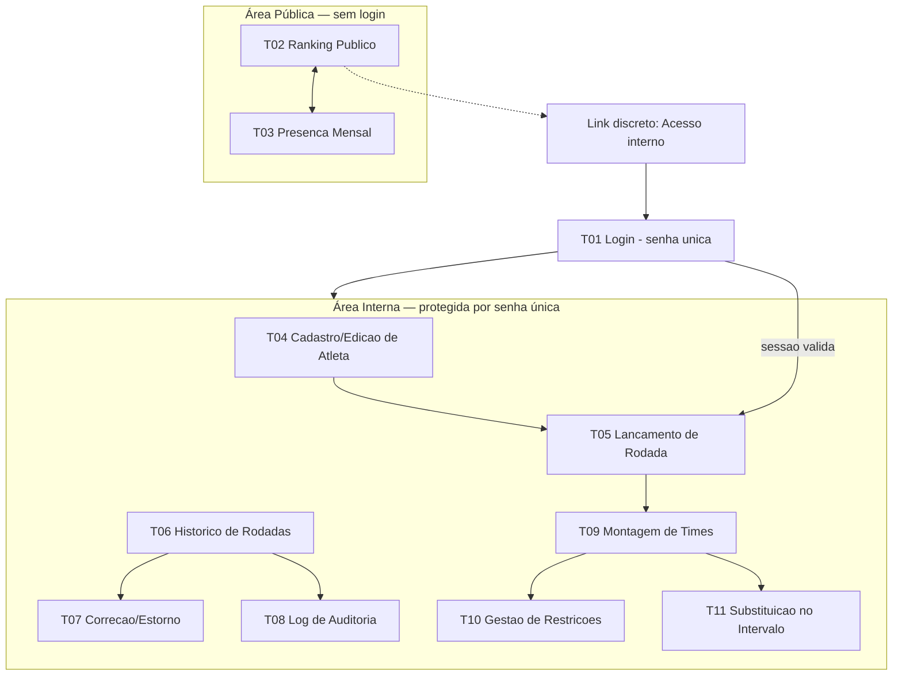

# UX-SPEC.md — Sistema de Ranking "Turma do Rola - Comary"

**Dono**: UX/UI
**Status**: Completo — publicado integralmente para o Tech Lead (Frontend/Mobile ficam
como consumidores de contexto futuro; não há Mobile neste projeto, conforme Gate 1 do
CTO — "acessível pelo celular" é atendido por web responsivo, não por app nativo).
**Revisão 2026-09-02 (pós-resolução de BLOCKER-001/BLOCKER-002)**: BLOCKER-001 e
BLOCKER-002, escalados ao Software Architect a partir da versão anterior deste
documento, foram resolvidos (`ADR-010`, `ADR-011`, `SDD.md` Seção 2.1/5/7.7/Anexo A;
`BLOCKERS.md` ambos `Resolvido`). Esta revisão incorpora: (a) confirmação do contrato
de dado de `ConflictList` em T09 — sem redesenho; (b) nova ação de anonimização de
dado pessoal em T04; (c) uma observação não bloqueante para o Tech Lead confirmar em
`TASK.md` (quantidade de times "N" por rodada). Mudanças marcadas explicitamente onde
ocorrem, conforme o mecanismo de histórico de componente (Seção 3.3).
**Input de origem**: `SDD.md` (aprovado com ressalvas no Gate 2 do CTO, 2026-09-02;
Anexo A registra a resolução pós-Gate 2) + ADRs 001-011 (especialmente 003, 004, 005,
007, 010, 011) + `PRD-TECNICO.md` (Business Analyst, Seção 4 — fluxos de usuário — e
RF-01 a RF-08) + `CTO-REVIEW.md` (Gate 1: risco estratégico #1 LGPD, #2 senha única,
#3 algoritmo de times; Gate 2: ressalvas que tocavam experiência, itens 3 e 6, ambas
resolvidas nesta revisão) + `BLOCKERS.md` (BLOCKER-001, BLOCKER-002, `Resolvido`).
**Skills aplicadas**: `user-flow-to-screen-mapping` (Seções 1-2),
`technical-constraint-check` (Seção 7, aplicada em paralelo a cada tela mapeada),
`design-system-consistency-check` (Seção 3), `accessibility-review` (Seção 5),
`responsive-behavior-spec` (Seção 6), `ux-spec-drafting` (montagem final).

**Nota metodológica**: este é o primeiro `UX-SPEC.md` do projeto — não existe design
system prévio a reaproveitar. Por isso, **todo** componente listado na Seção 3 está
marcado como "Novo (baseline desta primeira versão)" — não é omissão de
`design-system-consistency-check`, é o próprio ato de fundação do design system.
Mudanças futuras a qualquer componente aqui definido, depois que o Tech Lead já tiver
estimado esforço sobre ele, serão registradas como **alteração visível** nesta mesma
seção (histórico de mudança), nunca como sobrescrita silenciosa.

---

## 1. Fluxos de Tela

### 1.1 Mapa de telas (a partir dos fluxos do PRD-TECNICO.md, Seção 4)

| Fluxo do PRD-TECNICO.md | Tela(s) mapeada(s) | Área |
|---|---|---|
| Pré-requisito implícito a todo fluxo de escrita (RF-07) | **T01 — Login (senha única)** | Interna (gate de entrada) |
| 4.1 Cadastro de Atleta (RF-01) | **T04 — Cadastro/Edição de Atleta** | Interna |
| 4.2 Lançamento de Rodada (RF-02) | **T05 — Lançamento de Rodada** | Interna |
| 4.3 Consulta de Ranking (RF-03.1, RF-03.2, RF-03.4) | **T02 — Ranking Público** | Pública |
| 4.3 Consulta de Ranking — visão mensal (RF-03.3) | **T03 — Presença Mensal** | Pública |
| 4.4 Correção de Histórico (RF-04) | **T06 — Histórico de Rodadas** (lista) + **T07 — Correção/Estorno** (detalhe) | Interna |
| RF-04.5 (log de auditoria, sem tela própria no PRD, mas exigido) | **T08 — Log de Auditoria** | Interna |
| 4.5 Montagem de Times (RF-05.1 a RF-05.4) | **T09 — Montagem de Times** | Interna |
| RF-05.5 (gestão de restrições obrigatórias, sem tela própria no PRD, mas exigido) | **T10 — Gestão de Restrições Obrigatórias** | Interna |
| 4.6 Substituições (RF-06) | **T11 — Substituição no Intervalo** (sub-tela/modal de T09, no contexto da rodada em andamento) | Interna |
| RF-08 (Migração do banco legado) | **Não aplicável — sem tela dedicada.** Confirmado pelo próprio PRD-TECNICO.md (checklist, Seção 4): é processo técnico de carga única, executado pelo Software Architect/execução, não um fluxo de usuário recorrente. Relatório de conferência (RF-08.5) é artefato técnico de validação do organizador fora da interface do produto nesta release — se isso mudar (ex.: organizador precisar revisar o relatório dentro do próprio app), volta como novo fluxo a mapear. | — |

Todo fluxo do PRD-TECNICO.md tem tela correspondente ou justificativa explícita de
não aplicabilidade — critério de pronto atendido.

### 1.2 Arquitetura de navegação (site map)



**Racional de navegação**:
- Nenhuma hierarquia de permissão (RN-12) → nenhum item de menu escondido ou
  condicionado a papel. Toda ação disponível a quem tem sessão válida.
- A área pública nunca exige navegação até o login; o link de acesso interno é
  discreto (rodapé/canto), não um CTA competindo com o ranking, que é o produto
  principal para o visitante comum.
- Dentro da área interna, a navegação é uma barra fixa com 5 destinos + logout
  (T04 Atletas, T05 Rodada, T06 Histórico, T09 Times, T10 Restrições) — T07, T08 e
  T11 são acessadas a partir de T06/T09, não itens de primeiro nível, para não
  sobrecarregar a barra de navegação mobile (RNF-07).

### 1.3 Sessão e expiração (aplica-se a toda tela da área interna)

TTL curto (8-12h, ADR-004) sem refresh token de longa duração. Toda tela da área
interna precisa lidar com o caso "sessão expirou no meio do uso" — especificado uma
vez aqui para não repetir em cada tela:

- Aos 2 minutos antes da expiração estimada, exibir aviso não-bloqueante ("Sua sessão
  expira em breve — salve o que estiver fazendo") — atende WCAG 2.2.1 (Timing
  Adjustable), evitando perda de trabalho em formulário longo (T04, T05, T07).
- Se uma ação de escrita retornar 401 (sessão inválida/expirada), a tela deve:
  preservar os dados não salvos em memória local (o que for tecnicamente possível),
  exibir mensagem "Sessão expirada, faça login novamente" e redirecionar para T01,
  retornando à tela de origem após novo login bem-sucedido.

---

## 2. Wireframes / Descrição de Layout por Tela

Convenção: layout descrito para viewport mobile (base, <640px) primeiro — mobile-first
(RNF-07). Adaptação para telas maiores está na Seção 6 (Comportamento Responsivo), não
repetida aqui.

### T01 — Login (senha única)

```
┌─────────────────────────────┐
│      Turma do Rola           │
│      Comary                  │
│                               │
│   [ Acesso interno ]         │
│                               │
│   Senha                      │
│   [________________] 👁      │
│                               │
│   [   Entrar   ]              │
│                               │
│   (mensagem de erro aqui,     │
│    quando houver)             │
│                               │
│   ← Voltar ao ranking público │
└─────────────────────────────┘
```

- Tela isolada, sem barra de navegação da área interna (ainda não autenticado).
- Único campo: senha (não há campo de usuário/e-mail — RN-12, ADR-004).
- Botão "mostrar/ocultar senha" (ícone olho) — acessível, não só visual.
- Link de retorno ao ranking público sempre visível (a consulta pública nunca depende
  de login, RF-07.2).
- Não existe link "esqueci minha senha" nesta versão — ver Seção 7 (ponto sinalizado).

### T02 — Ranking Público

```
┌─────────────────────────────┐
│ Turma do Rola - Comary        │
│ [Ranking] [Presenca Mensal]   │  <- tabs
├─────────────────────────────┤
│ 🥇 1  João Pedro   42 pts     │
│      12 presenças · 1 cartão  │
│ 🥈 2  Carlinhos    38 pts     │
│      10 presenças · 0 cartão  │
│  3   Rafa "Foguinho" 35 pts   │
│      11 presenças · 2 cartões │
│  ...                          │
├─────────────────────────────┤
│ Atualizado em: 02/09/2026     │
│ Acesso interno (rodapé)       │
└─────────────────────────────┘
```

- Lista ordenada (cascata de desempate RN-08), cartão por atleta em mobile (não
  tabela densa) — nome de exibição (RN-06), pontuação, presenças, ausências.
  **Nunca** exibe contato ou data de nascimento (RN-01/RF-03.1) — nem como campo
  oculto no DOM (ver Seção 7, constraint aplicada de ADR-005: a garantia é no banco,
  mas o frontend também nunca deve *solicitar* essas colunas à view pública).
- Top 3 com indicador visual (medalha/posição destacada) — reforçado por texto
  "1º, 2º, 3º", nunca só cor/ícone (WCAG 1.4.1).
- Cartões amarelo/vermelho exibidos como contagem com rótulo textual, não só cor.
- Rodapé com timestamp da última atualização (transparência sobre RF-03.4 — "estado
  mais recente do histórico").

### T03 — Presença Mensal (público)

```
┌─────────────────────────────┐
│ [Ranking] [Presenca Mensal]   │
├─────────────────────────────┤
│  ◀  Setembro/2026  ▶          │
├─────────────────────────────┤
│ 05/09  Presentes: 18          │
│ 12/09  Presentes: 15          │
│ 19/09  (ainda não lançada)     │
├─────────────────────────────┤
│ Ver lista de presentes ⌄      │
└─────────────────────────────┘
```

- Navegação por mês civil (RN-09), seletor anterior/próximo.
- Cada rodada do mês é expansível para ver lista de nomes de exibição presentes
  (accordion) — ainda dentro do limite de dado público (RN-01).

### T04 — Cadastro/Edição de Atleta

```
┌─────────────────────────────┐
│ ☰  Atletas                    │
├─────────────────────────────┤
│ 🔒 Aviso de privacidade        │
│ "Contato e data de nascimento │
│ são usados apenas internamente│
│ e nunca aparecem no ranking   │
│ público."                     │
├─────────────────────────────┤
│ Nome completo *               │
│ [______________________]      │
│ Apelido de exibição            │
│ [______________________]      │
│ (se em branco, usa 1º nome)    │
│ Contato                        │
│ [______________________]      │
│ Data de nascimento *           │
│ [__/__/____]                   │
│ Pontuação inicial *            │
│ [______] (mínimo 0)            │
│                                │
│ ⚠ Menor de 18 anos detectado   │
│ ☐ Confirmo que o consentimento │
│   do responsável legal foi     │
│   obtido                       │
│                                │
│ [ Salvar Atleta ]              │
└─────────────────────────────┘
```

- Aviso de privacidade fixo no topo do formulário (LGPD, transparência no ato do
  cadastro — SDD.md Seção 7.6, delegado explicitamente ao UX/UI). Texto diferencia,
  na prática, a base legal por trás: dado de adulto tratado sob legítimo interesse do
  organizador; dado de possível menor tratado sob consentimento do responsável — ver
  nota em Seção 7 sobre a redação pendente de ajuste na Seção 7.6 do SDD.md.
  ***Este componente antecipa a correção pendente do SDD.md 7.6 (ressalva Gate 2, item
  4) — a redação final deve ser revisada quando o Software Architect atualizar a
  seção correspondente.***
- Bloco de consentimento (RN-02) só aparece condicionalmente, quando idade calculada
  < 18 anos — nunca oculto por CSS apenas (ver a11y).
- Nível técnico **não é campo do formulário** (RF-01.4 — é derivado, exibido apenas
  em modo leitura na lista/perfil do atleta, nunca editável aqui).
- Ao detectar nome completo duplicado (RF-01.5), modal de confirmação aparece antes
  de permitir salvar (ver Seção 4, estado "erro/aviso").

**Ação nova (revisão 2026-09-02 — desbloqueada por BLOCKER-002/ADR-011): "Solicitar
exclusão/anonimização de dados pessoais"**

Disponível na tela de edição de um atleta já existente (não no formulário de
criação), como ação secundária destrutiva — visualmente separada das ações de
salvamento normal, no mesmo padrão de "zona de risco" usado para exclusão de rodada
em T07:

```
┌─────────────────────────────┐
│ ☰  Editar Atleta — Carlinhos   │
│  (... campos normais acima ...)│
├─────────────────────────────┤
│ Zona de risco                  │
│ Solicitar exclusão/anonimização│
│ de dados pessoais               │
│ [ Solicitar anonimização ]      │
└─────────────────────────────┘
```

Estado de **confirmação (ação irreversível)** — modal bloqueante, mesmo padrão de
foco inicial seguro de T07 (foco em "Cancelar", não no botão destrutivo):

```
┌─────────────────────────────┐
│ Anonimizar dados de Carlinhos?  │
│                                 │
│ Esta ação substitui nome        │
│ completo, apelido de exibição,  │
│ contato e data de nascimento    │
│ por valores não identificáveis, │
│ e marca o atleta como inativo.  │
│                                 │
│ O histórico de pontuação        │
│ (ranking, presenças, gols,      │
│ cartões) é preservado — não     │
│ é apagado nem recalculado.      │
│                                 │
│ Esta ação NÃO PODE SER          │
│ DESFEITA. Não há como recuperar │
│ o nome ou contato originais     │
│ depois de confirmar.            │
│                                 │
│ Digite "ANONIMIZAR" para        │
│ confirmar:                      │
│ [________________________]      │
│                                 │
│ [ Cancelar ]  [ Confirmar       │
│                anonimização ]   │
└─────────────────────────────┘
```

- Exige digitação de uma palavra de confirmação (padrão "digite para confirmar"),
  mais rigoroso que o "Sim, excluir" simples de T07 — justificativa: em T07 o estorno
  reverte números (auditável e, na prática, refazível lançando de novo); aqui o dado
  pessoal original é perdido para sempre (ADR-011, "irreversibilidade por desenho"),
  o que pede uma barreira de confirmação mais alta.
- Texto explicita, em linguagem simples, os três efeitos definidos no `ADR-011`: (1)
  o que é sobrescrito, (2) o que é preservado (ledger), (3) que não há reversão.

Estado de **resultado visível** (após confirmação bem-sucedida), na mesma tela de
edição, refletindo o placeholder não identificável definido no `ADR-011`:

```
┌─────────────────────────────┐
│ ☰  Editar Atleta                │
├─────────────────────────────┤
│ ⚠ Este atleta foi anonimizado    │
│ em 02/09/2026 e está inativo.    │
│ Dados pessoais não podem mais    │
│ ser editados ou recuperados.     │
├─────────────────────────────┤
│ Nome completo                    │
│ [Atleta anonimizado #4821]       │
│ Apelido de exibição               │
│ [Anônimo]                         │
│ Contato                           │
│ [—]                               │
│ Data de nascimento                │
│ [—]                               │
│                                    │
│ Pontuação/histórico: preservados  │
│ (ver ranking e histórico de       │
│ rodadas)                          │
└─────────────────────────────┘
```

- Todos os campos pessoais viram somente-leitura após anonimização — nenhum formulário
  de edição aceita entrada nesses campos, consistente com "a operação não tem função
  inversa" (`ADR-011`).
- O atleta anonimizado **desaparece do ranking público (T02) e da presença mensal
  (T03) como identidade** (ele já não tem `apelido_exibicao` reconhecível), mas os
  pontos/eventos históricos que ele gerou continuam contabilizados agregadamente no
  histórico de rodadas (T06/T07) — o UX/UI não recalcula nem remove eventos, apenas
  exibe o nome-placeholder onde antes aparecia o nome do atleta, refletindo
  diretamente o comportamento de dados definido no `ADR-011`.
- Nível técnico e listas de restrição obrigatória (T10) que referenciassem esse
  atleta aparecem com a mesma etiqueta placeholder e a restrição é exibida como
  desativada automaticamente (efeito colateral do `ADR-011` sobre
  `RESTRICAO_OBRIGATORIA`) — sem ação adicional do organizador nessa tela.

### T05 — Lançamento de Rodada

Layout tipo *stepper* (etapas), dado o volume de dados por atleta em uma tela só
seria inviável em mobile:

```
Etapa 1/3: Presença
┌─────────────────────────────┐
│ Rodada: 05/09/2026            │
│ ⚠ já existe rodada nesta data  │  <- RF-02.8, condicional
├─────────────────────────────┤
│ João Pedro                    │
│ ( ) Presente (•) Ausente ( ) Lesionado │
│ Carlinhos                     │
│ (•) Presente ( ) Ausente ( ) Lesionado │
│ ...                            │
│                                │
│ [ Continuar → ]                │
└─────────────────────────────┘

Etapa 2/3: Eventos
┌─────────────────────────────┐
│ Carlinhos (Presente)           │
│ Gols:   [ - ] 1 [ + ]          │
│ 🟨 Amarelo [ - ] 0 [ + ]        │
│ 🟥 Vermelho [ - ] 0 [ + ]       │
│                                │
│ João Pedro (Ausente)           │
│ Eventos bloqueados — atleta    │
│ ausente (RF-02.6)              │
│                                │
│ [ ← Voltar ]   [ Continuar → ] │
└─────────────────────────────┘

Etapa 3/3: Revisão e Confirmação
┌─────────────────────────────┐
│ Resumo da rodada 05/09/2026    │
│ 18 presentes · 3 ausentes      │
│ 4 gols · 2 cartões amarelos     │
│                                │
│ [ ← Voltar ]  [ Confirmar     │
│                Lançamento ]    │
└─────────────────────────────┘
```

- Etapa 2 mostra atletas ausentes com os controles de evento visivelmente
  desabilitados (não escondidos) + texto explicando o porquê (RF-02.6) — evita
  confusão de "por que não consigo marcar gol para esse atleta".
- Etapa 3 é o ponto de não-retorno: confirmar dispara a transação atômica no banco
  (RNF-10). Botão de confirmação tem estado de carregamento explícito (ver Seção 4).
- Substituições **não** entram neste fluxo (T05) — são registradas depois, durante a
  rodada em andamento, a partir de T09/T11 (RF-06 depende de times já definidos).

### T06 — Histórico de Rodadas (lista)

```
┌─────────────────────────────┐
│ ☰  Histórico                  │
├─────────────────────────────┤
│ 19/09/2026  18 presentes  ⋮   │
│ 12/09/2026  15 presentes  ⋮   │
│ 05/09/2026  20 presentes  ⋮   │
│                                │
│ [ Ver log de auditoria ]      │
└─────────────────────────────┘
```

- Lista cronológica decrescente. Menu "⋮" por rodada: "Corrigir" / "Excluir rodada".
- Link para T08 (log de auditoria) sempre visível no rodapé da lista.

### T07 — Correção/Estorno (detalhe de uma rodada)

```
┌─────────────────────────────┐
│ ← Corrigir rodada 05/09/2026   │
├─────────────────────────────┤
│ Carlinhos                     │
│ Presença: Presente → [Ausente ▾] │
│ Gols: 1 → [ 2 ]                │
│                                │
│ Pré-visualização do impacto:   │
│ Carlinhos: -2 pts (presença)   │
│            +3 pts (gol extra)  │
│            = -2 pts líquido    │  <- ver nota de suposição, Secao 7
│                                │
│ [ Cancelar ]  [ Confirmar      │
│                Correção ]      │
└─────────────────────────────┘
```

Fluxo de **exclusão** de rodada (diferente de correção de campo):

```
┌─────────────────────────────┐
│ Excluir rodada 05/09/2026?    │
│                                │
│ Isso reverte automaticamente   │
│ TODOS os pontos desta rodada   │
│ (presença, gols, cartões,      │
│ substituições vinculadas) para │
│ 20 atletas. Esta ação gera      │
│ registro no log de auditoria   │
│ e não pode ser desfeita.        │
│                                │
│ [ Cancelar ]  [ Sim, excluir e │
│                estornar ]       │
└─────────────────────────────┘
```

- Toda correção/exclusão explica em linguagem simples o efeito de estorno automático
  (RN-04) **antes** da confirmação — nunca some pontos silenciosamente.
- Diálogo de confirmação de exclusão é modal bloqueante (ação destrutiva e em
  cascata) — correção de campo único usa preview inline, não modal (menos disruptivo
  para ajustes triviais, ex.: corrigir 1 gol).

### T08 — Log de Auditoria

```
┌─────────────────────────────┐
│ ← Log de Auditoria             │
├─────────────────────────────┤
│ 02/09/2026 14:32               │
│ Rodada 05/09/2026 — correção   │
│ Carlinhos: presença            │
│   Antes: Presente → Depois:    │
│   Ausente                      │
├─────────────────────────────┤
│ 01/09/2026 09:10               │
│ Rodada 29/08/2026 — exclusão   │
│ (20 atletas afetados)          │
└─────────────────────────────┘
```

- Ordenado do mais recente ao mais antigo (RF-04.5), somente leitura.
- **Nunca** exibe campo de autor (RN-12/RN-07) — nem "sistema", nem "organizador
  desconhecido" — simplesmente omitido, para não sugerir uma identidade que não
  existe.
- Cada entrada mostra timestamp, rodada afetada, valores antes/depois — igual ao
  contrato de dado definido no modelo (`LOG_AUDITORIA`, SDD.md Seção 5).

### T09 — Montagem de Times

```
┌─────────────────────────────┐
│ ☰  Times — Rodada 05/09/2026   │
├─────────────────────────────┤
│ Presentes selecionados: 18     │
│ [ Gerar sugestão de times ]     │
├─────────────────────────────┤
│ Time A            Time B       │
│ João Pedro         Carlinhos   │
│ Rafa               Marquinhos  │
│ ...                ...         │
│                                │
│ Nível técnico médio:            │
│ A: 6.2   B: 6.0  (diferença ok) │
│                                │
│ [ Trocar jogador ]  [ Confirmar│
│                       Times ]   │
└─────────────────────────────┘
```

Estado de **conflito não resolvido** (RF-05.2 — tratamento central desta release,
ressalva explícita do Gate 2 do CTO):

```
┌─────────────────────────────┐
│ ⚠ Não foi possível gerar uma    │
│ divisão que satisfaça todas as  │
│ restrições obrigatórias.        │
│                                 │
│ Restrições em conflito:         │
│ • João Pedro ⚡ Carlinhos        │
│   (não podem ficar juntos)      │
│ • Carlinhos ⚡ Marquinhos        │
│   (não podem ficar juntos)      │
│ → Com apenas 2 times, não é      │
│   possível separar os três        │
│   simultaneamente.                │
│                                 │
│ [ Ajustar lista de presentes ] │
│ [ Gerar mesmo assim,           │
│   ciente do conflito ]          │
└─────────────────────────────┘
```

- Cada linha de conflito é um **par específico de atletas em restrição**, com o
  motivo (visual + texto, nunca só ícone). **Confirmado (revisão 2026-09-02,
  resolução de BLOCKER-001/ADR-010)**: o backend devolve `restricoes_conflitantes`
  (lista de pares `{atleta_a_id, atleta_b_id, motivo, ...}`, um por componente conexo
  do grafo de restrições sem divisão válida) e `grupos_conflito` — uma superestrutura
  aditiva da suposição original deste layout. O contrato confirma exatamente o
  formato assumido; **nenhum redesenho de T09/`ConflictList` foi necessário** — ver
  confirmação em Seção 7.2, item 1.
- Segunda opção ("Gerar mesmo assim, ciente do conflito") é uma via de escape
  explícita: o organizador pode prosseguir mesmo sem solução perfeita, mas o sistema
  nunca decide isso silenciosamente por ele (alinhado a RF-05.2 — "informar, não
  ignorar").
- "Trocar jogador" (ajuste manual, RF-05.4): em mobile, ao tocar em um jogador, abre
  seletor "trocar com quem?" (ver Seção 6 — evita drag-and-drop em touch, que tem
  baixa confiabilidade e pior acessibilidade).
- Idade/nível técnico usados no equilíbrio (RF-05.3) são exibidos como média
  agregada por time — nunca como "ranking" competitivo entre times (não é o
  propósito da tela).
- **Observação nova (revisão 2026-09-02, não bloqueante)**: este wireframe assume
  exatamente **2 times por rodada** ("Time A"/"Time B", inclusive no texto de
  conflito "com apenas 2 times, não é possível separar..."). O `PRD-TECNICO.md` não
  confirma esse número "N" explicitamente (RF-05 não define quantidade de times).
  Isso **não é um conflito entre experiência e restrição técnica** (não há
  restrição do SDD.md sendo contornada) — é uma lacuna do próprio requisito de
  produto. Não escalado ao Software Architect por esse motivo; registrado aqui como
  **ponto para o Tech Lead confirmar em `TASK.md`** antes de estimar/implementar T09
  — ver Seção 7.3. Se "N" for diferente de 2 ou variável por rodada, o layout lado a
  lado (2 colunas) e o texto de conflito acima precisam ser ajustados — mudança que
  será marcada visivelmente nesta seção quando ocorrer.

### T10 — Gestão de Restrições Obrigatórias

```
┌─────────────────────────────┐
│ ☰  Restrições                  │
├─────────────────────────────┤
│ [ + Nova restrição ]           │
├─────────────────────────────┤
│ João Pedro ⚡ Carlinhos          │
│ (não podem ficar no mesmo time) │
│ Ativa            [Desativar]   │
├─────────────────────────────┤
│ Rafa ⚡ Marquinhos               │
│ Desativada em 20/08/2026        │
│                    [Reativar]  │
└─────────────────────────────┘
```

- CRUD simples de pares. Desativação é soft-delete (RN-11) — histórico permanece
  visível (com data de desativação), nunca excluído fisicamente da tela.
- Formulário "+ Nova restrição": dois seletores de atleta (autocomplete por nome),
  sem campo de "motivo" obrigatório no PRD-TECNICO (fora de escopo desta release).

### T11 — Substituição no Intervalo

Acessível a partir de T09, quando a rodada está em andamento (times já definidos):

```
┌─────────────────────────────┐
│ ← Substituições — Time A        │
├─────────────────────────────┤
│ Sai:   [ João Pedro     ▾ ]    │
│ Entra: [ Bruno (banco)   ▾ ]   │
│ [ Registrar Substituição ]      │
├─────────────────────────────┤
│ Substituições registradas:      │
│ João Pedro ↔ Bruno (Time A)     │
│ [ + Registrar outra ]           │
└─────────────────────────────┘
```

- Sem limite de quantidade (RF-06.2) — "+ Registrar outra" sempre disponível.
- Nenhum campo de pontuação aqui — reforço textual "Substituição não altera pontos,
  apenas registro histórico" (RF-06.3), para não criar expectativa equivocada no
  organizador.

---

## 3. Design System e Componentes

**Todo componente abaixo é Novo (baseline desta primeira versão do design system)** —
não há sistema prévio no projeto.

### 3.1 Tokens visuais

| Token | Valor/Descrição | Uso |
|---|---|---|
| `color.primary` | Verde (identidade "campo de futebol"), tom único definido pelo Frontend na implementação a partir desta especificação | Botões primários, links de destaque, tabs ativas |
| `color.neutral.50…900` | Escala de cinza para texto/fundo/bordas | Texto, cards, divisores |
| `color.success` | Verde-sucesso (distinto do `color.primary` em matiz para não confundir "ação" com "confirmação") | Toasts de sucesso, badge "Presente" |
| `color.warning` | Amarelo | Badge "Lesionado", avisos não bloqueantes, cartão amarelo |
| `color.danger` | Vermelho | Erros, exclusão, cartão vermelho, badge "Ausente" |
| `color.info` | Azul | Avisos informativos (ex.: sessão expirando) |
| `spacing.1…8` | Escala de espaçamento (múltiplos de 4px) | Todo padding/margin |
| `radius.sm/md/lg` | Cantos arredondados | Cards, botões, inputs |
| `type.scale` | Escala tipográfica mobile-first (base 16px, nunca menor que 14px para texto de corpo — WCAG 1.4.4) | Títulos, corpo, legendas |
| `elevation.0…3` | Sombra para cards/modais | Diferenciação de camadas (modal sobre conteúdo) |
| `motion.duration` | Transições curtas (150-250ms), respeitando `prefers-reduced-motion` | Toasts, accordions, steppers |

### 3.2 Componentes reutilizáveis

| Componente | Descrição | Usado em |
|---|---|---|
| `Button` (primary/secondary/danger/ghost) | Estados: default, hover, focus-visible, disabled, loading (spinner + texto mantido, nunca só ícone) | Todas as telas |
| `TextInput` / `DateInput` / `NumberInput` | Label sempre visível (nunca só placeholder), mensagem de erro associada via `aria-describedby` | T01, T04, T05, T07, T10 |
| `PasswordInput` | Toggle mostrar/ocultar senha acessível, `autocomplete="current-password"` | T01 |
| `SegmentedControl` | Grupo de opção única visualmente destacado (ex.: Presente/Ausente/Lesionado) — implementado como `radiogroup` semântico, não `div`s clicáveis | T05 |
| `StepperCounter` | Contador +/- para gols/cartões, com `aria-label` descrevendo o campo | T05 |
| `Badge/Tag` | Rótulo textual + cor (nunca só cor) — status de presença, cartões | T02, T05, T06 |
| `Card` (lista responsiva) | Substitui tabela densa em mobile; em telas largas pode virar tabela (ver Seção 6) | T02, T06, T09 |
| `Tabs` | Navegação entre 2 views relacionadas (Ranking/Presença Mensal) | T02/T03 |
| `Accordion` | Expansão de detalhe (lista de presentes por rodada) | T03 |
| `Modal/Dialog` | Focus trap, fecha com `Esc`, foco retorna ao elemento que abriu | T04 (duplicidade), T07 (exclusão) |
| `Toast/Alert banner` | Não-modal, `aria-live="polite"` (ou `assertive` para erro crítico) | Todas as telas com ação de escrita |
| `EmptyState` | Ilustração textual + call-to-action, nunca uma tela em branco sem explicação | T02, T03, T06, T08, T09, T10 |
| `Skeleton` | Placeholder de carregamento, respeitando `prefers-reduced-motion` (sem "pulso" para quem desativou animação) | T02, T05, T06 |
| `Stepper` (wizard de etapas) | Cabeçalho "Etapa X/3", navegação linear com "voltar" | T05 |
| `ConflictList` **(novo, específico do domínio)** | Lista de pares de atletas em conflito de restrição, com ícone + texto explicando o motivo | T09 — contrato de dado **confirmado** (revisão 2026-09-02, ver Seção 7.2, item 1); sem mudança de desenho |
| `DiffViewer` **(novo, específico do domínio)** | Exibição "antes → depois" para correção e log de auditoria | T07, T08 |
| `TypedConfirmationModal` **(novo, específico do domínio — adicionado na revisão 2026-09-02)** | Variante de `Modal/Dialog` para ações destrutivas e **irreversíveis** (sem função inversa): exige digitar uma palavra de confirmação exata antes de habilitar o botão de ação destrutiva, além do padrão de foco inicial seguro (foco em "Cancelar") já usado em `Modal/Dialog` | T04 (anonimização de dado pessoal, ADR-011) |
| `BottomTabBar` (mobile) / `TopNav` (desktop) | Navegação principal da área interna | Todas as telas internas |
| `SessionExpiryBanner` | Aviso não-bloqueante de expiração próxima de sessão | Todas as telas internas |

### 3.3 Histórico de mudanças de componente (mecanismo obrigatório)

`[Data] — Componente alterado — O que mudou — Motivo — Precisa reestimar: Sim/Não`

| Data | Componente/Tela alterado | O que mudou | Motivo | Precisa reestimar |
|---|---|---|---|---|
| 2026-09-02 | T04 (Cadastro/Edição de Atleta) | Adicionada ação "Solicitar exclusão/anonimização de dados pessoais": botão em "zona de risco", novo componente `TypedConfirmationModal`, e novo estado de tela pós-anonimização (campos pessoais somente-leitura com placeholder) | Resolução de BLOCKER-002 — mecanismo de anonimização definido em `ADR-011` (LGPD Art. 18), antes deliberadamente omitido enquanto o SDD.md não o desenhava | **Sim** |
| 2026-09-02 | T09 (Montagem de Times) / `ConflictList` | Nenhuma mudança de desenho — contrato de dado assumido (`[{atleta_a, atleta_b, motivo}]`) **confirmado** como subconjunto de `restricoes_conflitantes`/`grupos_conflito` | Resolução de BLOCKER-001 — mecanismo de RF-05.2 detalhado em `ADR-010` | **Não** (confirmação, não alteração) |

Nenhuma outra mudança registrada além das duas acima. A partir de agora, qualquer
alteração subsequente a componente já estimado pelo Tech Lead deve ser adicionada como
nova linha aqui.

---

## 4. Estados de Tela (vazio, carregando, erro, sucesso)

| Tela | Vazio | Carregando | Erro | Sucesso |
|---|---|---|---|---|
| **T01 Login** | Formulário sem senha digitada (estado inicial) | Botão "Entrar" com spinner, campo desabilitado | Mensagem genérica "Senha incorreta" (RF-07.3) — **idêntica** mesmo sob rate limiting (ver Seção 7, não é bug, é requisito) | Redireciona para última tela interna acessada (ou T05 por padrão) |
| **T02 Ranking Público** | "Nenhum atleta cadastrado ainda" (pré-migração/pré-cadastro) | Skeleton de 5 linhas de card | "Não foi possível carregar o ranking agora. Tente novamente." + botão retry | Lista renderizada, ordenada (RN-08), timestamp de atualização visível |
| **T03 Presença Mensal** | "Nenhuma rodada lançada neste mês" | Skeleton de calendário/lista | Idem T02 | Lista de rodadas do mês com contagem de presentes |
| **T04 Cadastro/Edição** | N/A — formulário de criação começa vazio por natureza (não é "estado a tratar", é o estado inicial normal) | Botão "Salvar" com spinner; botão "Confirmar anonimização" com spinner (revisão 2026-09-02) | Erro de validação por campo (idade/consentimento não confirmado bloqueia salvar, RF-01.3) + modal de duplicidade (RF-01.5); "Não foi possível anonimizar. Nenhuma alteração foi salva." se a transação de anonimização falhar (revisão 2026-09-02) | Toast "Atleta salvo com sucesso" + retorno à lista; para anonimização (revisão 2026-09-02): toast "Dados pessoais anonimizados" + tela permanece em modo somente-leitura para os campos pessoais, refletindo o placeholder (ver Seção 2, estado de resultado) |
| **T05 Lançamento de Rodada** | N/A — sempre há lista de atletas ativos a marcar (se não houver nenhum atleta cadastrado, a tela redireciona para T04 com aviso, tratado como dependência, não como "vazio" desta tela) | Etapa 3: botão "Confirmar Lançamento" com spinner, etapas anteriores bloqueadas para edição durante o envio | Falha na transação atômica: "Não foi possível lançar a rodada. Nada foi salvo — tente novamente." (reforça RNF-10: nunca estado parcial) | Toast de sucesso + redireciona para T06 com a nova rodada no topo |
| **T06 Histórico** | "Nenhuma rodada lançada ainda" | Skeleton de lista | "Não foi possível carregar o histórico" + retry | Lista cronológica decrescente |
| **T07 Correção/Estorno** | N/A — sempre parte de uma rodada existente selecionada em T06 | Botão "Confirmar Correção"/"Sim, excluir" com spinner | "Não foi possível aplicar a correção. Nenhuma alteração foi salva." | Toast "Correção aplicada, log de auditoria atualizado" + retorno a T06 |
| **T08 Log de Auditoria** | "Nenhuma correção registrada até agora" | Skeleton de lista | "Não foi possível carregar o log" + retry | Lista ordenada mais recente → mais antiga |
| **T09 Montagem de Times** | "Selecione os presentes da rodada para gerar times" (antes de qualquer geração) | "Calculando divisão de times…" (pode levar alguns segundos — heurística de backtracking, ver Seção 7) | Dois sub-casos: (a) conflito de hard constraint não resolvido (ver wireframe T09, não é "erro" técnico, é resultado válido do algoritmo); (b) falha técnica real ("Não foi possível gerar a sugestão, tente novamente") | Times exibidos lado a lado + indicadores de equilíbrio |
| **T10 Restrições** | "Nenhuma restrição obrigatória cadastrada" | Skeleton de lista | "Não foi possível salvar a restrição" | Toast de sucesso + lista atualizada |
| **T11 Substituição** | "Nenhuma substituição registrada nesta rodada" | Botão "Registrar" com spinner | "Não foi possível registrar — verifique se o atleta já está em outro time" | Lista de substituições atualizada em tempo real na mesma tela |

Todo item marcado "N/A" tem justificativa explícita na própria célula, conforme
critério de pronto (não há "N/A" sem porquê).

---

## 5. Requisitos de Acessibilidade (WCAG 2.1, nível AA como piso)

Acessibilidade é critério não negociável em toda tela — aplicado via
`accessibility-review` tela a tela, não como etapa única genérica ao final.

### 5.1 Requisitos transversais (aplicam-se a todas as 11 telas)

| Critério WCAG | Aplicação concreta neste projeto |
|---|---|
| 1.1.1 Conteúdo não textual | Ícones (medalha, cartão, ⚡ de conflito) sempre acompanhados de texto equivalente, nunca só `aria-hidden` sem alternativa |
| 1.3.1 Informações e relações | Tabelas de ranking usam `<table>`/`<th scope="col">` reais mesmo quando visualmente exibidas como cards em mobile (usar CSS, não remover semântica); formulários com `<label for>` associado a todo input |
| 1.4.1 Uso de cor | Status (presente/ausente/lesionado, cartões, conflito de restrição) nunca comunicado só por cor — sempre + texto/ícone com rótulo |
| 1.4.3 / 1.4.11 Contraste | Texto ≥ 4.5:1; componentes de UI (bordas de input, ícones informativos) ≥ 3:1 |
| 1.4.4 Redimensionamento de texto | Layout funcional até 200% de zoom sem perda de conteúdo/funcionalidade (crítico em T05/T09, telas densas) |
| 2.1.1 / 2.1.2 Teclado | Toda ação executável só com teclado, incluindo o fluxo de "trocar jogador" em T09 (sem depender de drag-and-drop obrigatório) e o wizard de T05 |
| 2.2.1 Tempo ajustável | Aviso de expiração de sessão (Seção 1.3) com tempo suficiente para reação, nunca expiração silenciosa |
| 2.4.3 Ordem de foco | Ordem de tabulação segue a ordem visual/lógica em todos os formulários (T04, T05, T07, T10) |
| 2.4.7 Foco visível | Indicador de foco visível em todo elemento interativo, nunca removido via CSS sem substituto |
| 2.5.5 / 2.5.8 Alvo de toque | Área mínima de toque 44×44px (mobile-first — RNF-07) em botões, checkboxes, contadores de gol/cartão |
| 3.1.1 Idioma da página | `lang="pt-BR"` em todo o documento (RNF-08) |
| 3.3.1 / 3.3.3 Identificação e sugestão de erro | Toda mensagem de erro de formulário associada ao campo (`aria-describedby`, `aria-invalid="true"`) + sugestão de correção em texto simples |
| 4.1.2 Nome, função, valor | Componentes customizados (`SegmentedControl`, `StepperCounter`, `Tabs`) implementados com roles ARIA corretos (`radiogroup`, `tablist`/`tab`/`tabpanel`), não `div`s genéricas estilizadas |
| 4.1.3 Mensagens de status | Toasts e banners de confirmação usam `aria-live` (`polite` para sucesso, `assertive` para erro crítico) sem exigir foco manual do usuário |

### 5.2 Pontos de atenção específicos por tela

- **T01 Login**: campo de senha nunca em texto puro visível por padrão; toggle
  "mostrar senha" com `aria-pressed` e rótulo textual, não só ícone de olho.
  Mensagem de erro genérica (RF-07.3) anunciada via `aria-live="assertive"` — mesmo
  sendo genérica, o usuário de leitor de tela precisa ser informado da falha.
- **T02/T03 Ranking Público**: maior superfície de uso por público não-técnico e
  potencialmente idoso (pais/familiares de atletas) — prioridade alta de contraste e
  tamanho de fonte legível sem zoom.
- **T04 Cadastro**: bloco de consentimento (RN-02) deve ser alcançável e anunciado
  por leitor de tela quando aparece dinamicamente (`aria-live="polite"` na
  mudança condicional, não apenas exibição/ocultação via `display:none` silenciosa).
- **T04 Anonimização (revisão 2026-09-02)**: `TypedConfirmationModal` é modal com
  focus trap obrigatório e foco inicial em "Cancelar" (ação segura por padrão, mesmo
  critério de T07); o botão destrutivo permanece `disabled` (com `aria-disabled`,
  não removido do DOM) até o texto digitado corresponder exatamente à palavra de
  confirmação, com feedback textual associado via `aria-describedby` (não só cor de
  borda); após confirmação, o resultado (campos pessoais somente-leitura) é
  anunciado via `aria-live="polite"` e cada campo tornado somente-leitura usa
  `aria-readonly="true"` (não `disabled`, que removeria o campo da navegação por
  teclado/leitor de tela sem explicar o porquê).
- **T05 Lançamento de Rodada**: `StepperCounter` (gols/cartões) precisa de
  `aria-label` específico por atleta e tipo de evento (ex.: "Gols de Carlinhos"),
  não um rótulo genérico repetido — crítico numa lista longa de atletas.
- **T07 Correção/Estorno**: diálogo de exclusão é modal com focus trap obrigatório
  (ação destrutiva e irreversível) — foco inicial no botão "Cancelar" (ação segura
  por padrão), não no botão destrutivo.
- **T09 Montagem de Times**: lista de conflitos (`ConflictList`) deve ser navegável
  por teclado e anunciada como alerta ao aparecer (`role="alert"`) — é uma mudança de
  estado relevante que o organizador precisa perceber sem depender só de leitura
  visual da tela.
- **T11 Substituição**: seletores "Sai"/"Entra" devem impedir, de forma acessível
  (mensagem de erro clara, não só bloqueio silencioso do submit), selecionar o mesmo
  atleta nos dois campos.

Nenhuma tela tem pendência crítica de acessibilidade aberta neste UX-SPEC. O contrato
de dado de T09/`ConflictList` (antes suposição, agora **confirmado** via `ADR-010` —
ver Seção 7.1/7.2) não alterou a estrutura semântica já definida aqui. A única
pendência remanescente de Seção 7 (item 3 — redação da base legal em T04) é uma
dependência de sincronização de texto, não uma pendência de acessibilidade.

---

## 6. Comportamento Responsivo

Aplicação mobile-first (RNF-07) — toda tela é desenhada primeiro para a viewport
mobile (Seção 2); esta seção documenta a adaptação progressiva para viewports
maiores. Não há app nativo (fora de escopo, Gate 1 do CTO) — responsividade é web
pura.

### 6.1 Breakpoints

| Nome | Faixa | Uso típico |
|---|---|---|
| `base` | < 640px | Celular — viewport de referência para todo o desenho de Seção 2 |
| `sm` | 640-1023px | Tablet — layout intermediário, mais densidade sem virar desktop completo |
| `lg` | ≥ 1024px | Desktop — organizador lançando rodada/times em notebook |

### 6.2 Adaptações por tela

| Tela | `base` (mobile) | `sm`/`lg` (tablet/desktop) |
|---|---|---|
| Navegação interna | `BottomTabBar` fixo na base da tela | `TopNav` horizontal fixo no topo |
| T02 Ranking | Lista de `Card` empilhados | `lg`: vira `<table>` real com colunas (posição, nome, pontos, presenças, cartões) — mesma semântica, densidade maior |
| T05 Lançamento de Rodada | `Stepper` de 3 etapas, uma por tela | `lg`: pode exibir etapas 1 e 2 lado a lado (lista de presença + eventos), sem remover a possibilidade de uso 100% mobile |
| T09 Montagem de Times | Times empilhados verticalmente (Time A acima de Time B), troca de jogador via modal de seleção (toque) | `lg`: Times lado a lado (colunas), troca de jogador pode oferecer drag-and-drop **como atalho opcional**, mantendo o modal de seleção como alternativa sempre disponível (não substituindo, por acessibilidade — 2.1.1) |
| T04/T07/T10 Formulários | Campos empilhados, um por linha | `sm`/`lg`: campos relacionados podem parear em duas colunas (ex.: nome + apelido), sem alterar ordem de tabulação lógica |
| T03 Presença Mensal | Accordion vertical por rodada | `lg`: pode exibir em grade de mês (estilo calendário), mesma informação, layout mais denso |

### 6.3 Casos "não aplicável"

Não há caso de "não aplicável" nesta seção — o produto é 100% web responsivo (não é
API-only, não há tela exclusivamente desktop); toda tela mapeada na Seção 1 tem
comportamento responsivo definido acima.

---

## 7. Restrições Técnicas Aplicadas e Conflitos Sinalizados ao Software Architect

### 7.1 Restrições técnicas aplicadas sem conflito (checadas via `technical-constraint-check`)

| Restrição (SDD.md/ADR) | Onde se aplica | Como foi respeitada no UX-SPEC |
|---|---|---|
| RN-01/RF-03.1 + ADR-005 (RLS/views públicas, nunca expor contato/data de nascimento) | T02, T03 | Layout de T02/T03 nunca inclui campo de contato/data de nascimento, nem oculto via CSS — a tela simplesmente não solicita essas colunas |
| RF-07.3 (mensagem de erro sempre genérica, sem diferenciar senha errada de bloqueio) | T01 | Estado de erro único ("Senha incorreta") independente de estar ou não sob rate limiting (RNF-03) — não há banner separado de "conta bloqueada" |
| ADR-004 (sessão TTL curta, sem refresh token de longa duração, cookie httpOnly) | Toda área interna | Seção 1.3 documenta aviso de expiração em vez de "manter conectado" por longos períodos — nenhuma tela oferece opção de sessão persistente além do TTL |
| RN-12 (nenhuma ação atribuída a pessoa física) | T08 (log de auditoria) | Layout de T08 não reserva espaço para "autor" — omitido, não preenchido com placeholder genérico |
| RF-02.6 (bloquear evento para atleta ausente) | T05 | Controles de evento desabilitados e explicados textualmente para atletas ausentes, não escondidos |
| RNF-10 (atomicidade — nunca estado parcial visível) | T05 (confirmação), T07 (correção/exclusão) | Estado de erro de T05/T07 explicita "nada foi salvo" em vez de sugerir salvamento parcial |
| RN-04/RF-04.3 (estorno automático em cascata, incluindo eventos vinculados) | T07 | Diálogo de exclusão explicita o efeito em cascata antes da confirmação, sem opção de "excluir sem estornar" |
| RN-11 (restrição é soft-delete, não exclusão física) | T10 | Lista de restrições sempre mostra desativadas com data, nunca remove do histórico visual |
| RF-06.3 (substituição não gera pontuação) | T11 | Reforço textual explícito na própria tela, para evitar expectativa equivocada do organizador |
| RF-05.2 + `ADR-010` (mecanismo de explicação de conflito — grafo por componentes conexos) *(confirmado 2026-09-02, ex-BLOCKER-001)* | T09 | `ConflictList` exibe um a um os pares de `restricoes_conflitantes` retornados pelo backend, agrupados por `grupos_conflito` quando aplicável — contrato confirmado sem redesenho, ver Seção 2 (T09) e Seção 3.2 |
| LGPD Art. 18 + `ADR-011` (anonimização in-place, nunca hard delete, ledger preservado) *(confirmado 2026-09-02, ex-BLOCKER-002)* | T04 | Nova ação "Solicitar exclusão/anonimização de dados pessoais" com `TypedConfirmationModal` e estado de resultado somente-leitura, refletindo exatamente o mecanismo do `ADR-011` — ver Seção 2 (T04), Seção 4 e Seção 5.2 |

### 7.2 Conflitos/pendências sinalizados ao Software Architect (não resolvidos unilateralmente)

Registrados também em `BLOCKERS.md`. Dois dos três pontos abaixo, sinalizados na
versão anterior deste documento, **foram resolvidos** pelo Software Architect nesta
revisão (2026-09-02) — mantidos aqui como registro histórico do que foi escalado e
como foi resolvido, conforme guardrail de não apagar em silêncio o que já foi
sinalizado; o terceiro segue em aberto.

1. **[RESOLVIDO] Mecanismo de explicação de conflito para RF-05.2 (T09)** —
   pendência originalmente registrada pelo Gate 2 do CTO (item 6, dono Software
   Architect/Backend) e escalada como `BLOCKER-001`. O UX-SPEC havia desenhado T09
   assumindo que o backend devolveria uma **lista estruturada de pares de atletas em
   conflito** (ex.: `[{atleta_a, atleta_b, motivo}]`). **Resolução (`ADR-010`,
   `SDD.md` Seção 2.1/6.3/Anexo A)**: o Software Architect confirmou o mecanismo
   (grafo de restrições decomposto em componentes conexos via union-find,
   backtracking do `ADR-007` executado por componente) e o contrato de dado real
   (`restricoes_conflitantes: [{atleta_a_id, atleta_b_id, motivo, ...}]` +
   `grupos_conflito`) — uma **superestrutura aditiva** da suposição original, não uma
   simplificação. **Nenhum redesenho de T09/`ConflictList` foi necessário** —
   registrado sem mudança em Seção 3.3 (histórico de componente). `BLOCKER-001`
   marcado `Resolvido` em `BLOCKERS.md`.
2. **[RESOLVIDO] Direito de exclusão/anonimização de dado pessoal (LGPD Art. 18)** —
   pendência originalmente registrada pelo Gate 2 do CTO (item 3, dono Software
   Architect) e escalada como `BLOCKER-002`. O UX-SPEC não incluía, deliberadamente,
   ação de "excluir"/"anonimizar" atleta em T04 enquanto o mecanismo de dados não
   fosse definido. **Resolução (`ADR-011`, `SDD.md` Seção 5/7.7/Anexo A)**: o
   Software Architect definiu anonimização in-place da linha `ATLETA` (nunca
   exclusão física), preservando o ledger append-only e desativando restrições
   obrigatórias associadas. **Ação incorporada a T04** nesta revisão: "Solicitar
   exclusão/anonimização de dados pessoais", com confirmação por digitação
   (`TypedConfirmationModal`) e estado de resultado (campos somente-leitura com
   placeholder) — ver Seção 2 (T04). **Mudança registrada em Seção 3.3 (histórico de
   componente) com reestimativa necessária pelo Tech Lead** — `BLOCKER-002` marcado
   `Resolvido` em `BLOCKERS.md`.
3. **[EM ABERTO] Redação da base legal diferenciada (adulto vs. menor) na Seção 7.6
   do SDD.md (Gate 2, item 4, dono Software Architect).** O aviso de privacidade
   desenhado em T04 (Seção 2) já antecipa essa diferenciação em linguagem simples
   para o usuário final, mas o texto final deve ser revisado assim que a Seção 7.6
   do SDD.md for corrigida, para garantir que a redação da tela não contradiga a
   base legal formalmente registrada na arquitetura. Não é um conflito de
   experiência — é uma dependência de sincronização de texto, ainda não resolvida
   nesta revisão (o Anexo A do `SDD.md` confirma que os itens 1, 2, 4, 5 e 7 do Gate
   2 não são objeto desta rodada de resolução). **Escalado para**:
   `software-architect` (acompanhamento, não bloqueio).

### 7.3 Pontos observados, sem conflito de arquitetura, mas com impacto de UX a monitorar

- **Quantidade de times por rodada ("N") não confirmada no `PRD-TECNICO.md` (ponto
  novo, revisão 2026-09-02, anotado pelo Software Architect ao resolver
  BLOCKER-001/BLOCKER-002, não bloqueante).** O wireframe de T09 (Seção 2) assume
  exatamente **2 times** por rodada — layout de 2 colunas ("Time A"/"Time B") e o
  texto de conflito ("com apenas 2 times, não é possível separar os três
  simultaneamente"). RF-05 (`PRD-TECNICO.md`) não define esse número explicitamente.
  **Isto não é um conflito entre experiência e restrição técnica do SDD.md** — não há
  decisão de arquitetura sendo contornada, é uma lacuna do requisito de produto em
  si; por isso **não é escalado ao Software Architect**. Fica registrado aqui como
  **ponto para o Tech Lead confirmar em `TASK.md`** (junto ao Business Analyst, se
  necessário) antes de estimar/planejar a implementação de T09. Se "N" divergir de 2
  (fixo ou variável por rodada), o layout de 2 colunas e o texto de conflito
  precisarão ser ajustados — mudança que será marcada visivelmente na Seção 2 e no
  histórico de componente (Seção 3.3) quando confirmada.
- **Complexidade combinatória do backtracking (ADR-007, dívida técnica aceita) pode
  tornar a geração de times em T09 perceptivelmente lenta** se o volume de presentes
  se aproximar do limite de revisão já registrado no SDD.md (~60 atletas/rodada). O
  estado de carregamento de T09 (Seção 4) já contempla uma mensagem de espera
  ("Calculando divisão de times…"), mas **não há, ainda, um estado de timeout
  definido tecnicamente** (o que acontece se o algoritmo não retornar em tempo hábil
  dentro do limite de execução serverless mencionado como consequência negativa do
  ADR-003?). Isto não é reprovado nem aprovado por este UX/UI — é uma pergunta em
  aberto para o Software Architect/Tech Lead confirmarem se existe timeout e qual
  mensagem de erro correspondente deve ser exibida. Até confirmação, o UX-SPEC trata
  esse caso dentro do estado genérico "falha técnica real" de T09 (Seção 4).
- **Procedimento de redefinição da senha única compartilhada (Gate 2, item 7, dono
  Tech Lead/Backend, não Software Architect)** — T01 não inclui link "esqueci minha
  senha" nesta versão, porque esse procedimento ainda não foi definido. Diferente
  dos itens 1 e 2 acima, este não é um conflito entre experiência desejada e
  restrição de arquitetura — é uma responsabilidade já atribuída pelo CTO a
  Tech Lead/Backend; o UX/UI apenas documenta a ausência da funcionalidade nesta
  versão e ficará disponível para desenhar a tela correspondente assim que o
  procedimento for definido, sem necessidade de escalonamento a `software-architect`.
- **Pré-visualização de impacto de correção em T07** assume que é possível calcular
  o delta de pontos no cliente (ou via endpoint de simulação) antes da confirmação,
  usando os valores vigentes de `CONFIGURACAO_PONTUACAO` (SDD.md Seção 5). Esta é uma
  suposição de UX razoável (a tabela de pontuação é simples e não sensível), mas
  depende de o Tech Lead confirmar se o cálculo de preview será feito no
  frontend ou exigirá endpoint dedicado — impacto de esforço, não de arquitetura;
  não é escalado ao Software Architect, fica registrado aqui para o Tech Lead avaliar
  ao estimar T07.

---

## Checklist de Prontidão (revalidado em 2026-09-02, pós-resolução de BLOCKER-001/002)

- [x] Todo fluxo do PRD-TECNICO.md tem tela(s) correspondente(s) mapeada(s) — Seção
      1.1, incluindo a justificativa explícita de não aplicabilidade para RF-08
      (migração, processo técnico sem tela dedicada). Sem alteração nesta revisão.
- [x] Todo fluxo de tela tem os 4 estados especificados (vazio, carregando, erro,
      sucesso), ou está marcado "não aplicável" com o porquê — Seção 4, tabela
      completa, toda célula "N/A" com justificativa inline. Linha de T04 atualizada
      nesta revisão com os estados de carregamento/erro/sucesso da nova ação de
      anonimização.
- [x] Todo componente novo está sinalizado como tal — Seção 3.2: todos os
      componentes da versão de fundação seguem marcados "Novo (baseline)";
      `TypedConfirmationModal`, adicionado nesta revisão para a ação de
      anonimização de T04, está marcado como novo e específico do domínio. Mudança
      registrada em Seção 3.3 (histórico de componente), com reestimativa
      necessária pelo Tech Lead para T04.
- [x] Toda tela passou por `accessibility-review` sem pendência crítica aberta —
      Seção 5, requisitos transversais (5.1) e pontos específicos por tela (5.2),
      incluindo o ponto novo de T04 (`TypedConfirmationModal`, `aria-readonly` nos
      campos anonimizados). Nenhuma pendência de acessibilidade em si.
- [x] Comportamento responsivo definido para todo fluxo relevante — Seção 6; não há
      caso "não aplicável" porque o produto é 100% web responsivo, sem componente
      API-only. A nova ação de T04 herda o comportamento responsivo de formulário já
      definido em 6.2 (não introduz layout novo).
- [x] Toda restrição técnica do SDD.md foi checada via `technical-constraint-check`
      e todo conflito encontrado está sinalizado ao Software Architect, não
      resolvido por conta própria — Seção 7.1 (agora com 2 novas linhas para
      `ADR-010`/`ADR-011`, confirmadas) e 7.2 (dos 3 pontos originalmente escalados,
      2 estão **[RESOLVIDO]** — `BLOCKER-001` e `BLOCKER-002`, ambos `Resolvido` em
      `BLOCKERS.md` — e 1 segue **[EM ABERTO]**, item 3, acompanhamento não
      bloqueante); 7.3 registra observações de impacto de UX que não chegam a ser
      conflito de arquitetura, incluindo o ponto novo (não bloqueante) sobre a
      quantidade de times "N" em T09, para o Tech Lead confirmar em `TASK.md`.
- [x] Nenhuma das 7 seções está vazia ou com placeholder.

**Veredito desta revisão**: `UX-SPEC.md` permanece completo e liberado para o Tech
Lead. Os dois bloqueios que motivaram reestimativa condicional na versão anterior
(T09/`ConflictList` e T04/anonimização) estão agora resolvidos: T09 não exige
reestimativa (contrato de dado confirmado sem mudança de desenho, Seção 3.3); T04
exige reestimativa (nova ação, novo componente `TypedConfirmationModal`, novos
estados de tela — Seção 3.3, linha marcada "Precisa reestimar: Sim"). Resta em aberto,
não bloqueante, o item 3 da Seção 7.2 (redação de base legal em T04, acompanhamento
com o Software Architect) e a observação da Seção 7.3 sobre "N" times em T09 (para o
Tech Lead confirmar em `TASK.md`, sem envolvimento do Software Architect).

**Veredito**: `UX-SPEC.md` completo e liberado para o Tech Lead considerar a
especificação pronta para decomposição/estimativa em `TASK.md`. Três pontos seguem
formalmente em aberto em `BLOCKERS.md` (Seção 7.2) — não bloqueiam o início do
trabalho do Tech Lead sobre as demais telas, mas T09 (conflito de restrições) e T04
(ação de exclusão/anonimização, ainda ausente) podem exigir reestimativa quando o
Software Architect responder.
